# Ubuntu Server - BIND9 + ISC DHCP Server + DDNS Base

**Autor:** Nammu  
**Entorno:** Laboratorio local controlado en VirtualBox  
**Objetivo:** convertir una base previa con `dnsmasq` en una infraestructura DNS/DHCP más profesional usando BIND9, ISC DHCP Server y actualizaciones DNS dinámicas mediante TSIG.

---

## 1. Contexto del laboratorio

Este laboratorio parte de un Ubuntu Server previamente preparado como servidor base de red. La máquina dispone de tres interfaces:

| Interfaz | Función | Dirección |
|---|---|---|
| `enp0s3` | NAT / salida a Internet | `10.0.2.15/24` |
| `enp0s8` | Red interna del laboratorio | `192.168.1.8/24` |
| `enp0s9` | Host-only / administración SSH desde Windows | `192.168.56.10/24` |

La base anterior usaba `dnsmasq` como servicio combinado de DHCP y DNS local. Para acercar el laboratorio a una arquitectura más habitual en entornos profesionales, se migra a una separación clara de responsabilidades:

```text
BIND9              -> DNS autoritativo para lab.local
ISC DHCP Server    -> asignación de IPs en la red interna
TSIG               -> clave compartida para DDNS
DDNS               -> actualizaciones dinámicas de registros DNS
iptables/NAT       -> salida a Internet para clientes internos
```

> Todo el laboratorio se realiza en una red local aislada. No se exponen servicios a Internet ni se opera sobre infraestructura de terceros.

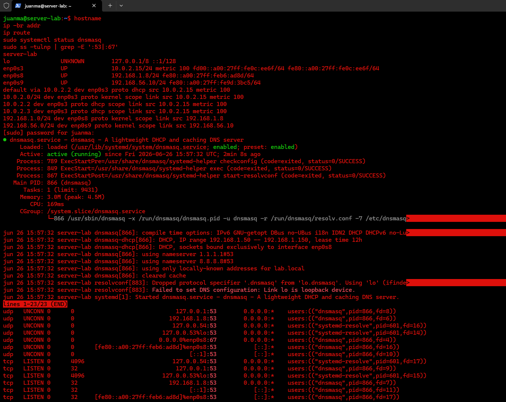

---

## 2. Copia de seguridad y desactivación de dnsmasq

Antes de sustituir `dnsmasq`, se realiza una copia de seguridad de su configuración y de reglas relevantes del sistema.

```bash
sudo mkdir -p /opt/lab-backups/dnsmasq-$(date +%F)
sudo cp /etc/dnsmasq.conf /opt/lab-backups/dnsmasq-$(date +%F)/dnsmasq.conf.bak
sudo cp /etc/sysctl.conf /opt/lab-backups/dnsmasq-$(date +%F)/sysctl.conf.bak
sudo iptables-save | sudo tee /opt/lab-backups/dnsmasq-$(date +%F)/iptables.rules.bak > /dev/null
```

Después se detiene y deshabilita `dnsmasq` para liberar los puertos DNS/DHCP:

```bash
sudo systemctl stop dnsmasq
sudo systemctl disable dnsmasq
sudo systemctl status dnsmasq
sudo ss -tulnp | grep -E ':53|:67'
```

Resultado esperado:

```text
dnsmasq inactive/dead
puerto 67 libre
puerto 53 ya no ocupado por dnsmasq
```

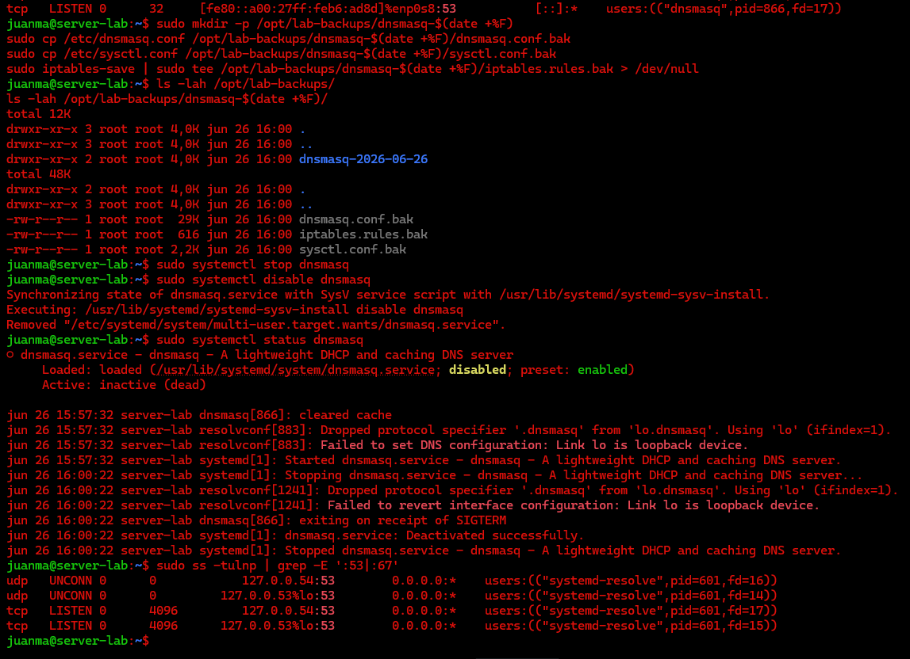

---

## 3. Instalación de BIND9

Se instala BIND9 junto con herramientas de validación y consulta DNS.

```bash
sudo apt update
sudo apt install bind9 bind9utils bind9-doc dnsutils -y
```

Se comprueba la versión y el estado inicial:

```bash
named -v
sudo systemctl status bind9
```

---

## 4. Configuración general de BIND9

El archivo principal de opciones se configura para que BIND9 escuche solo en la red interna y en localhost.

Archivo editado:

```bash
sudo nano /etc/bind/named.conf.options
```

Contenido aplicado:

```conf
options {
    directory "/var/cache/bind";

    listen-on {
        127.0.0.1;
        192.168.1.8;
    };

    listen-on-v6 { none; };

    allow-query {
        localhost;
        192.168.1.0/24;
    };

    recursion yes;

    allow-recursion {
        localhost;
        192.168.1.0/24;
    };

    forwarders {
        1.1.1.1;
        8.8.8.8;
    };

    dnssec-validation auto;
    auth-nxdomain no;
};
```

Validación:

```bash
sudo named-checkconf
```

Si el comando no devuelve salida, la sintaxis es correcta.

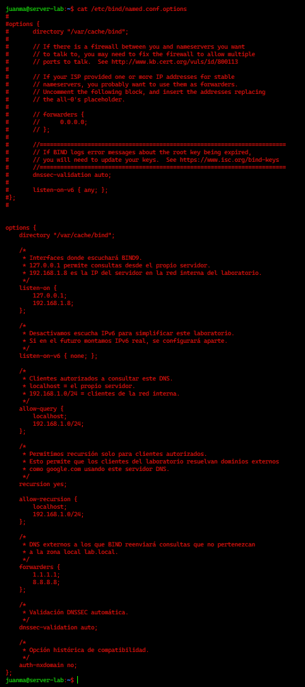

---

## 5. Creación de clave TSIG para DDNS

Para que el servidor DHCP pueda actualizar zonas DNS en BIND9 se crea una clave TSIG.

```bash
sudo tsig-keygen -a hmac-sha256 dhcp-ddns-key | sudo tee /etc/bind/dhcp-ddns.key > /dev/null
sudo chown root:bind /etc/bind/dhcp-ddns.key
sudo chmod 640 /etc/bind/dhcp-ddns.key
sudo ls -l /etc/bind/dhcp-ddns.key
```

La clave queda con un formato similar a:

```conf
key "dhcp-ddns-key" {
    algorithm hmac-sha256;
    secret "[REDACTED]";
};
```

> El valor real del `secret` no debe subirse a GitHub ni aparecer visible en documentación pública.

Se incluye la clave en BIND9 editando `/etc/bind/named.conf`:

```conf
include "/etc/bind/dhcp-ddns.key";
include "/etc/bind/named.conf.options";
include "/etc/bind/named.conf.local";
include "/etc/bind/named.conf.default-zones";
```

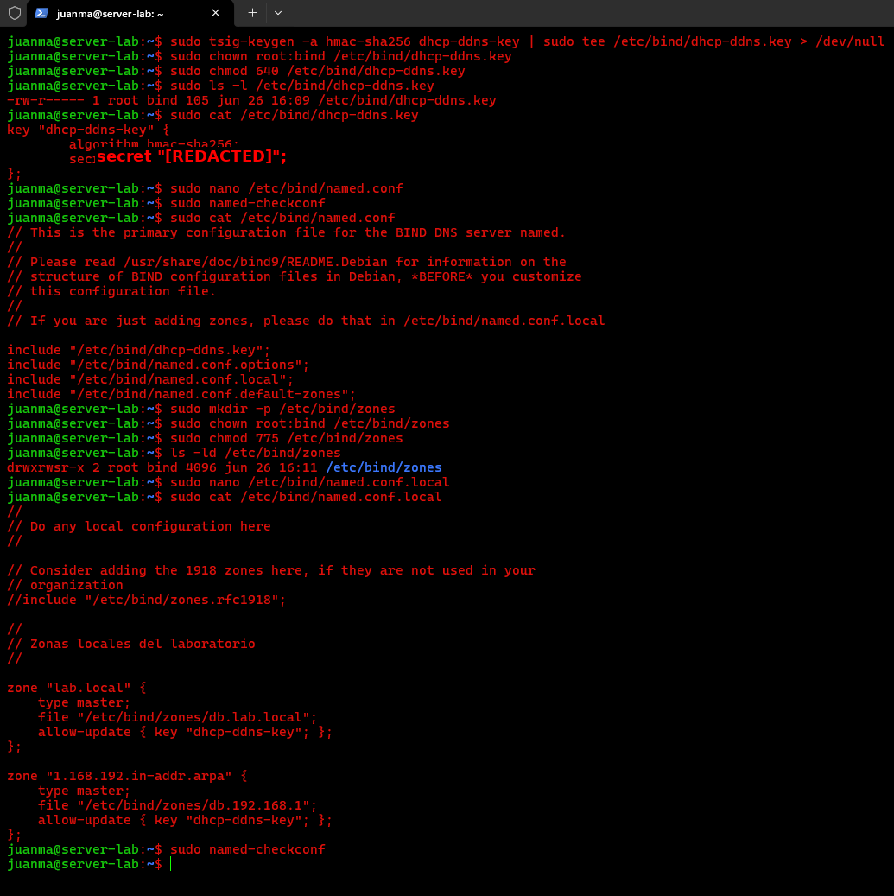

---

## 6. Declaración de zonas DNS

Se declara una zona directa para `lab.local` y una zona inversa para la red `192.168.1.0/24`.

Archivo editado:

```bash
sudo nano /etc/bind/named.conf.local
```

Contenido:

```conf
zone "lab.local" {
    type master;
    file "/etc/bind/zones/db.lab.local";
    allow-update { key "dhcp-ddns-key"; };
};

zone "1.168.192.in-addr.arpa" {
    type master;
    file "/etc/bind/zones/db.192.168.1";
    allow-update { key "dhcp-ddns-key"; };
};
```

Posteriormente estas zonas se moverán a `/var/lib/bind/zones` para permitir escritura dinámica por BIND9.

---

## 7. Creación inicial de archivos de zona

Se crea el directorio inicial de zonas:

```bash
sudo mkdir -p /etc/bind/zones
sudo chown root:bind /etc/bind/zones
sudo chmod 775 /etc/bind/zones
```

### Zona directa `db.lab.local`

```dns
$TTL 3600
@   IN  SOA server-lab.lab.local. admin.lab.local. (
        2026062601 ; Serial
        3600       ; Refresh
        1800       ; Retry
        604800     ; Expire
        86400 )    ; Negative Cache TTL

@           IN  NS      server-lab.lab.local.

server-lab  IN  A       192.168.1.8
ns1         IN  A       192.168.1.8
gateway     IN  A       192.168.1.8
media       IN  A       192.168.1.8
icecast     IN  A       192.168.1.8
radio       IN  A       192.168.1.8

dns         IN  CNAME   server-lab.lab.local.
dhcp        IN  CNAME   server-lab.lab.local.
```

### Zona inversa `db.192.168.1`

```dns
$TTL 3600
@   IN  SOA server-lab.lab.local. admin.lab.local. (
        2026062601 ; Serial
        3600       ; Refresh
        1800       ; Retry
        604800     ; Expire
        86400 )    ; Negative Cache TTL

@   IN  NS      server-lab.lab.local.

8   IN  PTR     server-lab.lab.local.
8   IN  PTR     gateway.lab.local.
8   IN  PTR     media.lab.local.
8   IN  PTR     icecast.lab.local.
8   IN  PTR     radio.lab.local.
```

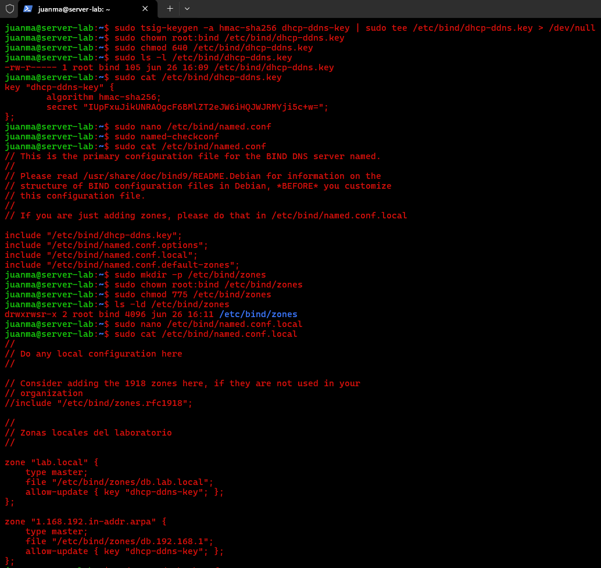

Validación:

```bash
sudo named-checkzone lab.local /etc/bind/zones/db.lab.local
sudo named-checkzone 1.168.192.in-addr.arpa /etc/bind/zones/db.192.168.1
sudo named-checkconf
sudo systemctl restart bind9
sudo systemctl status bind9
sudo ss -tulnp | grep ':53'
```

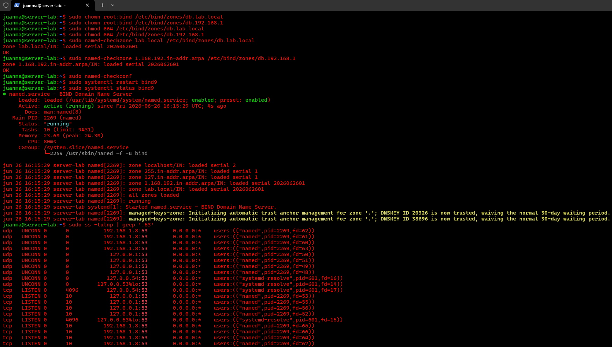

---

## 8. Pruebas de resolución DNS estática

Se comprueba que BIND9 resuelve registros locales y externos.

```bash
dig @192.168.1.8 server-lab.lab.local
dig @192.168.1.8 media.lab.local
dig @192.168.1.8 icecast.lab.local
dig @192.168.1.8 radio.lab.local
dig @192.168.1.8 google.com
dig @192.168.1.8 -x 192.168.1.8
```

Resultado validado:

```text
server-lab.lab.local -> 192.168.1.8
media.lab.local      -> 192.168.1.8
icecast.lab.local    -> 192.168.1.8
radio.lab.local      -> 192.168.1.8
google.com           -> resuelto por forwarders
192.168.1.8          -> PTR locales
```

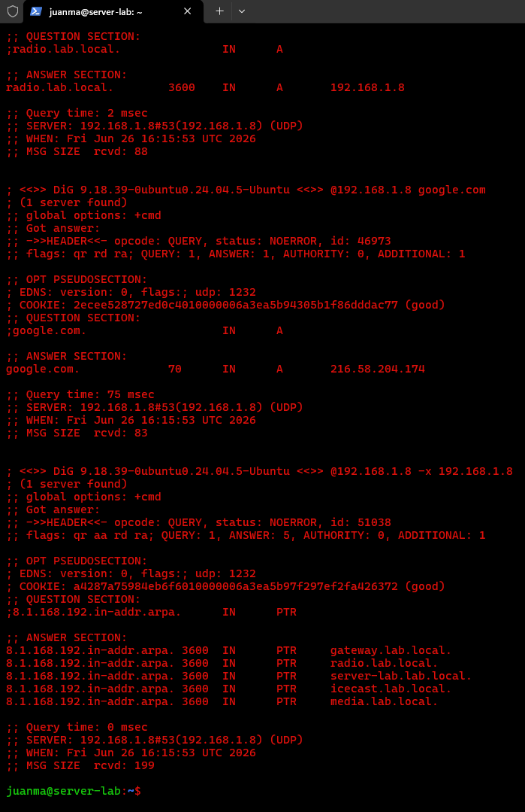

---

## 9. Instalación de ISC DHCP Server

Se instala el servidor DHCP dedicado:

```bash
sudo apt install isc-dhcp-server -y
```

Se indica la interfaz en la que debe escuchar:

```bash
sudo nano /etc/default/isc-dhcp-server
```

Configuración:

```conf
INTERFACESv4="enp0s8"
INTERFACESv6=""
```

Esto evita que el servicio DHCP responda en NAT o en host-only.

---

## 10. Configuración DHCP + DDNS

Inicialmente se intentó insertar manualmente el secreto TSIG en `dhcpd.conf`, pero el archivo falló porque se dejó un placeholder literal en lugar del secreto Base64 real.

Error observado:

```text
invalid base64 character 95
unknown key dhcp-ddns-key
```

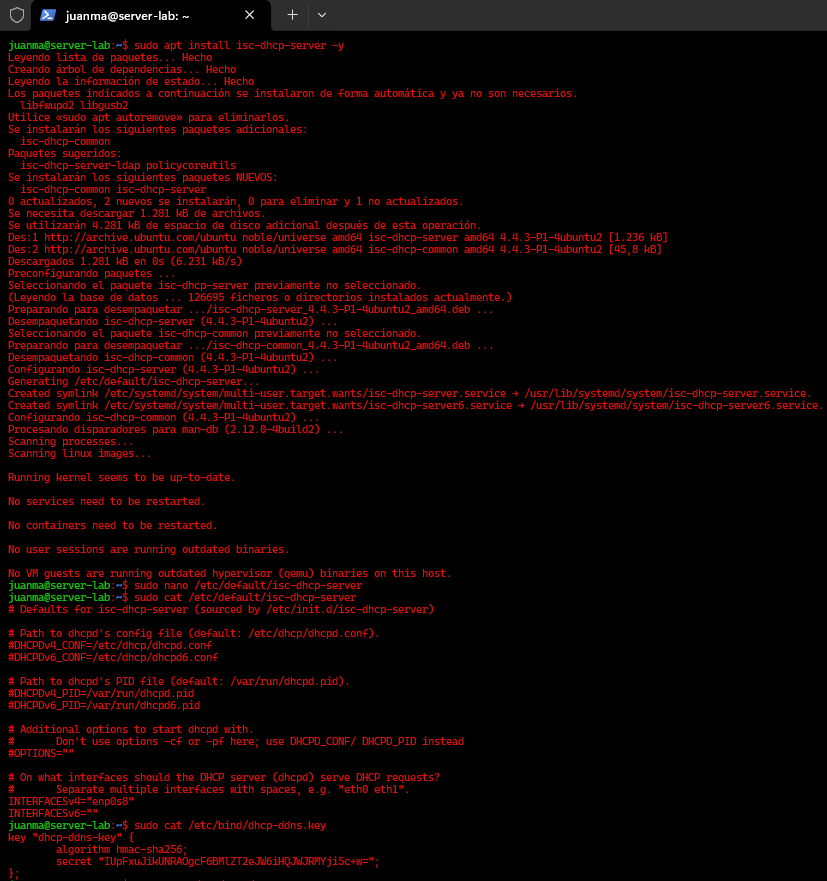

La solución profesional fue reutilizar la clave TSIG generada, evitando duplicar secretos a mano. Primero se intentó incluirla desde `/etc/bind/dhcp-ddns.key`, pero el servicio DHCP no podía leerla por permisos:

```text
Can't open /etc/bind/dhcp-ddns.key: Permission denied
```

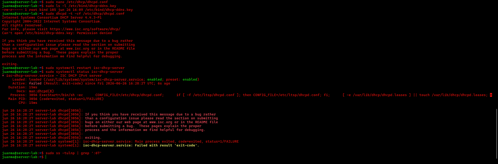

Se corrigió copiando la clave a `/etc/dhcp/` con permisos restrictivos:

```bash
sudo cp /etc/bind/dhcp-ddns.key /etc/dhcp/dhcp-ddns.key
sudo chown root:root /etc/dhcp/dhcp-ddns.key
sudo chmod 600 /etc/dhcp/dhcp-ddns.key
```

Configuración final de `/etc/dhcp/dhcpd.conf`:

```conf
include "/etc/dhcp/dhcp-ddns.key";

authoritative;

default-lease-time 3600;
max-lease-time 7200;

ddns-update-style interim;
ddns-updates on;
update-static-leases on;
ignore client-updates;

option domain-name "lab.local";
option domain-name-servers 192.168.1.8;

option routers 192.168.1.8;
option subnet-mask 255.255.255.0;
option broadcast-address 192.168.1.255;

zone lab.local. {
    primary 127.0.0.1;
    key "dhcp-ddns-key";
}

zone 1.168.192.in-addr.arpa. {
    primary 127.0.0.1;
    key "dhcp-ddns-key";
}

subnet 192.168.1.0 netmask 255.255.255.0 {
    range 192.168.1.50 192.168.1.150;

    option routers 192.168.1.8;
    option domain-name-servers 192.168.1.8;
    option domain-name "lab.local";
    option broadcast-address 192.168.1.255;
}

host cliente-ubuntu {
    hardware ethernet 08:00:27:4d:70:30;
    fixed-address 192.168.1.20;
    ddns-hostname "cliente-ubuntu";
}
```

Validación:

```bash
sudo dhcpd -t -cf /etc/dhcp/dhcpd.conf
sudo systemctl restart isc-dhcp-server
sudo systemctl status isc-dhcp-server
sudo ss -tulnp | grep ':67'
```

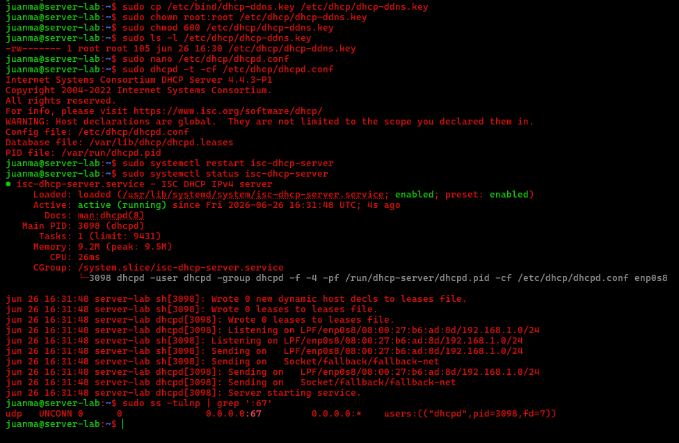

---

## 11. Validación desde cliente Ubuntu

En el cliente Ubuntu Desktop se renovó la conexión gestionada por NetworkManager:

```bash
nmcli connection show
sudo nmcli connection down "netplan-enp0s3"
sudo nmcli connection up "netplan-enp0s3"
```

Validaciones:

```bash
ip -br addr
ip route
resolvectl status
resolvectl query server-lab.lab.local
resolvectl query icecast.lab.local
resolvectl query google.com
```

Resultado:

```text
IP cliente:      192.168.1.20/24
Gateway:         192.168.1.8
DNS:             192.168.1.8
DNS Domain:      lab.local
Resolución local: OK
Resolución externa: OK
```

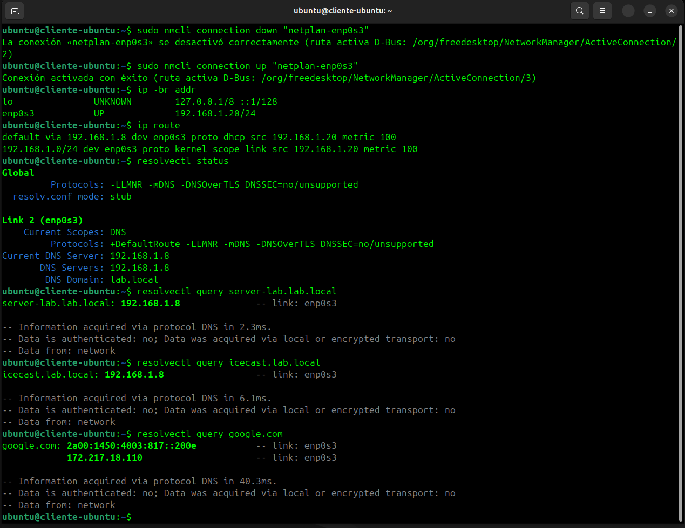

---

## 12. Problema DDNS: SERVFAIL

Aunque DHCP entregaba IP correctamente, al principio DDNS fallaba.

En los logs de DHCP aparecía:

```text
Unable to add forward map from cliente-ubuntu.lab.local to 192.168.1.20: SERVFAIL
```

Y las consultas no devolvían registros para el cliente:

```bash
dig @192.168.1.8 cliente-ubuntu.lab.local
dig @192.168.1.8 -x 192.168.1.20
```

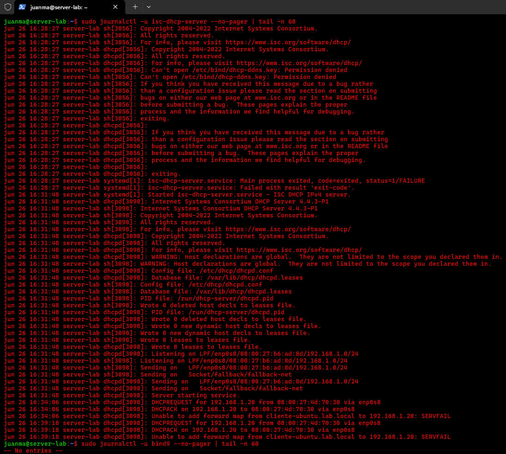

La causa probable era que las zonas dinámicas estaban ubicadas en `/etc/bind/zones`, ruta no ideal para escritura dinámica por parte de BIND9.

---

## 13. Solución: zonas dinámicas en `/var/lib/bind/zones`

Se movieron las zonas a una ubicación adecuada para datos dinámicos de BIND9:

```bash
sudo mkdir -p /var/lib/bind/zones
sudo cp /etc/bind/zones/db.lab.local /var/lib/bind/zones/db.lab.local
sudo cp /etc/bind/zones/db.192.168.1 /var/lib/bind/zones/db.192.168.1
sudo chown -R bind:bind /var/lib/bind/zones
sudo chmod 775 /var/lib/bind/zones
sudo chmod 664 /var/lib/bind/zones/db.lab.local
sudo chmod 664 /var/lib/bind/zones/db.192.168.1
```

Se actualizó `/etc/bind/named.conf.local`:

```conf
zone "lab.local" {
    type master;
    file "/var/lib/bind/zones/db.lab.local";
    allow-update { key "dhcp-ddns-key"; };
};

zone "1.168.192.in-addr.arpa" {
    type master;
    file "/var/lib/bind/zones/db.192.168.1";
    allow-update { key "dhcp-ddns-key"; };
};
```

Validación y reinicio:

```bash
sudo named-checkconf
sudo named-checkzone lab.local /var/lib/bind/zones/db.lab.local
sudo named-checkzone 1.168.192.in-addr.arpa /var/lib/bind/zones/db.192.168.1
sudo systemctl restart bind9
sudo systemctl restart isc-dhcp-server
```

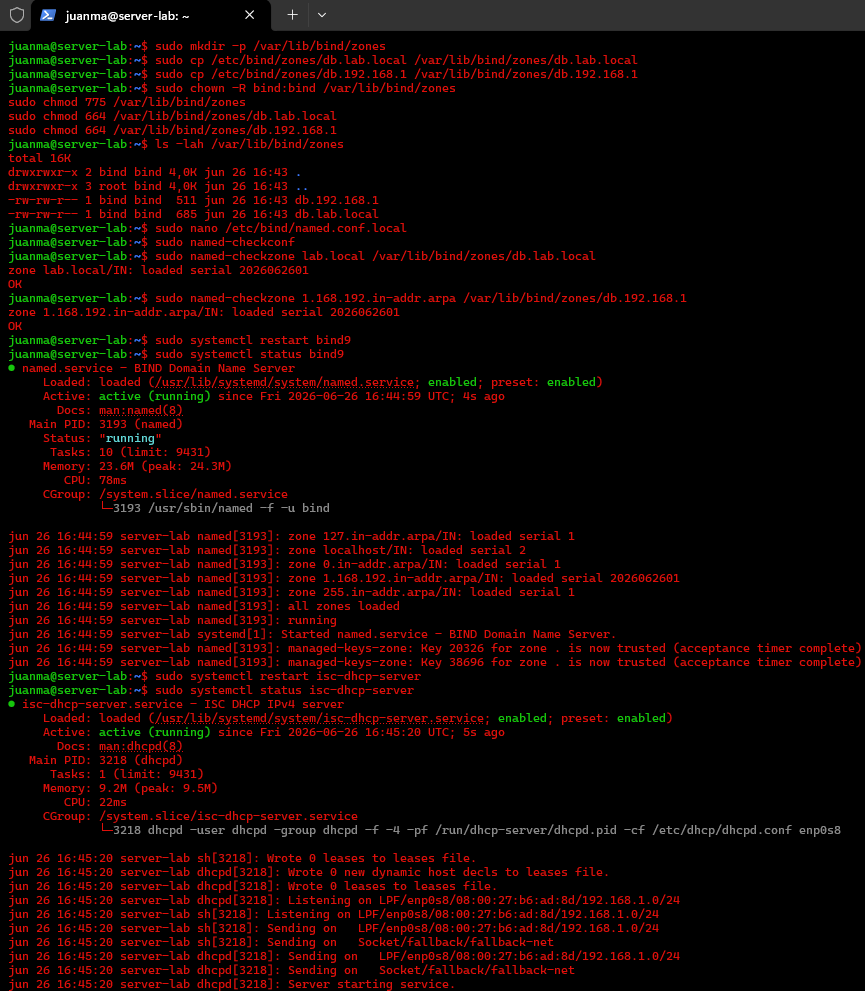

Después de renovar DHCP desde el cliente, los logs mostraron:

```text
Added new forward map from cliente-ubuntu.lab.local to 192.168.1.20
Added reverse map from 20.1.168.192.in-addr.arpa. to cliente-ubuntu.lab.local
```

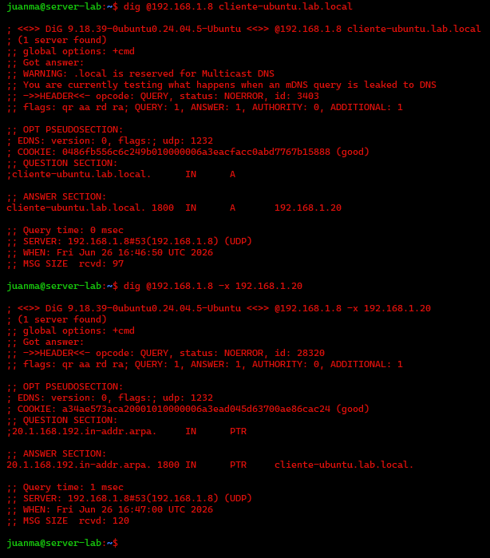

---

## 14. Limpieza final de configuración DHCP

Para eliminar el warning:

```text
WARNING: Host declarations are global
```

se movió la reserva `host cliente-ubuntu` fuera del bloque `subnet`. Tras validar de nuevo, el servicio quedó activo sin warnings relevantes.

```bash
sudo dhcpd -t -cf /etc/dhcp/dhcpd.conf
sudo systemctl restart isc-dhcp-server
sudo systemctl status isc-dhcp-server
sudo ss -tulnp | grep ':67'
```

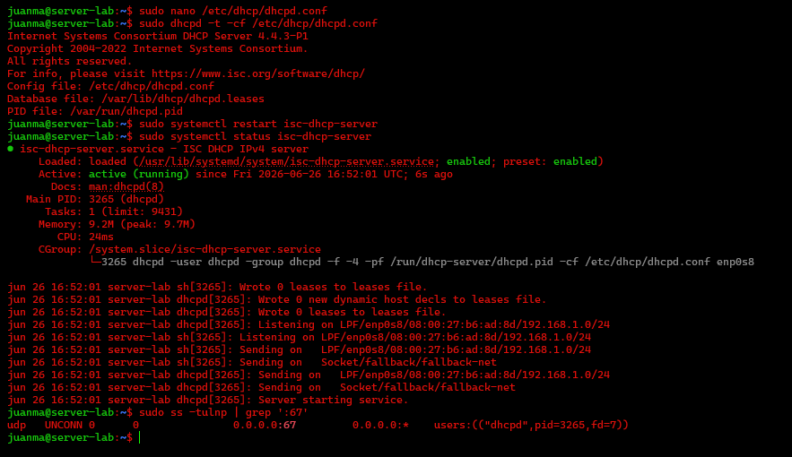

---

## 15. Verificación final desde cliente y servidor

Desde el cliente:

```bash
sudo nmcli connection down "netplan-enp0s3"
sudo nmcli connection up "netplan-enp0s3"
ip -br addr
ip route
resolvectl status
resolvectl query server-lab.lab.local
resolvectl query cliente-ubuntu.lab.local
resolvectl query icecast.lab.local
resolvectl query google.com
```

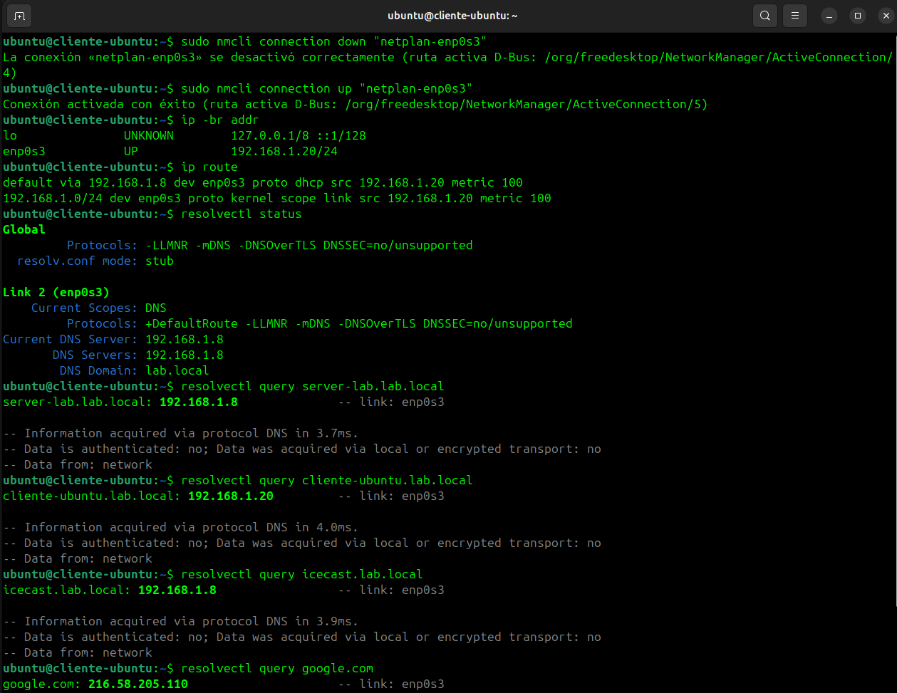

Desde el servidor:

```bash
sudo systemctl status isc-dhcp-server
sudo ss -tulnp | grep ':67'
dig @192.168.1.8 cliente-ubuntu.lab.local
dig @192.168.1.8 -x 192.168.1.20
```

Resultado final:

```text
cliente-ubuntu.lab.local -> 192.168.1.20
192.168.1.20 -> cliente-ubuntu.lab.local
```

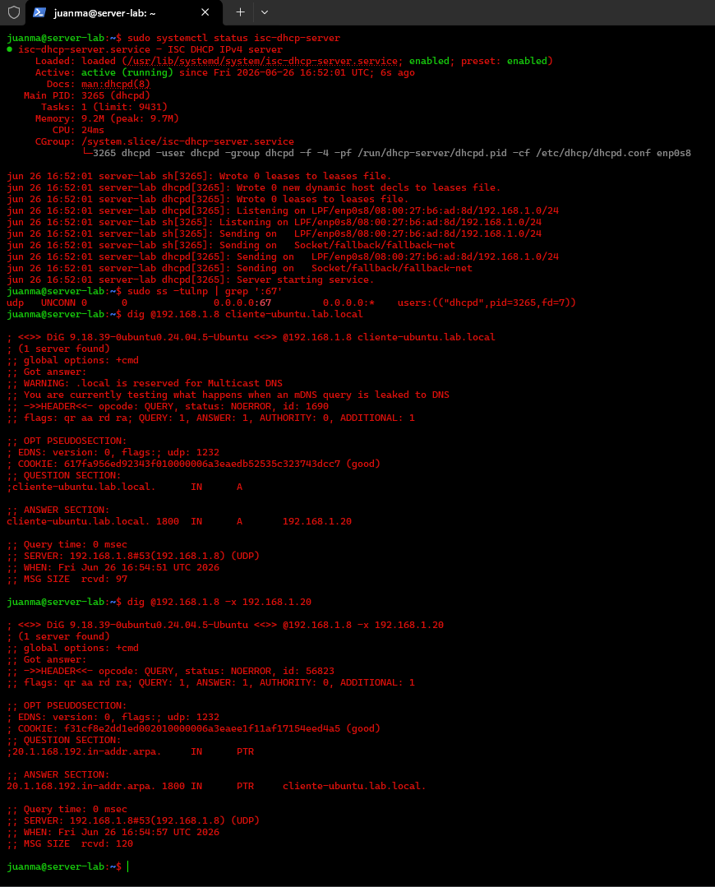

---

## 16. Estado final de la infraestructura

La base profesional queda preparada para desplegar servicios posteriores como Icecast2, NGINX, bases de datos, monitorización o servidores web internos.

```text
server-lab
├── BIND9 autoritativo para lab.local
├── ISC DHCP Server en enp0s8
├── DDNS con clave TSIG
├── NAT hacia Internet
├── cliente-ubuntu con IP fija vía DHCP reservation
└── resolución directa e inversa automática
```

Servicios DNS ya preparados:

```text
server-lab.lab.local       -> 192.168.1.8
media.lab.local            -> 192.168.1.8
icecast.lab.local          -> 192.168.1.8
radio.lab.local            -> 192.168.1.8
cliente-ubuntu.lab.local   -> 192.168.1.20 vía DDNS
```

---

## 17. Problemas encontrados y soluciones

| Problema | Causa | Solución |
|---|---|---|
| `invalid base64 character 95` | Se dejó `PEGAR_AQUI_TU_SECRET` en lugar del secreto real | Reutilizar clave TSIG real mediante `include` |
| `Permission denied` al leer la clave | DHCP no podía leer `/etc/bind/dhcp-ddns.key` | Copiar clave a `/etc/dhcp/dhcp-ddns.key` con permisos restrictivos |
| `SERVFAIL` en DDNS | BIND no podía actualizar zonas en ruta inicial | Mover zonas dinámicas a `/var/lib/bind/zones` con propiedad `bind:bind` |
| Warning `Host declarations are global` | Reserva host dentro del bloque subnet | Mover `host cliente-ubuntu` fuera del bloque subnet |
| Cliente sin `dhclient` | Ubuntu Desktop usa NetworkManager | Renovar con `nmcli connection down/up` |

---

## 18. Buenas prácticas aplicadas

- Separación entre DNS y DHCP.
- Uso de BIND9 como DNS autoritativo.
- Uso de ISC DHCP Server como servidor DHCP dedicado.
- DDNS autenticado mediante clave TSIG.
- Servicio DHCP limitado a la interfaz interna `enp0s8`.
- Zonas dinámicas ubicadas en `/var/lib/bind/zones`.
- Secretos redactados en documentación pública.
- Backups previos antes de migrar desde `dnsmasq`.
- Validación con `named-checkconf`, `named-checkzone` y `dhcpd -t`.
- Resolución directa e inversa comprobada con `dig`.

---

## 19. Conclusión

Se ha migrado correctamente una base sencilla basada en `dnsmasq` hacia una arquitectura más profesional con BIND9, ISC DHCP Server y DDNS.

El resultado permite que los clientes de la red interna reciban IP, gateway, DNS y dominio de búsqueda por DHCP, mientras el propio servidor DHCP actualiza automáticamente los registros DNS directos e inversos en BIND9.

Esta base queda lista para laboratorios posteriores, especialmente servicios internos que dependan de nombres DNS estables, como:

```text
icecast.lab.local
radio.lab.local
media.lab.local
web.lab.local
monitor.lab.local
```
