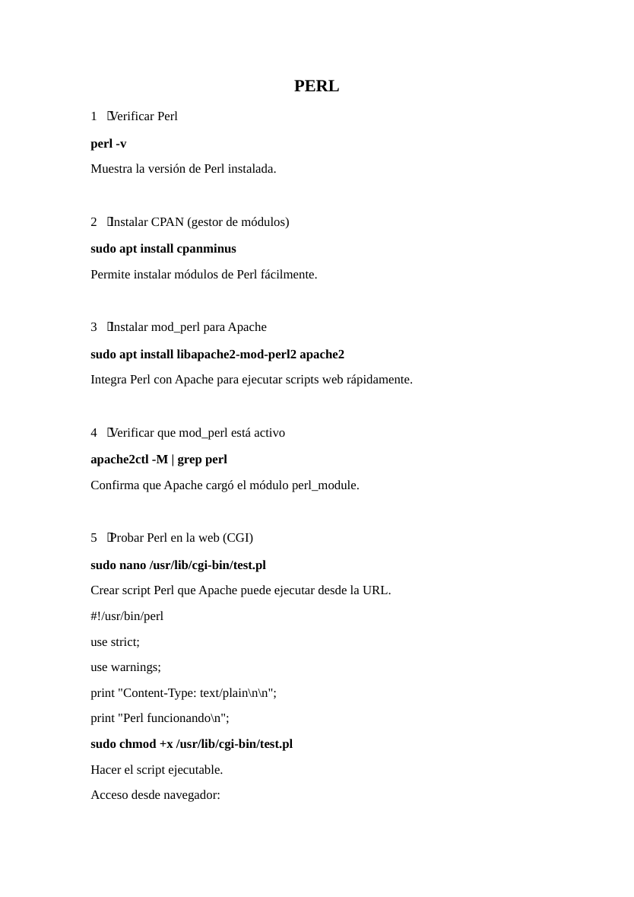
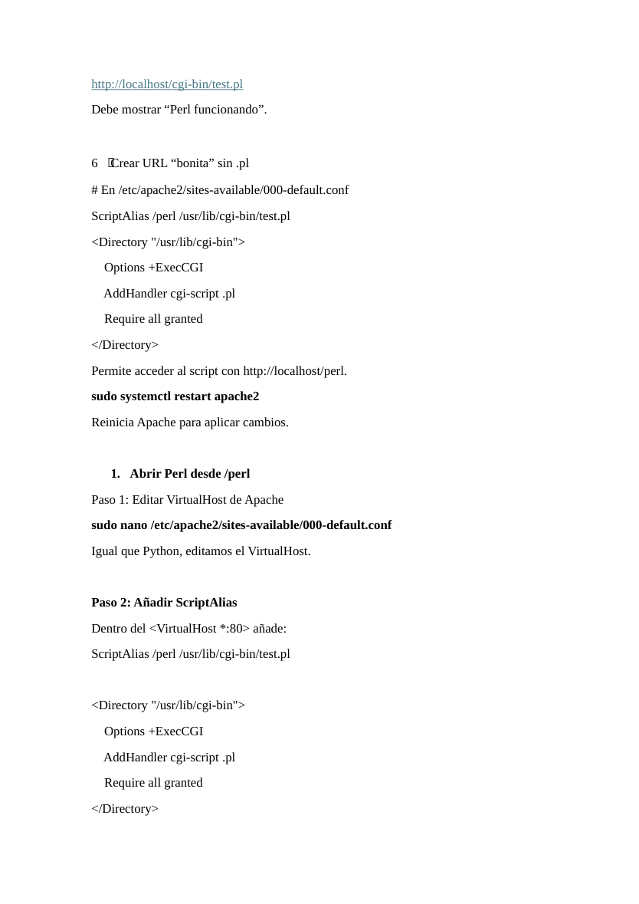
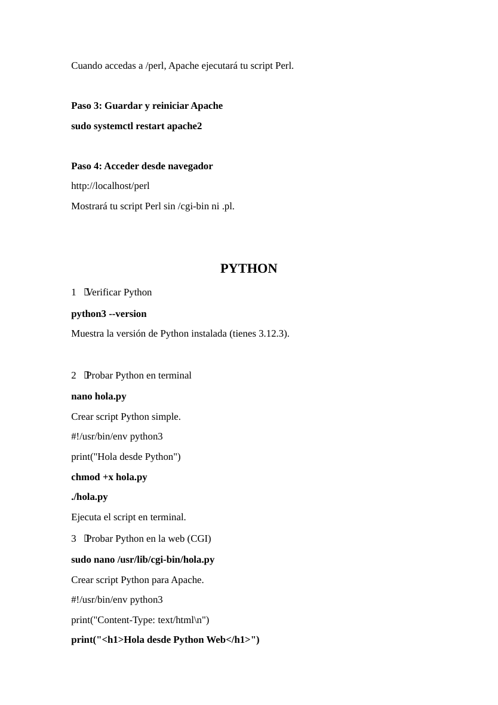
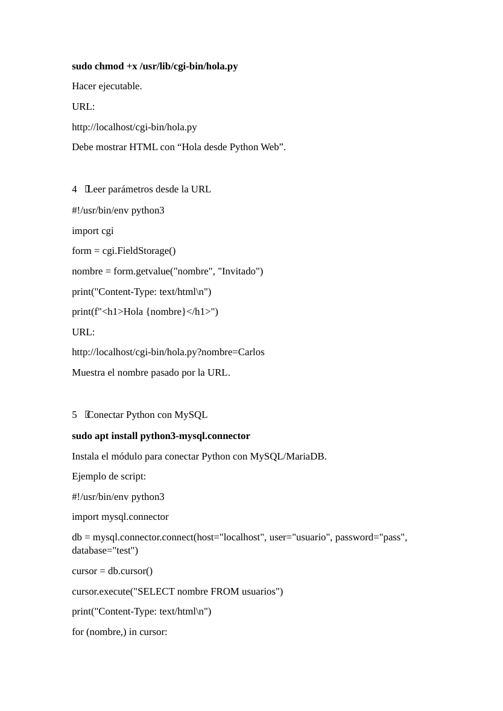
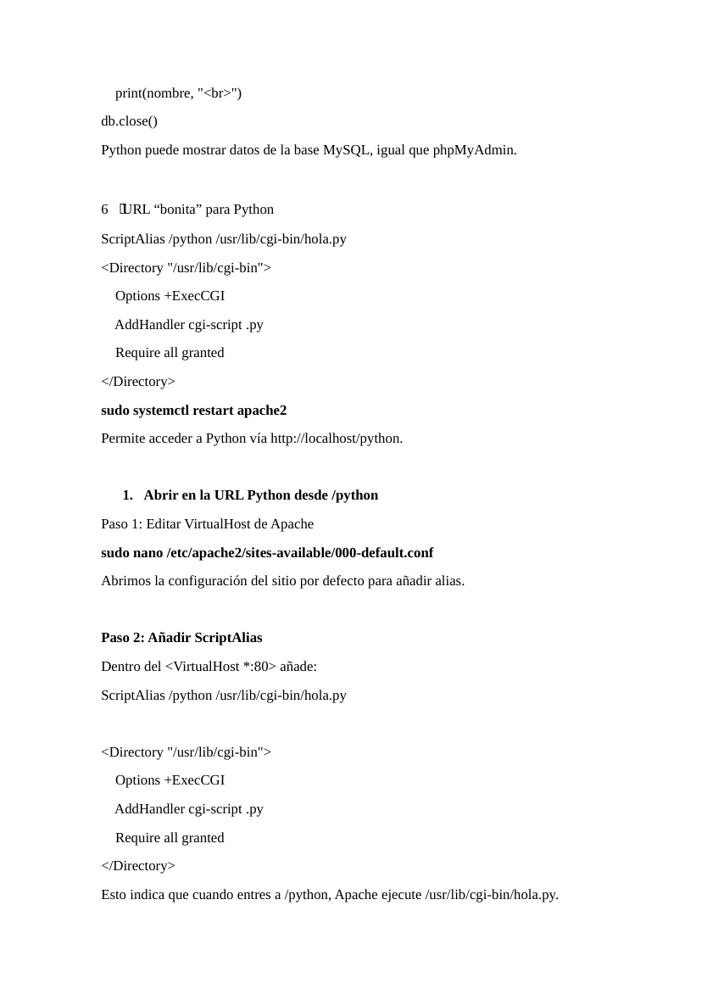
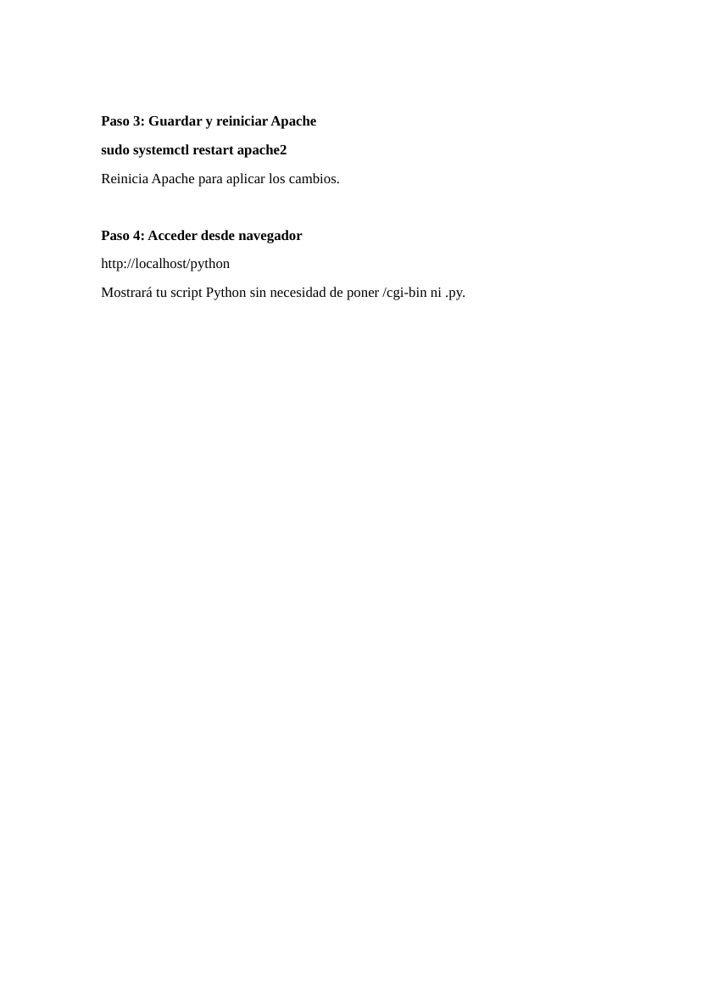

# Apache - Ejecución web de scripts Perl y Python mediante CGI

**Autor:** Nammu  
**Entorno:** laboratorio local controlado  
**Categoría:** Servicios de Internet / Web / CGI / Scripting

## Objetivo

Configurar Apache para ejecutar scripts Perl y Python mediante CGI, validar ejecución desde navegador y crear rutas limpias mediante `ScriptAlias`.

## Arquitectura

```text
Cliente navegador
      |
      | HTTP
      v
Apache2
├── /usr/lib/cgi-bin/test.pl
├── /usr/lib/cgi-bin/hola.py
├── ScriptAlias /perl
└── ScriptAlias /python
```

## Perl CGI

Instalación de dependencias:

```bash
sudo apt update
sudo apt install apache2 cpanminus libapache2-mod-perl2 -y
```

Verificación:

```bash
perl -v
apache2ctl -M | grep perl
```

Script de prueba:

```bash
sudo nano /usr/lib/cgi-bin/test.pl
```

```perl
#!/usr/bin/perl
use strict;
use warnings;
print "Content-Type: text/plain\n\n";
print "Perl funcionando\n";
```

Permisos:

```bash
sudo chmod +x /usr/lib/cgi-bin/test.pl
```

Acceso:

```text
http://localhost/cgi-bin/test.pl
```

## Python CGI

Script:

```bash
sudo nano /usr/lib/cgi-bin/hola.py
```

```python
#!/usr/bin/env python3
print("Content-Type: text/html\n")
print("<h1>Hola desde Python Web</h1>")
```

Permisos:

```bash
sudo chmod +x /usr/lib/cgi-bin/hola.py
```

Acceso:

```text
http://localhost/cgi-bin/hola.py
```

## Parámetros por URL

```python
#!/usr/bin/env python3
import cgi
form = cgi.FieldStorage()
nombre = form.getvalue("nombre", "Invitado")
print("Content-Type: text/html\n")
print(f"<h1>Hola {nombre}</h1>")
```

Prueba:

```text
http://localhost/cgi-bin/hola.py?nombre=Nammu
```

## Rutas limpias con ScriptAlias

Editar VirtualHost:

```bash
sudo nano /etc/apache2/sites-available/000-default.conf
```

Dentro de `<VirtualHost *:80>`:

```apache
ScriptAlias /perl /usr/lib/cgi-bin/test.pl
ScriptAlias /python /usr/lib/cgi-bin/hola.py

<Directory "/usr/lib/cgi-bin">
    Options +ExecCGI
    AddHandler cgi-script .pl .py
    Require all granted
</Directory>
```

Reiniciar:

```bash
sudo systemctl restart apache2
```

## Verificación final

```bash
curl http://localhost/perl
curl http://localhost/python
```

## Buenas prácticas

- Usar CGI solo para laboratorios o necesidades concretas.
- No ejecutar scripts como root.
- Validar entradas de usuario.
- No almacenar credenciales dentro de scripts.
- Revisar permisos de ejecución.

## Evidencias visuales












