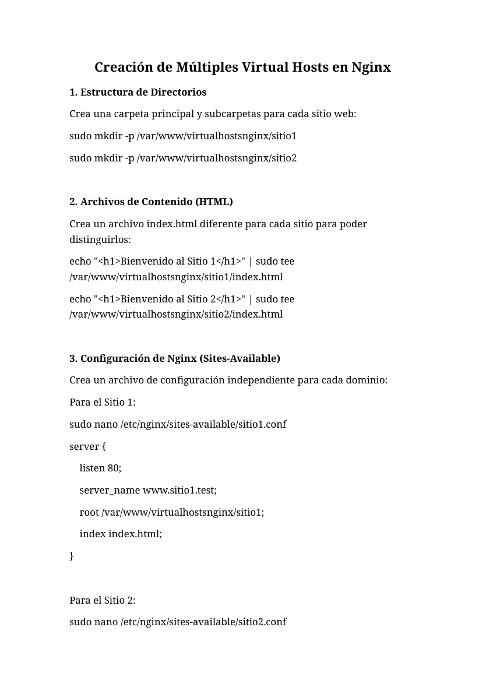
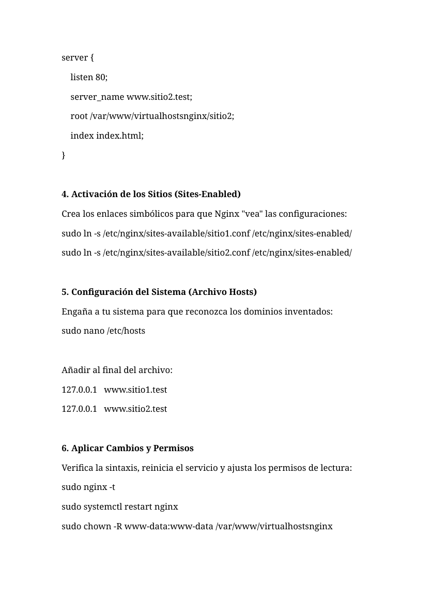
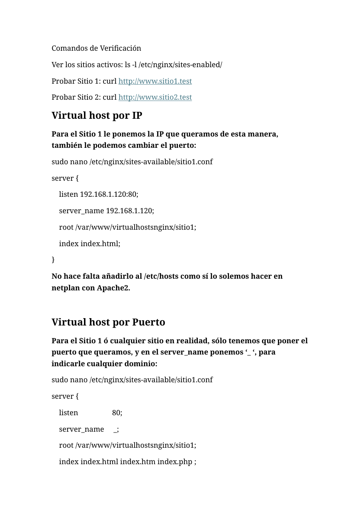

# Nginx - Múltiples Virtual Hosts

**Autor:** Nammu  
**Entorno:** laboratorio local controlado  
**Categoría:** Servicios de Internet / Web / Nginx

## Objetivo

Configurar varios sitios web independientes en Nginx mediante `server_name`, directorios separados, archivos en `sites-available`, enlaces en `sites-enabled` y comprobación con `curl`.

## Estructura de directorios

```bash
sudo mkdir -p /var/www/virtualhostsnginx/sitio1
sudo mkdir -p /var/www/virtualhostsnginx/sitio2
```

Contenido de prueba:

```bash
echo "<h1>Bienvenido al Sitio 1</h1>" | sudo tee /var/www/virtualhostsnginx/sitio1/index.html
echo "<h1>Bienvenido al Sitio 2</h1>" | sudo tee /var/www/virtualhostsnginx/sitio2/index.html
```

Permisos:

```bash
sudo chown -R www-data:www-data /var/www/virtualhostsnginx
```

## VirtualHost sitio 1

```bash
sudo nano /etc/nginx/sites-available/sitio1.conf
```

```nginx
server {
    listen 80;
    server_name www.sitio1.test;
    root /var/www/virtualhostsnginx/sitio1;
    index index.html;
}
```

## VirtualHost sitio 2

```bash
sudo nano /etc/nginx/sites-available/sitio2.conf
```

```nginx
server {
    listen 80;
    server_name www.sitio2.test;
    root /var/www/virtualhostsnginx/sitio2;
    index index.html;
}
```

## Activación

```bash
sudo ln -s /etc/nginx/sites-available/sitio1.conf /etc/nginx/sites-enabled/
sudo ln -s /etc/nginx/sites-available/sitio2.conf /etc/nginx/sites-enabled/
```

## Resolución local

En un laboratorio simple se puede usar `/etc/hosts`:

```text
127.0.0.1 www.sitio1.test
127.0.0.1 www.sitio2.test
```

En nuestra base profesional, lo recomendable es crear registros DNS en BIND9:

```dns
www.sitio1 IN A 192.168.1.8
www.sitio2 IN A 192.168.1.8
```

## Validación

```bash
sudo nginx -t
sudo systemctl restart nginx
ls -l /etc/nginx/sites-enabled/
curl http://www.sitio1.test
curl http://www.sitio2.test
```

## Variantes

### Virtual host por IP

```nginx
server {
    listen 192.168.1.120:80;
    server_name 192.168.1.120;
    root /var/www/virtualhostsnginx/sitio1;
    index index.html;
}
```

### Virtual host por puerto

```nginx
server {
    listen 8081;
    server_name _;
    root /var/www/virtualhostsnginx/sitio1;
    index index.html;
}
```

## Buenas prácticas

- Un archivo por sitio en `sites-available`.
- Activación mediante enlace simbólico.
- Verificación con `nginx -t` antes de reiniciar.
- Permisos correctos para `www-data`.
- DNS centralizado en BIND9 si existe infraestructura de laboratorio.

## Evidencias visuales








