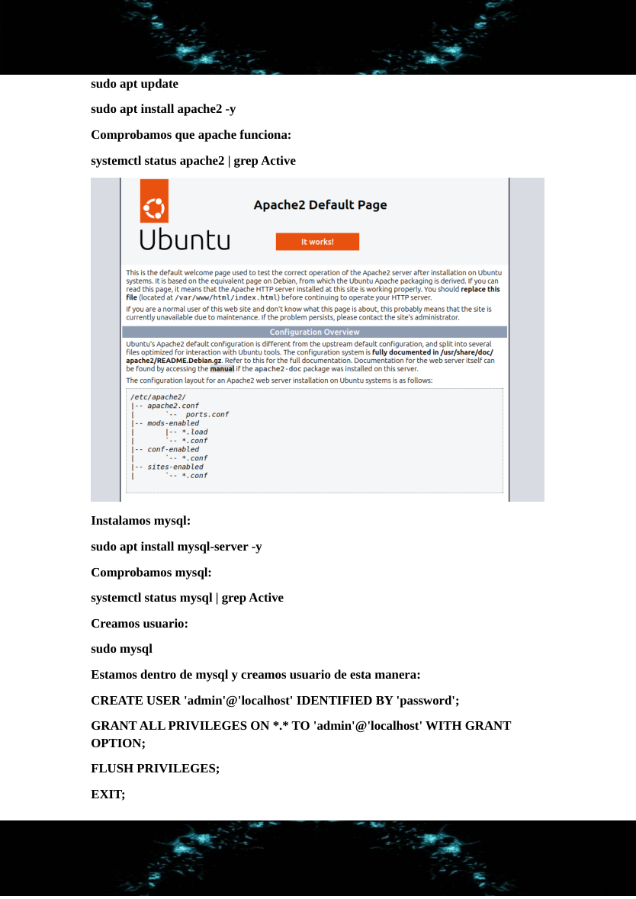
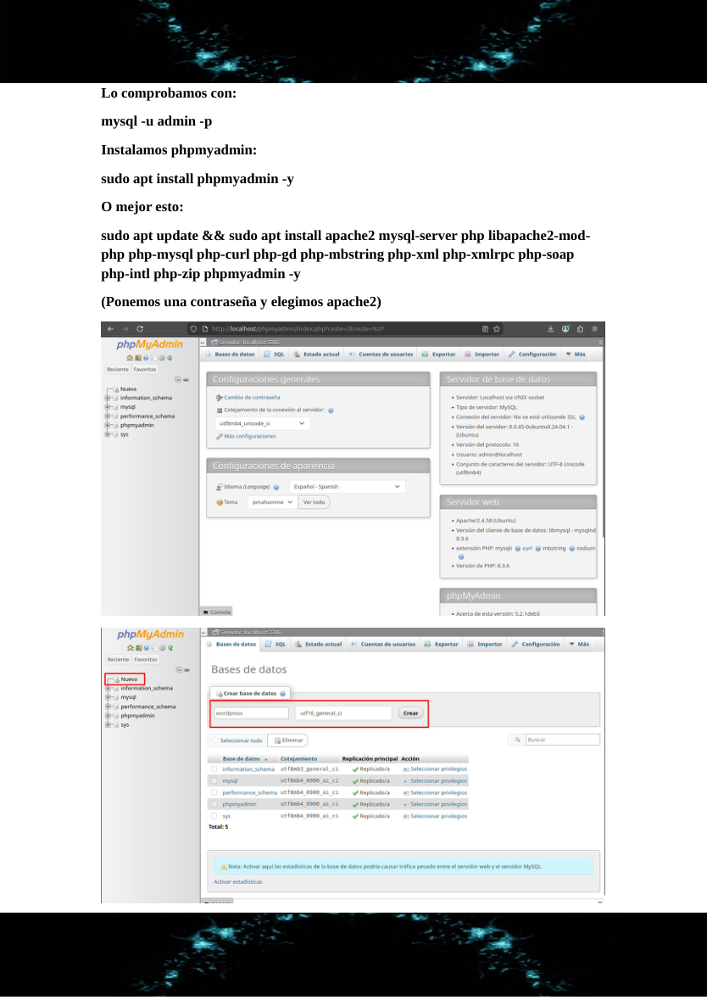
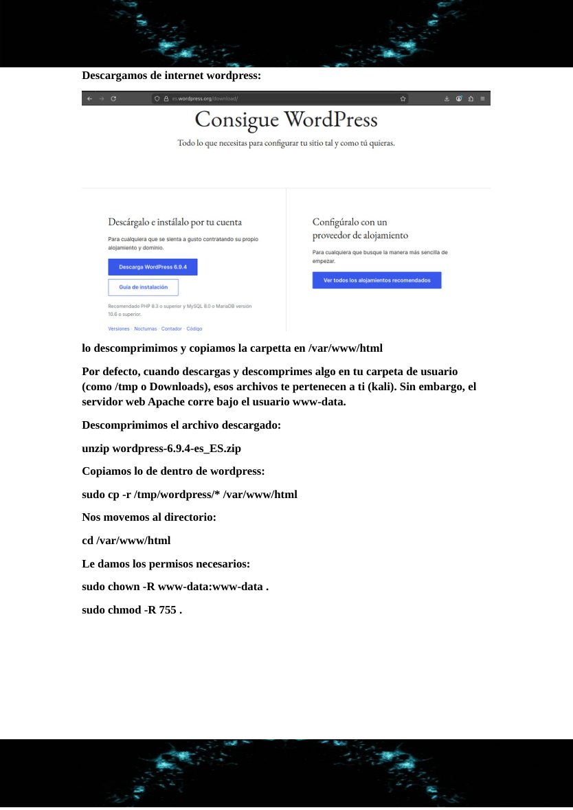
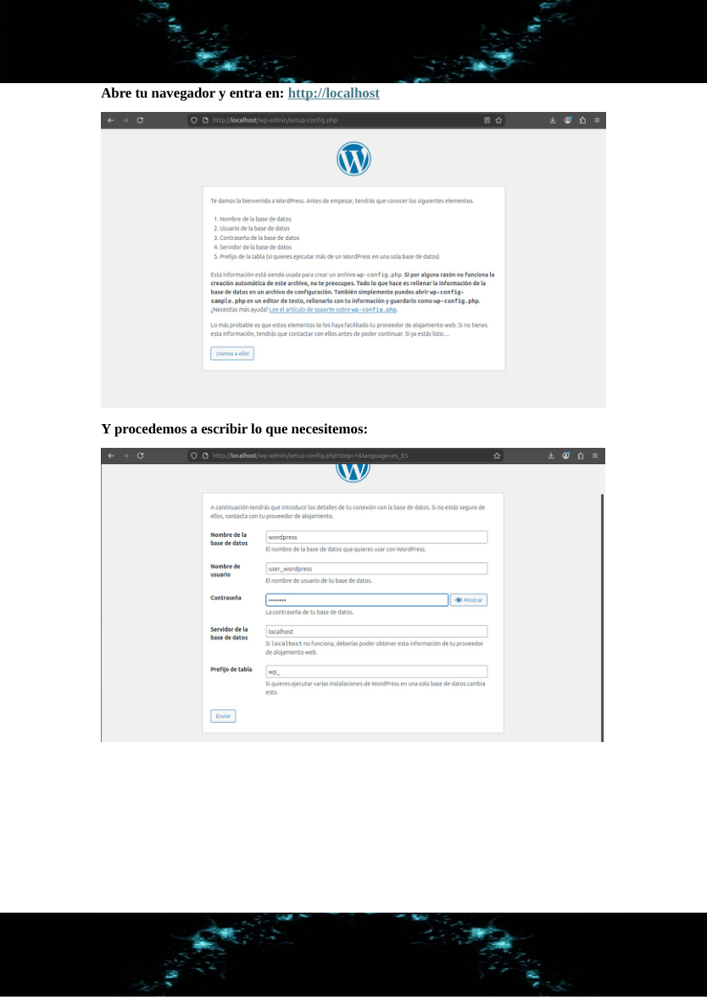
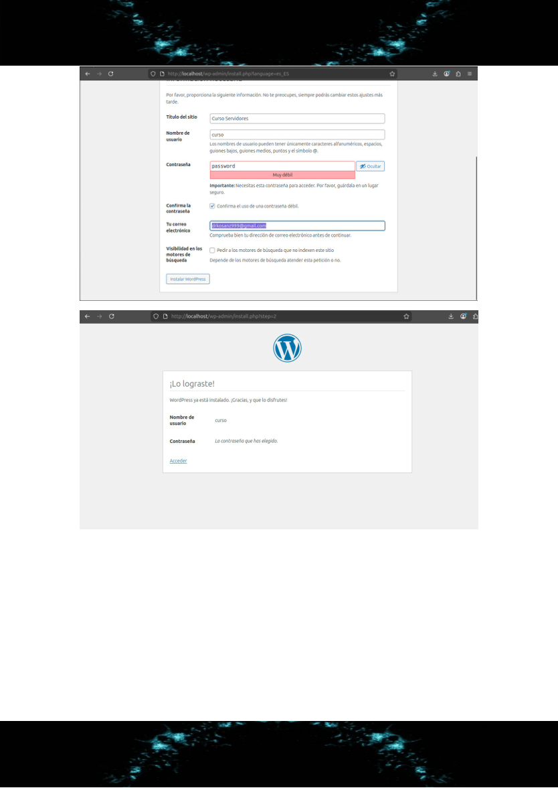
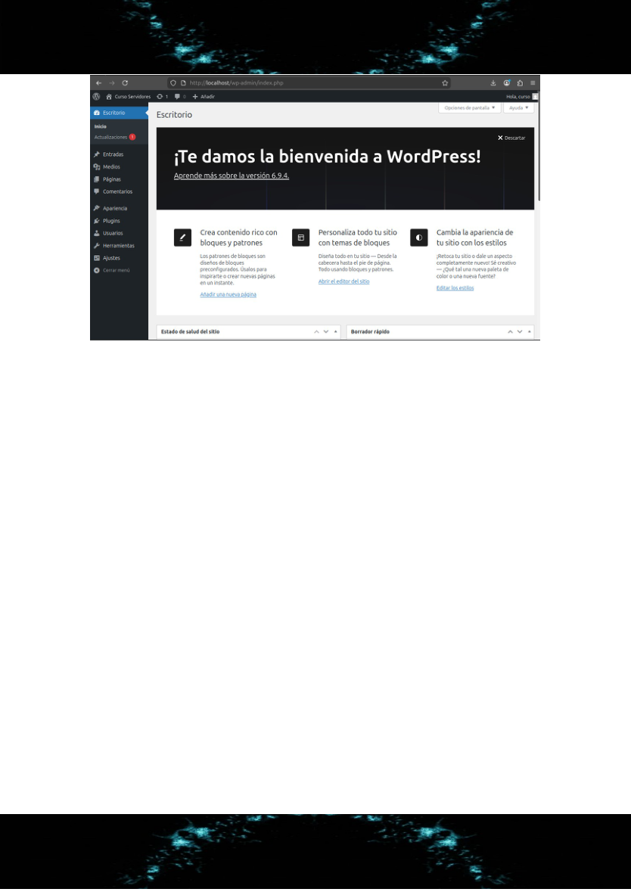

# Ubuntu - Apache2, MySQL, phpMyAdmin y WordPress

**Autor:** Nammu  
**Entorno:** laboratorio local controlado  
**Categoría:** Servicios de Internet / Web / LAMP / CMS

## Objetivo

Instalar y validar una pila LAMP en Ubuntu para desplegar WordPress con Apache2, MySQL/MariaDB, PHP y phpMyAdmin. El objetivo del laboratorio es practicar el despliegue completo de un CMS con base de datos, permisos correctos y comprobaciones de servicio.

## Arquitectura

```text
Cliente navegador
      |
      | HTTP/80
      v
Ubuntu Server
├── Apache2
├── PHP + módulos WordPress
├── MySQL/MariaDB
├── phpMyAdmin
└── WordPress en /var/www/html
```

## Instalación base

```bash
sudo apt update
sudo apt install apache2 mysql-server php libapache2-mod-php \
php-mysql php-curl php-gd php-mbstring php-xml php-soap \
php-intl php-zip phpmyadmin unzip curl -y
```

Comprobación de servicios:

```bash
systemctl status apache2 --no-pager
systemctl status mysql --no-pager
```

## Base de datos y usuario para WordPress

En un entorno profesional no se debe usar `root` para WordPress. Se crea una base de datos y un usuario específico:

```sql
CREATE DATABASE wordpress CHARACTER SET utf8mb4 COLLATE utf8mb4_unicode_ci;
CREATE USER 'wpuser'@'localhost' IDENTIFIED BY '<WORDPRESS_DB_PASSWORD>';
GRANT ALL PRIVILEGES ON wordpress.* TO 'wpuser'@'localhost';
FLUSH PRIVILEGES;
```

Verificación:

```bash
mysql -u wpuser -p wordpress
```

## Despliegue de WordPress

```bash
cd /tmp
curl -O https://wordpress.org/latest.zip
unzip latest.zip
sudo rsync -av wordpress/ /var/www/html/
sudo chown -R www-data:www-data /var/www/html
sudo find /var/www/html -type d -exec chmod 755 {} \;
sudo find /var/www/html -type f -exec chmod 644 {} \;
```

## Configuración web

Desde navegador:

```text
http://<IP_DEL_SERVIDOR>/wp-admin/install.php
```

Datos de conexión:

```text
Base de datos: wordpress
Usuario: wpuser
Contraseña: <WORDPRESS_DB_PASSWORD>
Servidor: localhost
Prefijo: wp_
```

## Buenas prácticas aplicadas

- Usuario de base de datos dedicado para WordPress.
- Credenciales redactadas en el write-up.
- Propietario web `www-data:www-data`.
- Permisos diferenciados para directorios y ficheros.
- Validación de Apache, MySQL/phpMyAdmin y acceso web.

## Verificación final

```bash
curl -I http://localhost
systemctl is-active apache2
systemctl is-active mysql
```

Resultado esperado: Apache activo, MySQL activo y WordPress accesible desde navegador.

## Evidencias visuales












