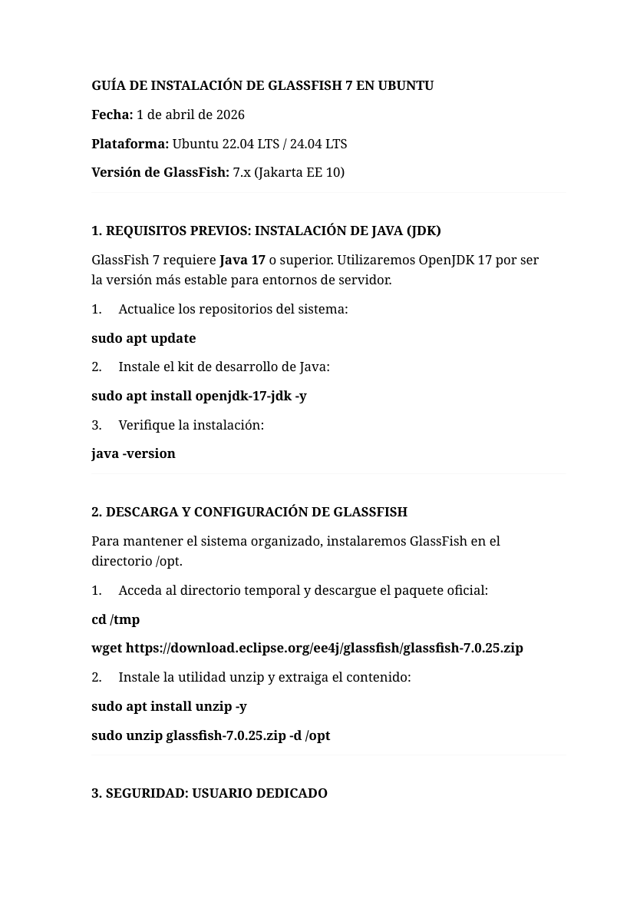
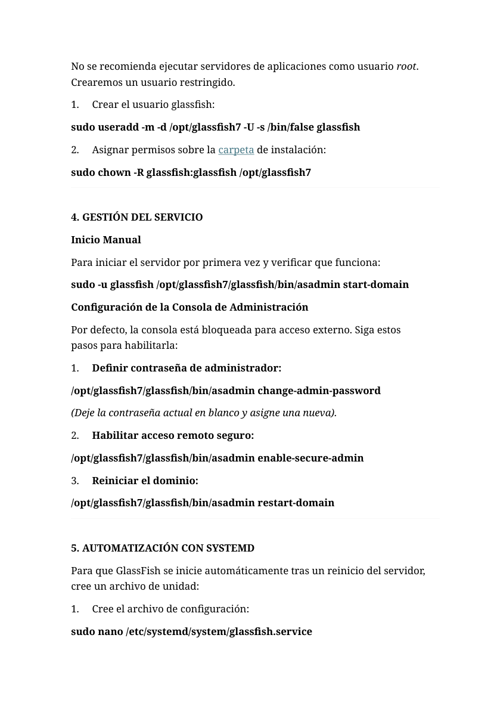
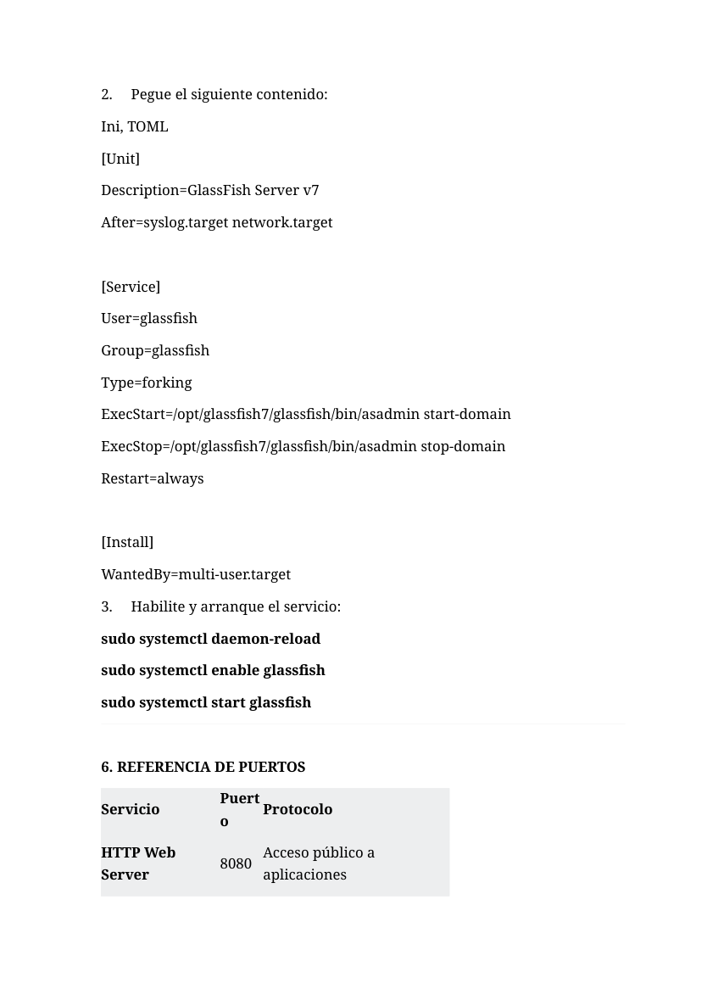

# Ubuntu - GlassFish 7 con usuario dedicado y systemd

**Autor:** Nammu  
**Entorno:** laboratorio local controlado  
**Categoría:** Servicios de Internet / Servidor de aplicaciones / Jakarta EE

## Objetivo

Instalar GlassFish 7 en Ubuntu de forma ordenada, usando Java 17, instalación bajo `/opt`, usuario dedicado sin shell interactiva y servicio `systemd` para gestión profesional del servidor de aplicaciones.

## Componentes

```text
Ubuntu Server
├── OpenJDK 17
├── GlassFish 7.x
├── Usuario dedicado: glassfish
└── systemd: glassfish.service
```

## Instalación de Java

GlassFish 7 requiere Java 17 o superior. Se instala OpenJDK 17:

```bash
sudo apt update
sudo apt install openjdk-17-jdk unzip wget -y
java -version
```

## Instalación en /opt

```bash
cd /tmp
wget https://download.eclipse.org/ee4j/glassfish/glassfish-7.0.25.zip
sudo unzip glassfish-7.0.25.zip -d /opt
```

## Usuario dedicado

No se recomienda ejecutar un servidor de aplicaciones como `root`. Se crea un usuario específico:

```bash
sudo useradd -m -d /opt/glassfish7 -U -s /bin/false glassfish
sudo chown -R glassfish:glassfish /opt/glassfish7
```

## Arranque manual de prueba

```bash
sudo -u glassfish /opt/glassfish7/glassfish/bin/asadmin start-domain
sudo -u glassfish /opt/glassfish7/glassfish/bin/asadmin stop-domain
```

## Configuración de administración remota

```bash
sudo -u glassfish /opt/glassfish7/glassfish/bin/asadmin change-admin-password
sudo -u glassfish /opt/glassfish7/glassfish/bin/asadmin enable-secure-admin
sudo -u glassfish /opt/glassfish7/glassfish/bin/asadmin restart-domain
```

La contraseña de administración no se documenta en claro.

## Servicio systemd

Archivo:

```bash
sudo nano /etc/systemd/system/glassfish.service
```

Contenido:

```ini
[Unit]
Description=GlassFish Server v7
After=syslog.target network.target

[Service]
User=glassfish
Group=glassfish
Type=forking
ExecStart=/opt/glassfish7/glassfish/bin/asadmin start-domain
ExecStop=/opt/glassfish7/glassfish/bin/asadmin stop-domain
Restart=always

[Install]
WantedBy=multi-user.target
```

Activación:

```bash
sudo systemctl daemon-reload
sudo systemctl enable glassfish
sudo systemctl start glassfish
sudo systemctl status glassfish
```

## Puertos

```text
8080 - HTTP aplicaciones
4848 - Consola de administración HTTPS
8181 - HTTPS aplicaciones
```

## Verificación

```bash
ss -tulnp | grep -E '8080|4848|8181'
curl -I http://localhost:8080
```

## Buenas prácticas aplicadas

- Instalación en `/opt`.
- Usuario de servicio dedicado.
- Servicio gestionado por `systemd`.
- Administración remota protegida.
- Contraseñas fuera del repositorio.

## Evidencias visuales








