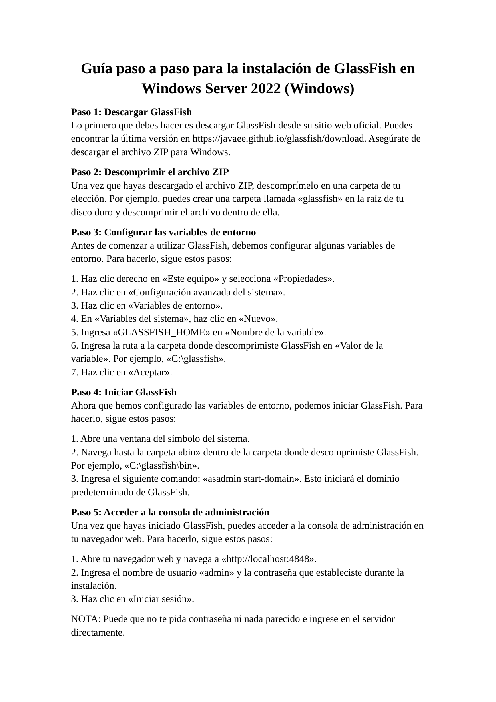

# Windows Server 2022 - Instalación de GlassFish

Instalación de GlassFish, configuración de variables de entorno e inicio del dominio desde asadmin.

> Laboratorio documentado para portfolio tecnico. Entorno controlado, sin credenciales reales publicadas.

## Tecnologias

`Windows Server 2022` `GlassFish` `Jakarta EE` `Java` `asadmin`

## Entorno

| Campo | Valor |
|---|---|
| Sistema | Windows Server 2022 |
| Servidor de aplicaciones | GlassFish |
| Puerto administración | 4848 |
| Método | ZIP + variable GLASSFISH_HOME |
| Tipo de práctica | Laboratorio local controlado |

## Objetivos

- Descargar GlassFish desde la fuente oficial.
- Descomprimir el paquete ZIP en una ruta controlada.
- Configurar la variable de entorno GLASSFISH_HOME.
- Iniciar el dominio por defecto con asadmin start-domain.
- Acceder a la consola de administración desde el navegador.

## Procedimiento resumido

### Descarga y extracción

Se descarga el ZIP de GlassFish y se descomprime, por ejemplo, en C:\glassfish.

### Variables de entorno

Se configura GLASSFISH_HOME apuntando a la ruta donde se ha descomprimido el servidor.

### Arranque del dominio

Desde la carpeta bin se ejecuta asadmin start-domain para iniciar el dominio por defecto.

### Consola web

Se comprueba el acceso a http://localhost:4848 desde el navegador.

## Comandos relevantes

```powershell
setx GLASSFISH_HOME "C:\glassfish"
cd C:\glassfish\bin
asadmin start-domain
```

## Verificacion

- El comando asadmin start-domain arranca el dominio sin error.
- La consola de administración responde en http://localhost:4848.

## Buenas practicas aplicadas o recomendadas

- No usar la consola de administración sin contraseña en entornos reales.
- Limitar el acceso al puerto 4848.
- Ejecutar el servicio con un usuario dedicado.
- Mantener Java y GlassFish actualizados.

## Evidencias visuales

Las siguientes imagenes corresponden a capturas del laboratorio y validaciones realizadas durante la practica.

### 01 captura pagina 01




## Conclusiones

El laboratorio permite practicar una tarea realista de administracion de servicios web, documentando instalacion, configuracion, validacion y resolucion de errores. La documentacion se ha preparado para ser reutilizable como referencia tecnica en GitHub.

## Disclaimer

Uso exclusivamente formativo en entorno controlado. No contiene credenciales reales ni pretende ser una configuracion final de produccion.
