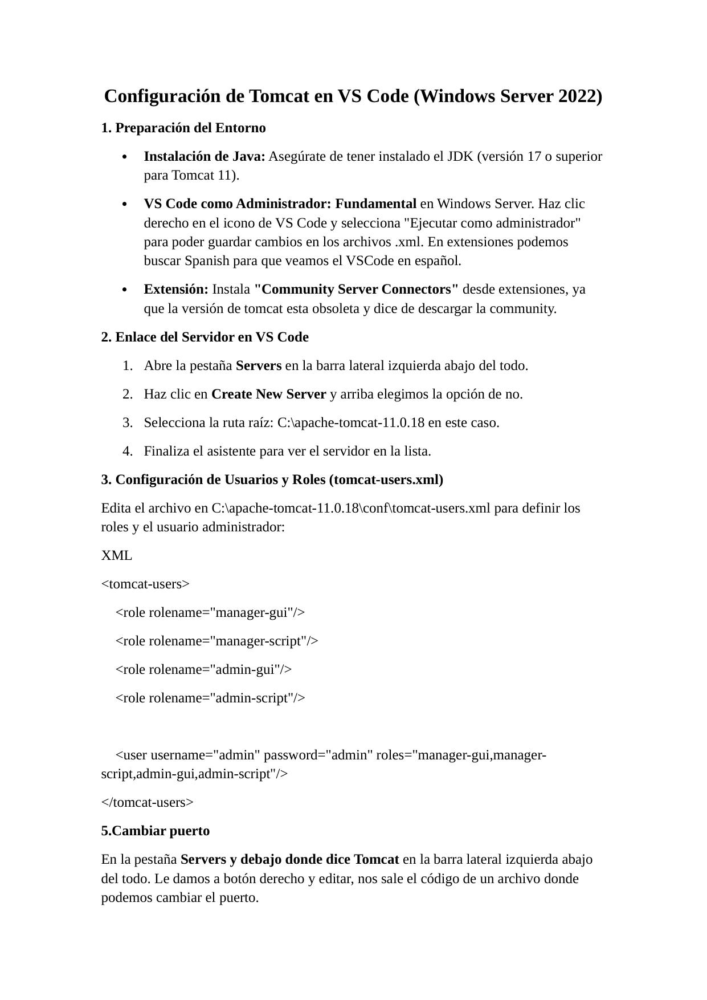
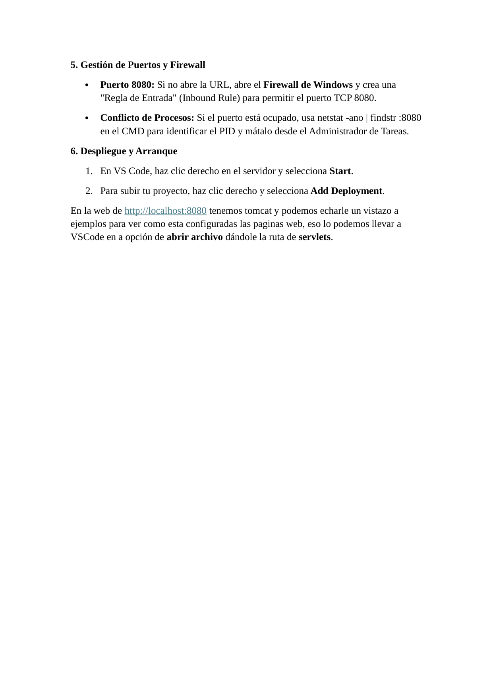

# Windows Server 2022 - Tomcat 11 con VS Code

Preparación de Java, integración de Tomcat en VS Code, roles de administración, puertos y despliegue.

> Laboratorio documentado para portfolio tecnico. Entorno controlado, sin credenciales reales publicadas.

## Tecnologias

`Windows Server 2022` `Tomcat 11` `VS Code` `Java 17` `Servlets`

## Entorno

| Campo | Valor |
|---|---|
| Sistema | Windows Server 2022 |
| Servidor | Apache Tomcat 11 |
| IDE | Visual Studio Code |
| Java | JDK 17 o superior |
| Puerto | 8080 |

## Objetivos

- Preparar Java para Tomcat 11.
- Ejecutar VS Code como administrador para editar XML de configuración.
- Añadir Tomcat desde Community Server Connectors.
- Configurar roles y usuario administrador de Tomcat.
- Gestionar puertos, firewall y despliegues desde VS Code.

## Procedimiento resumido

### Entorno

Se instala Java 17 o superior y se abre VS Code como administrador.

### Extensión

Se instala Community Server Connectors para gestionar Tomcat.

### Servidor

Se añade el servidor apuntando a C:\apache-tomcat-11.0.18.

### Usuarios

Se editan roles en tomcat-users.xml usando credenciales de laboratorio redactadas en el write-up.

### Puertos y firewall

Se valida el puerto 8080, se revisan conflictos con netstat y se permite el tráfico en firewall si es necesario.

### Despliegue

Se arranca Tomcat desde VS Code y se añade el despliegue de la aplicación.

## Comandos relevantes

```powershell
netstat -ano | findstr :8080
```

## Verificacion

- Tomcat responde en http://localhost:8080.
- El servidor aparece en la pestaña Servers de VS Code.
- El despliegue se puede añadir desde Add Deployment.

## Buenas practicas aplicadas o recomendadas

- No usar <TOMCAT_ADMIN_USER>/<TOMCAT_ADMIN_PASSWORD> fuera de laboratorio.
- Limitar roles de administración a los mínimos necesarios.
- No exponer el Manager públicamente.
- Controlar el puerto 8080 en firewall.

## Evidencias visuales

Las siguientes imagenes corresponden a capturas del laboratorio y validaciones realizadas durante la practica.

### 01 captura pagina 01



### 02 captura pagina 02




## Conclusiones

El laboratorio permite practicar una tarea realista de administracion de servicios web, documentando instalacion, configuracion, validacion y resolucion de errores. La documentacion se ha preparado para ser reutilizable como referencia tecnica en GitHub.

## Disclaimer

Uso exclusivamente formativo en entorno controlado. No contiene credenciales reales ni pretende ser una configuracion final de produccion.
