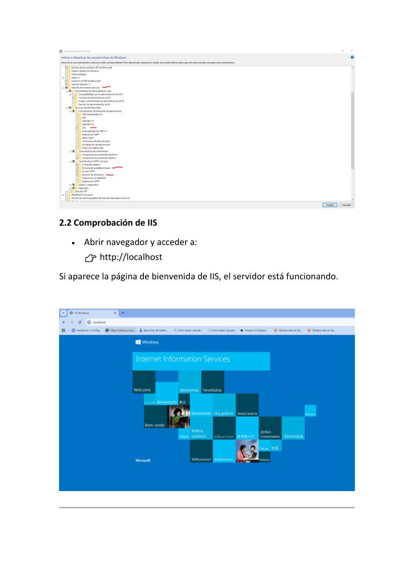
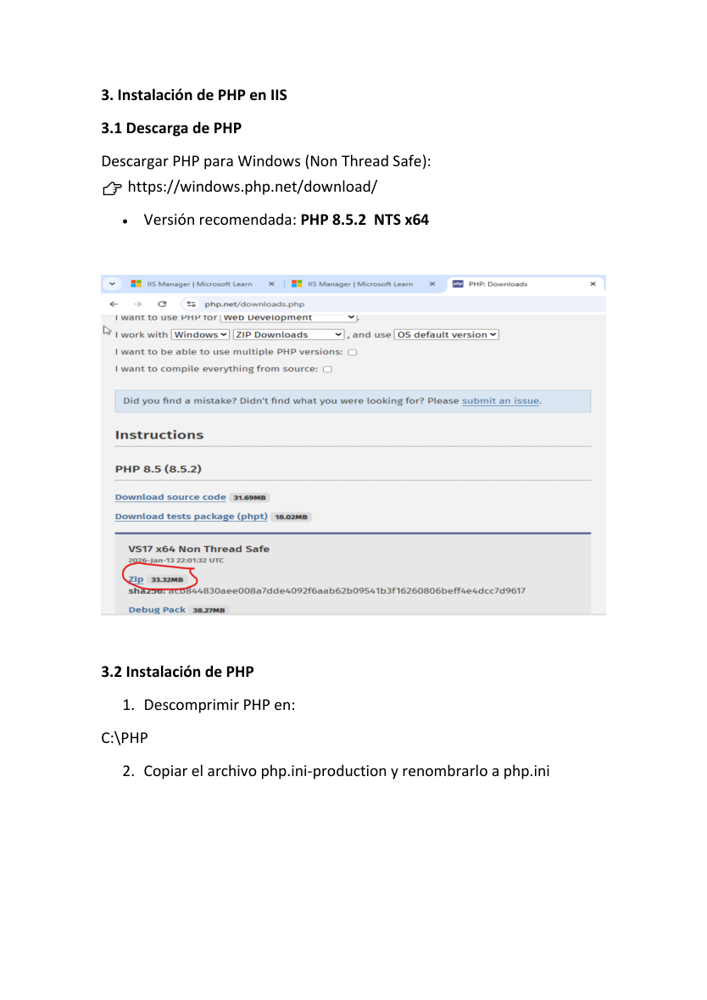
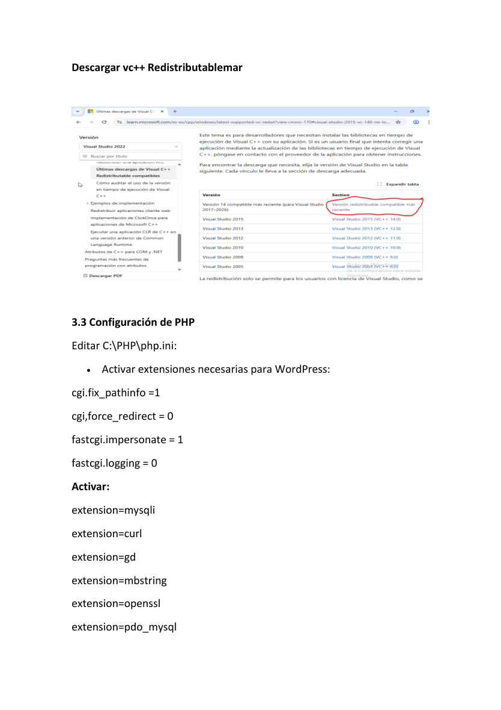
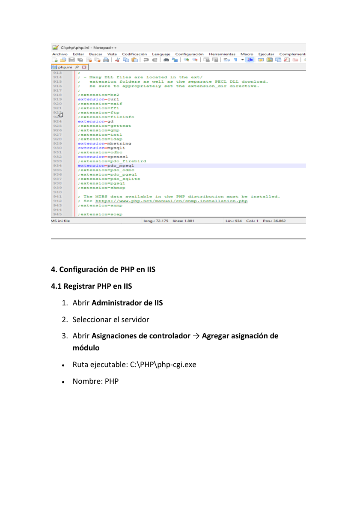
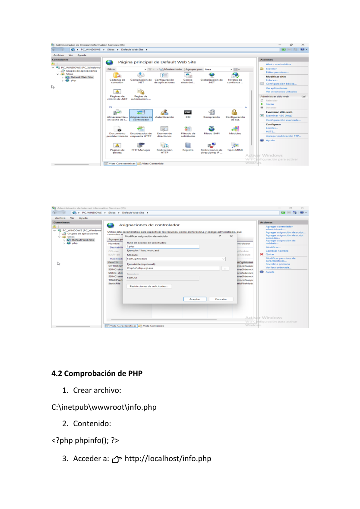
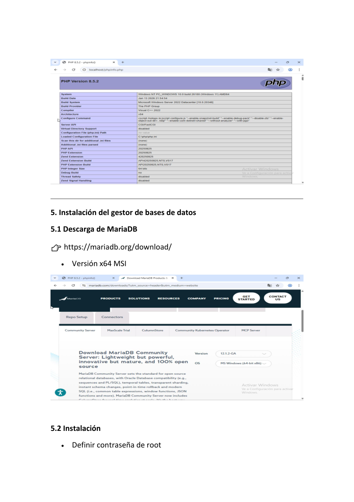
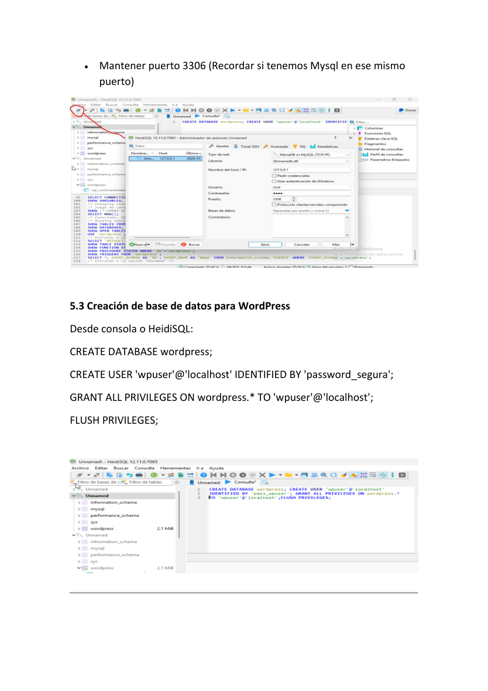
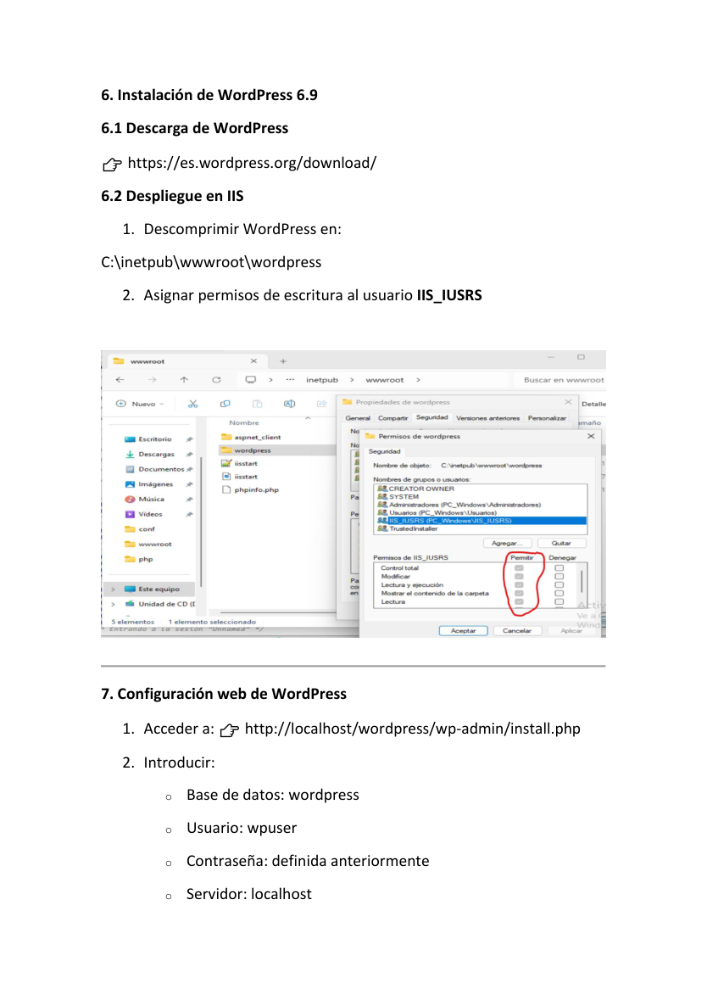
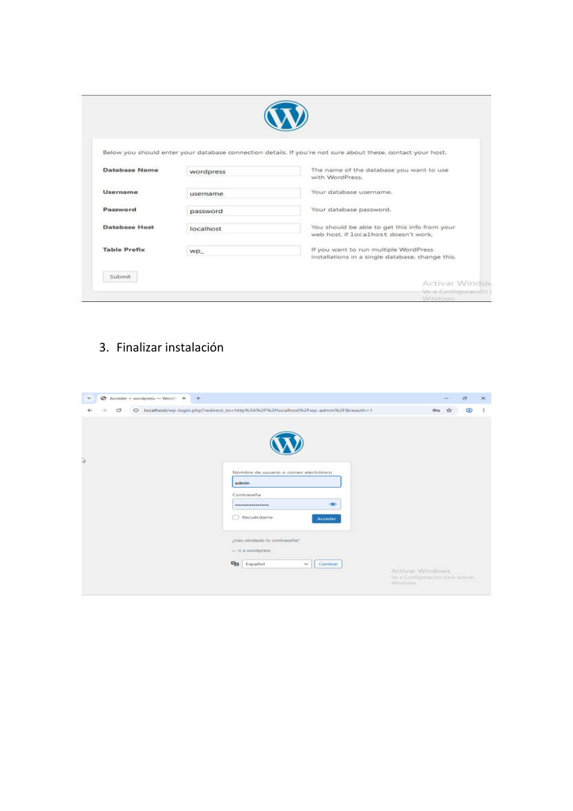
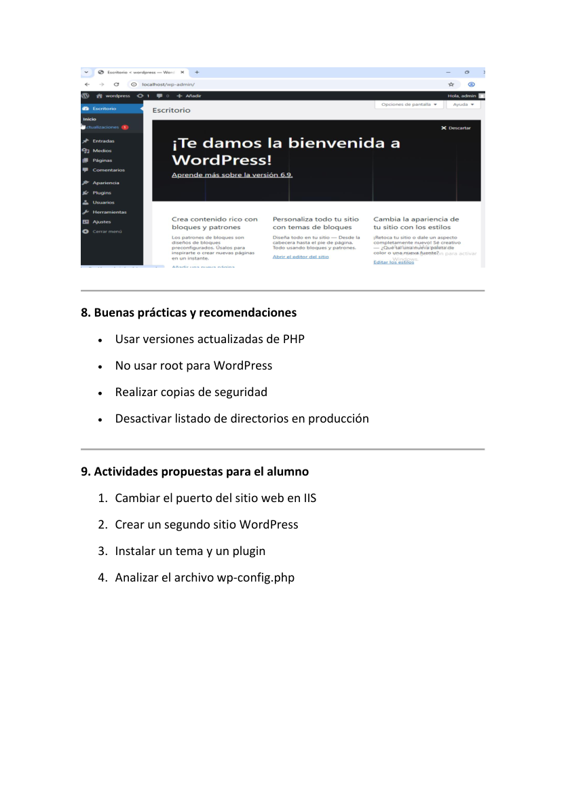

# Windows - IIS con PHP, MariaDB y WordPress

**Autor:** Nammu  
**Entorno:** laboratorio local controlado  
**Categoría:** Servicios de Internet / Windows / IIS / PHP / CMS

## Objetivo

Instalar y configurar un servidor web local basado en IIS en Windows 11 para publicar WordPress con PHP y base de datos MariaDB/MySQL.

## Componentes

```text
Windows 11 Pro/Education
├── IIS
├── CGI/FastCGI
├── PHP NTS x64
├── MariaDB
└── WordPress en C:\inetpub\wwwroot\wordpress
```

## Activación de IIS

Desde características de Windows:

```text
Internet Information Services
Servicios World Wide Web
Características de desarrollo de aplicaciones > CGI
Características HTTP comunes > Documento predeterminado
Características HTTP comunes > Exploración de directorios
```

Comprobación:

```text
http://localhost
```

## Instalación de PHP

Descargar PHP para Windows, versión Non Thread Safe x64, y descomprimir en:

```text
C:\PHP
```

Copiar:

```text
php.ini-production -> php.ini
```

Ajustes recomendados en `php.ini`:

```ini
cgi.fix_pathinfo=1
cgi.force_redirect=0
fastcgi.impersonate=1
fastcgi.logging=0
extension=mysqli
extension=curl
extension=gd
extension=mbstring
extension=openssl
extension=pdo_mysql
```

## Registrar PHP en IIS

En Administrador de IIS:

```text
Asignaciones de controlador -> Agregar asignación de módulo
Ruta de acceso: *.php
Módulo: FastCgiModule
Ejecutable: C:\PHP\php-cgi.exe
Nombre: PHP
```

Comprobación:

```text
C:\inetpub\wwwroot\info.php
```

Contenido:

```php
<?php phpinfo(); ?>
```

Acceso:

```text
http://localhost/info.php
```

## MariaDB y base de datos WordPress

Crear base de datos y usuario:

```sql
CREATE DATABASE wordpress;
CREATE USER 'wpuser'@'localhost' IDENTIFIED BY '<WORDPRESS_DB_PASSWORD>';
GRANT ALL PRIVILEGES ON wordpress.* TO 'wpuser'@'localhost';
FLUSH PRIVILEGES;
```

## Despliegue de WordPress

Descomprimir WordPress en:

```text
C:\inetpub\wwwroot\wordpress
```

Dar permisos de escritura al usuario/grupo adecuado de IIS:

```text
IIS_IUSRS
```

Configuración web:

```text
http://localhost/wordpress/wp-admin/install.php
```

Datos:

```text
Base de datos: wordpress
Usuario: wpuser
Contraseña: <WORDPRESS_DB_PASSWORD>
Servidor: localhost
```

## Buenas prácticas

- No usar root/administrador de base de datos para WordPress.
- Usar contraseña robusta y no documentarla en claro.
- Mantener PHP actualizado.
- Desactivar exploración de directorios en producción.
- Restringir permisos de escritura a lo mínimo necesario.
- Realizar copias de seguridad de base de datos y ficheros.

## Verificación final

```text
http://localhost/wordpress/wp-admin/
```

Resultado esperado: panel de administración de WordPress accesible en IIS.

## Evidencias visuales




















