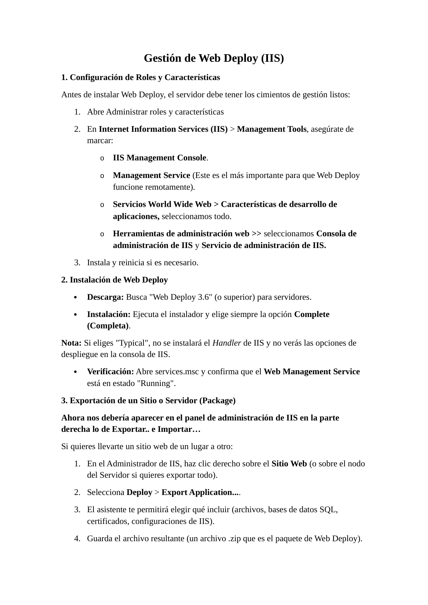

# Windows Server 2022 - Web Deploy para IIS

Preparación de roles IIS, instalación completa de Web Deploy y exportación/importación de paquetes.

> Laboratorio documentado para portfolio tecnico. Entorno controlado, sin credenciales reales publicadas.

## Tecnologias

`Windows Server 2022` `IIS` `Web Deploy` `MSDeploy` `Paquetes`

## Entorno

| Campo | Valor |
|---|---|
| Sistema | Windows Server 2022 |
| Servidor web | IIS |
| Herramienta | Web Deploy 3.6 o superior |
| Servicios | IIS Management Service / Web Management Service |
| Tipo de práctica | Laboratorio de administración |

## Objetivos

- Preparar IIS con consola de administración y Management Service.
- Instalar Web Deploy en modo Complete.
- Verificar Web Management Service en estado Running.
- Exportar un sitio o aplicación como paquete ZIP.
- Importar un paquete en un servidor o sitio de destino.

## Procedimiento resumido

### Roles y características

Se habilitan IIS Management Console, Management Service y características de desarrollo de aplicaciones.

### Instalación

Se instala Web Deploy en modo Complete para incluir el handler de IIS.

### Validación

Se comprueba en services.msc que Web Management Service está Running.

### Exportación

Desde IIS Manager se usa Deploy > Export Application para generar un paquete ZIP.

### Importación

En el destino se usa Deploy > Import Application para cargar el ZIP y revisar configuración.

## Comandos relevantes

```powershell
services.msc
```

## Verificacion

- El panel de IIS muestra opciones Deploy > Export Application e Import Application.
- El servicio Web Management Service está Running.
- El paquete ZIP generado puede importarse en el destino.

## Buenas practicas aplicadas o recomendadas

- No habilitar administración remota sin políticas de acceso.
- Usar cuentas dedicadas para despliegue.
- Revisar cadenas de conexión antes de importar.
- Guardar backups antes de sobrescribir sitios.

## Evidencias visuales

Las siguientes imagenes corresponden a capturas del laboratorio y validaciones realizadas durante la practica.

### 01 captura pagina 01



### 02 captura pagina 02


## Conclusiones

El laboratorio permite practicar una tarea realista de administracion de servicios web, documentando instalacion, configuracion, validacion y resolucion de errores. La documentacion se ha preparado para ser reutilizable como referencia tecnica en GitHub.

## Disclaimer

Uso exclusivamente formativo en entorno controlado. No contiene credenciales reales ni pretende ser una configuracion final de produccion.
