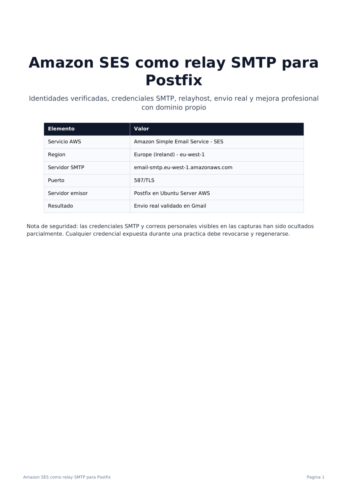
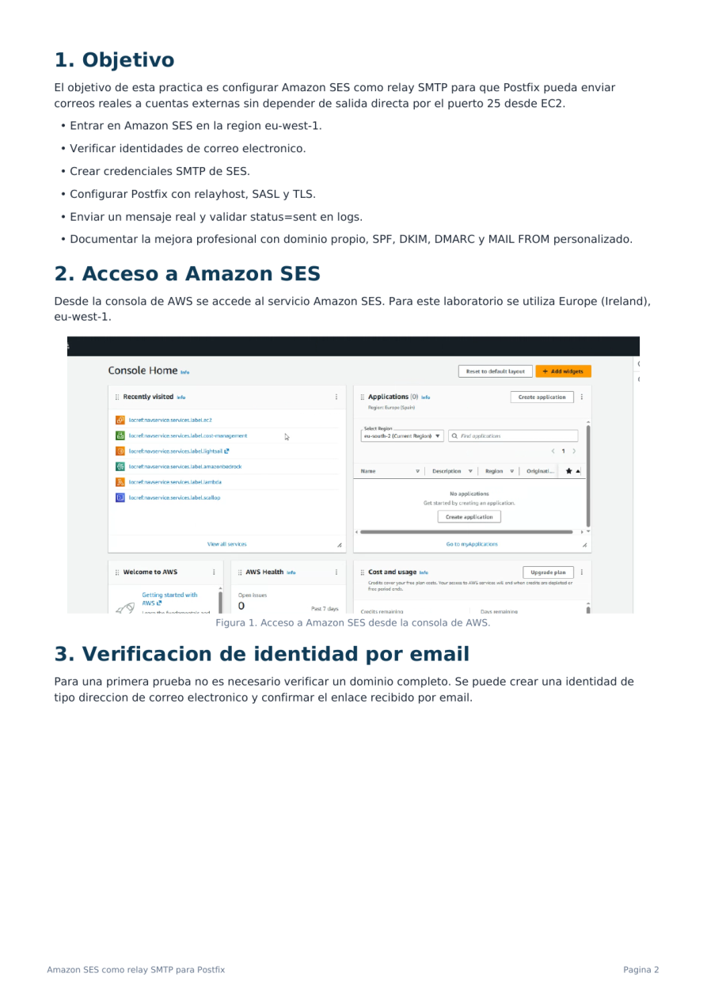
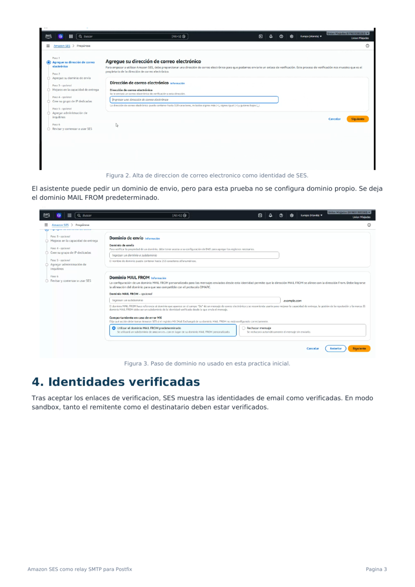
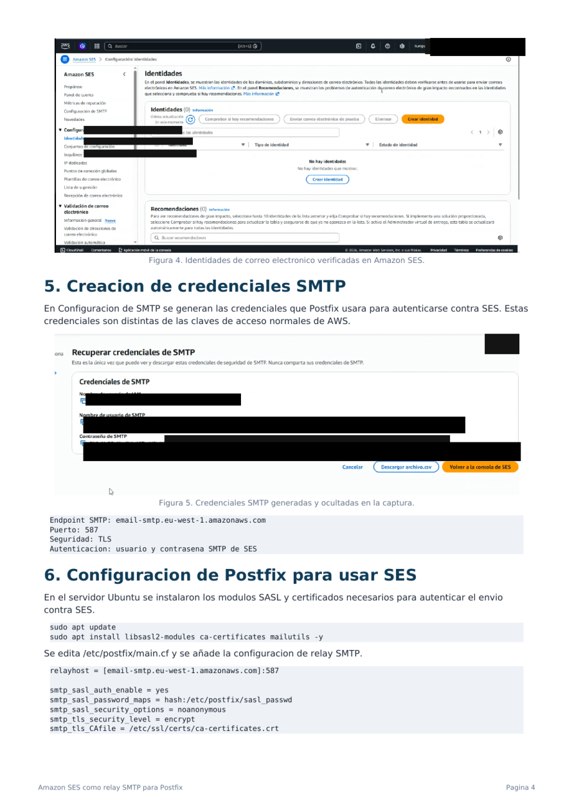
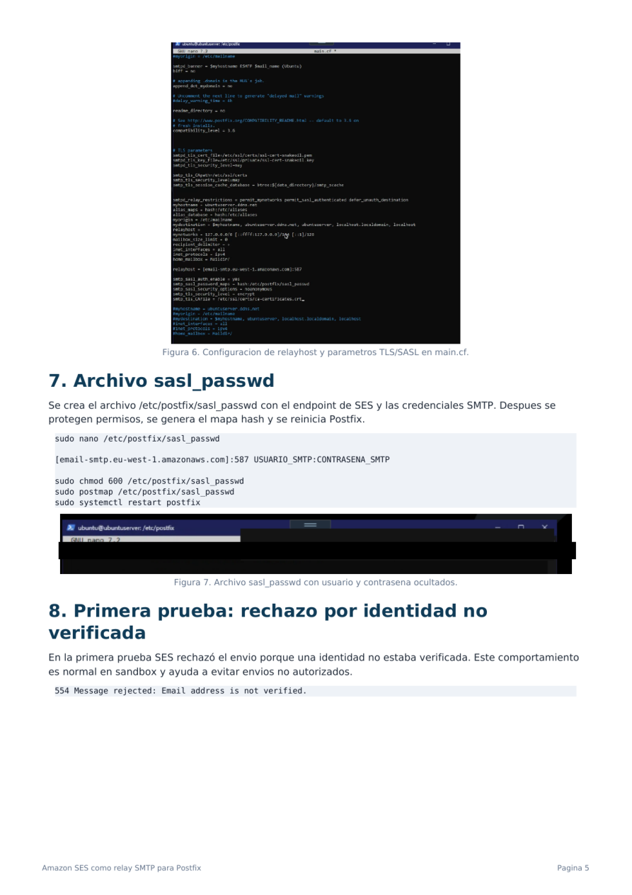
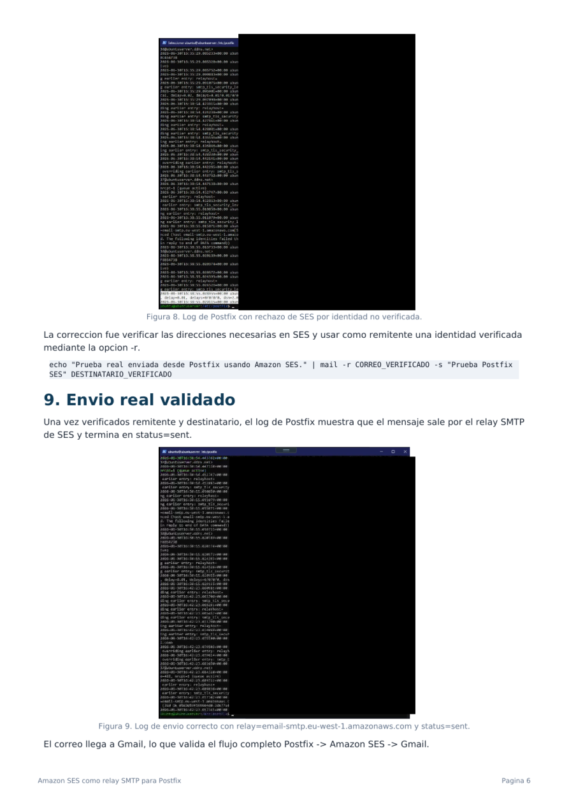
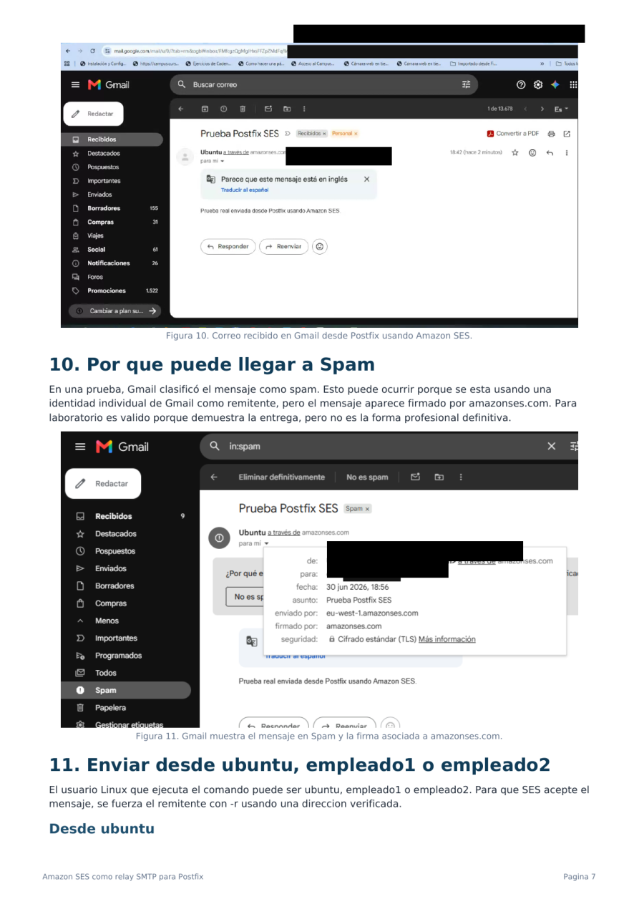
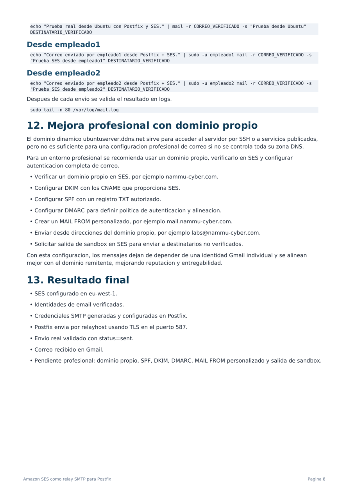

# Amazon SES como relay SMTP para Postfix

Configuración de **Amazon SES** como relay SMTP para que un servidor **Postfix en Ubuntu Server AWS** pueda enviar correos reales usando autenticación SMTP, TLS y el puerto `587`.

> Laboratorio realizado en entorno controlado. Las credenciales SMTP y direcciones personales visibles en capturas se han ocultado.



## 1. Objetivo

El objetivo es evitar el envío directo por el puerto `25` desde EC2 y utilizar Amazon SES como relay SMTP.

Objetivos trabajados:

- Acceder a Amazon SES en la región `eu-west-1`.
- Verificar identidades de correo electrónico.
- Crear credenciales SMTP de SES.
- Configurar Postfix con `relayhost`, SASL y TLS.
- Crear y proteger `/etc/postfix/sasl_passwd`.
- Validar el envío con `status=sent` en logs.
- Comprobar la recepción en Gmail.
- Documentar la mejora profesional con dominio propio, SPF, DKIM, DMARC y MAIL FROM personalizado.

## 2. Acceso a Amazon SES

Desde la consola de AWS se accede al servicio **Amazon Simple Email Service (SES)**.

Para este laboratorio se utiliza la región:

```text
Europe (Ireland) - eu-west-1
```



## 3. Verificación de identidad por email

Para una primera prueba no es necesario verificar un dominio completo. Se crea una identidad de tipo **dirección de correo electrónico** y se confirma el enlace recibido por email.

En modo sandbox, SES exige que tanto remitente como destinatario estén verificados.

Durante el asistente puede aparecer un paso de dominio de envío. En esta práctica no se configura dominio propio y se mantiene el MAIL FROM predeterminado.



## 4. Identidades verificadas

Tras aceptar los enlaces de verificación, SES muestra las identidades de correo como verificadas.

Esta validación es necesaria para poder enviar mensajes en modo sandbox.

## 5. Creación de credenciales SMTP

En **Configuración de SMTP** se generan credenciales específicas para el envío SMTP.

Estas credenciales son distintas de las claves normales de AWS y se usan exclusivamente para que Postfix pueda autenticarse contra SES.

Parámetros del laboratorio:

```text
Endpoint SMTP: email-smtp.eu-west-1.amazonaws.com
Puerto: 587
Seguridad: TLS
Autenticación: usuario y contraseña SMTP de SES
```



## 6. Configuración de Postfix para usar SES

En el servidor Ubuntu se instalan los módulos necesarios:

```bash
sudo apt update
sudo apt install libsasl2-modules ca-certificates mailutils -y
```

Se edita el archivo principal de Postfix:

```bash
sudo nano /etc/postfix/main.cf
```

Configuración añadida para usar SES como relay:

```conf
relayhost = [email-smtp.eu-west-1.amazonaws.com]:587

smtp_sasl_auth_enable = yes
smtp_sasl_password_maps = hash:/etc/postfix/sasl_passwd
smtp_sasl_security_options = noanonymous
smtp_tls_security_level = encrypt
smtp_tls_CAfile = /etc/ssl/certs/ca-certificates.crt
```

Es recomendable comentar entradas antiguas duplicadas si existen:

```conf
#relayhost =
#smtp_tls_security_level=may
```

## 7. Archivo `sasl_passwd`

Se crea el archivo que almacena las credenciales SMTP de SES:

```bash
sudo nano /etc/postfix/sasl_passwd
```

Formato usado:

```conf
[email-smtp.eu-west-1.amazonaws.com]:587 USUARIO_SMTP:CONTRASENA_SMTP
```

Después se protegen permisos, se genera el mapa hash y se reinicia Postfix:

```bash
sudo chmod 600 /etc/postfix/sasl_passwd
sudo postmap /etc/postfix/sasl_passwd
sudo systemctl restart postfix
sudo systemctl status postfix --no-pager
```



## 8. Primera prueba: rechazo por identidad no verificada

En la primera prueba SES rechazó el envío porque una identidad no estaba verificada.

Error observado:

```text
554 Message rejected: Email address is not verified.
```

Esto es normal en SES sandbox. La solución consiste en verificar las direcciones necesarias en SES y usar como remitente una identidad verificada mediante la opción `-r`.

Comando de envío usando remitente verificado:

```bash
echo "Prueba real enviada desde Postfix usando Amazon SES." | mail -r CORREO_VERIFICADO -s "Prueba Postfix SES" DESTINATARIO_VERIFICADO
```

## 9. Envío real validado

Tras verificar remitente y destinatario, el log de Postfix muestra que el mensaje sale por el relay SMTP de SES y termina correctamente.

Validación en logs:

```bash
sudo tail -n 80 /var/log/mail.log
```

Indicadores esperados:

```text
relay=email-smtp.eu-west-1.amazonaws.com
status=sent
```



## 10. Recepción en Gmail y posible clasificación como spam

El correo llega a Gmail, lo que valida el flujo completo:

```text
Postfix -> Amazon SES -> Gmail
```

En una prueba, Gmail clasificó el mensaje como spam. Esto puede ocurrir porque se está usando una identidad individual de Gmail como remitente, pero el mensaje aparece firmado por `amazonses.com`.

Para laboratorio es válido porque demuestra la entrega, pero no es la configuración profesional definitiva.



## 11. Enviar desde `ubuntu`, `empleado1` o `empleado2`

El usuario Linux que ejecuta el comando puede ser `ubuntu`, `empleado1` o `empleado2`. Para que SES acepte el mensaje, se fuerza el remitente con `-r` usando una dirección verificada.

Desde `ubuntu`:

```bash
echo "Prueba real desde Ubuntu con Postfix y SES." | mail -r CORREO_VERIFICADO -s "Prueba desde Ubuntu" DESTINATARIO_VERIFICADO
```

Desde `empleado1`:

```bash
echo "Correo enviado por empleado1 desde Postfix + SES." | sudo -u empleado1 mail -r CORREO_VERIFICADO -s "Prueba SES desde empleado1" DESTINATARIO_VERIFICADO
```

Desde `empleado2`:

```bash
echo "Correo enviado por empleado2 desde Postfix + SES." | sudo -u empleado2 mail -r CORREO_VERIFICADO -s "Prueba SES desde empleado2" DESTINATARIO_VERIFICADO
```

Después de cada envío:

```bash
sudo tail -n 80 /var/log/mail.log
```

## 12. Mejora profesional con dominio propio

El dominio dinámico `ubuntuserver.ddns.net` sirve para acceder al servidor por SSH o a servicios publicados, pero no es suficiente para una configuración profesional de correo si no se controla toda su zona DNS.

Para un entorno profesional se recomienda:

- Verificar un dominio propio en SES, por ejemplo `nammu-cyber.com`.
- Configurar DKIM con los CNAME que proporciona SES.
- Configurar SPF con un registro TXT autorizado.
- Configurar DMARC para definir política de autenticación y alineación.
- Crear un MAIL FROM personalizado, por ejemplo `mail.nammu-cyber.com`.
- Enviar desde direcciones del dominio propio, por ejemplo `labs@nammu-cyber.com`.
- Solicitar salida de sandbox en SES para enviar a destinatarios no verificados.

Con esta configuración los mensajes se alinean mejor con el dominio remitente, mejorando reputación y entregabilidad.

## 13. Resultado final

- SES configurado en `eu-west-1`.
- Identidades de email verificadas.
- Credenciales SMTP generadas y configuradas en Postfix.
- Postfix envía por `relayhost` usando TLS en el puerto `587`.
- Envío real validado con `status=sent`.
- Correo recibido en Gmail.
- Pendiente profesional: dominio propio, SPF, DKIM, DMARC, MAIL FROM personalizado y salida de sandbox.



## 14. Ubicación recomendada en GitHub

```text
cybersecurity-labs/
└── 01_Cursos_Formacion/
    └── Administracion_Servicios_De_Internet_IFCT0509/
        └── 03_Correo_Mensajeria/
            └── AWS_SES_Postfix_Relay/
```
