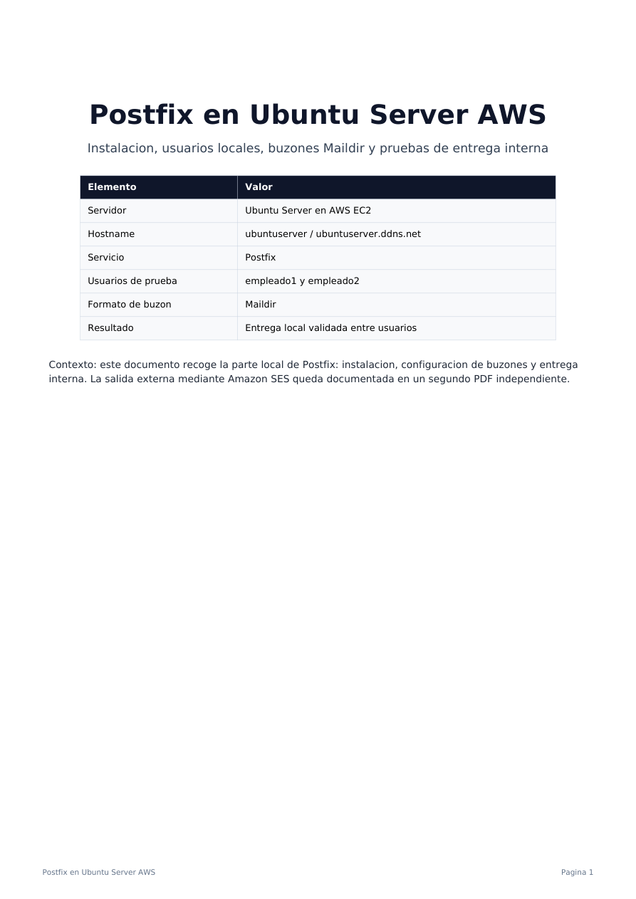
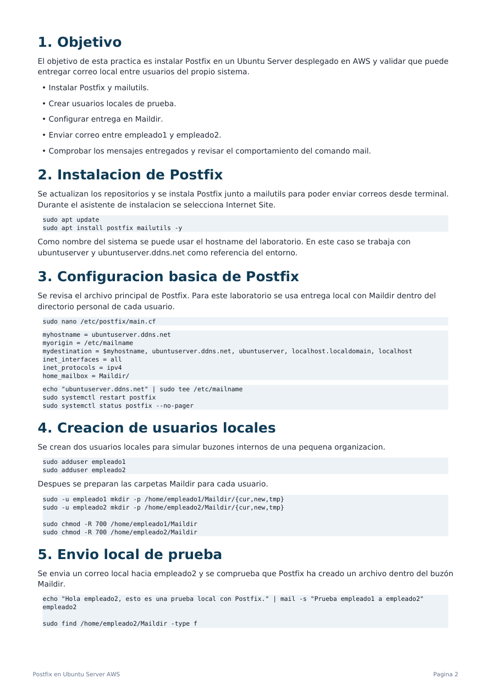
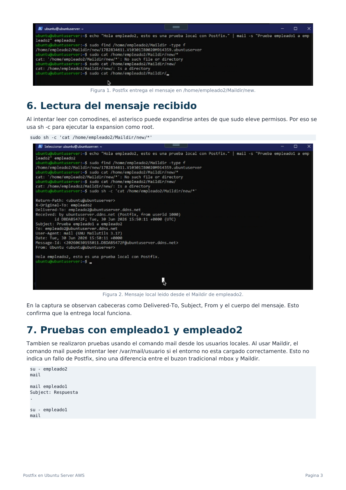
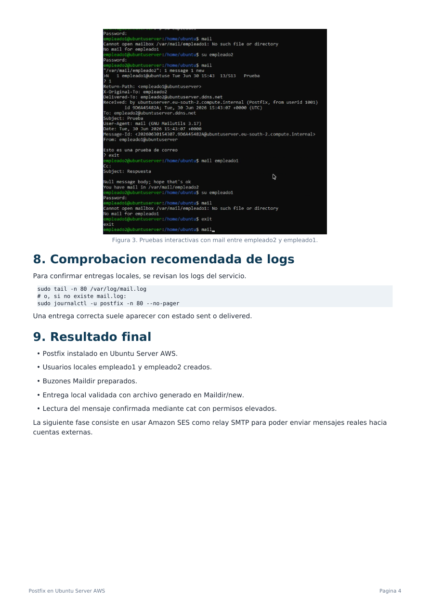

# Postfix en Ubuntu Server AWS

Instalación de **Postfix** en un servidor **Ubuntu Server desplegado en AWS EC2**, creación de usuarios locales, configuración de buzones en formato **Maildir** y validación de entrega interna entre `empleado1` y `empleado2`.

> Laboratorio realizado en un entorno controlado. La salida externa mediante Amazon SES se documenta en un write-up independiente.



## 1. Objetivo

El objetivo de la práctica es validar que Postfix puede actuar como servicio de correo local dentro del servidor Ubuntu, entregando mensajes entre usuarios del propio sistema.

Objetivos trabajados:

- Instalar Postfix y `mailutils`.
- Crear usuarios locales de prueba.
- Configurar entrega local mediante `Maildir/`.
- Enviar correo desde terminal.
- Comprobar que los mensajes se entregan en `/home/usuario/Maildir/new/`.
- Leer mensajes entregados con permisos adecuados.
- Entender la diferencia entre buzones `mbox` en `/var/mail/usuario` y buzones `Maildir`.

## 2. Instalación de Postfix

Se actualizan los repositorios y se instala Postfix junto con `mailutils`, herramienta que permite enviar correos desde terminal.

```bash
sudo apt update
sudo apt install postfix mailutils -y
```

Durante el asistente de instalación se selecciona:

```text
Internet Site
```

Como nombre del sistema se utiliza el hostname del laboratorio:

```text
ubuntuserver / ubuntuserver.ddns.net
```

## 3. Configuración básica en `main.cf`

Se revisa el archivo principal de configuración de Postfix:

```bash
sudo nano /etc/postfix/main.cf
```

Configuración principal usada para la entrega local:

```conf
myhostname = ubuntuserver.ddns.net
myorigin = /etc/mailname
mydestination = $myhostname, ubuntuserver.ddns.net, ubuntuserver, localhost.localdomain, localhost
inet_interfaces = all
inet_protocols = ipv4
home_mailbox = Maildir/
```

También se configura `/etc/mailname`:

```bash
echo "ubuntuserver.ddns.net" | sudo tee /etc/mailname
sudo systemctl restart postfix
sudo systemctl status postfix --no-pager
```

## 4. Creación de usuarios locales

Se crean dos usuarios para simular buzones internos de una pequeña organización:

```bash
sudo adduser empleado1
sudo adduser empleado2
```

Después se crean las carpetas Maildir para cada usuario:

```bash
sudo -u empleado1 mkdir -p /home/empleado1/Maildir/{cur,new,tmp}
sudo -u empleado2 mkdir -p /home/empleado2/Maildir/{cur,new,tmp}

sudo chmod -R 700 /home/empleado1/Maildir
sudo chmod -R 700 /home/empleado2/Maildir
```



## 5. Envío local de prueba

Se envía un correo local hacia `empleado2`:

```bash
echo "Hola empleado2, esto es una prueba local con Postfix." | mail -s "Prueba empleado1 a empleado2" empleado2
```

Se comprueba que Postfix ha creado un archivo dentro del buzón `Maildir`:

```bash
sudo find /home/empleado2/Maildir -type f
```

El resultado esperado es un archivo dentro de:

```text
/home/empleado2/Maildir/new/
```

## 6. Lectura del mensaje recibido

Al intentar leer con comodines puede aparecer un problema de permisos, porque el `*` se expande antes de que actúe `sudo`. Para evitarlo se usa `sh -c`:

```bash
sudo sh -c 'cat /home/empleado2/Maildir/new/*'
```

En el mensaje recibido se observan cabeceras como:

- `Return-Path`
- `Delivered-To`
- `Subject`
- `From`
- cuerpo del mensaje

Esto confirma que Postfix ha entregado correctamente el correo local.



## 7. Pruebas con `empleado1` y `empleado2`

También se hicieron pruebas interactivas entrando como usuarios locales:

```bash
su - empleado2
mail
```

Para responder o enviar un nuevo mensaje:

```text
mail empleado1
Subject: Respuesta
.
```

Después se comprueba desde `empleado1`:

```bash
su - empleado1
mail
```

Si `mail` intenta leer `/var/mail/empleado1`, no implica necesariamente un fallo de Postfix. El laboratorio está configurado para entregar en `Maildir`, por lo que el mensaje puede estar en:

```text
/home/empleado1/Maildir/
```

## 8. Comprobación de logs

Para revisar el comportamiento del servicio:

```bash
sudo tail -n 80 /var/log/mail.log
```

Si el archivo no existe:

```bash
sudo journalctl -u postfix -n 80 --no-pager
```

Una entrega correcta suele mostrarse con estados como `sent` o `delivered`.



## 9. Resultado final

- Postfix instalado en Ubuntu Server AWS.
- Usuarios locales `empleado1` y `empleado2` creados.
- Buzones Maildir preparados.
- Entrega local validada con archivo generado en `Maildir/new`.
- Lectura del mensaje confirmada mediante `cat` con permisos elevados.
- Base preparada para integrar un relay SMTP externo como Amazon SES.

## 10. Ubicación recomendada en GitHub

```text
cybersecurity-labs/
└── 01_Cursos_Formacion/
    └── Administracion_Servicios_De_Internet_IFCT0509/
        └── 03_Correo_Mensajeria/
            └── Postfix_Ubuntu_AWS/
```
