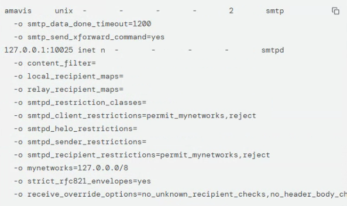
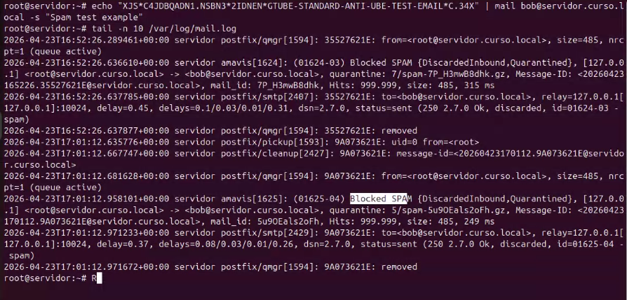

# Amavisd-new, ClamAV y SpamAssassin en Ubuntu Server

**Área:** Seguridad de correo

## Objetivo

Integrar Amavisd-new con Postfix para filtrar spam y virus usando SpamAssassin y ClamAV en un servidor de correo local.

## Tecnologías

- Ubuntu Server
- Postfix
- Amavisd-new
- ClamAV
- SpamAssassin
- spamd

## Desarrollo del laboratorio

### Instalación de paquetes

Actualizar repositorios e instalar componentes:

```bash
sudo apt update
sudo apt-get install amavisd-new clamav clamav-daemon spamassassin
```

En versiones modernas:

```bash
sudo apt install spamd
sudo systemctl enable spamd
sudo systemctl start spamd
```

### Habilitar servicios

```bash
sudo systemctl enable amavis clamav-daemon spamassassin
sudo systemctl start amavis clamav-daemon spamassassin
```

### Configurar ClamAV

Editar:

```bash
sudo nano /etc/clamav/clamd.conf
```

Comprobar que existe:

```text
LocalSocket /var/run/clamav/clamd.ctl
```

Y que el socket TCP esté comentado:

```text
# TCPSocket 3310
```

Reiniciar ClamAV:

```bash
sudo systemctl restart clamav-daemon
```

### Permisos entre ClamAV y Amavis

Asegurar que el usuario `clamav` pertenece al grupo `amavis`:

```bash
sudo usermod -a -G amavis clamav
```

### Activar escaneo de virus y spam en Amavisd

Editar:

```bash
sudo nano /etc/amavis/conf.d/15-content_filter_mode
```

Descomentar las líneas de comprobación de virus y spam según corresponda:

```perl
@bypass_virus_checks_maps = ( \%bypass_virus_checks, \@bypass_virus_checks_acl, $bypass_virus_checks );
@bypass_spam_checks_maps = ( \%bypass_spam_checks, \@bypass_spam_checks_acl, $bypass_spam_checks );
```

### Configurar Postfix como filtro de contenido

```bash
sudo postconf -e "content_filter = amavis:[127.0.0.1]:10024"
sudo postconf -e "receive_override_options = no_address_mappings"
```

### Editar master.cf

Añadir al final de `/etc/postfix/master.cf`:

```text
amavis unix - - - - 2 smtp
  -o smtp_data_done_timeout=1200
  -o smtp_send_xforward_command=yes
127.0.0.1:10025 inet n - - - - smtpd
  -o content_filter=
  -o local_recipient_maps=
  -o relay_recipient_maps=
  -o smtpd_restriction_classes=
  -o smtpd_client_restrictions=permit_mynetworks,reject
  -o smtpd_helo_restrictions=
  -o smtpd_sender_restrictions=
  -o smtpd_recipient_restrictions=permit_mynetworks,reject
  -o mynetworks=127.0.0.0/8
  -o strict_rfc821_envelopes=yes
  -o receive_override_options=no_unknown_recipient_checks,no_header_body_checks
```

### Reiniciar servicios

```bash
sudo systemctl restart amavis postfix clamav-daemon
```

### Verificar puertos

Comprobar que Amavis escucha en los puertos esperados:

```bash
netstat -tuln | grep 10024
netstat -tuln | grep 10025
netstat -tap | grep 10024
netstat -tap | grep 10025
```

### Prueba antispam GTUBE

Enviar correo de prueba con la cadena GTUBE:

```bash
echo "XJS*C4JDBQADN1.NSBN3*2IDNEN*GTUBE-STANDARD-ANTI-UBE-TEST-EMAIL*C.34X" | mail bob@servidor.curso.local -s "Spam test example" alice@servidor.curso.local
```

### Prueba antivirus EICAR

Descargar archivo de prueba EICAR en entorno controlado:

```bash
wget https://secure.eicar.org/eicar.com
```

Escanear localmente:

```bash
clamscan eicar.com
```

Enviar como adjunto de prueba en laboratorio:

```bash
echo "Esto es un regalo" | mail -s "Regalo" -a eicar.com bob@servidor.curso.local
```

### Revisión de logs

```bash
tail -f /var/log/mail.log
```

Resultado esperado: eventos de Amavis/SpamAssassin/ClamAV indicando detección o bloqueo según el tipo de prueba.

## Evidencias visuales





## Notas de seguridad

- EICAR y GTUBE son muestras de prueba estándar para antivirus/antispam. Deben usarse solo en laboratorio.

## Conclusión

Este laboratorio documenta una configuración reproducible en entorno local controlado y deja una base técnica reutilizable para futuras prácticas de administración de servicios.
