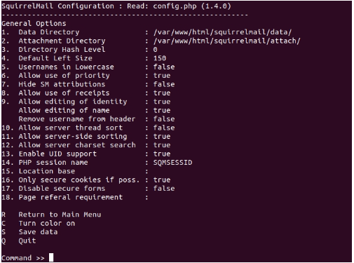
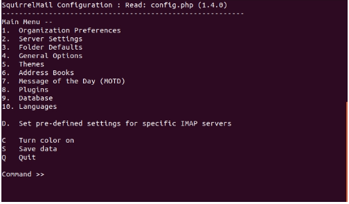
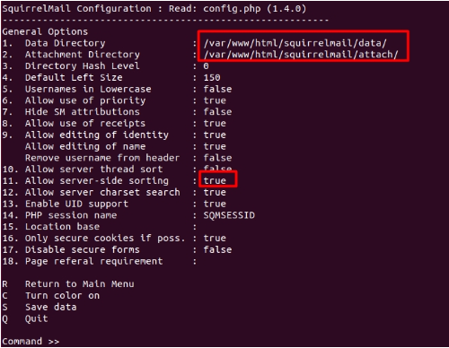

# SquirrelMail en Ubuntu Server

**Área:** Correo y webmail

## Objetivo

Instalar y configurar SquirrelMail como cliente web para enviar y recibir correo desde navegador en un servidor local.

## Tecnologías

- Ubuntu Server
- SquirrelMail 1.4.22
- Apache
- PHP
- Postfix

## Desarrollo del laboratorio

### Contexto

SquirrelMail funciona como cliente webmail para enviar y recibir correo desde el navegador.

No se instala desde los repositorios actuales de Ubuntu, por lo que se descarga manualmente desde SourceForge.

### Descarga e instalación

Descargar y descomprimir SquirrelMail 1.4.22:

```bash
wget https://sourceforge.net/projects/squirrelmail/files/stable/1.4.22/squirrelmail-webmail-1.4.22.zip
unzip squirrelmail-webmail-1.4.22.zip
```

Moverlo al directorio web:

```bash
sudo mv squirrelmail-webmail-1.4.22 /var/www/html/
sudo chown -R www-data:www-data /var/www/html/squirrelmail-webmail-1.4.22/
sudo chmod 755 -R /var/www/html/squirrelmail-webmail-1.4.22/
sudo mv /var/www/html/squirrelmail-webmail-1.4.22/ /var/www/html/squirrelmail
```

### Configuración interactiva

Ejecutar el configurador:

```bash
sudo perl /var/www/html/squirrelmail/config/conf.pl
```

Seleccionar `2. Server Settings`.

Seleccionar `1 Domain` e introducir el dominio usado en Postfix. En este laboratorio:

```text
servidor.curso.local
```

Guardar con `R` y después entrar en `4. General Options` para revisar opciones generales.

### Acceso web

URL local:

```text
http://localhost/squirrelmail
```

URL de red o dominio, según configuración:

```text
http://servidor.curso.local/squirrelmail
```

### Posible error 500

Si aparece un error 500, una posible solución del laboratorio fue instalar una versión compatible de PHP:

```bash
sudo apt install php7.3 php7.3-mbstring php7.3-xml
```

En un entorno moderno conviene adaptar esta parte a la versión PHP soportada por el sistema y por SquirrelMail.

### Creación de usuarios de correo

Los usuarios de correo deben existir como usuarios del sistema.

Ejemplo:

```bash
sudo adduser legolas
```

Crear/ajustar el directorio de correo/home:

```bash
sudo usermod -m -d /var/www/html/legolas legolas
sudo mkdir -p /var/www/html/legolas
sudo chown legolas:legolas /var/www/html/legolas
```

### Prueba final

Iniciar sesión en SquirrelMail con el usuario creado.

Enviar un correo local a otra cuenta del mismo servidor.

Comprobar que el mensaje se entrega correctamente.

### Limitación del laboratorio

El servidor de correo no está autenticado frente a DNS público ni preparado para entrega externa. Para enviar correo a Internet sería necesario configurar correctamente DNS, MX, SPF, DKIM, DMARC, reputación IP y TLS.

## Evidencias visuales







## Conclusión

Este laboratorio documenta una configuración reproducible en entorno local controlado y deja una base técnica reutilizable para futuras prácticas de administración de servicios.
