# Servidor FTP en Ubuntu con ProFTPD y restricciones de acceso

## 1. Objetivo

Instalar y configurar un servidor FTP en Ubuntu utilizando ProFTPD, creando un usuario de pruebas y aplicando restricciones de acceso para evitar que el usuario explore rutas no autorizadas del servidor.

## 2. Tecnologias utilizadas

- Ubuntu Linux
- ProFTPD
- Usuario local `alumnoftp`
- Archivo `/etc/proftpd/proftpd.conf`
- Restriccion de acceso mediante `DefaultRoot`
- FileZilla
- Explorador de archivos de Ubuntu

## 3. Instalacion de ProFTPD

Se instala el paquete `proftpd` desde los repositorios de Ubuntu.

```bash
sudo apt update
sudo apt install proftpd
```

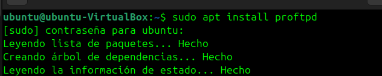

## 4. Creacion del directorio FTP

Se crea el directorio que se utilizara como espacio de trabajo para la practica.

```bash
sudo mkdir /examenUF1275FTP
```

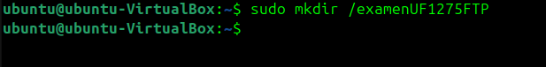

## 5. Permisos sobre el directorio

En la practica se asignan permisos amplios para facilitar las pruebas del laboratorio.

```bash
sudo chmod -R 777 /examenUF1275FTP
```

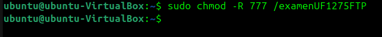

Se verifica que el directorio existe y que los permisos se han aplicado.

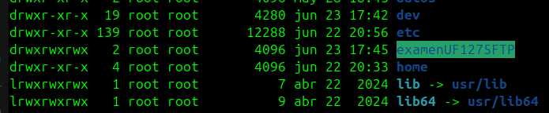

> Nota profesional: en un entorno real no se recomienda usar `777`; se deben aplicar permisos minimos y grupos especificos.

## 6. Usuario de pruebas

Se crea un usuario local llamado `alumnoftp`.

```bash
sudo adduser alumnoftp
```

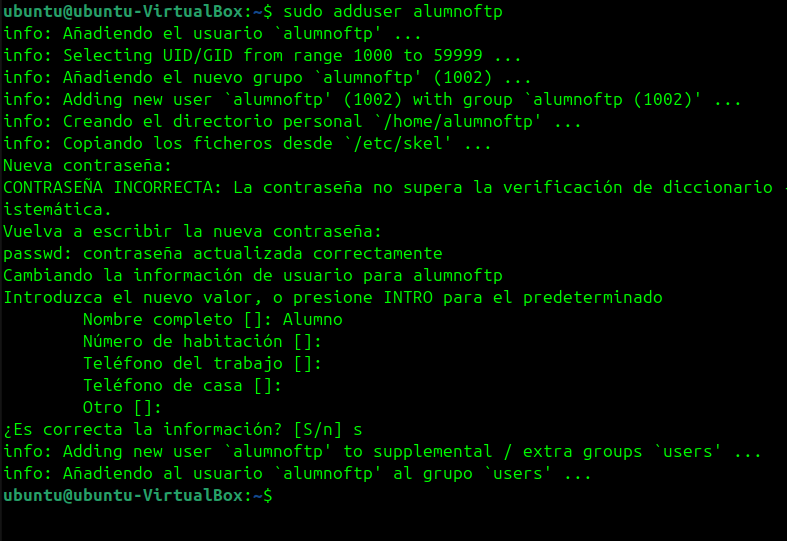

## 7. Restriccion de login

Se anade una regla para permitir el acceso solo al usuario de pruebas y denegar el resto.

```apache
<Limit LOGIN>
AllowUser alumnoftp
DenyAll
</Limit>
```

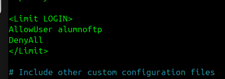

## 8. Configuracion de ProFTPD

Se modifica el archivo principal:

```bash
sudo nano /etc/proftpd/proftpd.conf
```

Se establece el nombre del servidor:

```apache
ServerName "FTP Examen ProFTPD"
```

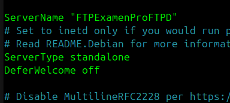

## 9. Enjaulamiento del usuario

Se configura `DefaultRoot` para limitar la navegacion del usuario dentro del servidor.

```apache
DefaultRoot ~
```

En la practica tambien se documenta una ruta de trabajo especifica del laboratorio.

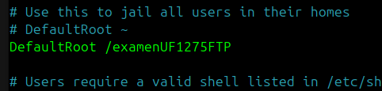

## 10. Reinicio y verificacion del servicio

Se reinicia el servicio para aplicar los cambios.

```bash
sudo systemctl restart proftpd
sudo systemctl status proftpd
```

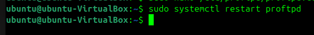

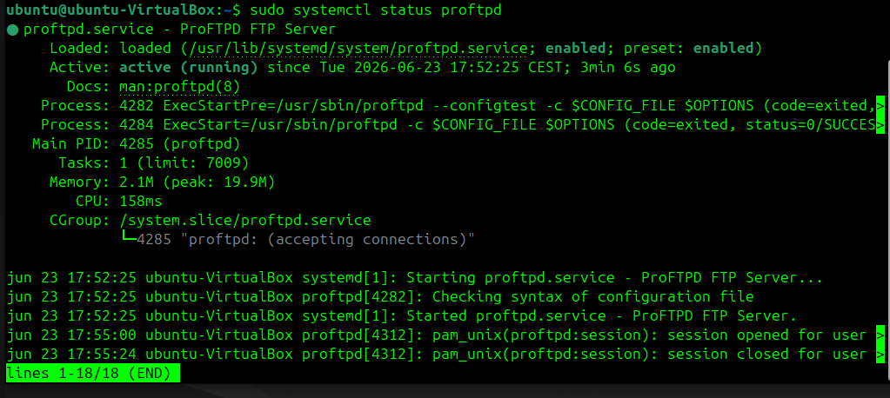

## 11. Prueba con FileZilla

Se comprueba el acceso usando FileZilla, introduciendo IP del servidor, usuario y contrasena.

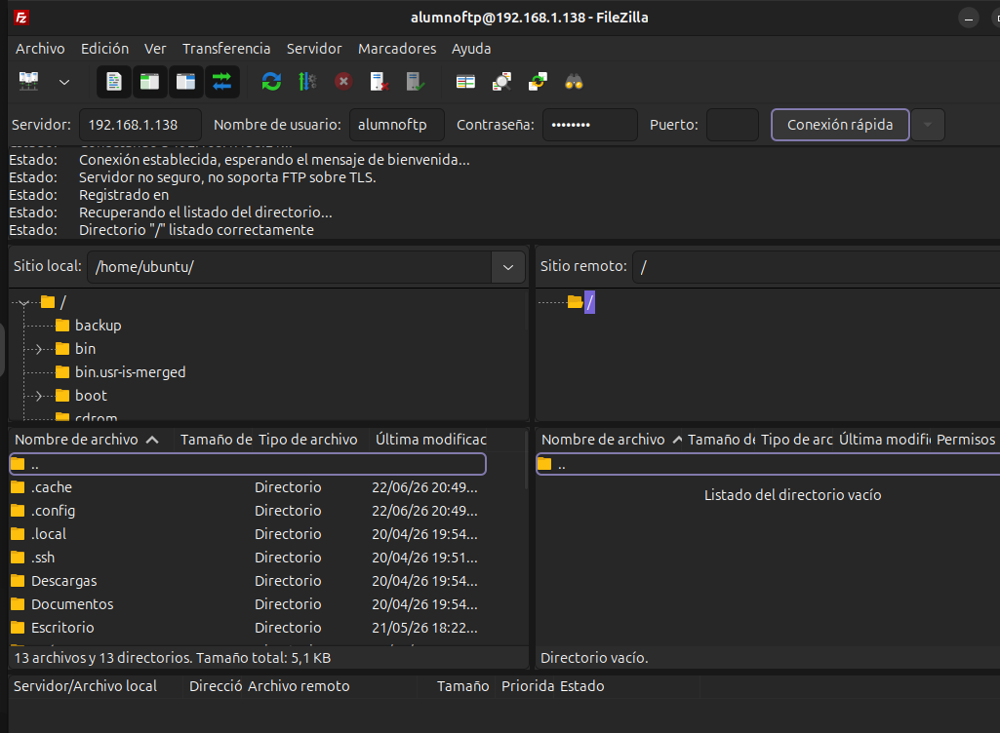

Se valida tambien la transferencia de carpetas/archivos.

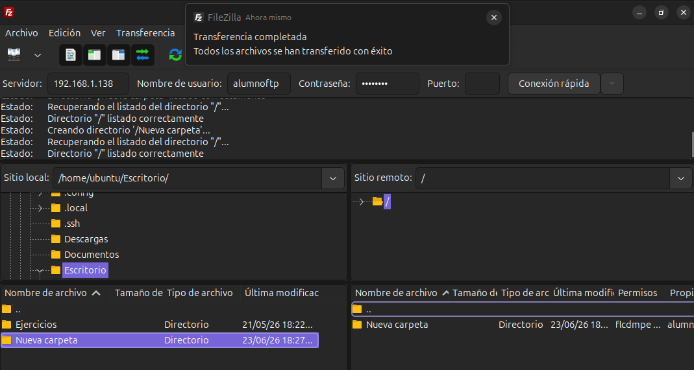

## 12. Prueba desde explorador de archivos

Tambien se accede desde el explorador de archivos usando una URL FTP.

```text
ftp://alumnoftp@IP_DEL_SERVIDOR
```

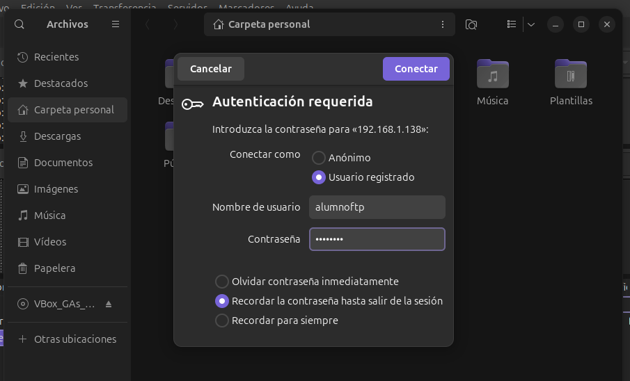

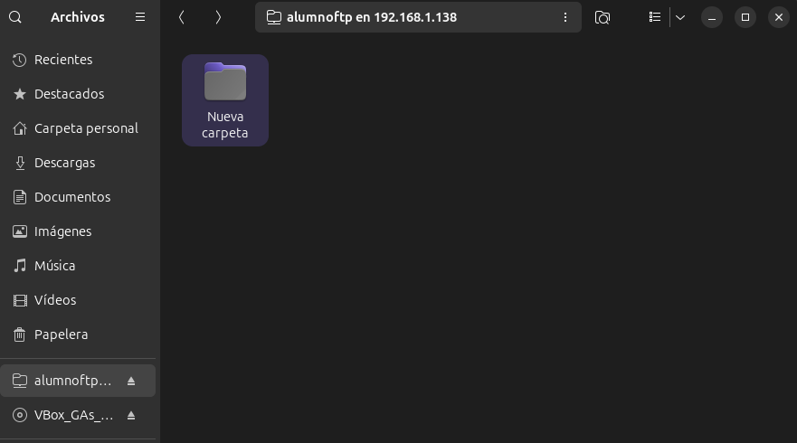

## 13. Conclusiones

Este laboratorio demuestra la instalacion y configuracion de ProFTPD en Ubuntu, incluyendo usuario de pruebas, permisos, configuracion del servicio, restricciones de login, enjaulamiento y validacion desde FileZilla y el explorador de archivos.

## 14. Mejoras recomendadas

Para un entorno profesional se recomienda:

- evitar permisos `777`;
- usar FTPS/SFTP cuando sea posible;
- aplicar grupos y permisos minimos;
- limitar conexiones por firewall;
- registrar accesos y revisar logs;
- usar cuentas nominales y politicas de contrasenas.
