# Servidor FTP en Linux con ProFTPD

## 1. Objetivo

Configurar un servidor FTP en Linux usando **ProFTPD**, crear un directorio de trabajo para el servicio, añadir un usuario dedicado y probar el acceso desde diferentes clientes.

El laboratorio cubre:

- instalación de ProFTPD,
- creación del directorio FTP,
- creación de usuario dedicado,
- modificación de `/etc/proftpd/proftpd.conf`,
- configuración de acceso anónimo/controlado,
- restricción de login a un usuario concreto,
- reinicio del servicio,
- pruebas desde URL, FileZilla y explorador de archivos.

---

## 2. Entorno de laboratorio

- **Sistema:** Linux / Ubuntu
- **Servicio:** ProFTPD
- **Directorio FTP usado en la práctica:** `/servidorFTP`
- **Usuario FTP:** `usuarioftp`
- **Cliente gráfico:** FileZilla

> Nota: esta documentación se ha preparado para GitHub manteniendo el flujo del laboratorio original, pero con una estructura más clara y profesional.

---

## 3. Actualización del sistema e instalación de ProFTPD

Primero actualizamos la lista de paquetes:

```bash
sudo apt update
```

Instalamos ProFTPD:

```bash
sudo apt install proftpd
```

Durante la instalación, el sistema instala `proftpd-core` y las dependencias necesarias para ejecutar el servicio FTP.

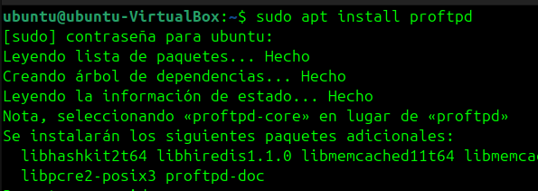

---

## 4. Creación del directorio FTP

Creamos el directorio que se utilizará como raíz del servicio FTP:

```bash
sudo mkdir /servidorFTP
```

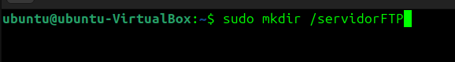

En el documento original se aplican permisos completos al directorio:

```bash
sudo chmod -R 777 /servidorFTP
```

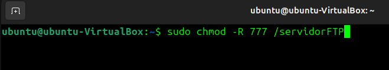

Comprobamos que el directorio existe:

```bash
ls -lah /
```

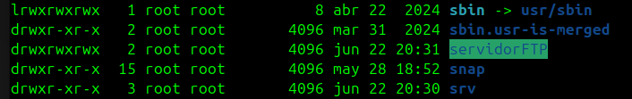

> En un entorno real, no es recomendable usar `777` salvo que sea estrictamente necesario y esté justificado. Sería mejor asignar propietario/grupo y permisos específicos.

---

## 5. Creación del usuario FTP

Creamos un usuario dedicado para el acceso FTP:

```bash
sudo adduser usuarioftp
```

Después se puede verificar que el usuario existe consultando `/etc/passwd`:

```bash
cat /etc/passwd | grep /bin/bash
```

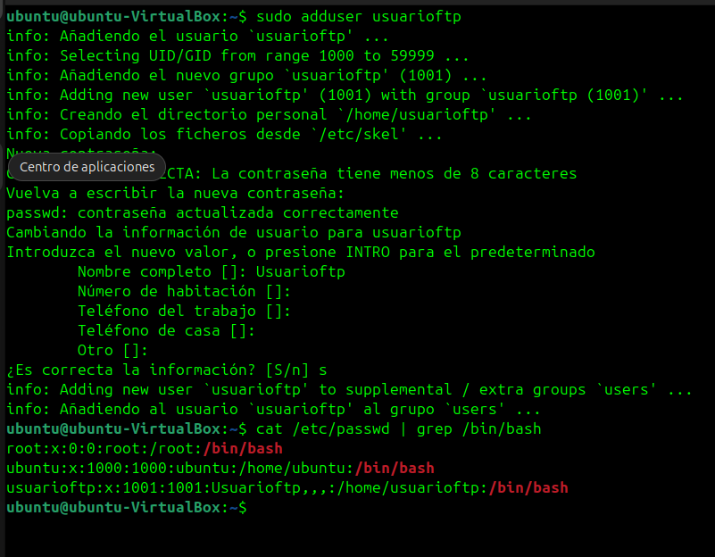

---

## 6. Modificación de la configuración de ProFTPD

Editamos el archivo principal de configuración:

```bash
sudo nano /etc/proftpd/proftpd.conf
```

### 6.1 Nombre del servidor

Se configura el nombre del servidor FTP:

```apache
ServerName "SkyFTP"
```

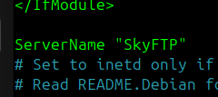

### 6.2 Directorio raíz para los usuarios

Se añade el directorio FTP creado como raíz de acceso:

```apache
DefaultRoot /servidorFTP
```

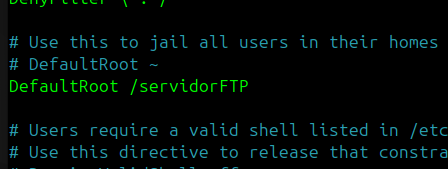

---

## 7. Configuración de acceso anónimo

En el laboratorio se descomenta y ajusta el bloque `Anonymous`, asociándolo al directorio del servicio FTP.

Ejemplo de bloque usado:

```apache
<Anonymous /servidorFTP>
  User ftp
  Group nogroup
  UserAlias anonymous ftp
  DirFakeUser on ftp
  DirFakeGroup on ftp

  RequireValidShell off

  MaxClients 10

  DisplayLogin welcome.msg
  DisplayChdir .message

  <Directory *>
    <Limit WRITE>
      DenyAll
    </Limit>
  </Directory>
</Anonymous>
```

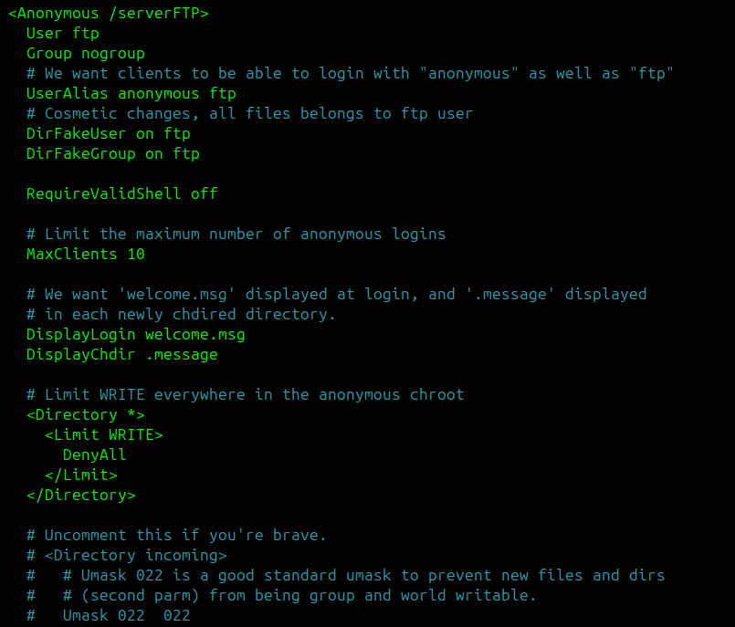

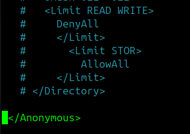

---

## 8. Restricción de login al usuario del laboratorio

Al final de la configuración se añade una sección para permitir únicamente el acceso del usuario `usuarioftp` y denegar el resto:

```apache
<Limit LOGIN>
  AllowUser usuarioftp
  DenyAll
</Limit>
```

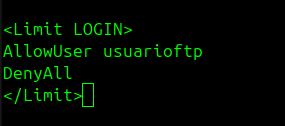

---

## 9. Reinicio del servicio

Después de modificar la configuración, reiniciamos ProFTPD:

```bash
sudo systemctl restart proftpd
```

También es recomendable comprobar el estado del servicio:

```bash
sudo systemctl status proftpd
```

---

## 10. Pruebas de conexión FTP

### 10.1 Acceso mediante URL

Desde el navegador o explorador de archivos podemos probar:

```text
ftp://IP_de_la_máquina
```

O usando el usuario creado:

```text
ftp://usuarioftp@IP_de_la_maquina
```

---

## 11. Prueba con FileZilla

Instalamos FileZilla:

```bash
sudo apt install filezilla
```

Lo ejecutamos con:

```bash
filezilla
```

En FileZilla se configura:

```text
Servidor: IP_del_servidor
Usuario: usuarioftp
Contraseña: <password_del_usuario>
Puerto: 21
```

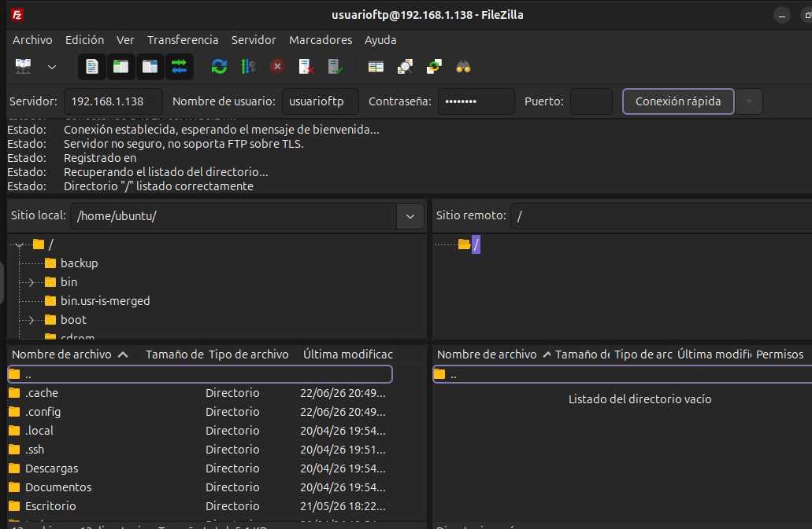

---

## 12. Acceso desde el explorador de archivos

También se puede acceder desde el explorador de archivos usando una URL FTP:

```text
ftp://usuarioftp@IP_de_la_maquina
```

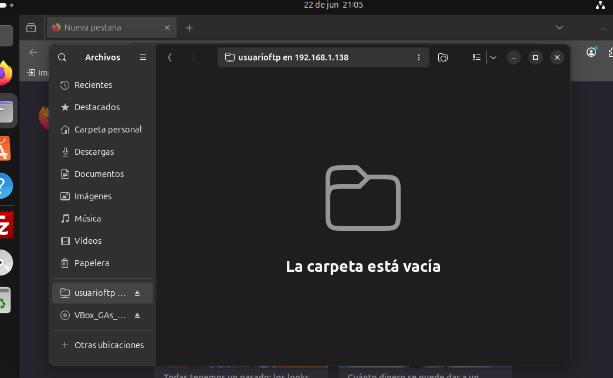

---

## 13. Conclusión

Con este laboratorio se configura un servidor FTP básico con ProFTPD, se crea un directorio dedicado, se añade un usuario de acceso y se valida la conexión desde clientes gráficos.

Puntos importantes aprendidos:

- instalación y puesta en marcha de ProFTPD,
- creación de un directorio raíz para FTP,
- alta de usuarios locales,
- edición de `proftpd.conf`,
- uso de `DefaultRoot`,
- configuración de acceso anónimo/controlado,
- reinicio y pruebas del servicio,
- validación con FileZilla y explorador de archivos.

## 14. Mejoras recomendadas

Para llevar este laboratorio a un entorno más profesional, se recomienda:

- sustituir FTP por **SFTP** o **FTPS**,
- evitar permisos `777`,
- crear grupos específicos para usuarios FTP,
- restringir acceso por firewall,
- registrar logs y revisar intentos fallidos,
- usar TLS si se mantiene ProFTPD,
- no exponer el puerto 21 a Internet sin protección adicional.
