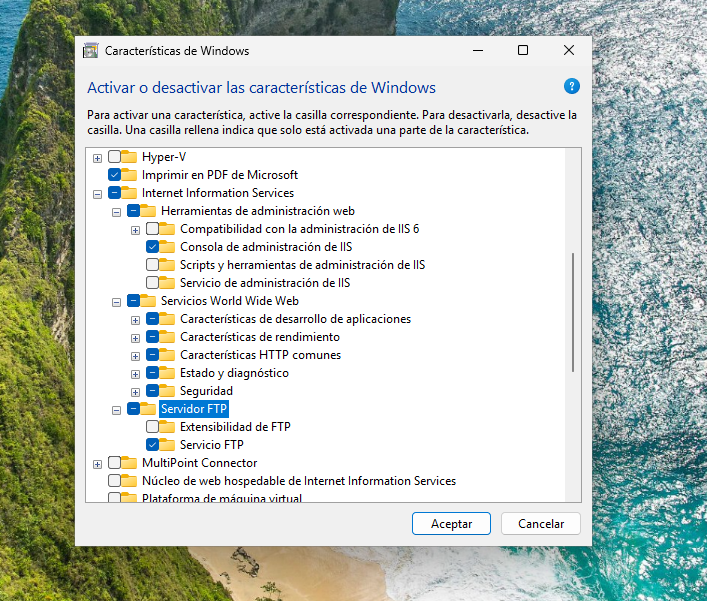
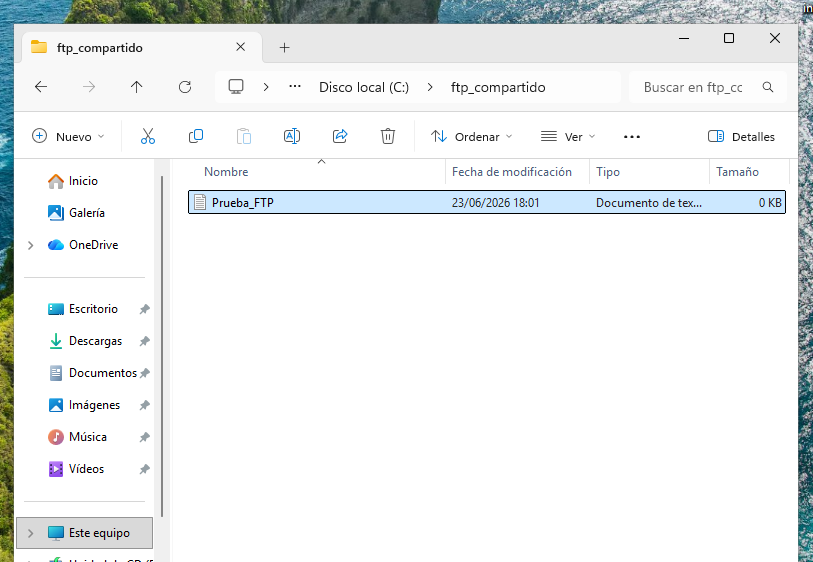
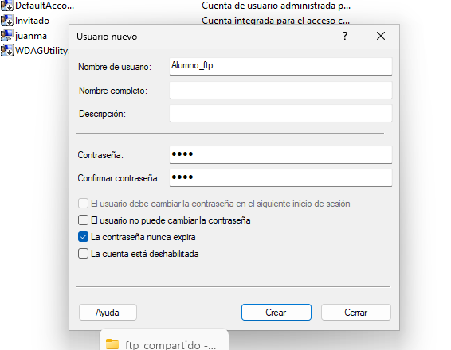
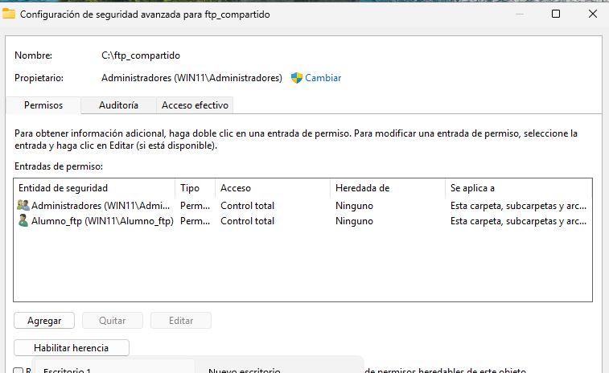
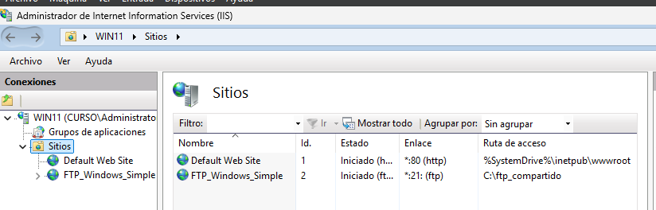
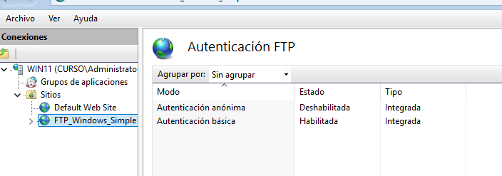
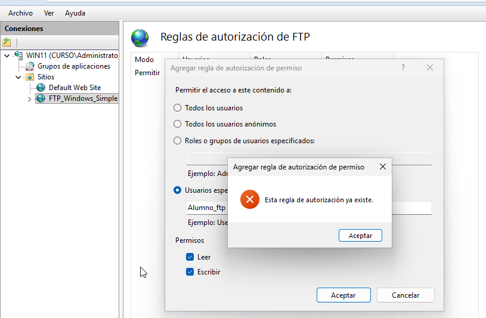
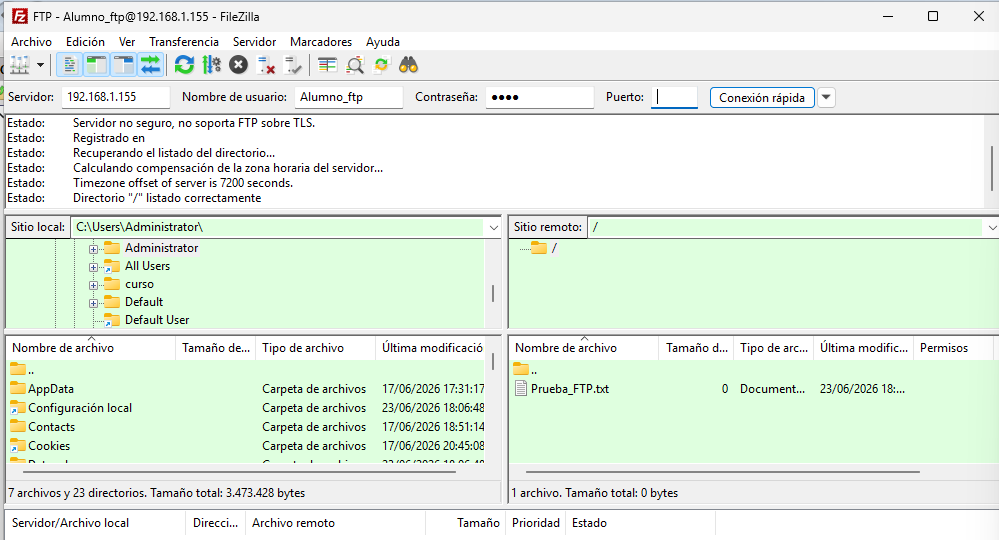
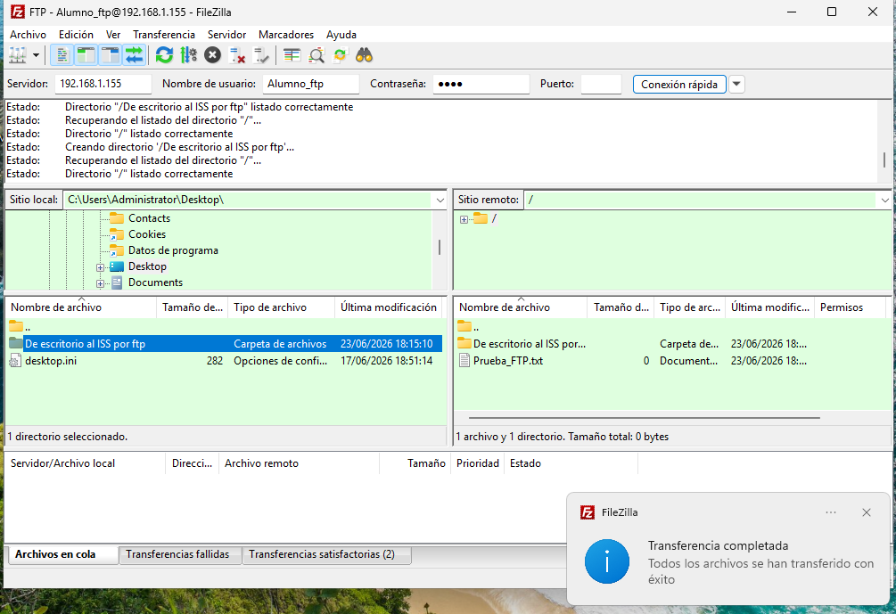

# Servidor FTP Basico en Windows 11 con IIS

## 1. Objetivo

Instalar el servicio FTP nativo de Windows mediante IIS y configurar un sitio de acceso compartido sencillo para pruebas de transferencia de archivos.

## 2. Tecnologias utilizadas

- Windows 11
- Internet Information Services (IIS)
- Servicio FTP de IIS
- Usuario local de pruebas
- Reglas de autorizacion FTP
- Firewall de Windows
- FileZilla como cliente FTP

## 3. Activacion de caracteristicas de Windows

Se activa IIS junto con el componente de servidor FTP desde las caracteristicas de Windows.

Ruta aproximada:

```text
Caracteristicas de Windows
└── Internet Information Services
    └── Servidor FTP
```



## 4. Creacion de la carpeta raiz

Se crea una carpeta en la raiz del sistema para actuar como directorio principal del sitio FTP.

```powershell
C:tp_compartido
```

Dentro de la carpeta se anade un archivo de prueba para verificar el acceso desde el cliente.



## 5. Usuario local de pruebas

Se crea un usuario local para validar la autenticacion FTP.

```text
usuario: Alumno_Ftp
```



## 6. Permisos NTFS sobre la carpeta

Se revisan los permisos de seguridad de la carpeta `C:tp_compartido` para permitir el acceso del usuario de pruebas.



## 7. Configuracion del sitio FTP en IIS

Se crea un nuevo sitio FTP en IIS con la siguiente configuracion:

```text
Nombre del sitio: FTP_Windows_Simple
Puerto: 21
SSL: Sin SSL
Ruta fisica: C:tp_compartido
```



## 8. Autenticacion y autorizacion

Se configura la autenticacion como basica y se anaden reglas de autorizacion para permitir lectura y escritura.

```text
Autenticacion anonima: deshabilitada
Autenticacion basica: habilitada
Permisos: lectura y escritura
```





## 9. Comprobacion desde cliente FTP

Se realiza la conexion desde FileZilla contra el servidor FTP, comprobando que el usuario puede iniciar sesion y acceder al directorio compartido.



Tambien se comprueba la transferencia de archivos.



## 10. Conclusiones

Este laboratorio demuestra la puesta en marcha de un servidor FTP basico en Windows 11 mediante IIS, incluyendo carpeta raiz, usuario local, permisos, autenticacion, autorizacion y validacion desde cliente.

## 11. Mejoras recomendadas

En un entorno real convendria aplicar:

- FTPS en lugar de FTP sin cifrar;
- usuarios nominales con permisos minimos;
- reglas de firewall limitadas por red origen;
- auditoria de accesos;
- separacion entre carpeta de datos y sistema operativo.
