# AWS NGINX FFmpeg RTMP Server

Laboratorio práctico de despliegue de un servidor multimedia RTMP sobre una instancia AWS EC2 con Ubuntu, NGINX, módulo RTMP y FFmpeg.

El objetivo del laboratorio es emitir una playlist de vídeo en bucle, simulando un canal de televisión, y reproducir la señal desde un cliente externo mediante VLC.

> Nota: los endpoints públicos reales, dominios, claves y direcciones concretas deben sustituirse por valores de laboratorio antes de reutilizar esta configuración.

## Tecnologías utilizadas

- AWS EC2
- Ubuntu Server
- NGINX
- `libnginx-mod-rtmp`
- FFmpeg
- yt-dlp
- VLC
- PowerShell
- No-IP / DNS dinámico

## Objetivo del laboratorio

Montar una infraestructura básica de streaming RTMP capaz de:

- Recibir una emisión local generada con FFmpeg.
- Publicar el stream mediante NGINX RTMP en el puerto `1935/tcp`.
- Reproducir el canal desde VLC usando una URL RTMP pública.
- Preparar vídeos locales para una emisión estable mediante conversión a MP4/H.264/AAC.
- Documentar errores reales encontrados y las soluciones aplicadas.

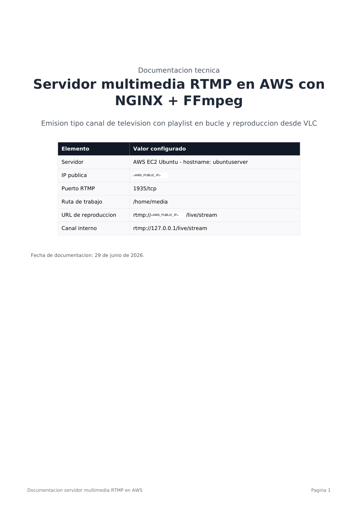

## Arquitectura del flujo

```text
Vídeos originales
/home/media/videos
        |
        v
Conversión con FFmpeg
/home/media/converted
        |
        v
Playlist
/home/media/playlist.txt
        |
        v
FFmpeg emite en bucle
rtmp://127.0.0.1/live/stream
        |
        v
NGINX RTMP publica el canal
rtmp://<AWS_PUBLIC_IP>/live/stream
        |
        v
Cliente externo reproduce en VLC
```

## 1. Instalación de NGINX y módulo RTMP

Se instaló NGINX junto con el módulo RTMP y se comprobó que el servidor escuchaba correctamente en el puerto `1935/tcp`.

```bash
sudo apt update
sudo apt install nginx libnginx-mod-rtmp -y
sudo nginx -t
sudo systemctl restart nginx
sudo systemctl status nginx
sudo ss -tulnp | grep 1935
```

También se comprobó la respuesta HTTP local de NGINX y el estado del firewall interno:

```bash
curl -I http://localhost
sudo ufw allow 1935/tcp
sudo ufw allow 80/tcp
sudo ufw status
```

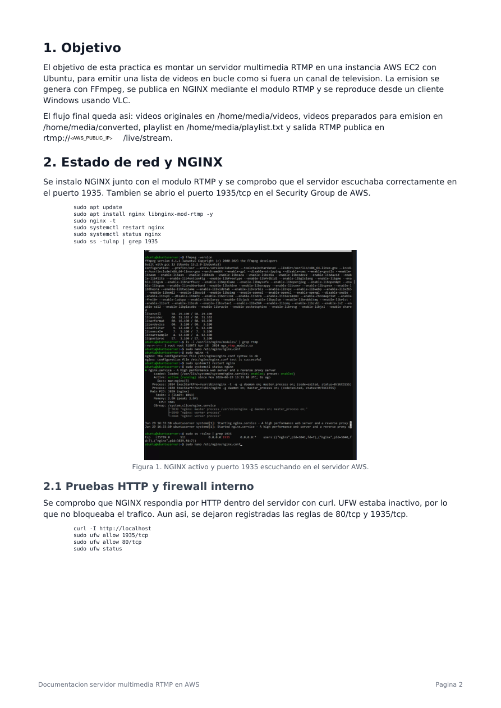

## 2. Configuración RTMP en `nginx.conf`

Después de instalar NGINX y el módulo `libnginx-mod-rtmp`, se editó el archivo principal de configuración:

```bash
sudo nano /etc/nginx/nginx.conf
```

El bloque `rtmp { ... }` se añadió fuera del bloque `http { ... }`, al final del archivo.

```nginx
rtmp {
    server {
        listen 1935;
        chunk_size 4096;

        allow publish 127.0.0.1;
        allow publish <AWS_PUBLIC_IP>;
        # En laboratorio se permitió la publicación amplia para pruebas.
        # En producción se debe restringir este permiso.
        allow publish all;

        application live {
            live on;
            record off;
        }
    }
}
```

`listen 1935;` hace que NGINX escuche tráfico RTMP en el puerto TCP 1935. `application live` define el punto de publicación `/live/stream` y `record off;` evita que NGINX grabe las emisiones en disco.

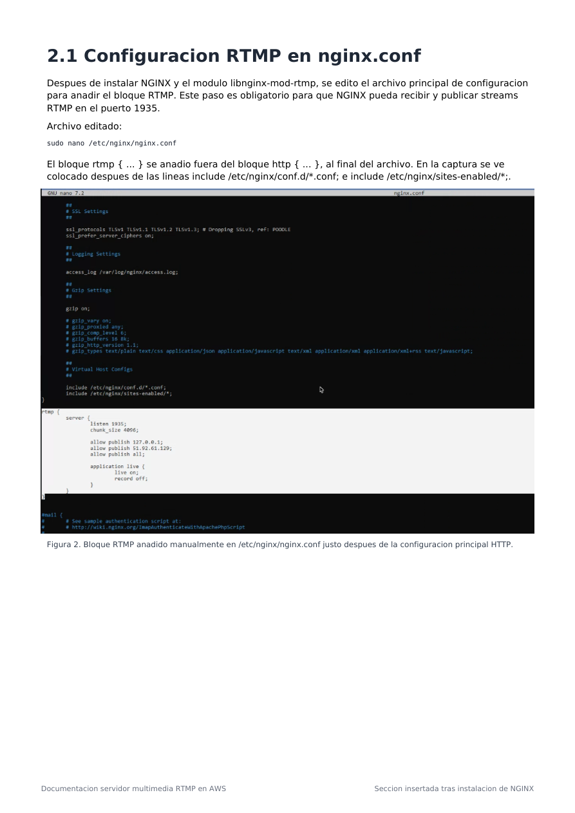

## 3. Verificación del bloque RTMP

Tras guardar la configuración, se validó la sintaxis de NGINX, se reinició el servicio y se comprobó que el puerto quedaba a la escucha.

```bash
sudo nginx -t
sudo systemctl restart nginx
sudo systemctl status nginx
sudo ss -tulnp | grep 1935
```

La comprobación correcta es que `nginx -t` devuelva `syntax is ok` y `test is successful`, y que el puerto `1935` aparezca escuchando.

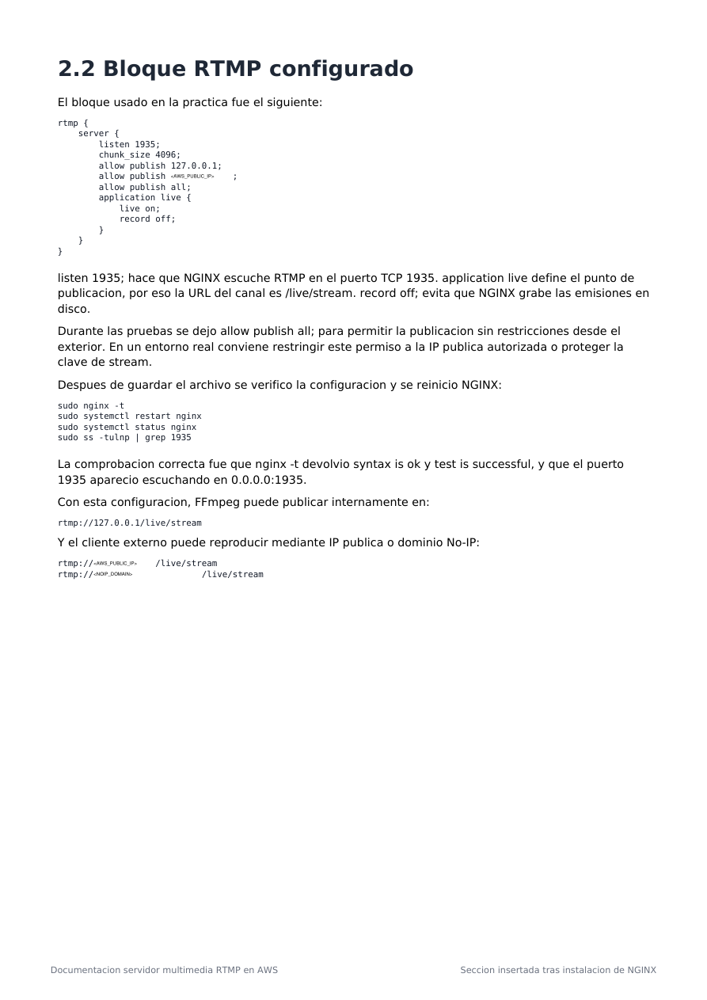

## 4. Prueba del puerto RTMP desde Windows

Desde PowerShell en Windows se comprobó que el puerto RTMP estaba accesible desde fuera de AWS.

```powershell
Test-NetConnection <AWS_PUBLIC_IP> -Port 1935
```

Resultado esperado:

```text
TcpTestSucceeded : True
```

## 5. Estructura de carpetas del canal

Se creó una carpeta principal para el proyecto en `/home/media`. Dentro se separaron los vídeos originales, los vídeos convertidos, logs y playlist.

```bash
sudo mkdir -p /home/media
sudo chown -R ubuntu:ubuntu /home/media
cd /home/media
mkdir -p videos converted logs
touch playlist.txt
ls -l
```

Estructura final:

```text
/home/media/
├── videos/       # Vídeos originales descargados o subidos
├── converted/    # Vídeos convertidos a formato estable para RTMP
├── logs/         # Logs futuros del canal
└── playlist.txt  # Lista de reproducción leída por FFmpeg
```

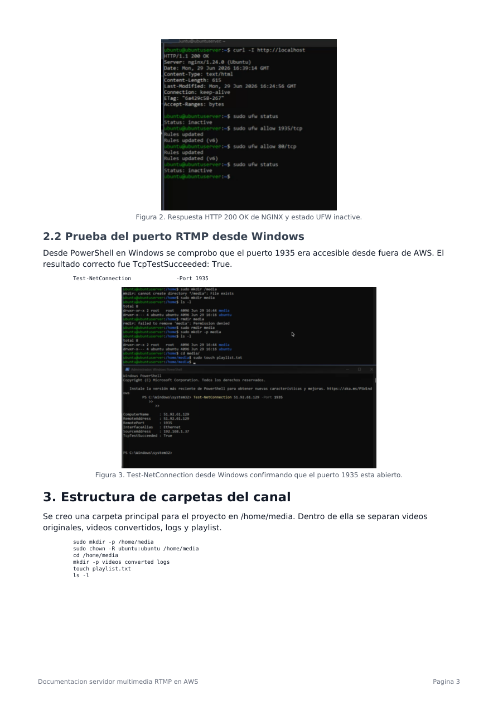

## 6. Descarga de vídeo libre para la prueba

Para la prueba se utilizó **Big Buck Bunny**, un vídeo abierto del proyecto Peach / Blender. Se instaló `yt-dlp` para descargar contenido autorizado directamente en el servidor.

```bash
sudo apt update
sudo apt install python3-pip -y
python3 -m pip install -U yt-dlp --break-system-packages

echo 'export PATH="$HOME/.local/bin:$PATH"' >> ~/.bashrc
source ~/.bashrc
yt-dlp --version
```

Descarga usada para la práctica:

```bash
cd /home/media/videos
yt-dlp "https://archive.org/details/BigBuckBunny_124" -o "big-buck-bunny.%(ext)s"
ls -lh /home/media/videos
```

## 7. Conversión del vídeo para RTMP

El vídeo descargado quedó en formato AVI, por lo que se convirtió a MP4/H.264/AAC para mejorar la compatibilidad con RTMP.

```bash
ffmpeg -i /home/media/videos/big-buck-bunny.avi \
  -c:v libx264 -preset veryfast -pix_fmt yuv420p \
  -c:a aac -ar 44100 -b:a 128k \
  /home/media/converted/big-buck-bunny.mp4
```

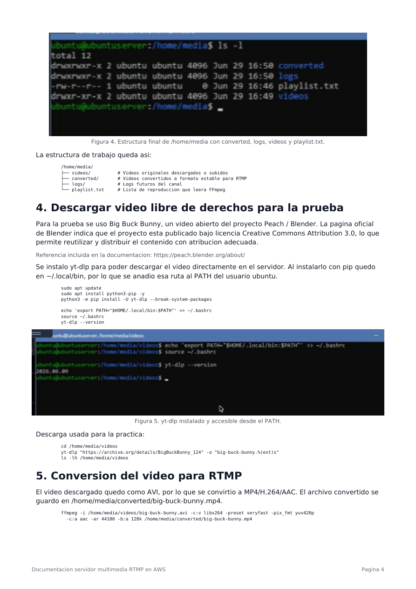

## 8. Creación de la playlist

La playlist es un archivo de texto que indica a FFmpeg qué vídeos debe reproducir.

```bash
nano /home/media/playlist.txt
```

Contenido inicial:

```text
file '/home/media/converted/big-buck-bunny.mp4'
```

Comprobación:

```bash
cat /home/media/playlist.txt
```

## 9. Emisión RTMP como canal en bucle

Durante la práctica, el primer intento de emisión falló porque el audio original tenía 6 canales. RTMP/FLV con AAC dio error de layout de canales.

La solución fue forzar el audio a estéreo con `-ac 2`.

Comando final funcional:

```bash
ffmpeg -re -stream_loop -1 \
  -f concat -safe 0 -i /home/media/playlist.txt \
  -c:v libx264 -preset veryfast -tune zerolatency -pix_fmt yuv420p \
  -c:a aac -ac 2 -ar 44100 -b:a 128k \
  -f flv rtmp://127.0.0.1/live/stream
```

Mientras este comando está en ejecución, el canal permanece emitiendo. Si se pulsa `CTRL + C`, la emisión se detiene.

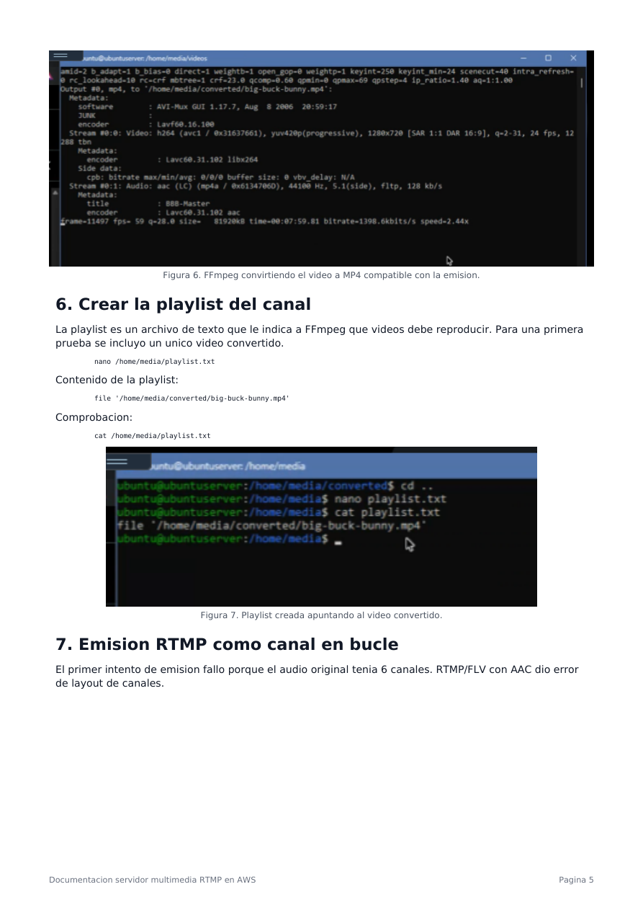

## 10. Reproducción desde VLC en Windows

Desde el cliente Windows se abrió VLC y se accedió a la URL pública RTMP:

```text
rtmp://<AWS_PUBLIC_IP>/live/stream
```

La reproducción se visualizó correctamente, confirmando que el servidor multimedia RTMP estaba operativo.

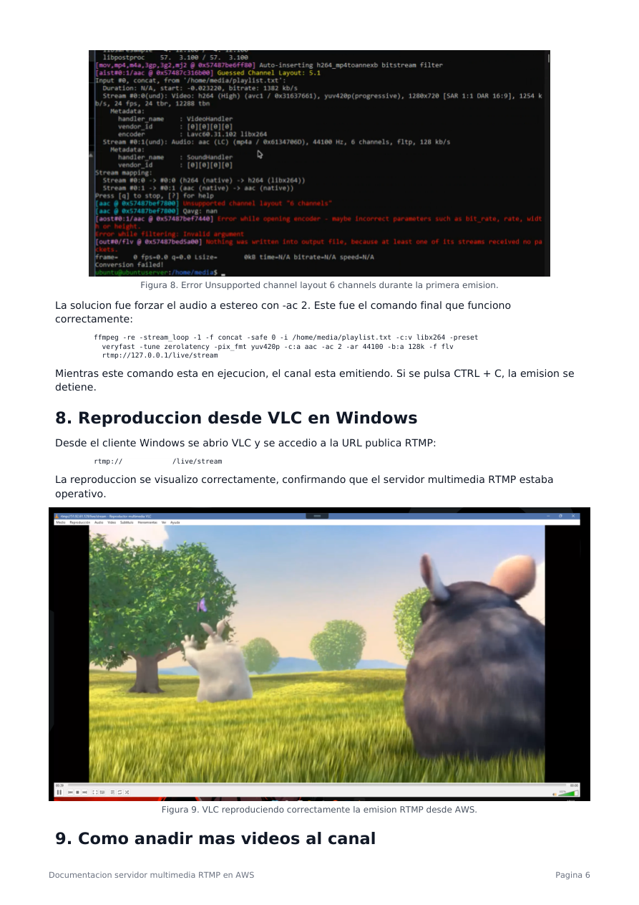

## 11. Añadir más vídeos al canal

### Subir vídeos desde Windows al servidor

```powershell
scp -i ".\<SSH_KEY>.pem" ".\video1.mp4" ubuntu@<AWS_PUBLIC_IP>:/home/media/videos/
scp -i ".\<SSH_KEY>.pem" ".\*.mp4" ubuntu@<AWS_PUBLIC_IP>:/home/media/videos/
```

Comprobación en el servidor:

```bash
ls -lh /home/media/videos
```

### Descargar vídeos autorizados con `yt-dlp`

Este método debe usarse solo con vídeos propios, vídeos con licencia Creative Commons o contenidos para los que se tenga permiso.

```bash
cd /home/media/videos
yt-dlp "URL_DEL_VIDEO_AUTORIZADO" -o "video2.%(ext)s"
yt-dlp -F "URL_DEL_VIDEO_AUTORIZADO"
```

### Convertir vídeos nuevos para el canal

```bash
ffmpeg -i /home/media/videos/video2.mp4 \
  -c:v libx264 -preset veryfast -pix_fmt yuv420p \
  -c:a aac -ac 2 -ar 44100 -b:a 128k \
  /home/media/converted/video2.mp4
```

Para convertir todos los MP4:

```bash
for f in /home/media/videos/*.mp4; do
  base=$(basename "$f" .mp4)
  ffmpeg -y -i "$f" \
    -c:v libx264 -preset veryfast -pix_fmt yuv420p \
    -c:a aac -ac 2 -ar 44100 -b:a 128k \
    "/home/media/converted/${base}.mp4"
done
```

### Actualizar la playlist

```text
file '/home/media/converted/big-buck-bunny.mp4'
file '/home/media/converted/video2.mp4'
file '/home/media/converted/video3.mp4'
```

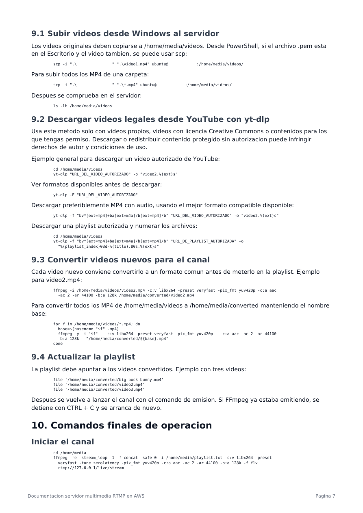

## 12. Comandos finales de operación

Iniciar el canal:

```bash
cd /home/media
ffmpeg -re -stream_loop -1 \
  -f concat -safe 0 -i /home/media/playlist.txt \
  -c:v libx264 -preset veryfast -tune zerolatency -pix_fmt yuv420p \
  -c:a aac -ac 2 -ar 44100 -b:a 128k \
  -f flv rtmp://127.0.0.1/live/stream
```

Ver el canal:

```text
rtmp://<AWS_PUBLIC_IP>/live/stream
rtmp://<NOIP_DOMAIN>/live/stream
```

Comprobar conexiones activas:

```bash
sudo ss -tanp | grep 1935
```

Comprobar proceso FFmpeg:

```bash
ps aux | grep ffmpeg
```

Parar el canal:

```text
CTRL + C
```

## 13. Problemas encontrados y soluciones

| Problema | Causa | Solución aplicada |
|---|---|---|
| `yt-dlp: command not found` | `yt-dlp` no estaba instalado o no estaba en el PATH | Instalación con pip y añadir `~/.local/bin` al PATH |
| No se podía llegar al puerto RTMP | Faltaba abrir `1935/tcp` en el Security Group de AWS | Regla de entrada TCP 1935 y validación con PowerShell |
| `Unsupported channel layout 6 channels` | Audio 5.1/6 canales incompatible con salida AAC/FLV | Forzar audio estéreo con `-ac 2` |
| La emisión se corta al cerrar SSH | FFmpeg depende de la terminal abierta | Crear un servicio `systemd` |

## 14. Mejora futura recomendada

Crear un servicio `systemd` para gestionar el canal como servicio del sistema:

```bash
sudo systemctl start media-channel
sudo systemctl stop media-channel
sudo systemctl restart media-channel
sudo systemctl status media-channel
```

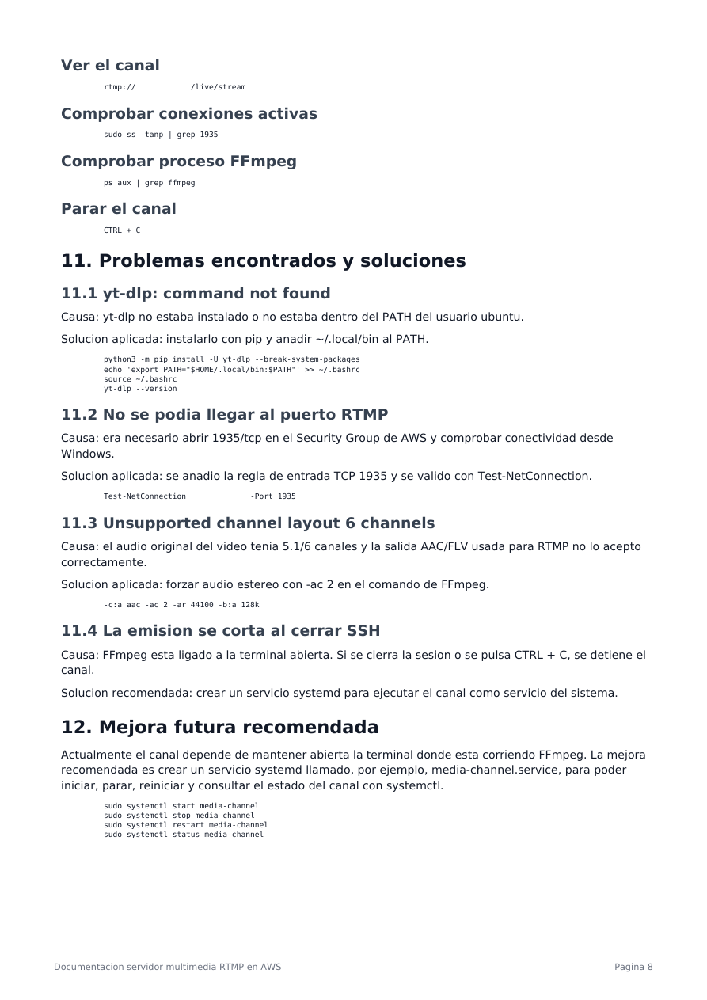

## 15. Fuentes y notas de licencia

Big Buck Bunny se usó como material de prueba por ser un proyecto abierto de Blender/Peach. Al reutilizar, emitir o redistribuir contenido multimedia, debe revisarse siempre la licencia concreta del archivo usado.

Referencias:

- https://peach.blender.org/about/
- https://archive.org/details/BigBuckBunny_124


## 16. Acceso externo mediante dominio No-IP

Una vez verificada la reproducción RTMP mediante IP pública, se añadió un dominio dinámico de No-IP para acceder al servidor sin escribir directamente la dirección IP.

El dominio dinámico apunta a la IP pública de la instancia AWS. De esta forma, la URL de reproducción pasa de usar IP directa a usar nombre DNS.

```text
rtmp://<NOIP_DOMAIN>/live/stream
```

Comprobación DNS desde Windows:

```powershell
nslookup <NOIP_DOMAIN>
```

Comprobación del puerto usando el dominio:

```powershell
Test-NetConnection <NOIP_DOMAIN> -Port 1935
```

Acceso SSH mediante dominio:

```powershell
ssh -i ".\<SSH_KEY>.pem" ubuntu@<NOIP_DOMAIN>
```

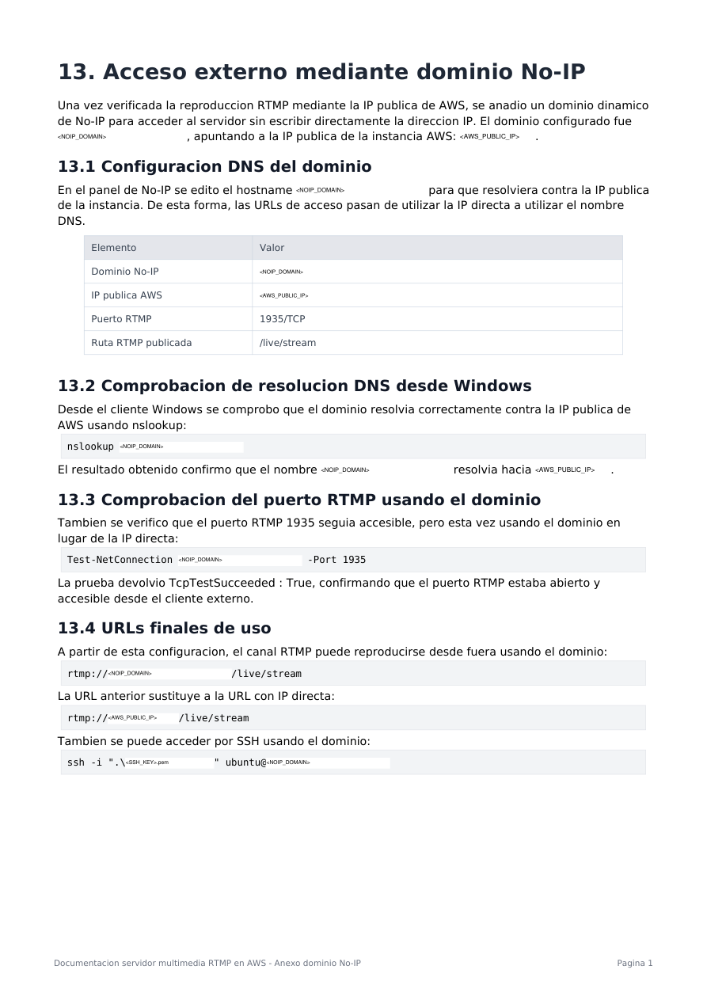

## 17. Prueba final de reproducción con dominio

La prueba final se realizó desde VLC en Windows usando la URL RTMP con dominio dinámico.

Resultado final validado:

```text
No-IP: <NOIP_DOMAIN> -> <AWS_PUBLIC_IP>
RTMP: rtmp://<NOIP_DOMAIN>/live/stream
Puerto: 1935/TCP
Resultado: reproducción correcta en VLC
```

Si la instancia de AWS se apaga y vuelve a encenderse sin Elastic IP asociada, su IP pública podría cambiar. En ese caso habría que actualizar el registro de No-IP o asociar una Elastic IP fija a la instancia.

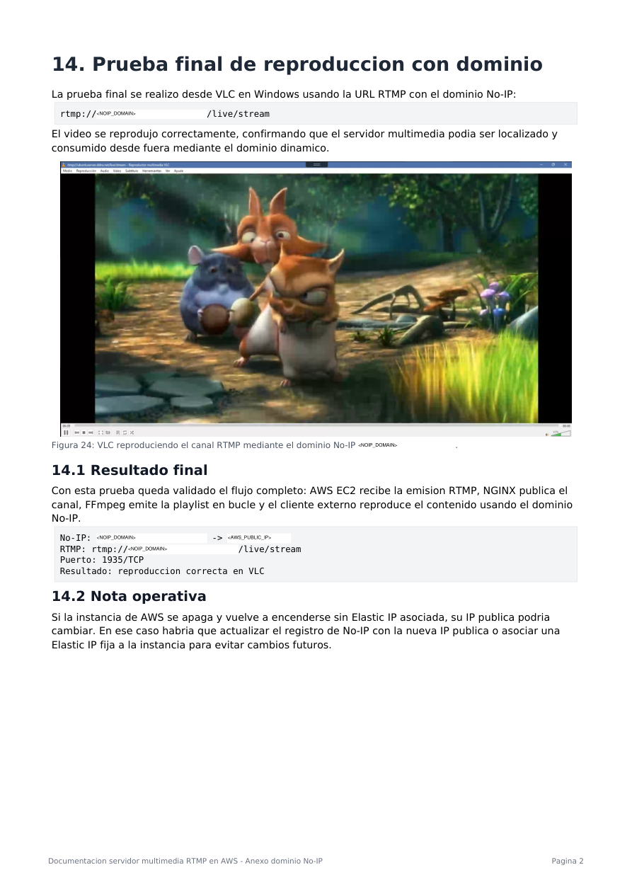

## Notas de seguridad

- No publicar claves privadas `.pem` ni credenciales de acceso.
- Sustituir IPs públicas, dominios y rutas sensibles por placeholders antes de publicar.
- Restringir `allow publish` a IPs autorizadas en entornos reales.
- Asociar Elastic IP a la instancia si se necesita estabilidad del endpoint.
- Revisar Security Groups de AWS y reglas de firewall antes de publicar el servicio.
- Usar únicamente contenido multimedia propio, autorizado o con licencia compatible.

## Disclaimer

Este laboratorio se ha realizado en un entorno controlado con fines formativos. No debe utilizarse para emitir contenido sin autorización ni para operar infraestructura pública sin aplicar medidas de seguridad adecuadas.
