# Ubuntu Server - Icecast2 + Ices2 + yt-dlp

**Autor:** Nammu  
**Entorno:** Laboratorio local controlado en VirtualBox  
**Nivel:** Intermedio  
**Categoría:** Servicios de Internet / Multimedia / Streaming de audio

---

## 1. Objetivo

El objetivo de este laboratorio es desplegar un servidor de streaming de audio en una red interna de laboratorio utilizando:

- **Icecast2** como servidor de streaming.
- **Ices2** como fuente de audio hacia Icecast2.
- **yt-dlp** para obtener un recurso de audio libre/controlado.
- **BIND9 + ISC DHCP Server + DDNS** como infraestructura base profesional de red.
- **Ubuntu Desktop** como cliente reproductor.

La práctica se realiza sobre una base previa ya configurada con DNS autoritativo, DHCP real y actualización dinámica de registros DNS mediante TSIG.

---

## 2. Topología del laboratorio

```text
Windows anfitrión
   |
   | SSH por red host-only
   |
server-lab - Ubuntu Server
   |-- enp0s3: NAT / Internet
   |-- enp0s8: Red interna 192.168.1.8/24
   |-- enp0s9: Host-only 192.168.56.10/24
   |-- BIND9: DNS autoritativo lab.local
   |-- ISC DHCP Server: DHCP para clientes internos
   |-- Icecast2: servidor streaming en puerto 8000
   |-- Ices2: fuente de audio hacia Icecast2

cliente-ubuntu - Ubuntu Desktop
   |-- IP por DHCP: 192.168.1.20/24
   |-- DNS: 192.168.1.8
   |-- Dominio: lab.local
```

Nombres DNS utilizados:

```text
server-lab.lab.local -> 192.168.1.8
icecast.lab.local    -> 192.168.1.8
radio.lab.local      -> 192.168.1.8
cliente-ubuntu.lab.local -> 192.168.1.20
```

---

## 3. Comprobación de la base de red

Antes de instalar Icecast2 se verificó que el servidor partía de una base funcional con BIND9, DHCP y DDNS.

Comandos utilizados:

```bash
hostname
ip -br addr
ip route
systemctl status bind9
systemctl status isc-dhcp-server
dig @192.168.1.8 icecast.lab.local
dig @192.168.1.8 radio.lab.local
```

Evidencia:

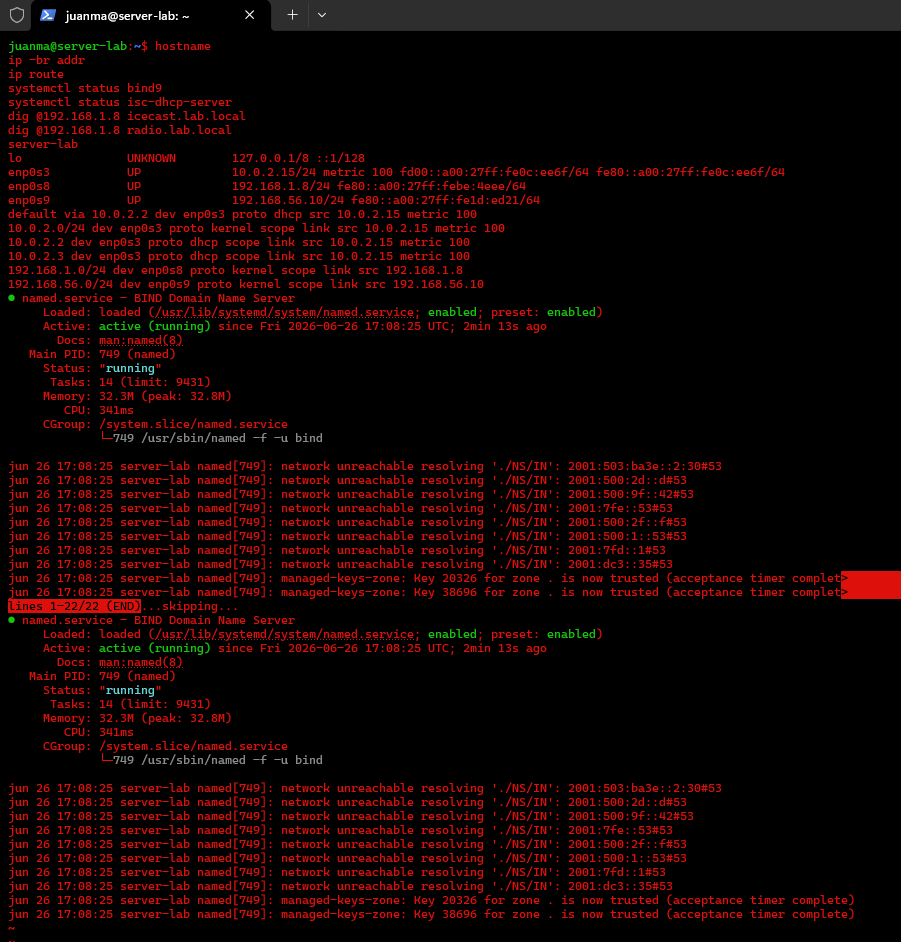

También se validó que los nombres `icecast.lab.local` y `radio.lab.local` resolvían correctamente hacia la IP interna del servidor:

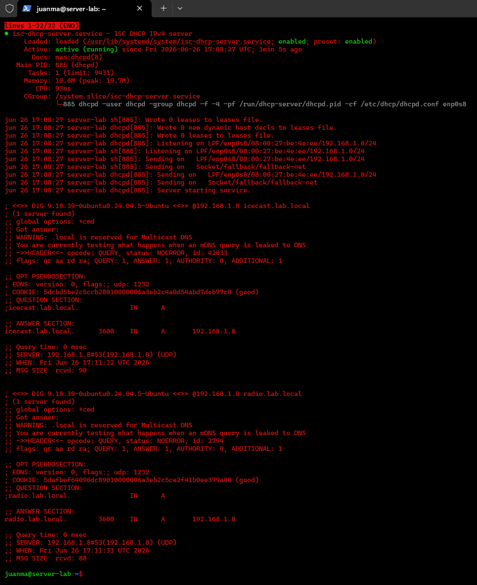

---

## 4. Instalación de Icecast2, Ices2 y herramientas

Se instalaron los paquetes necesarios:

```bash
sudo apt update
sudo apt install icecast2 ices2 vorbis-tools ffmpeg python3-pip -y
```

Durante el asistente de instalación de Icecast2 se configuró el hostname:

```text
icecast.lab.local
```

Las contraseñas de `source`, `relay` y `admin` se configuraron en el sistema, pero no se documentan en claro por seguridad.

Evidencia del asistente de configuración:

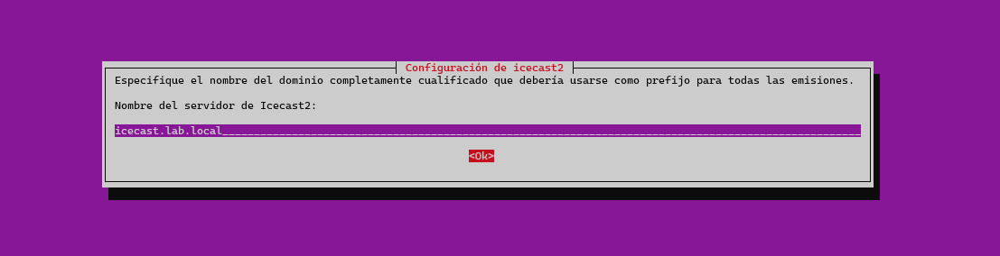

---

## 5. Validación inicial de Icecast2

Tras la instalación se comprobó el estado del servicio y el puerto de escucha:

```bash
sudo systemctl status icecast2
sudo ss -tulnp | grep ':8000'
curl -I http://127.0.0.1:8000
curl -I http://icecast.lab.local:8000
```

Inicialmente Icecast2 respondía correctamente en `127.0.0.1`, pero el propio servidor no resolvía todavía `icecast.lab.local` como resolver local. Esto se corrigió configurando `systemd-resolved` para usar BIND9 local.

Evidencia:

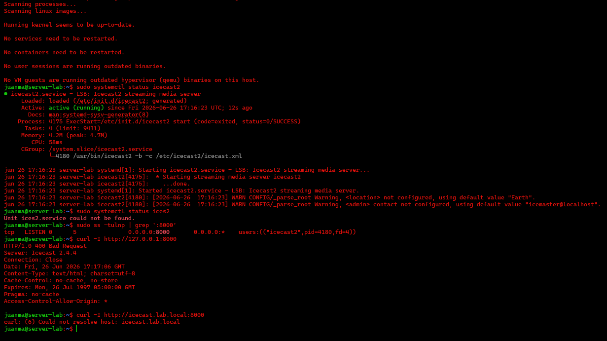

---

## 6. Configuración de resolución local en server-lab

El cliente Ubuntu ya resolvía correctamente los nombres internos por DHCP, pero el propio `server-lab` aún utilizaba el DNS entregado por NAT. Para que el servidor también resolviera sus zonas locales, se editó:

```bash
sudo nano /etc/systemd/resolved.conf
```

Configuración aplicada:

```ini
[Resolve]
DNS=127.0.0.1
FallbackDNS=1.1.1.1 8.8.8.8
Domains=lab.local
DNSSEC=no
```

Después se reinició el servicio:

```bash
sudo systemctl restart systemd-resolved
resolvectl status
```

Evidencia:

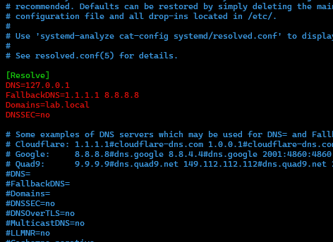

Validación de resolución interna y externa:

```bash
resolvectl query icecast.lab.local
resolvectl query radio.lab.local
resolvectl query google.com

dig icecast.lab.local
dig radio.lab.local
dig google.com
```

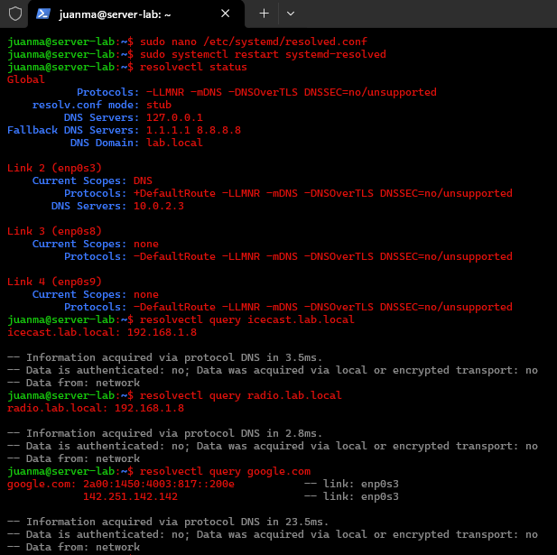

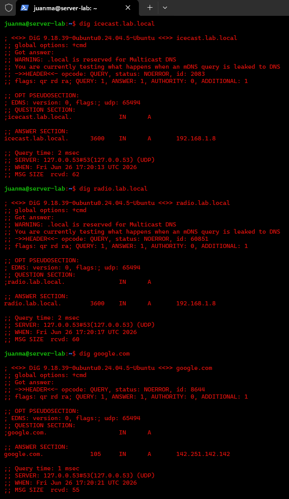

---

## 7. Validación HTTP de Icecast por DNS local

Una vez corregida la resolución local, se validó que Icecast2 respondía tanto por `icecast.lab.local` como por `radio.lab.local`:

```bash
curl http://icecast.lab.local:8000
curl http://radio.lab.local:8000
```

Evidencia:

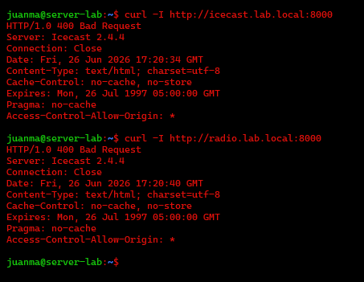

Desde `cliente-ubuntu` se accedió al panel web de Icecast2 mediante navegador:

```text
http://icecast.lab.local:8000
http://radio.lab.local:8000
```

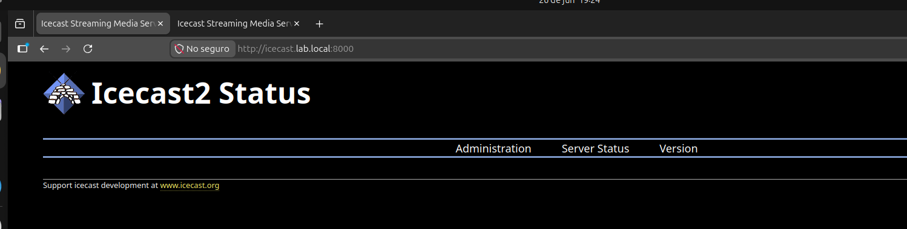

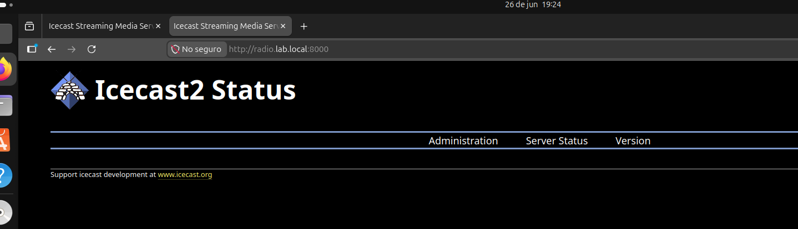

También se comprobó la respuesta HTML desde terminal:

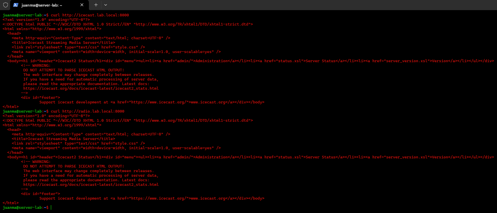

---

## 8. Ajuste de `icecast.xml`

Se hizo una copia de seguridad de la configuración original:

```bash
sudo cp /etc/icecast2/icecast.xml /etc/icecast2/icecast.xml.bak.$(date +%F)
```

Se revisaron los valores principales de:

```bash
sudo nano /etc/icecast2/icecast.xml
```

Valores relevantes:

```xml
<location>Lab Local</location>
<admin>admin@lab.local</admin>
<hostname>icecast.lab.local</hostname>

<listen-socket>
    <port>8000</port>
</listen-socket>
```

Las credenciales del bloque `<authentication>` fueron configuradas en el servidor, pero en este write-up quedan representadas como placeholders:

```xml
<source-password>&lt;ICECAST_SOURCE_PASSWORD&gt;</source-password>
<relay-password>&lt;ICECAST_RELAY_PASSWORD&gt;</relay-password>
<admin-password>&lt;ICECAST_ADMIN_PASSWORD&gt;</admin-password>
```

Después se reinició el servicio:

```bash
sudo systemctl restart icecast2
sudo systemctl status icecast2
sudo ss -tulnp | grep ':8000'
curl http://icecast.lab.local:8000
```

Evidencia:

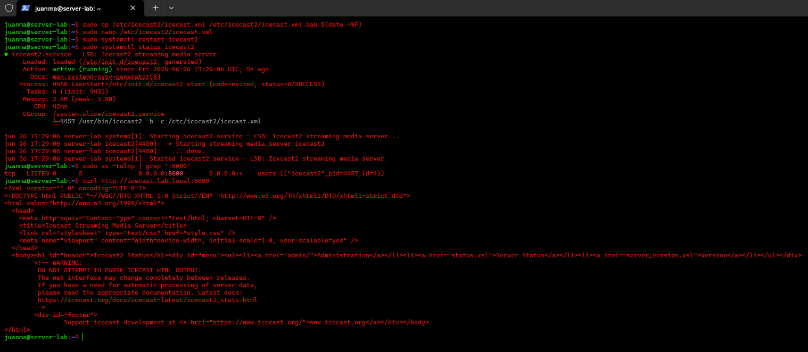

---

## 9. Estructura profesional del laboratorio

En lugar de trabajar dentro de `/root`, se preparó una estructura limpia para los recursos del laboratorio:

```bash
sudo mkdir -p /opt/icecast-lab/music
sudo mkdir -p /opt/icecast-lab/playlists
sudo mkdir -p /opt/icecast-lab/scripts
sudo mkdir -p /var/log/ices

sudo chown -R juanma:juanma /opt/icecast-lab
sudo chmod 755 /opt/icecast-lab
sudo chmod 755 /opt/icecast-lab/music
sudo chmod 755 /opt/icecast-lab/playlists
sudo chmod 755 /opt/icecast-lab/scripts
sudo chmod 755 /var/log/ices
```

Estructura resultante:

```text
/opt/icecast-lab/
|-- music/
|-- playlists/
`-- scripts/

/var/log/ices/
```

Evidencia:

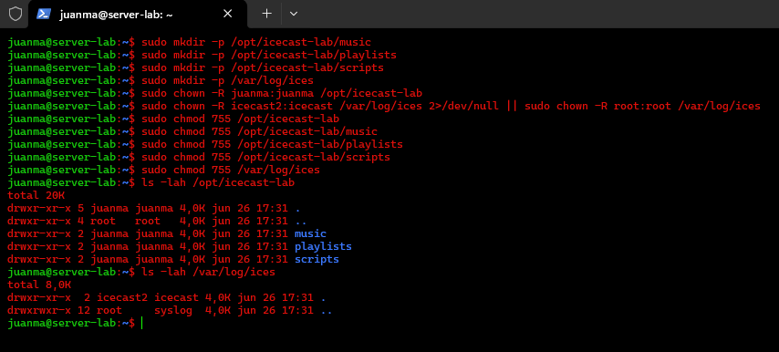

---

## 10. Instalación de `yt-dlp` con pipx

Para evitar instalar paquetes Python directamente como root, se utilizó `pipx`:

```bash
sudo apt install pipx -y
pipx ensurepath
exit
ssh juanma@192.168.56.10
pipx install yt-dlp
yt-dlp --version
```

Evidencia:

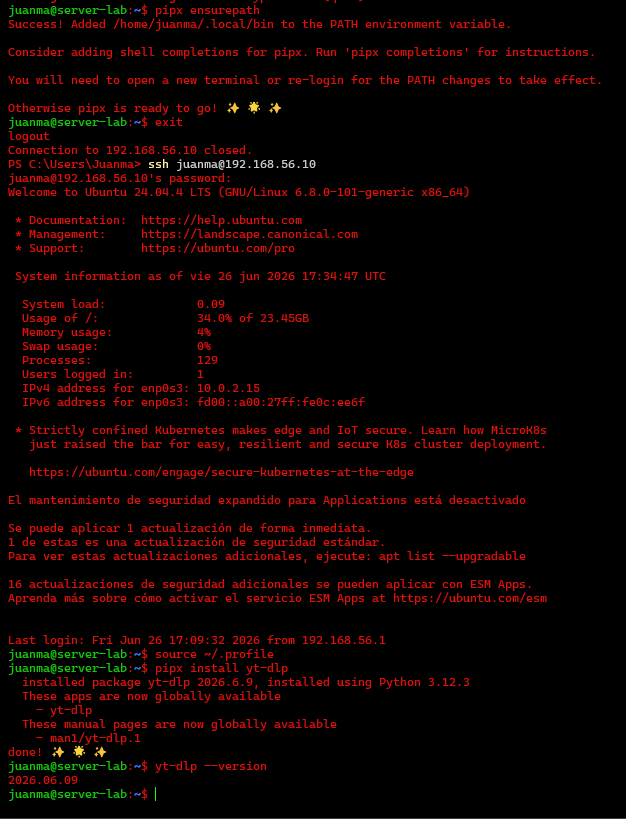

---

## 11. Preparación de audio libre y playlist

Se descargó un recurso audiovisual libre/controlado desde Archive.org y se extrajo el audio en formato OGG/Vorbis:

```bash
cd /opt/icecast-lab/music

yt-dlp \
-x \
--audio-format vorbis \
--audio-quality 5 \
"https://archive.org/details/BigBuckBunny_328" \
-o "audio-libre.%(ext)s"
```

Se comprobó el archivo generado:

```bash
ls -lah /opt/icecast-lab/music
file /opt/icecast-lab/music/*
```

Después se creó la playlist para Ices2:

```bash
find /opt/icecast-lab/music -type f -name "*.ogg" | sort > /opt/icecast-lab/playlists/playlist.txt
cat /opt/icecast-lab/playlists/playlist.txt
```

Resultado esperado:

```text
/opt/icecast-lab/music/audio-libre.ogg
```

Evidencia:

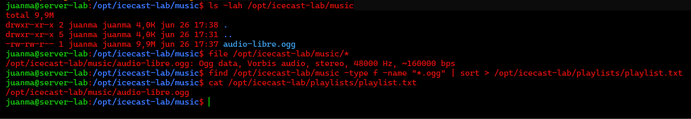

---

## 12. Configuración de Ices2

Se copió la configuración base de ejemplo:

```bash
sudo mkdir -p /etc/ices2
sudo cp /usr/share/doc/ices2/examples/ices-playlist.xml /etc/ices2/ices-playlist.xml
sudo chown root:root /etc/ices2/ices-playlist.xml
sudo chmod 644 /etc/ices2/ices-playlist.xml
sudo nano /etc/ices2/ices-playlist.xml
```

Configuración utilizada, con contraseña redactada:

```xml
<?xml version="1.0"?>
<ices>
    <background>0</background>

    <logpath>/var/log/ices</logpath>
    <logfile>ices-playlist.log</logfile>
    <loglevel>4</loglevel>
    <consolelog>1</consolelog>

    <pidfile>/var/run/ices2/ices.pid</pidfile>

    <stream>
        <metadata>
            <name>Radio Lab Local</name>
            <genre>Lab Audio</genre>
            <description>Streaming de audio libre con Icecast2, Ices2 y yt-dlp</description>
        </metadata>

        <input>
            <module>playlist</module>
            <param name="type">basic</param>
            <param name="file">/opt/icecast-lab/playlists/playlist.txt</param>
            <param name="random">0</param>
            <param name="once">0</param>
        </input>

        <instance>
            <hostname>icecast.lab.local</hostname>
            <port>8000</port>
            <password>&lt;ICECAST_SOURCE_PASSWORD&gt;</password>
            <mount>/musica.ogg</mount>
        </instance>
    </stream>
</ices>
```

Se creó el directorio PID:

```bash
sudo mkdir -p /var/run/ices2
sudo chown -R juanma:juanma /var/run/ices2
```

Y se lanzó Ices2 en primer plano:

```bash
ices2 /etc/ices2/ices-playlist.xml
```

Evidencia de conexión:

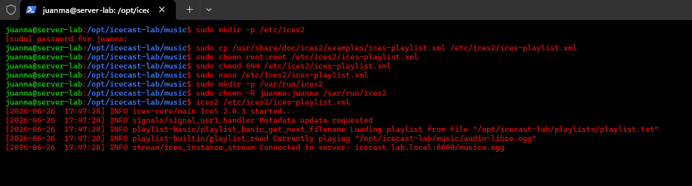

Puntos clave observados:

```text
Currently playing "/opt/icecast-lab/music/audio-libre.ogg"
Connected to server: icecast.lab.local:8000/musica.ogg
```

---

## 13. Reproducción desde cliente Ubuntu

Desde `cliente-ubuntu` se accedió al mount publicado por Icecast:

```text
http://icecast.lab.local:8000/musica.ogg
http://radio.lab.local:8000/musica.ogg
```

El panel principal de Icecast mostró el mount activo `/musica.ogg`, con metadata, tipo de contenido y oyentes conectados.

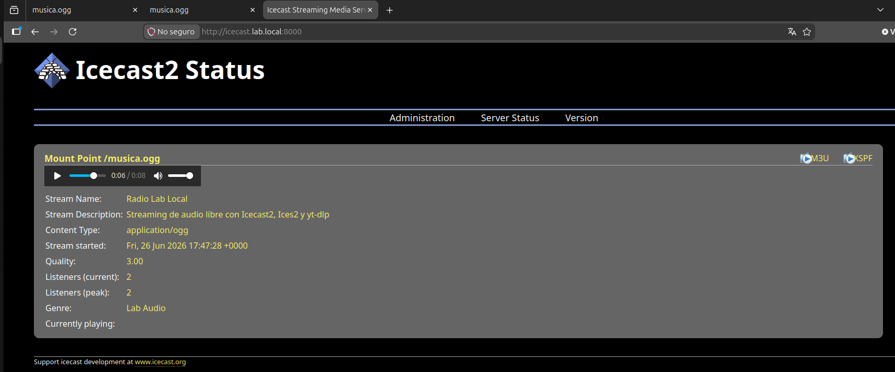

Reproducción desde `radio.lab.local`:

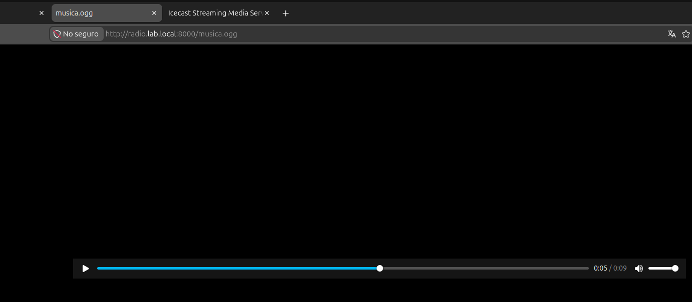

Reproducción desde `icecast.lab.local`:

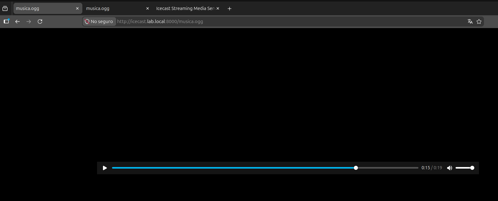

---

## 14. Validación de conexiones y logs

En `server-lab` se comprobaron conexiones activas en el puerto 8000:

```bash
sudo ss -tanp | grep ':8000'
```

También se revisaron logs:

```bash
sudo tail -n 40 /var/log/icecast2/access.log
sudo tail -n 40 /var/log/icecast2/error.log
```

Evidencia:

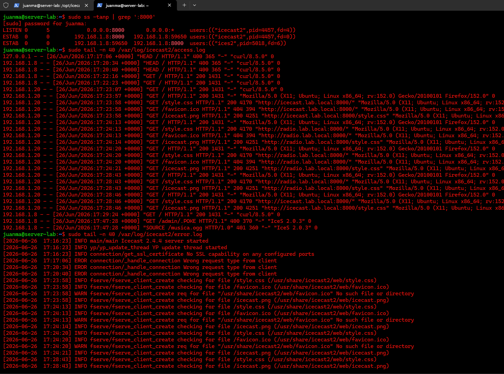

La salida muestra:

- Icecast2 escuchando en `0.0.0.0:8000`.
- Ices2 conectado como fuente al servidor.
- Cliente `192.168.1.20` accediendo al panel y al stream.
- Peticiones HTTP reales al mount `/musica.ogg`.

---

## 15. Problemas encontrados y solución

### Problema 1 - El servidor no resolvía `icecast.lab.local`

Icecast funcionaba en `127.0.0.1:8000`, pero `curl http://icecast.lab.local:8000` fallaba desde `server-lab`.

**Causa:** el servidor seguía usando el DNS de NAT/VirtualBox para algunas consultas.

**Solución:** configurar `systemd-resolved` para usar `127.0.0.1` como DNS principal.

---

### Problema 2 - `curl -I` devolvía `400 Bad Request`

`curl -I` usa petición `HEAD`, que no es la mejor prueba contra Icecast2.

**Solución:** usar `curl` normal o navegador:

```bash
curl http://icecast.lab.local:8000
```

---

### Problema 3 - Conversión repetida del audio

Tras descargar el audio en OGG, se intentó convertir de nuevo con FFmpeg usando el mismo patrón de entrada y salida.

**Causa:** FFmpeg no puede editar el archivo de salida sobre sí mismo.

**Solución:** verificar primero si `audio-libre.ogg` ya existe y no repetir la conversión si el formato es correcto.

---

### Problema 4 - Exposición de contraseñas en capturas

Durante la edición de `icecast.xml` aparecieron contraseñas en pantalla.

**Solución:** no incluir esas capturas sin redacción en GitHub/PDF. En la documentación se usan placeholders.

---

## 16. Conclusión

El laboratorio se completó correctamente. Se desplegó un servidor de streaming de audio en red local utilizando una base profesional con DNS, DHCP y DDNS.

Resultado final:

```text
Icecast2 funcionando en icecast.lab.local:8000
Alias radio.lab.local funcionando
Ices2 enviando audio a /musica.ogg
Audio OGG reproducido desde cliente-ubuntu
Panel de Icecast mostrando mount activo
Logs y conexiones validados
```

Este laboratorio funciona como una base para futuros servicios multimedia. Icecast2 es adecuado para crear radios online o canales de audio continuos. Para una experiencia más parecida a Spotify, con biblioteca musical, búsquedas, usuarios y reproducción bajo demanda, sería más adecuado desplegar un servicio como Navidrome o Jellyfin en un laboratorio posterior.
