# Ubuntu Server como base de laboratorio + NGINX RTMP + FFmpeg

## Descripción

Esta práctica documenta la creación de un servidor Ubuntu preparado como base de laboratorio en VirtualBox y su posterior uso como servidor de streaming RTMP con NGINX, FFmpeg y VLC.

El objetivo principal es disponer de una infraestructura reutilizable para futuras prácticas de servicios de red, servidores web, DNS, DHCP, multimedia y administración remota.

## Topología del laboratorio

```text
Windows anfitrión
    |
    | SSH / administración
    |
server-lab - Ubuntu Server
    ├── enp0s3: NAT              -> salida a Internet
    ├── enp0s8: Red interna      -> 192.168.1.8/24
    └── enp0s9: Solo anfitrión   -> 192.168.56.10/24

cliente-ubuntu - Ubuntu Desktop
    └── Red interna              -> DHCP desde server-lab
```

Tabla final de red:

| Equipo | Interfaz | IP | Función |
|---|---:|---:|---|
| Windows anfitrión | VirtualBox Host-Only | `192.168.56.1` | Administración del servidor |
| `server-lab` | `enp0s3` | `10.0.2.15/24` | NAT / Internet |
| `server-lab` | `enp0s8` | `192.168.1.8/24` | Red interna, gateway, DNS, DHCP, RTMP |
| `server-lab` | `enp0s9` | `192.168.56.10/24` | SSH desde Windows |
| `cliente-ubuntu` | `enp0s3` | `192.168.1.20/24` | Cliente de pruebas |

## 1. Activación del reenvío IPv4

Para que el servidor pueda actuar como puerta de enlace entre la red interna y la interfaz NAT, se habilitó el reenvío IPv4.

Archivo editado:

```bash
sudo nano /etc/sysctl.conf
```

Línea activada:

```ini
net.ipv4.ip_forward=1
```

Aplicación de cambios:

```bash
sudo sysctl -p
cat /proc/sys/net/ipv4/ip_forward
```

El valor `1` confirma que el reenvío IPv4 está activo.

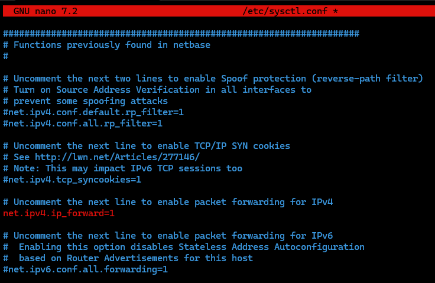

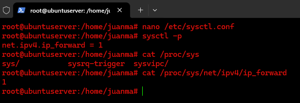

## 2. NAT con iptables

Se configuró NAT para que los clientes de la red interna `192.168.1.0/24` puedan salir a Internet utilizando la interfaz NAT del servidor (`enp0s3`).

```bash
sudo apt install iptables-persistent -y

sudo iptables -t nat -A POSTROUTING -s 192.168.1.0/24 -o enp0s3 -j MASQUERADE
sudo iptables -A FORWARD -i enp0s8 -o enp0s3 -j ACCEPT
sudo iptables -A FORWARD -i enp0s3 -o enp0s8 -m state --state RELATED,ESTABLISHED -j ACCEPT

sudo netfilter-persistent save
sudo netfilter-persistent reload
```

Comprobación:

```bash
sudo iptables -t nat -L -n -v
sudo iptables -L FORWARD -n -v
```

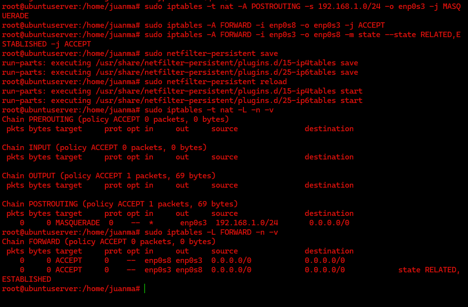

## 3. Prueba inicial del cliente con IP manual

Antes de activar DHCP, se configuró temporalmente el cliente Ubuntu con IP manual para validar conectividad.

Configuración inicial:

```text
IP:       192.168.1.20
Máscara:  255.255.255.0
Gateway:  192.168.1.8
DNS:      1.1.1.1
```

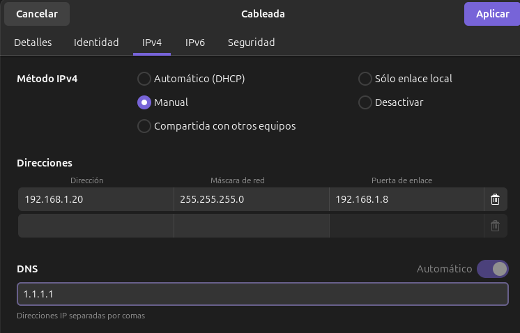

Pruebas realizadas desde `cliente-ubuntu`:

```bash
ping -c 4 192.168.1.8
ping -c 4 8.8.8.8
ping -c 4 google.com
```

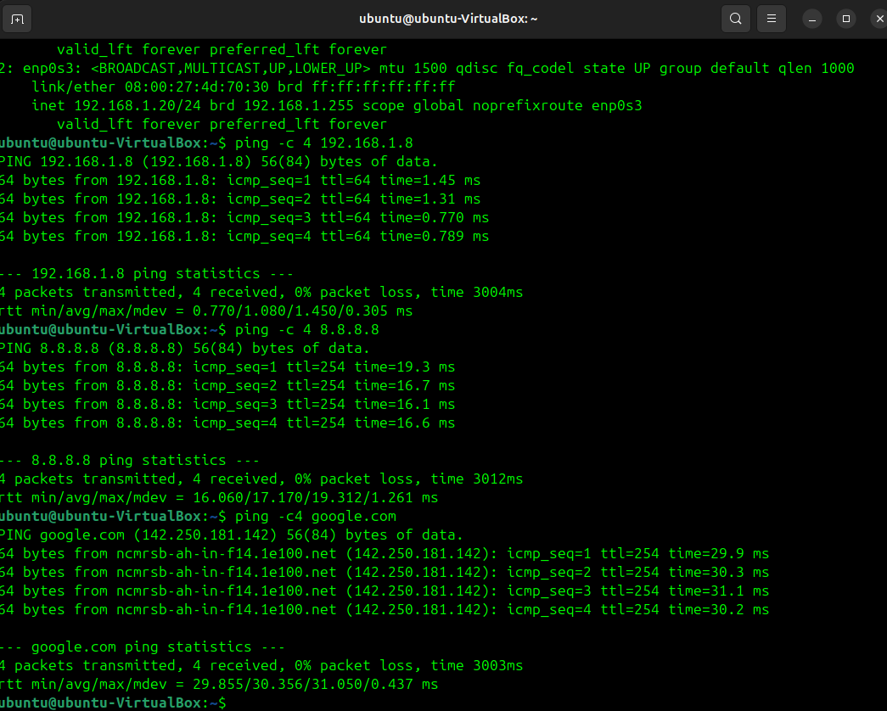

También se verificó la comunicación desde el servidor hacia el cliente y la tabla de rutas del servidor.

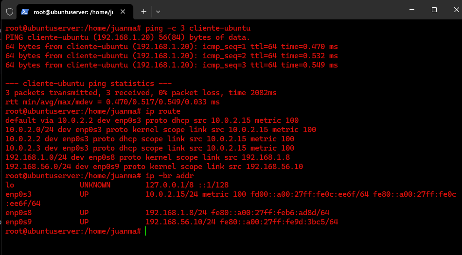

## 4. DHCP y DNS local con dnsmasq

Se instaló `dnsmasq` para ofrecer DHCP y DNS a la red interna.

```bash
sudo apt update
sudo apt install dnsmasq -y
sudo cp /etc/dnsmasq.conf /etc/dnsmasq.conf.bak
sudo nano /etc/dnsmasq.conf
```

Configuración final utilizada:

```ini
# ==============================
# DNSMASQ - DHCP + DNS LOCAL
# server-lab
# Laboratorio VirtualBox
# ==============================

interface=enp0s8
bind-interfaces

no-hosts

domain=lab.local
local=/lab.local/
expand-hosts
domain-needed
bogus-priv

listen-address=127.0.0.1
listen-address=192.168.1.8

dhcp-authoritative
dhcp-range=192.168.1.50,192.168.1.150,255.255.255.0,12h

dhcp-option=option:router,192.168.1.8
dhcp-option=option:dns-server,192.168.1.8
dhcp-option=option:domain-search,lab.local

# Sustituir la MAC por la MAC real del cliente si se reutiliza esta práctica.
dhcp-host=08:00:27:XX:XX:XX,cliente-ubuntu,192.168.1.20,12h

address=/server-lab.lab.local/192.168.1.8
address=/server-lab/192.168.1.8

address=/cliente-ubuntu.lab.local/192.168.1.20
address=/cliente-ubuntu/192.168.1.20

address=/media.lab.local/192.168.1.8
address=/media/192.168.1.8

server=1.1.1.1
server=8.8.8.8

log-queries
log-dhcp
```

Reinicio y comprobación del servicio:

```bash
sudo systemctl restart dnsmasq
sudo systemctl enable dnsmasq
sudo systemctl status dnsmasq
sudo ss -tulnp | grep dnsmasq
```

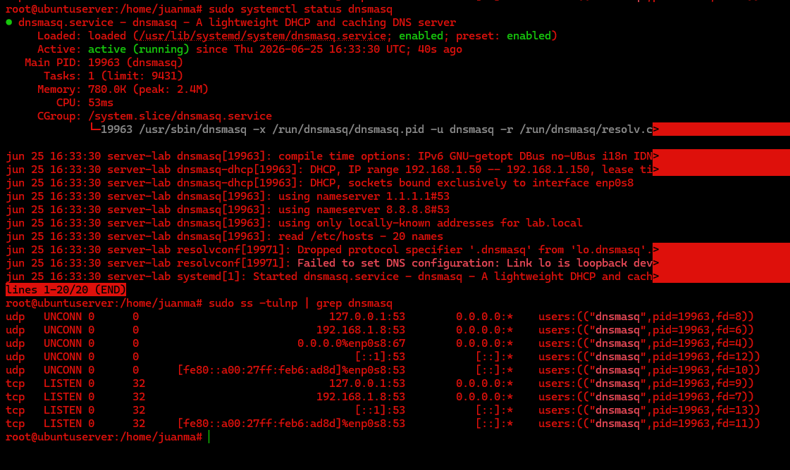

Capturas de la configuración final:

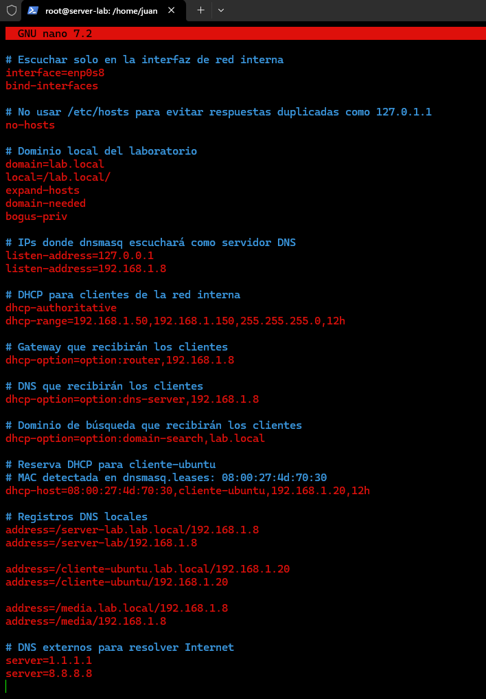

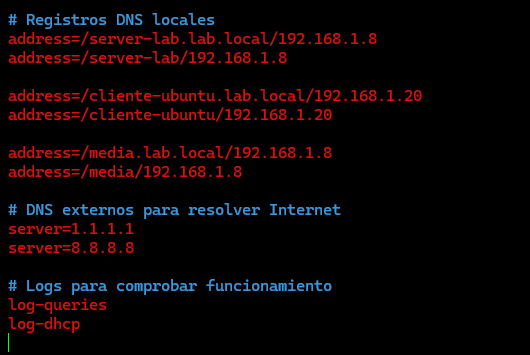

## 5. Cliente por DHCP y DNS local

Tras cambiar el cliente a DHCP, recibió la reserva `192.168.1.20`, el gateway `192.168.1.8`, el DNS `192.168.1.8` y el dominio `lab.local`.

Comandos de validación en `cliente-ubuntu`:

```bash
ip -br addr
ip route
resolvectl status
resolvectl query server-lab.lab.local
resolvectl query cliente-ubuntu.lab.local
resolvectl query media.lab.local
ping -c 3 google.com
```

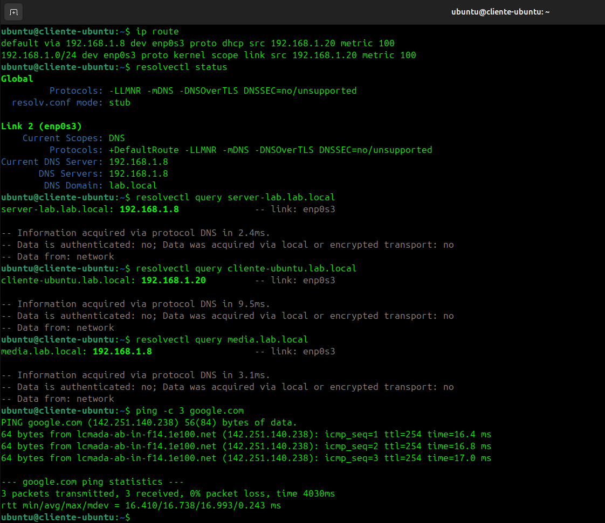

En el servidor se comprobó la concesión DHCP y la resolución DNS local.

```bash
sudo cat /var/lib/misc/dnsmasq.leases

dig @192.168.1.8 server-lab.lab.local
dig @192.168.1.8 cliente-ubuntu.lab.local
dig @192.168.1.8 media.lab.local

sudo journalctl -u dnsmasq --no-pager | tail -n 40
```

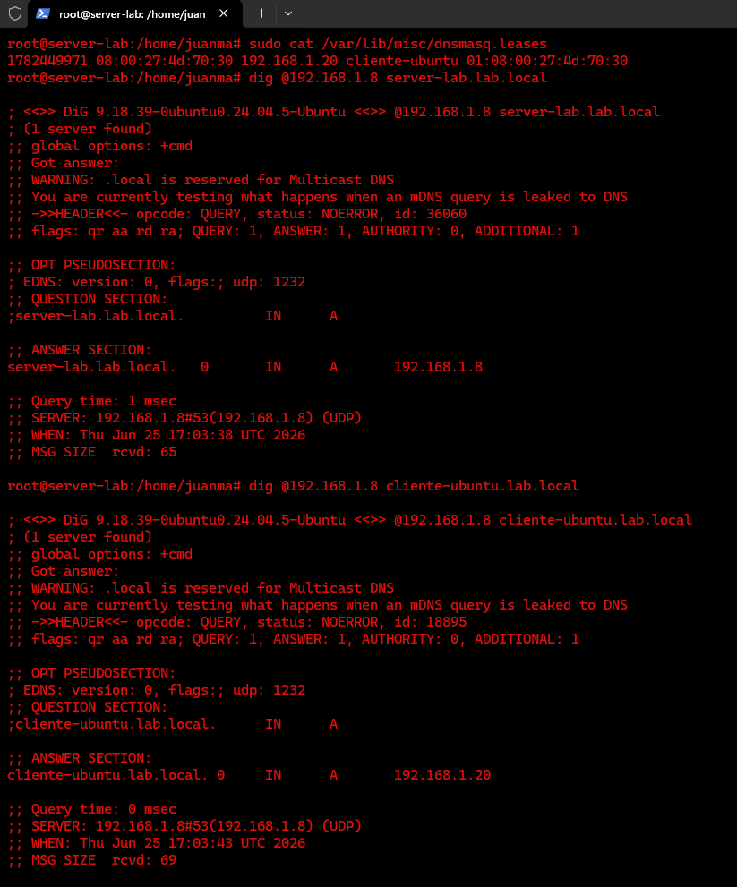

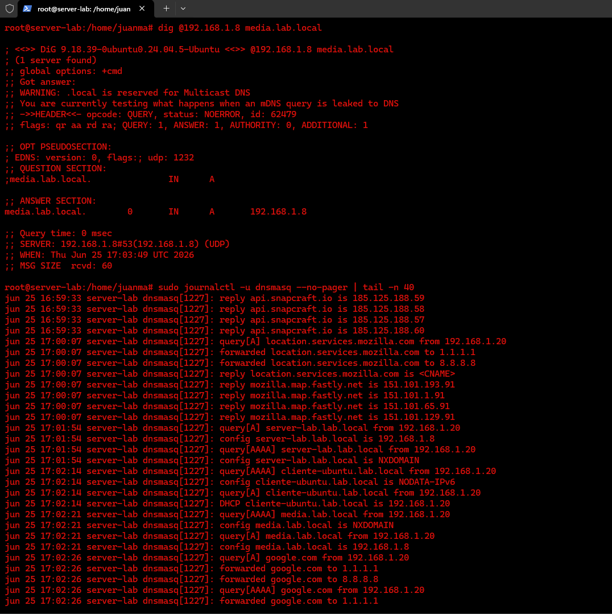

## 6. Prueba de gateway desde el cliente

Para verificar que el tráfico del cliente salía a Internet a través de `server-lab`, se utilizó `traceroute`.

```bash
traceroute google.com
```

El primer salto fue `server-lab (192.168.1.8)`, confirmando que el cliente utiliza el servidor como gateway.

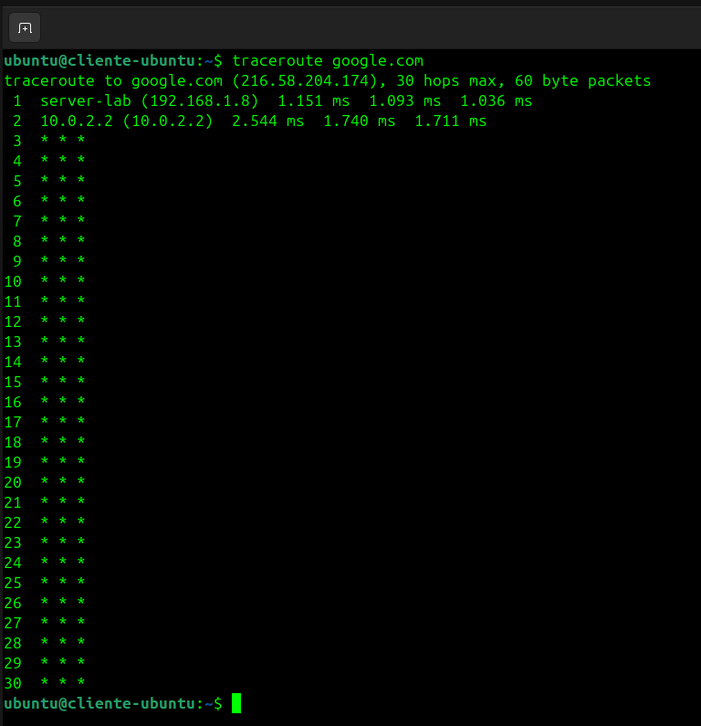

## 7. Instalación de NGINX, RTMP y FFmpeg

Sobre la base ya preparada se instaló NGINX, el módulo RTMP y FFmpeg.

```bash
sudo apt update
sudo apt install nginx libnginx-mod-rtmp ffmpeg -y
```

Comprobaciones:

```bash
sudo systemctl status nginx
ffmpeg -version
ls -l /usr/lib/nginx/modules/ | grep rtmp
```

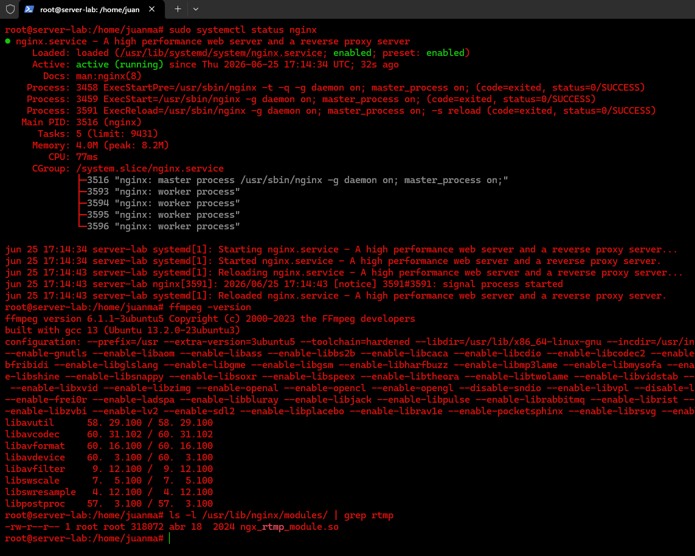

## 8. Configuración RTMP en NGINX

Se editó el archivo principal de NGINX:

```bash
sudo nano /etc/nginx/nginx.conf
```

Bloque añadido al final del archivo, fuera del bloque `http {}`:

```nginx
rtmp {
    server {
        listen 1935;
        chunk_size 4096;

        allow publish 127.0.0.1;
        allow publish 192.168.1.8;
        deny publish all;

        application live {
            live on;
            record off;
        }
    }
}
```

Validación y reinicio:

```bash
sudo nginx -t
sudo systemctl restart nginx
sudo ss -tulnp | grep 1935
sudo systemctl status nginx
```

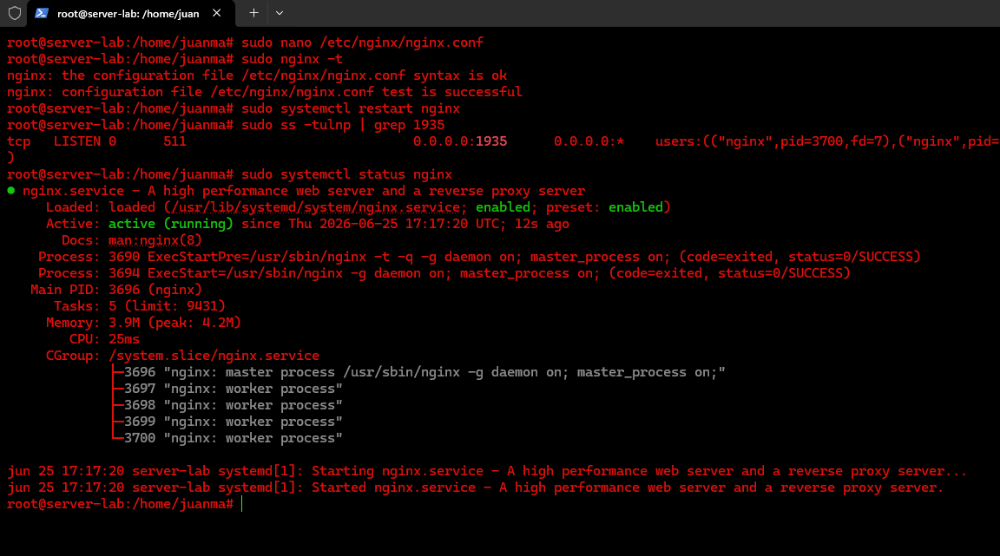

## 9. Pruebas HTTP y RTMP desde el cliente

Se permitió el tráfico HTTP y RTMP en `ufw`.

```bash
sudo ufw allow 1935/tcp
sudo ufw allow 80/tcp
sudo ufw status
```

Prueba HTTP local en el servidor:

```bash
curl -I http://localhost
```

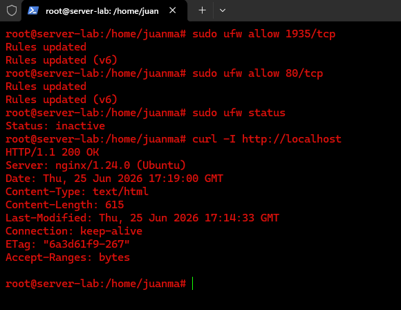

Desde `cliente-ubuntu` se comprobó que `media.lab.local` resolvía correctamente y que el puerto RTMP estaba abierto.

```bash
nc -vz media.lab.local 1935
curl -I http://media.lab.local
```

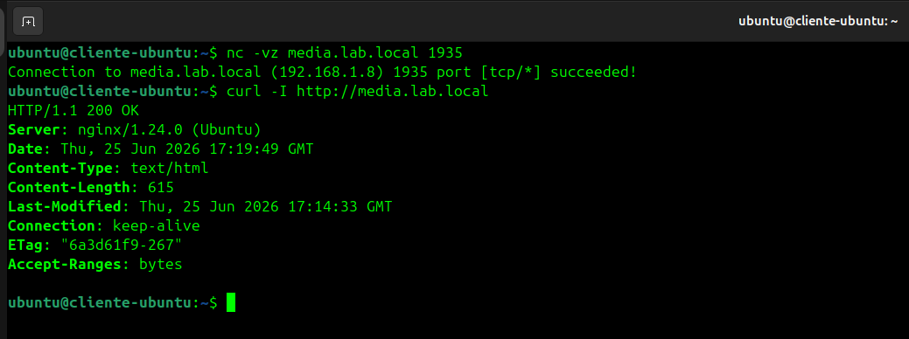

## 10. Emisión RTMP con vídeo de prueba generado

Primero se creó un vídeo de prueba con FFmpeg.

```bash
mkdir -p ~/rtmp-lab
cd ~/rtmp-lab

ffmpeg -f lavfi -i testsrc=size=1280x720:rate=30 \
-f lavfi -i sine=frequency=1000:sample_rate=44100 \
-t 30 \
-c:v libx264 -pix_fmt yuv420p \
-c:a aac \
video-prueba.mp4
```

Emisión del vídeo al servidor RTMP:

```bash
ffmpeg -re -stream_loop -1 -i ~/rtmp-lab/video-prueba.mp4 \
-c:v copy -c:a aac -ar 44100 -f flv \
rtmp://127.0.0.1/live/stream
```

Desde VLC en `cliente-ubuntu` se accedió al stream mediante IP directa:

```text
rtmp://192.168.1.8/live/stream
```

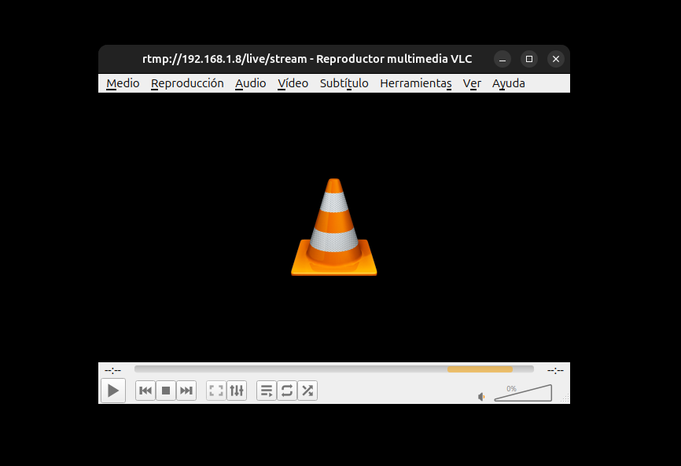

En el servidor se verificó la emisión con FFmpeg y las conexiones activas al puerto `1935`.

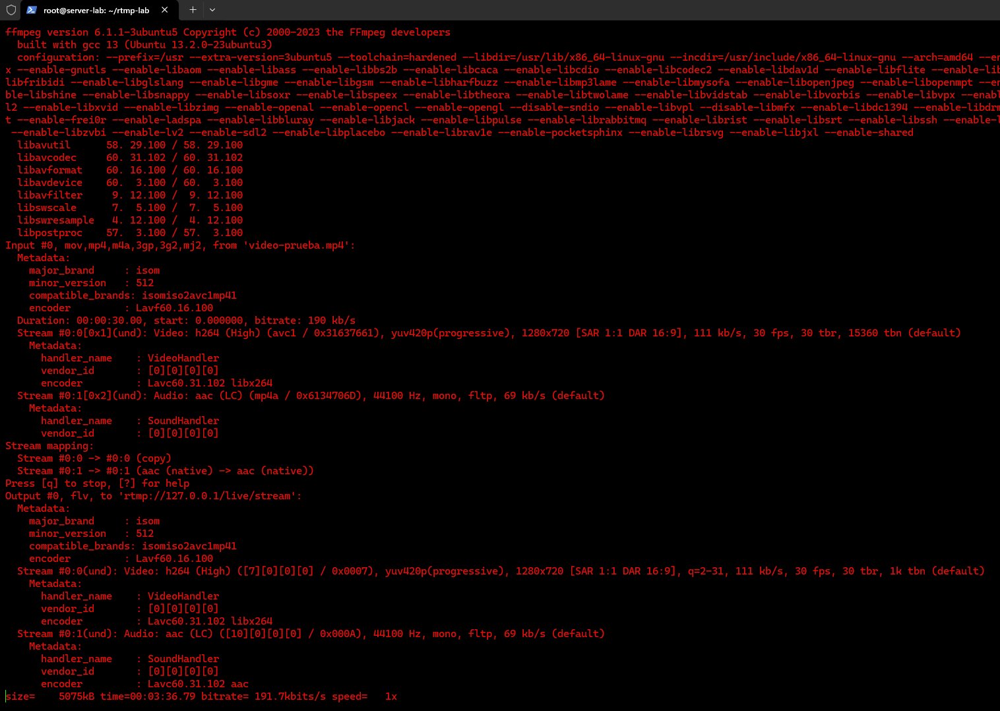

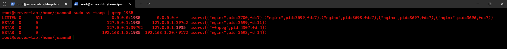

## 11. Emisión RTMP con vídeo libre descargado

Para realizar una prueba más realista se descargó un vídeo libre de prueba con `yt-dlp` desde Archive.org.

Instalación de `yt-dlp`:

```bash
sudo apt install python3-pip -y
python3 -m pip install -U yt-dlp --break-system-packages
```

Descarga del vídeo:

```bash
cd ~/rtmp-lab
yt-dlp "https://archive.org/details/BigBuckBunny_328" -o "video-youtube-libre.%(ext)s"
```

Durante la práctica apareció un error de Bash al no entrecomillar la plantilla de salida `%(ext)s`. La solución fue usar comillas:

```bash
-o "video-youtube-libre.%(ext)s"
```

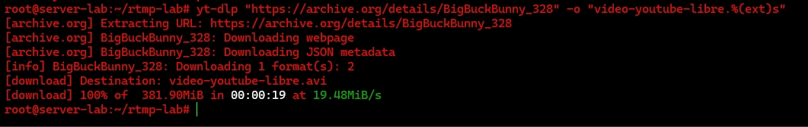

El vídeo se convirtió a MP4 para mejorar la compatibilidad con RTMP:

```bash
ffmpeg -i video-youtube-libre.avi \
-c:v libx264 -pix_fmt yuv420p \
-c:a aac \
video-youtube-libre.mp4
```

Emisión final:

```bash
ffmpeg -re -stream_loop -1 -i video-youtube-libre.mp4 \
-c:v libx264 -preset veryfast -tune zerolatency -pix_fmt yuv420p \
-c:a aac -ar 44100 -b:a 128k \
-f flv rtmp://127.0.0.1/live/stream
```

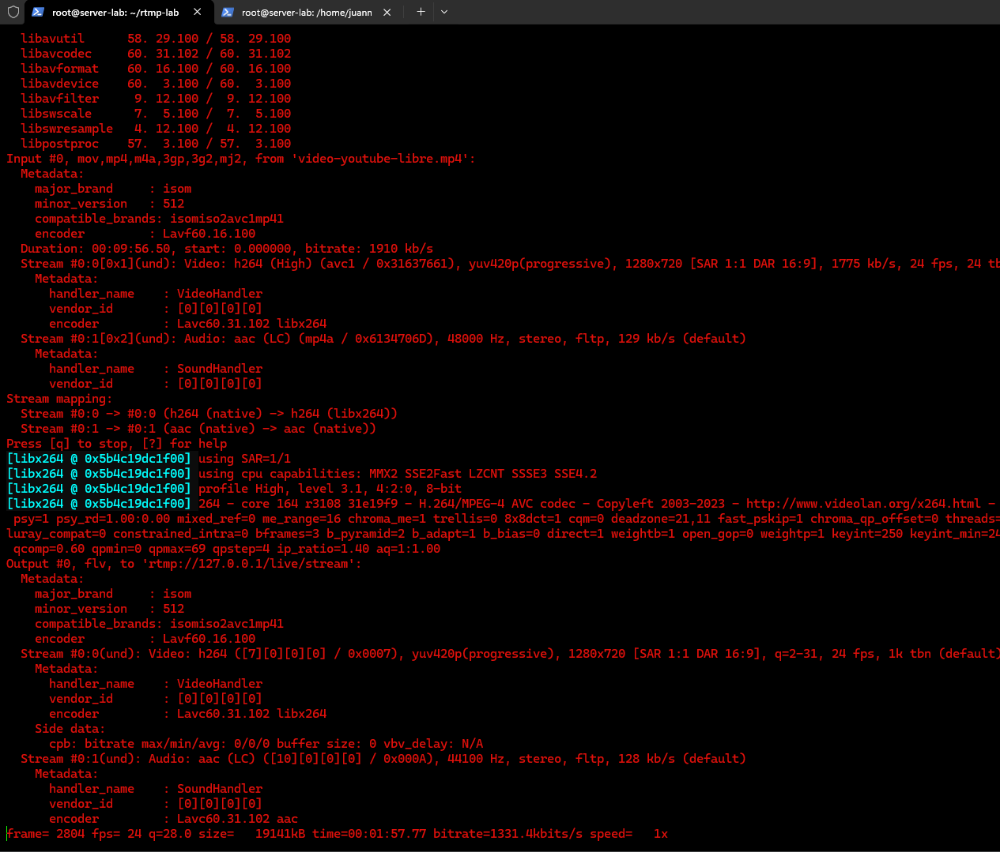

Comprobación de conexiones RTMP:

```bash
sudo ss -tanp | grep 1935
```

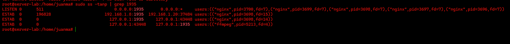

## 12. Reproducción desde VLC usando DNS local

Desde `cliente-ubuntu`, se abrió VLC usando el nombre DNS local:

```bash
vlc --network-caching=1000 rtmp://media.lab.local/live/stream
```

El vídeo se reprodujo correctamente desde la URL RTMP local.

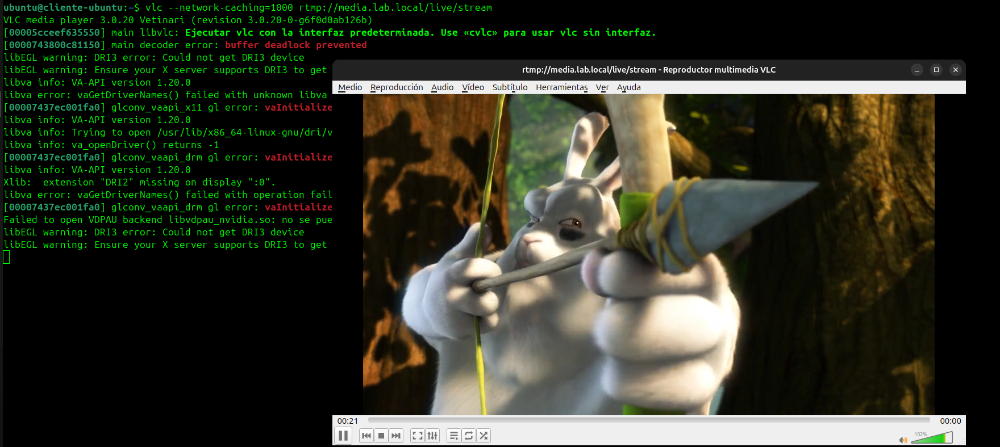

## Problemas encontrados y soluciones

### Adaptador Host-Only incorrecto

El acceso SSH desde Windows fallaba porque la VM estaba conectada a un adaptador Host-Only diferente. Se corrigió seleccionando el adaptador `VirtualBox Host-Only Ethernet Adapter` correspondiente a la red `192.168.56.0/24`.

### Cliente inicialmente con DNS externo

El cliente resolvía Internet, pero no los nombres `lab.local`, porque todavía usaba `1.1.1.1` como DNS. Se corrigió pasando la interfaz a DHCP y entregando `192.168.1.8` como DNS desde `dnsmasq`.

### Repositorio de Ubuntu con errores 404

Al instalar VLC aparecieron errores `404 Not Found` desde `es.archive.ubuntu.com`. Se corrigió actualizando listas de paquetes y cambiando temporalmente el mirror si era necesario.

### VLC mostraba solo el cono inicialmente

VLC conectaba al flujo RTMP, pero en un primer intento mostraba solo el cono. Al abrir el stream desde terminal con `--network-caching=1000`, el vídeo se reprodujo correctamente.

Los avisos gráficos de VirtualBox relacionados con `DRI3`, `VA-API` o `libEGL` no afectaron a la reproducción final.

## Conclusión

Se ha construido una base de laboratorio funcional en VirtualBox con Ubuntu Server actuando como gateway, servidor DHCP, servidor DNS local y servidor de streaming RTMP.

La práctica permite reutilizar `server-lab` como base para futuros servicios internos y valida un flujo completo:

```text
FFmpeg -> NGINX RTMP -> red interna -> VLC cliente
```

URL final validada:

```text
rtmp://media.lab.local/live/stream
```

## Aviso

Esta práctica se realizó en un entorno local y controlado de laboratorio. Para emitir contenido multimedia deben utilizarse vídeos propios, libres o con permiso explícito de uso.
