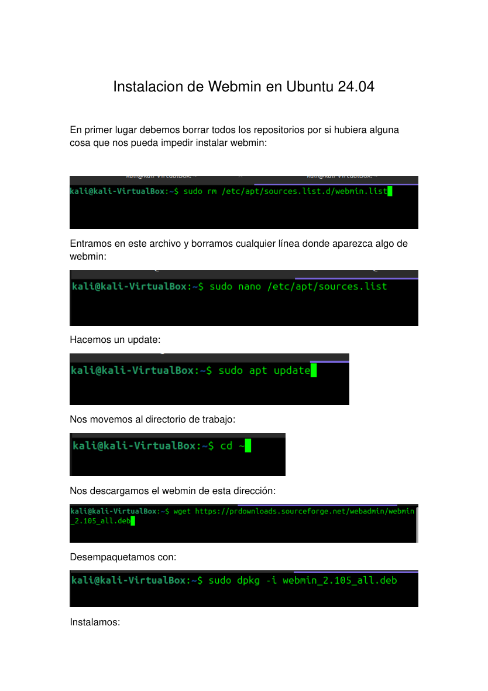
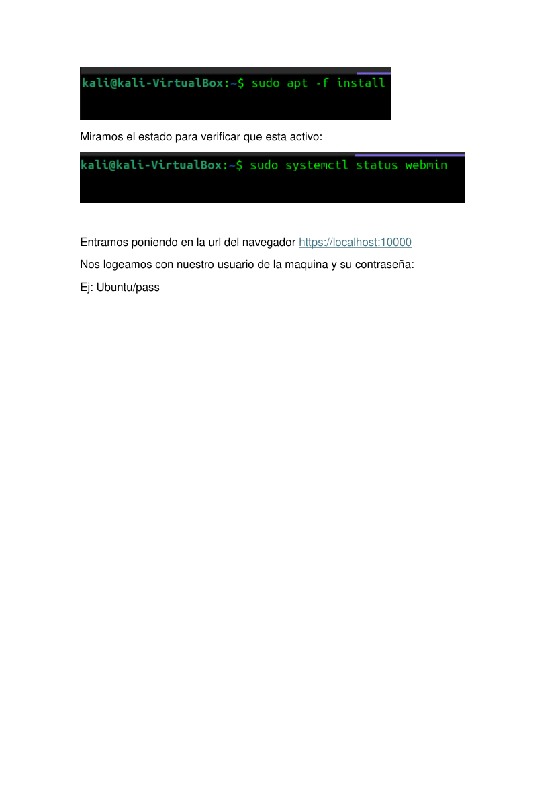

# Ubuntu - Instalación de Webmin para administración web

**Autor:** Nammu  
**Entorno:** laboratorio local controlado  
**Categoría:** Servicios de Internet / Administración / Webmin

## Objetivo

Instalar Webmin en Ubuntu 24.04 para administrar el servidor desde una interfaz web HTTPS en el puerto 10000, verificando servicio, acceso y buenas prácticas básicas.

## Limpieza previa

Antes de instalar, se revisan repositorios previos de Webmin para evitar conflictos:

```bash
sudo rm -f /etc/apt/sources.list.d/webmin.list
sudo apt update
```

## Instalación desde paquete `.deb`

```bash
cd /tmp
wget https://prdownloads.sourceforge.net/webadmin/webmin_2.105_all.deb
sudo dpkg -i webmin_2.105_all.deb
sudo apt -f install -y
```

## Validación del servicio

```bash
sudo systemctl status webmin
sudo ss -tulnp | grep ':10000'
```

## Acceso web

Desde navegador:

```text
https://localhost:10000
```

o desde otro equipo autorizado de la red:

```text
https://<IP_DEL_SERVIDOR>:10000
```

Webmin usa usuarios del sistema. No se deben documentar contraseñas reales.

## Firewall

Si UFW está activo:

```bash
sudo ufw allow 10000/tcp
sudo ufw reload
sudo ufw status
```

## Buenas prácticas

- Usar HTTPS.
- Limitar acceso por red o firewall.
- No publicar el puerto 10000 hacia Internet sin protección adicional.
- Usar contraseñas fuertes y, si aplica, 2FA.
- Mantener Webmin actualizado.

## Verificación final

```bash
systemctl is-active webmin
curl -k -I https://localhost:10000
```

## Evidencias visuales




