# Windows CMD - Práctica global de niveles 1, 2 y 3

## Descripción

Actividad global de reconocimiento y análisis básico del equipo desde CMD integrando comandos de los tres niveles trabajados.

## Tecnologías / comandos trabajados

- Windows 11
- CMD
- systeminfo
- ipconfig
- netstat
- tasklist
- tree
- findstr

## Contexto

Laboratorio realizado en entorno controlado como parte del bloque de Seguridad Informática IFCT0109. El contenido se ha normalizado para GitHub, eliminando referencias personales innecesarias y manteniendo las evidencias visuales del trabajo realizado.

## Procedimiento y evidencias

### Ejercicio 4: Consola CMD

Integración de comandos de Nivel 1, Nivel 2 y Nivel 3

#### Objetivo de la práctica

En esta práctica vais a poner en uso comandos de los tres niveles trabajados en CMD.

Esta práctica está planteada como una actividad global de reconocimiento y análisis básico del equipo desde CMD, usando comandos reales de trabajo técnico.

Ayudante

Tenéis el ayudante: <enlace_al_asistente>

Forma de entrega

Debéis entregar un documento con:

el comando utilizado en cada apartado

una captura de pantalla donde se vea claramente el resultado

una breve explicación de lo que habéis obtenido

Importante

La captura debe verse completa o lo suficientemente clara.

No vale solo escribir el comando: hay que mostrar el resultado.

Si en algún ejercicio aparece información diferente según el equipo, no pasa nada. Lo importante es que sepáis localizarla e interpretarla.

Estas normas de entrega se aplican a toda la práctica. No hace falta repetirlas en cada ejercicio.

PARTE 1 · Primer reconocimiento del equipo (Nivel 1)

Objetivo de esta parte

En esta parte debéis trabajar al menos 10 comandos del Nivel 1 para realizar un reconocimiento básico del equipo y moveros con soltura en CMD.

Comandos mínimos que deben aparecer en esta parte

cls

date

time

help

comando /?

cd

dir

tree

mkdir

rmdir

type

copy

hostname

ver

systeminfo

ipconfig

ping

1. Limpiar la consola y consultar fecha y hora

#### Tarea

Limpia la consola.

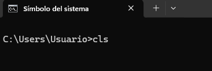

Muestra la fecha del sistema.

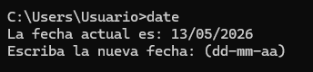

Muestra la hora del sistema.

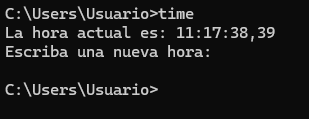

#### Debes entregar

captura del comando para limpiar la consola

captura donde se vea la fecha

captura donde se vea la hora

breve explicación de para qué sirve cada uno

2. Consultar ayuda básica

#### Tarea

Muestra la ayuda del comando ping.

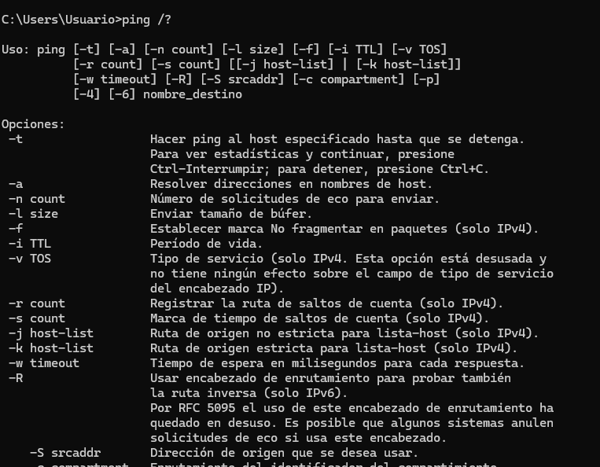

Muestra la ayuda del comando dir usando /?.

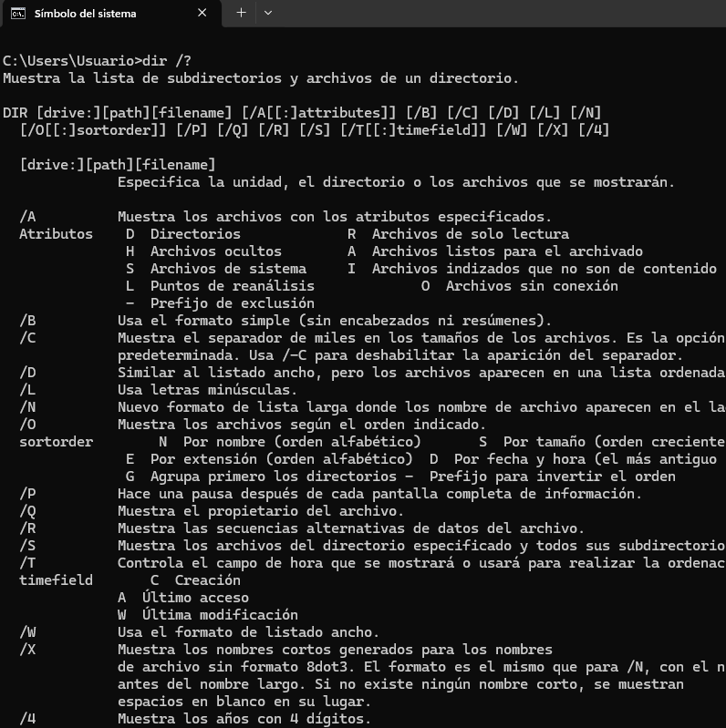

Explica qué utilidad tiene consultar la ayuda antes de ejecutar un comando desconocido.

Consultar que parámetros tiene y como podemos conseguir la información que necesitamos.

3. Comprobar carpeta actual y moverse por el sistema

#### Tarea

Muestra la carpeta actual.

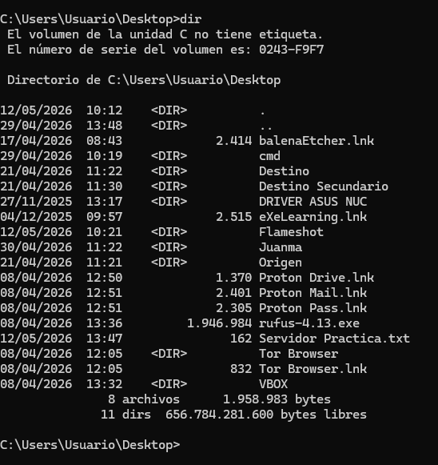

Entra en una carpeta de tu perfil de usuario.

Sube un nivel.

Entra en C:\Windows.

Vuelve a una carpeta de trabajo.

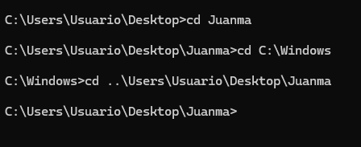

Explica qué hace cd y qué significa cambiar de ruta.

Es poder moverte entre carpetas y cambiar de ruta es entrar en las carpetas padres y sus respectivos subdirectorios

4. Listar y visualizar estructura de carpetas

#### Tarea

Muestra el contenido de una carpeta con dir.

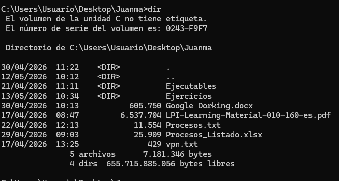

Repite con dir /b.

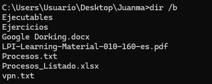

Repite con dir /p.

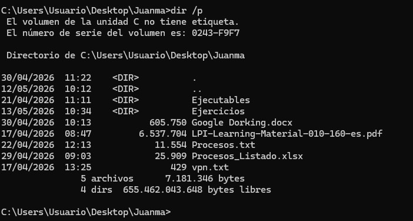

Muestra la estructura con tree.

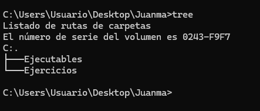

Repite con tree /f.

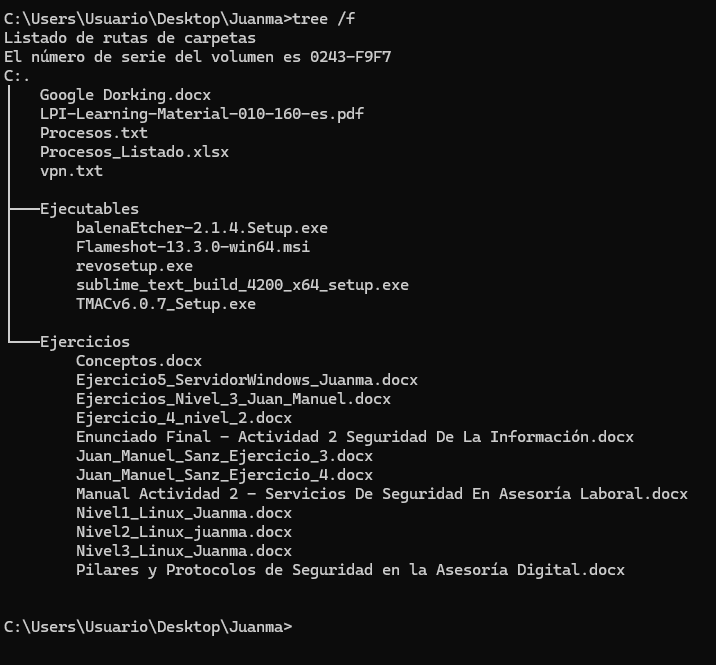

Compara brevemente dir y tree.

Tree te muestra el árbol de carpetas y subcarpetas a demás de los archivos, y dir sólo te muestra lo que contiene el directorio don de estas

5. Crear una estructura de carpetas para la práctica

#### Tarea

Crea la siguiente estructura:

PracticaCMD ├── Nivel1 ├── Nivel2 └── Nivel3

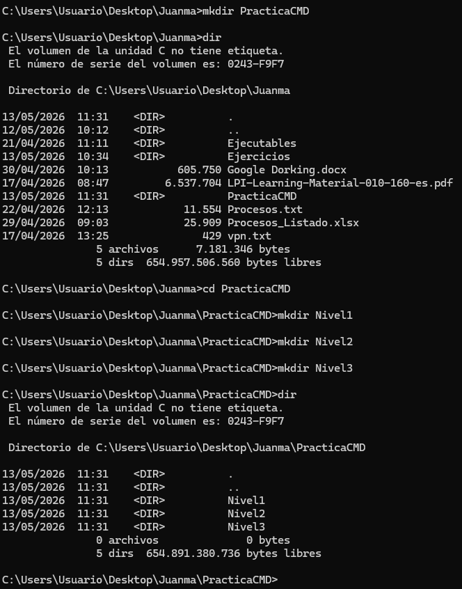

Después elimina una carpeta vacía de prueba y vuelve a crearla.

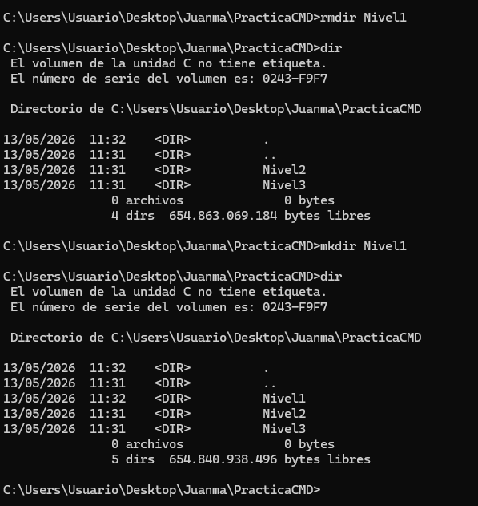

6. Crear y copiar un archivo de texto

#### Tarea

Crea un archivo de texto llamado datos.txt.

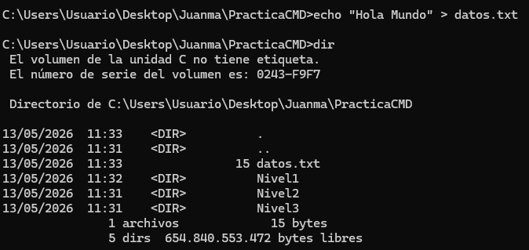

Muéstralo con type.

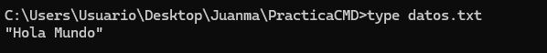

Haz una copia con otro nombre.

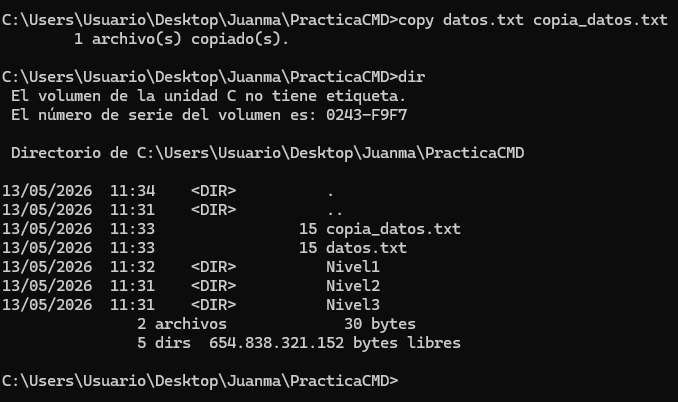

Copia ese archivo dentro de una de las carpetas creadas antes.

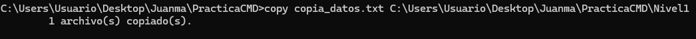

Comprueba con dir que existen ambos archivos.

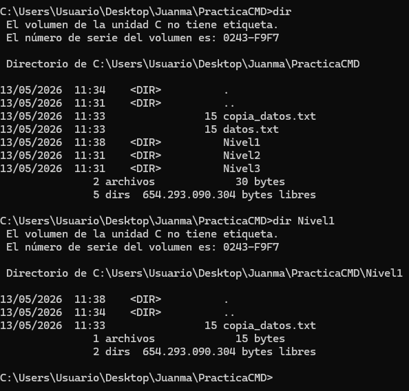

7. Consultar información del equipo

#### Tarea

Muestra el nombre del equipo.

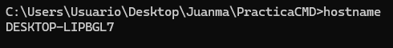

Muestra la versión de Windows.

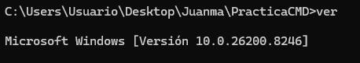

Ejecuta systeminfo.

Localiza en la salida:

sistema operativo

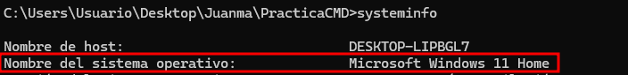

memoria RAM

fecha de instalación

grupo de trabajo o dominio

8. Consultar configuración de red y conectividad

#### Tarea

Ejecuta ipconfig.

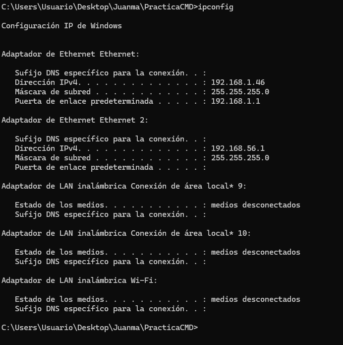

Ejecuta ipconfig /all.

Localiza:

IPv4

máscara de subred

puerta de enlace

DNS

Haz ping a:

la puerta de enlace

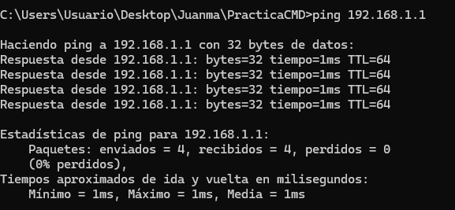

8.8.8.8

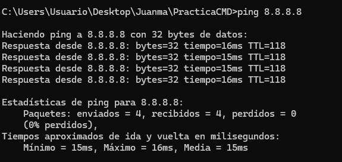

google.com

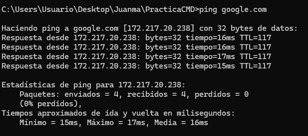

Explica qué comprueba cada uno de esos ping.

La conectividad entre las máquinas

PARTE 2 · Enumeración y análisis intermedio (Nivel 2)

Objetivo de esta parte

En esta parte debéis trabajar al menos 10 comandos del Nivel 2 para hacer una enumeración más técnica del sistema y de la red.

Comandos mínimos que deben aparecer en esta parte

whoami

whoami /all

whoami /groups

whoami /priv

getmac

getmac /v

arp -a

nslookup

tracert

pathping

tasklist

tasklist /v

taskkill

findstr

where

more

9. Consultar el usuario actual

#### Tarea

Muestra el usuario actual.

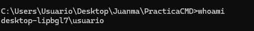

Muestra toda la información del usuario.

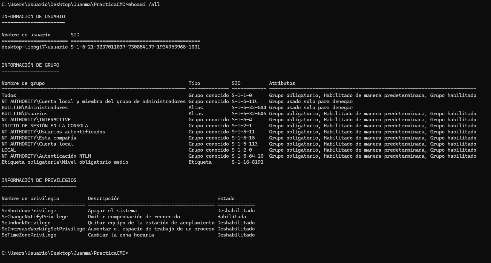

Consulta sus grupos.

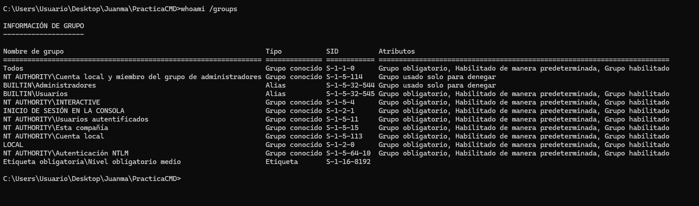

Consulta sus privilegios.

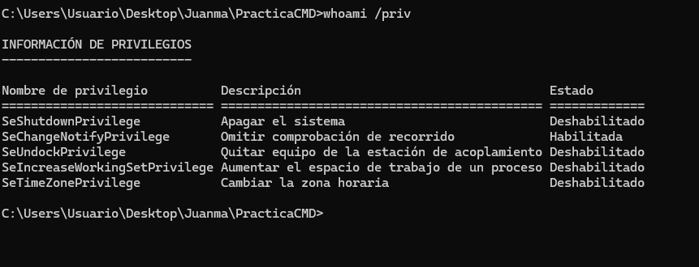

Explica qué información nueva aporta cada variante.

10. Consultar MAC y tabla ARP

#### Tarea

Ejecuta getmac.

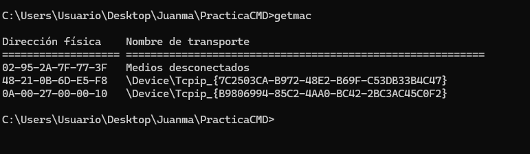

Ejecuta getmac /v.

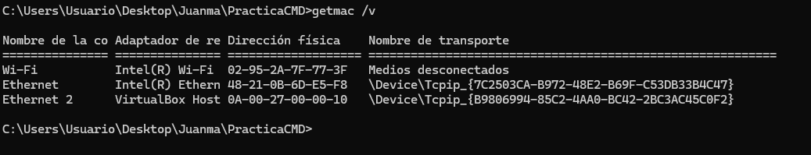

Ejecuta arp -a.

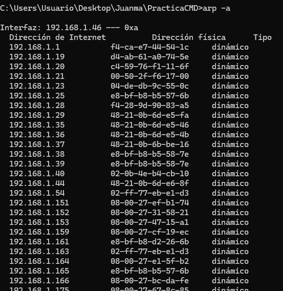

Localiza una IP y su MAC asociada.

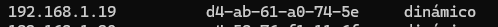

Explica brevemente la relación entre IP y MAC.

La mac es física y esta siempre asociada a una IP de la máquina

11. Resolver dominios y analizar rutas

#### Tarea

Ejecuta nslookup google.com.

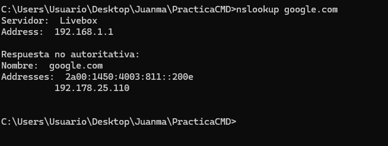

Ejecuta nslookup openai.com.

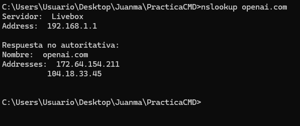

Ejecuta tracert google.com.

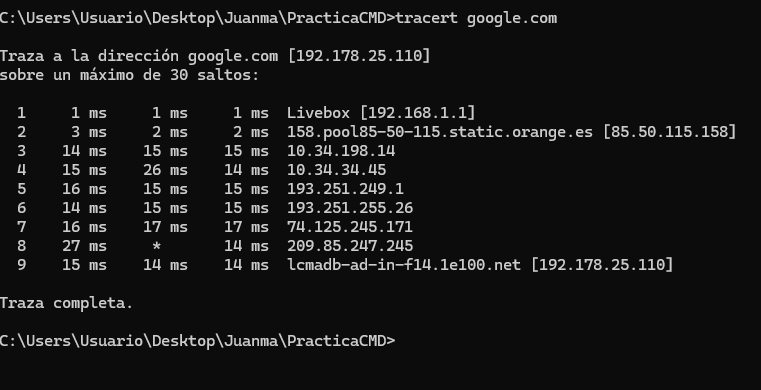

Ejecuta pathping google.com.

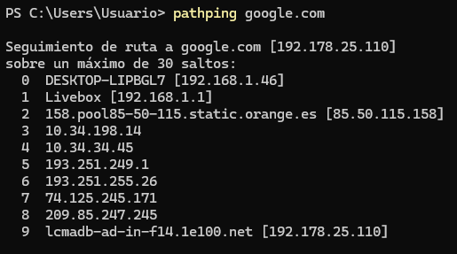

Explica qué diferencia hay entre ping, tracert y pathping.

12. Consultar procesos

#### Tarea

Ejecuta tasklist.

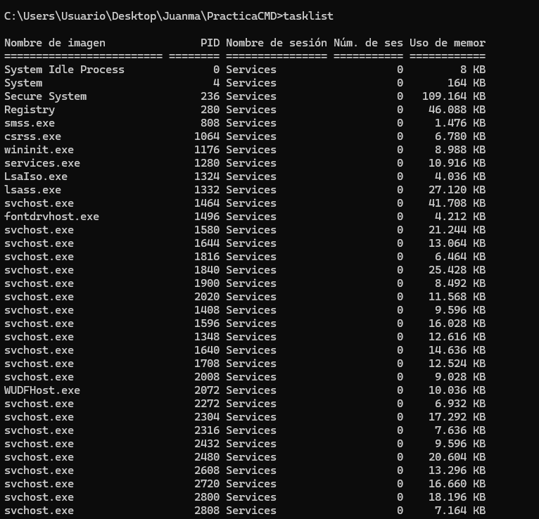

Ejecuta tasklist /v.

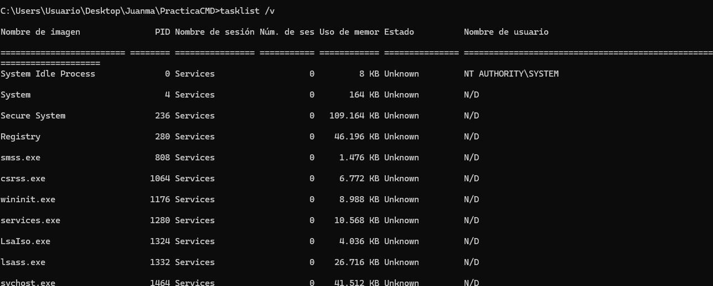

Localiza un proceso conocido y anota su PID.

Si el profesor lo indica, abre el Bloc de notas y ciérralo desde CMD con taskkill.

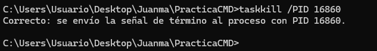

Explica cuándo usarías tasklist y cuándo taskkill.

Tasklist para ver los procesos que hay en el sistema y takkill para cerrar ese proceso

Importante

No cierres procesos del sistema.

13. Filtrar y localizar información

#### Tarea

Filtra archivos .txt con findstr.

Usa where para localizar notepad.

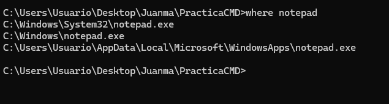

Usa more para paginar la salida de un comando largo.

Explica para qué sirve cada uno de esos comandos.

14. Búsqueda guiada de información en salidas

#### Tarea

Usa tasklist combinado con findstr para localizar un proceso concreto.

Usa dir combinado con findstr para localizar archivos de texto.

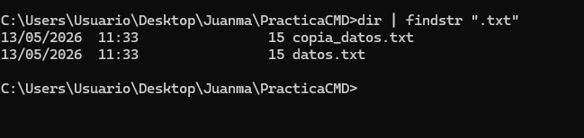

Usa un comando largo combinado con more.

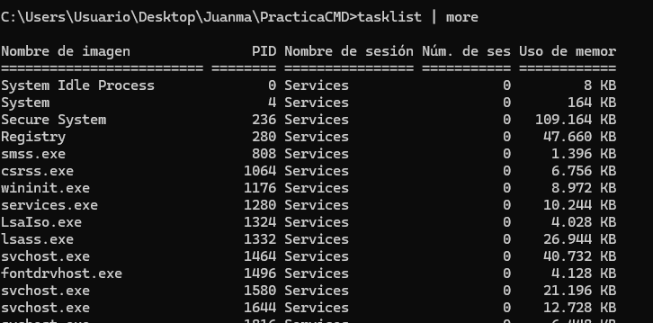

Explica qué ventaja tiene filtrar la salida.

Que puedes ver solo la información que necesitas y asi no llenas la consola de información y pierdes menos tiempo

PARTE 3 · Análisis técnico y administración (Nivel 3)

Objetivo de esta parte

En esta parte debéis trabajar al menos 10 comandos del Nivel 3 para consultar información más avanzada sobre conexiones, servicios, rutas, permisos, tareas y usuarios.

Comandos mínimos que deben aparecer en esta parte

netstat

netstat -a

netstat -ano

netsh interface show interface

netsh wlan show profiles

netsh advfirewall show allprofiles

route print

sc query

sc query state= all

schtasks /query

schtasks /query /v

icacls

attrib

fc

net user

15. Consultar conexiones y puertos

#### Tarea

Ejecuta netstat.

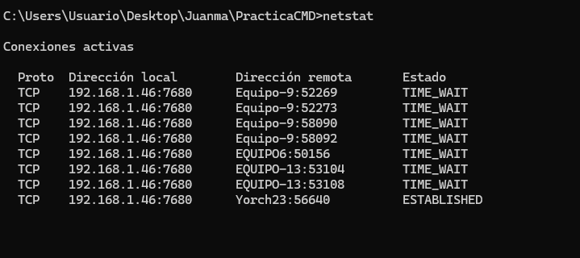

Ejecuta netstat -a.

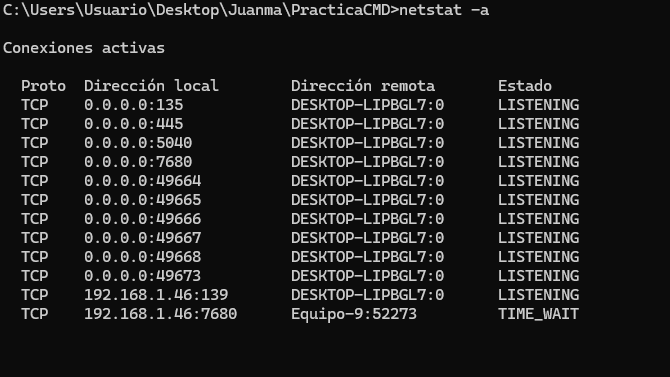

Ejecuta netstat -ano.

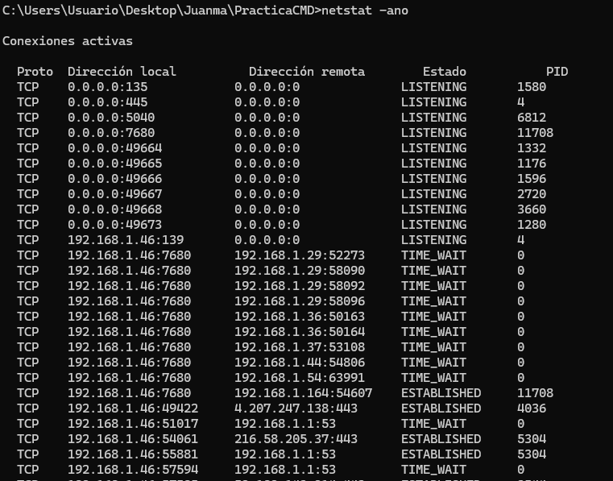

Localiza:

una conexión establecida

un puerto en escucha

un PID asociado

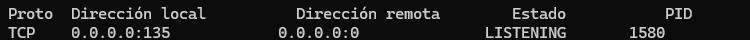

Explica qué diferencia observas entre las tres salidas.

16. Relacionar conexiones con procesos

#### Tarea

Toma un PID de netstat -ano.

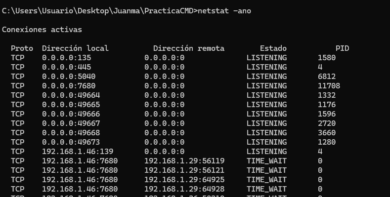

Busca el proceso correspondiente usando tasklist.

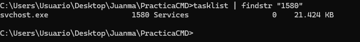

Relaciona conexión y proceso.

Explica la relación encontrada.

17. Consultar red avanzada

#### Tarea

Ejecuta netsh interface show interface.

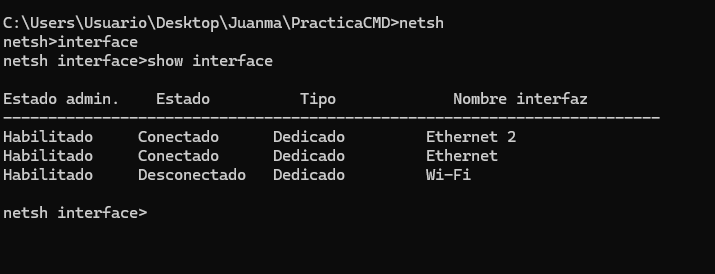

Ejecuta netsh wlan show profiles.

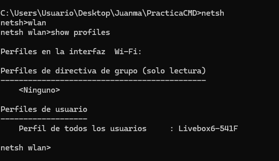

Ejecuta netsh advfirewall show allprofiles.

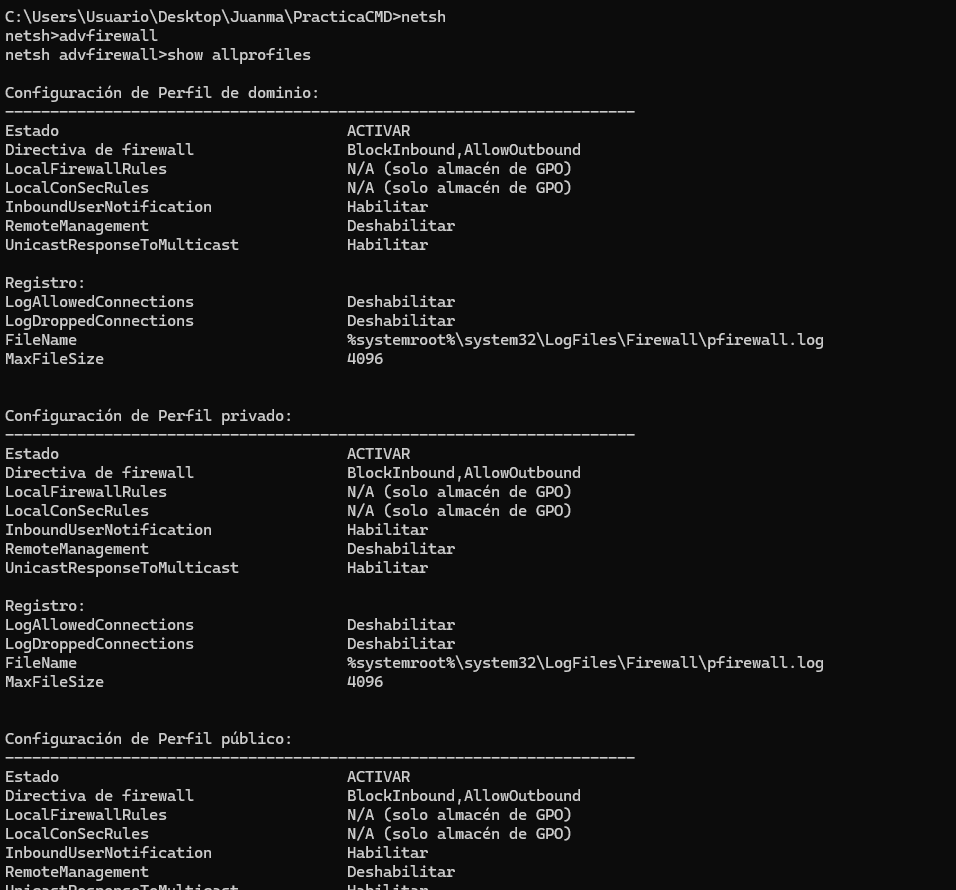

Ejecuta route print.

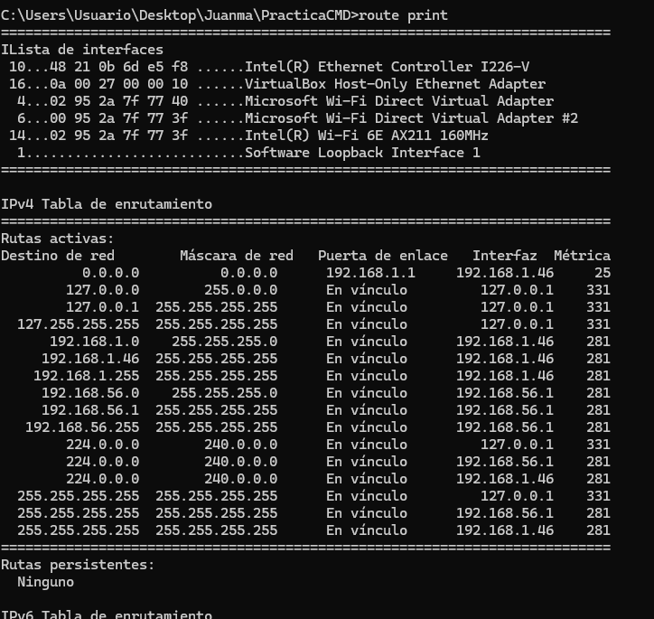

Explica qué información aporta cada uno.

18. Consultar servicios y tareas programadas

#### Tarea

Ejecuta sc query.

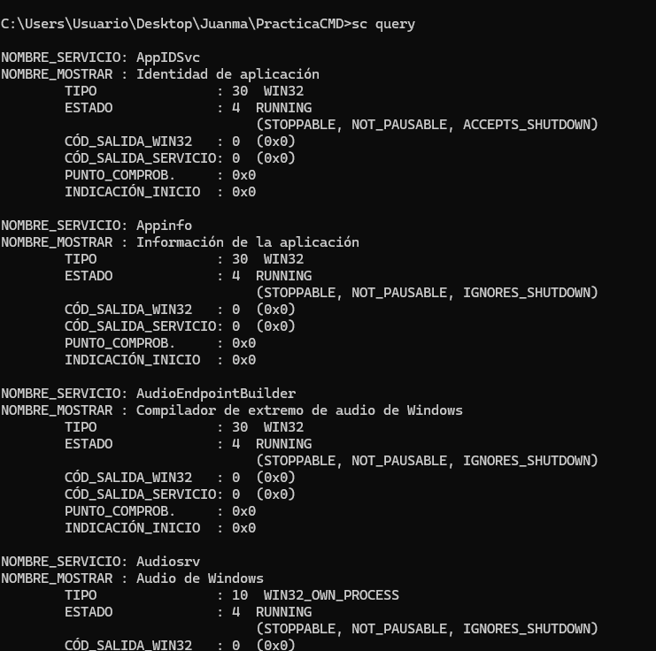

Ejecuta sc query state= all.

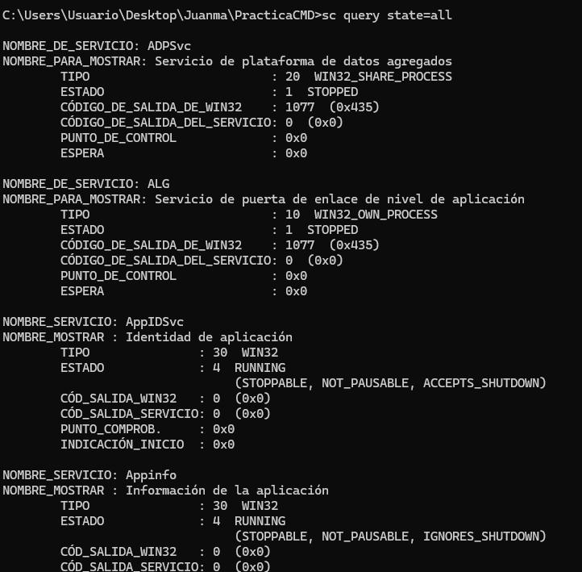

Ejecuta schtasks /query.

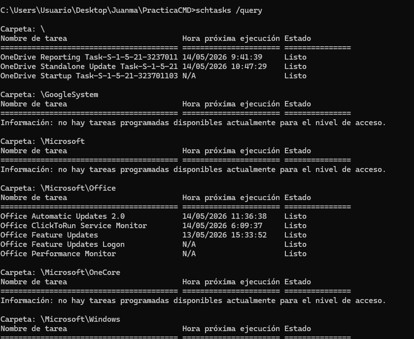

Ejecuta schtasks /query /v.

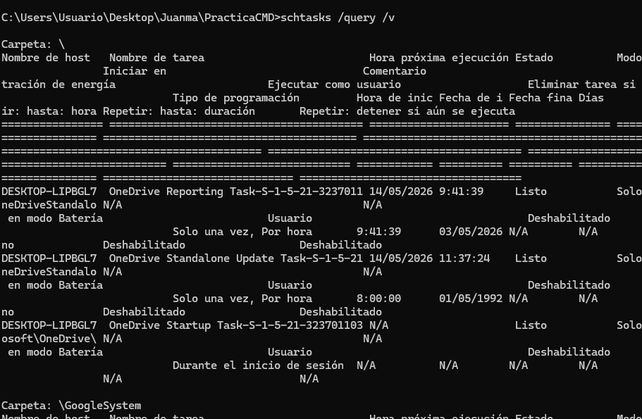

Elige un servicio y una tarea programada y explica qué has encontrado.

19. Consultar permisos y atributos

#### Tarea

Ejecuta icacls sobre una carpeta de la práctica.

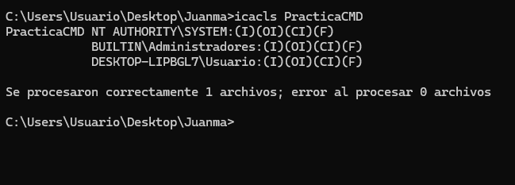

Ejecuta icacls sobre un archivo de texto.

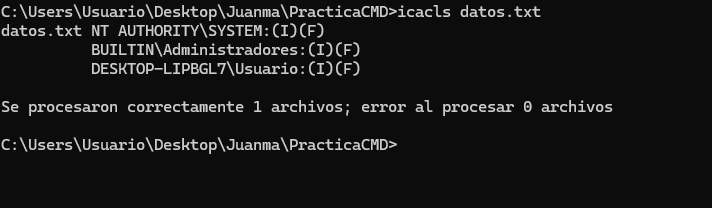

Ejecuta attrib sobre los archivos de la práctica.

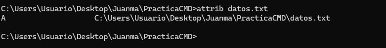

Si el profesor lo indica, oculta un archivo de prueba y vuelve a mostrarlo.

Explica qué te muestran los permisos y qué te muestran los atributos.

20. Comparar archivos y consultar usuarios

#### Tarea

Crea dos archivos de texto parecidos, con una pequeña diferencia.

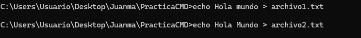

Compáralos con fc

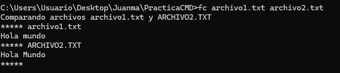

Ejecuta net user.

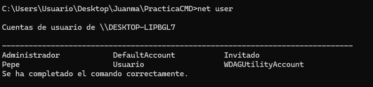

Consulta un usuario concreto con net user nombre_usuario.

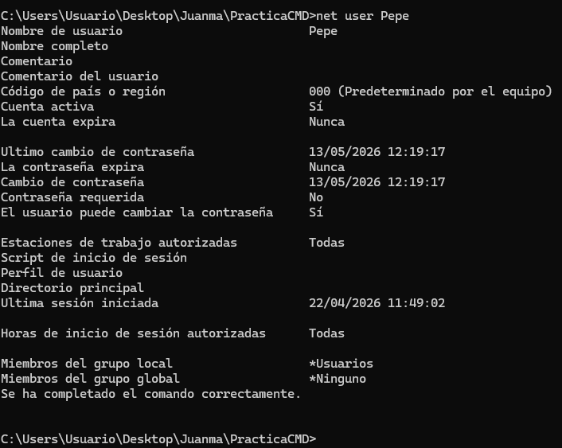

Explica qué diferencia hay entre listar todos los usuarios y consultar uno concreto.

21. Revisión final de comandos avanzados

#### Tarea

Haz una tabla resumen donde indiques al menos 10 comandos de esta parte y expliques: 1. qué hace cada comando 2. qué información aporta 3. en qué situación lo usarías

PARTE 4 · Informe final

22. Informe técnico breve

#### Tarea

Con toda la información obtenida, realiza un pequeño informe final donde resumas:

Nombre del equipo

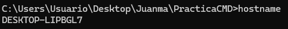

Usuario actual

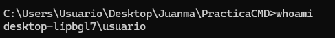

IPv4 del equipo

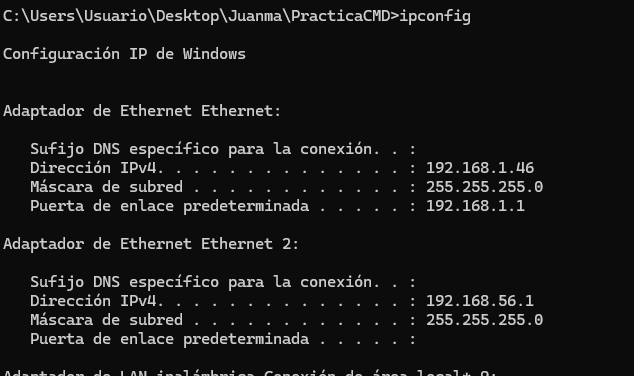

Una dirección MAC

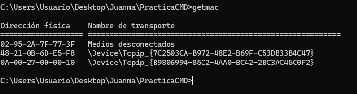

Una conexión de red y su PID

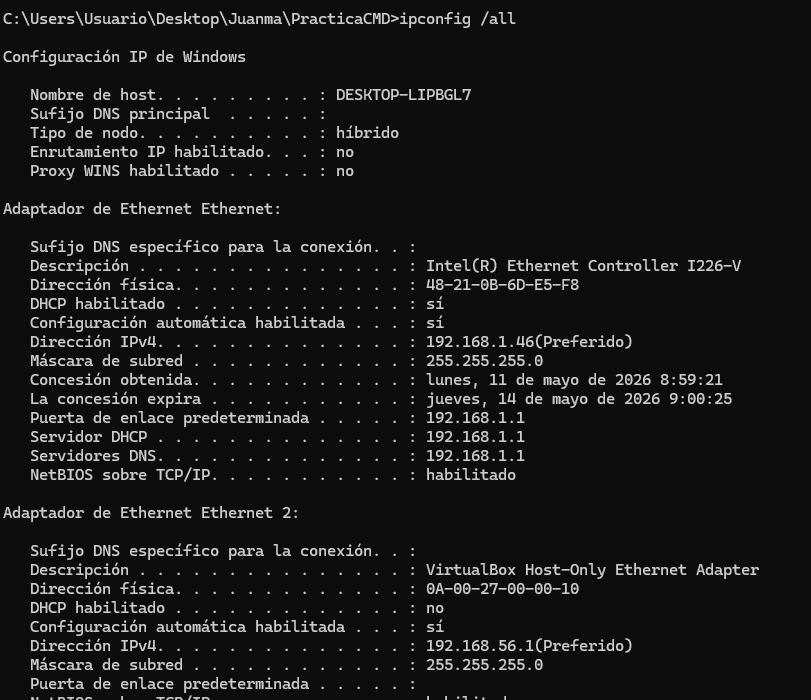

El proceso asociado a esa conexión

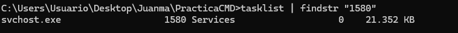

Un servicio del sistema

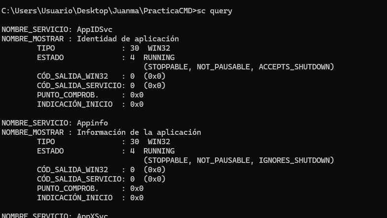

Una tarea programada

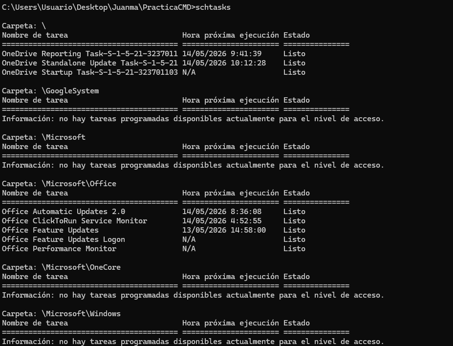

Un permiso detectado en una carpeta

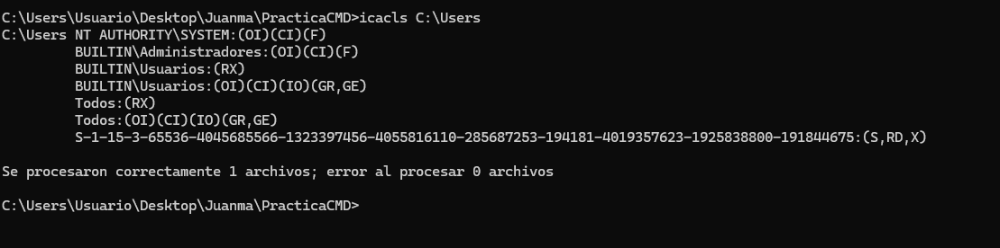

Una conclusión final sobre lo que has aprendido en la práctica

Mi conclusión es que cuanto mas profundo aprenda sobre los comandos y su utilidad a demás de poder concatenar comandos, mejor y mas rápido voy a poder sacar la información que necesite en cada momento

#### Debes entregar

texto resumen final

acompañado de las capturas más importantes

Importante

No hagáis esta práctica como una lista mecánica de comandos. La idea es que empecéis a ver CMD como una herramienta real de trabajo técnico.

Cuanto mejor entendáis lo que estáis viendo, más utilidad le sacaréis en administración de sistemas, análisis y seguridad informática.

## Conclusión

Esta práctica refuerza competencias de administración, reconocimiento y análisis técnico en entornos Windows/Linux, documentando comandos, configuración y evidencias de ejecución en laboratorio.
