# Windows CMD - Nivel 1: comandos básicos y navegación

## Descripción

Práctica inicial de CMD con comandos de ayuda, fecha/hora, navegación, rutas, listados, creación de carpetas, archivos y reconocimiento básico del sistema.

## Tecnologías / comandos trabajados

- Windows 11
- CMD
- dir
- cd
- tree
- copy
- ping
- ipconfig

## Contexto

Laboratorio realizado en entorno controlado como parte del bloque de Seguridad Informática IFCT0109. El contenido se ha normalizado para GitHub, eliminando referencias personales innecesarias y manteniendo las evidencias visuales del trabajo realizado.

## Procedimiento y evidencias

## BLOQUE 1 · Primer contacto con la consola

### Ejercicio 1 · Abrir CMD y comprobar que funciona

#### Enunciado

Abre la consola de Windows.

Ejecuta el comando que limpia la pantalla.

Ejecuta el comando que muestra la fecha del sistema.

Ejecuta el comando que muestra la hora del sistema.

#### Debes entregar

comando para limpiar la pantalla

fecha mostrada

hora mostrada

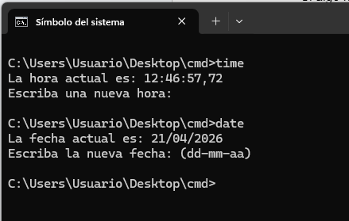

### Ejercicio 2 · Buscar ayuda en CMD

#### Enunciado

Muestra la ayuda general de CMD.

Busca la ayuda del comando dir.

Busca la ayuda del comando ping usando /?.

Anota dos parámetros útiles de cada uno.

#### Debes entregar

comando usado para la ayuda general

comando usado para la ayuda de dir

comando usado para la ayuda de ping

dos parámetros de dir

dos parámetros de ping

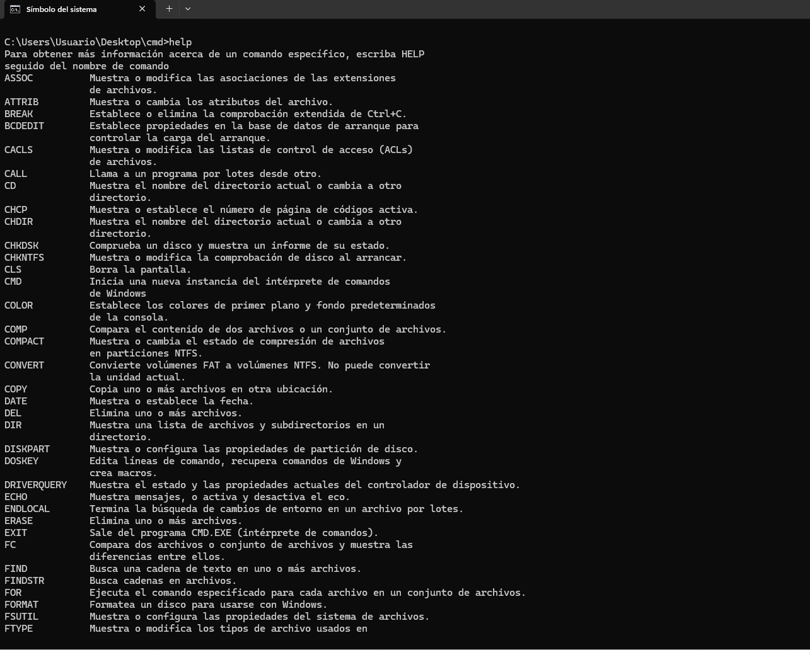

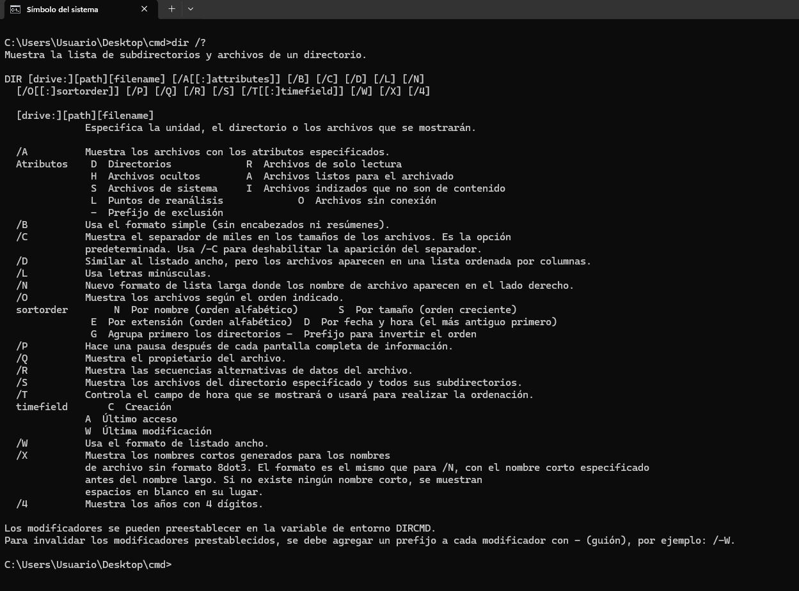

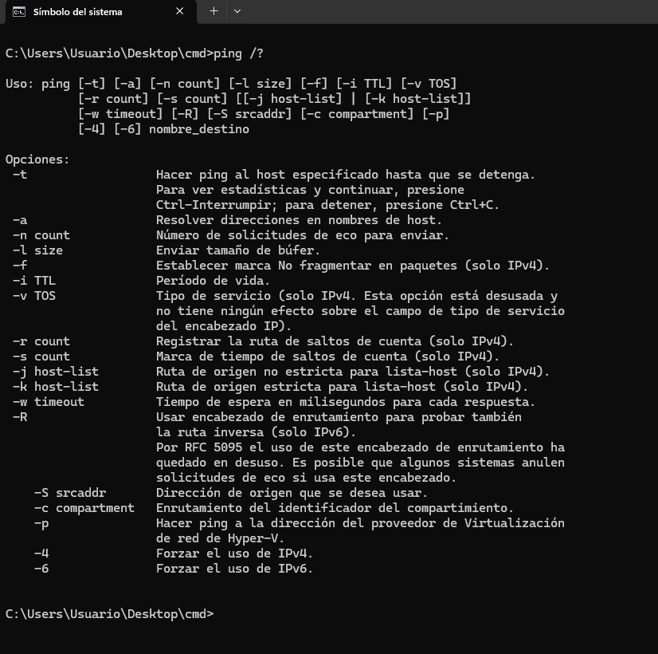

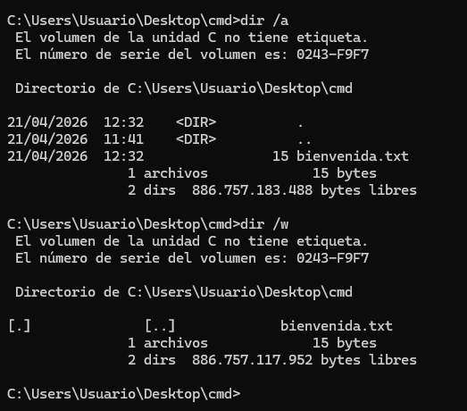

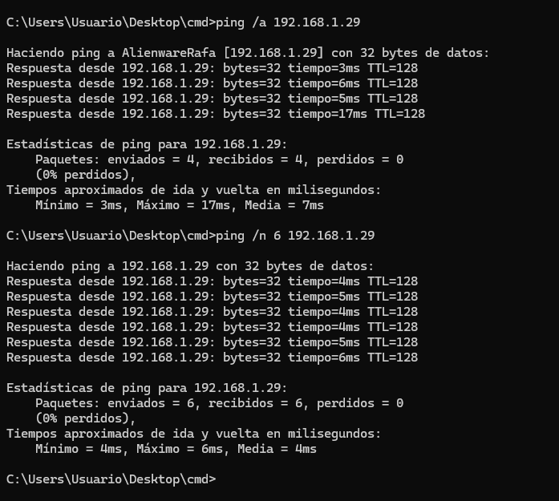

## BLOQUE 2 · Navegación por carpetas

### Ejercicio 3 · Saber dónde estás

#### Enunciado

Ejecuta el comando que muestra la carpeta actual.

Anota la ruta completa en la que te encuentras.

#### Debes entregar

comando usado

ruta obtenida

### Ejercicio 4 · Moverse por carpetas

#### Enunciado

Comprueba la carpeta actual.

Entra en una carpeta dentro de tu perfil de usuario.

Sube un nivel.

Entra en C:\Windows.

Vuelve a la carpeta inicial.

#### Debes entregar

secuencia de comandos utilizada

breve explicación de lo que hiciste en cada paso

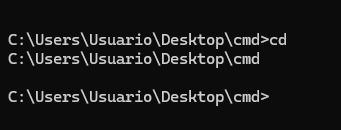

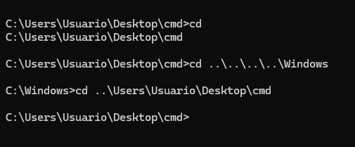

### Ejercicio 5 · Rutas con espacios

#### Enunciado

Crea o localiza una carpeta cuyo nombre tenga espacios.

Intenta acceder a ella sin usar comillas.

Explica qué ocurre.

Accede correctamente usando comillas.

#### Debes entregar

comando incorrecto usado

explicación del error

comando correcto

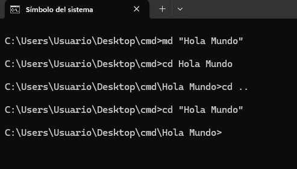

## BLOQUE 3 · Listado y estructura de carpetas

### Ejercicio 6 · Listar el contenido de una carpeta

#### Enunciado

Sitúate en una carpeta que tenga varios archivos o subcarpetas.

Muestra su contenido con dir.

Repite el ejercicio con dir /b.

Explica la diferencia entre ambas salidas.

#### Debes entregar

comandos usados

diferencia observada

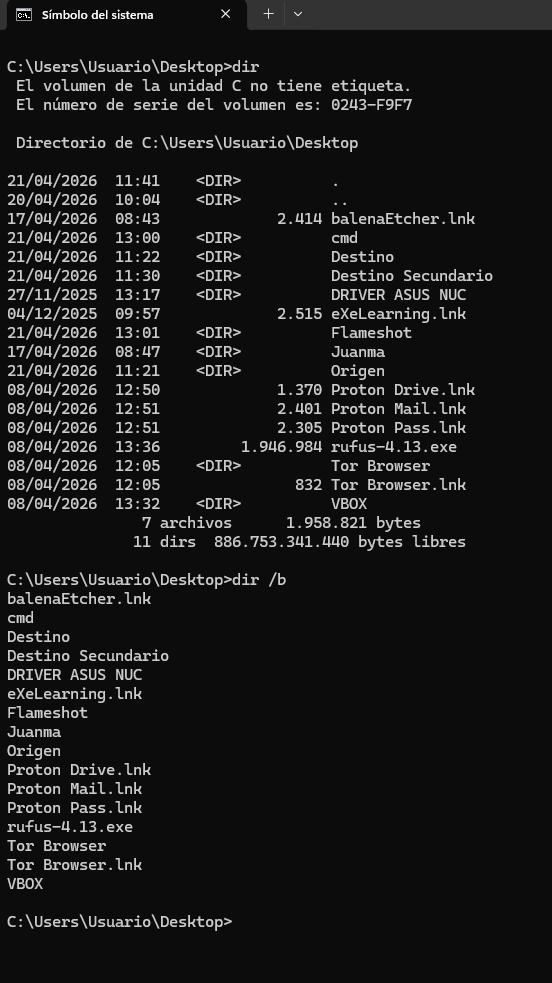

### Ejercicio 7 · Probar distintos formatos de dir

#### Enunciado

Ejecuta en la misma carpeta los siguientes comandos:

dirdir /pdir /wdir /s

Después responde: 1. ¿Para qué sirve dir /p? 2. ¿Qué cambia con dir /w? 3. ¿Qué hace dir /s?

#### Debes entregar

los cuatro comandos

respuesta a las tres preguntas

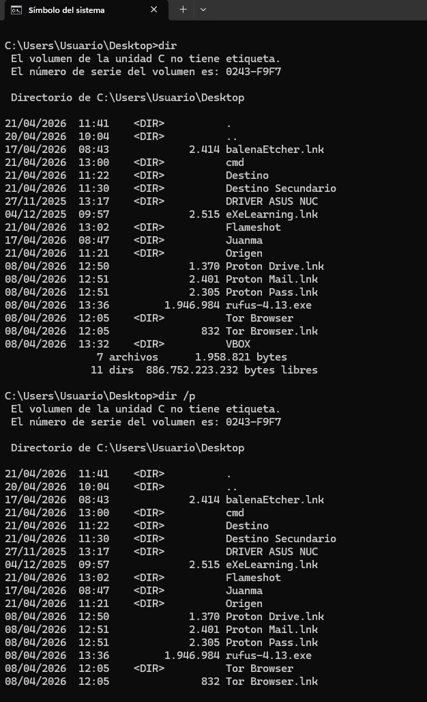

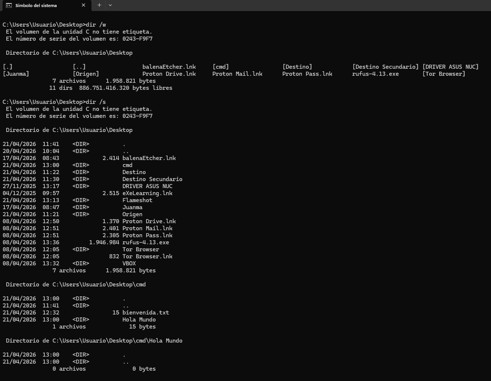

### Ejercicio 8 · Ver la estructura en árbol

#### Enunciado

Elige una carpeta sencilla.

Muestra su estructura con tree.

Repite con tree /f.

Explica qué información extra aporta tree /f.

#### Debes entregar

comando del primer caso

comando del segundo caso

diferencia observada

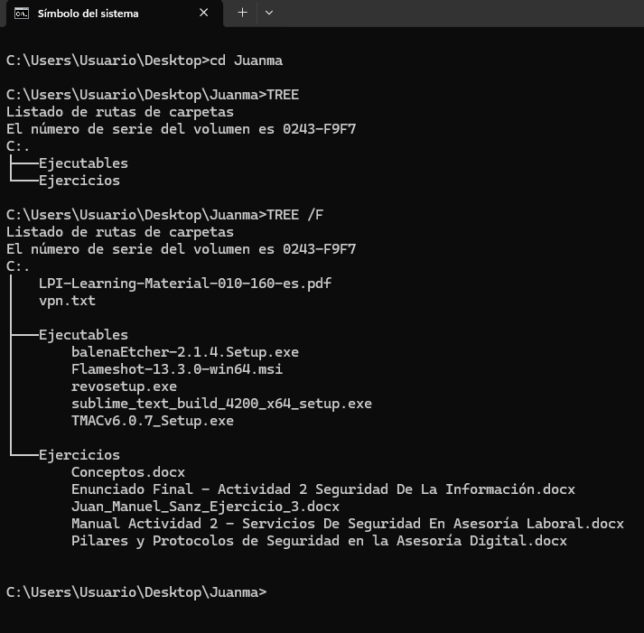

## BLOQUE 4 · Trabajo básico con carpetas

### Ejercicio 9 · Crear carpetas desde CMD

#### Enunciado

Crea una carpeta llamada PracticasCMD.

Crea dentro otra carpeta llamada Nivel1.

Crea una tercera carpeta llamada Archivos de prueba.

#### Debes entregar

comandos usados

listado final de carpetas creadas

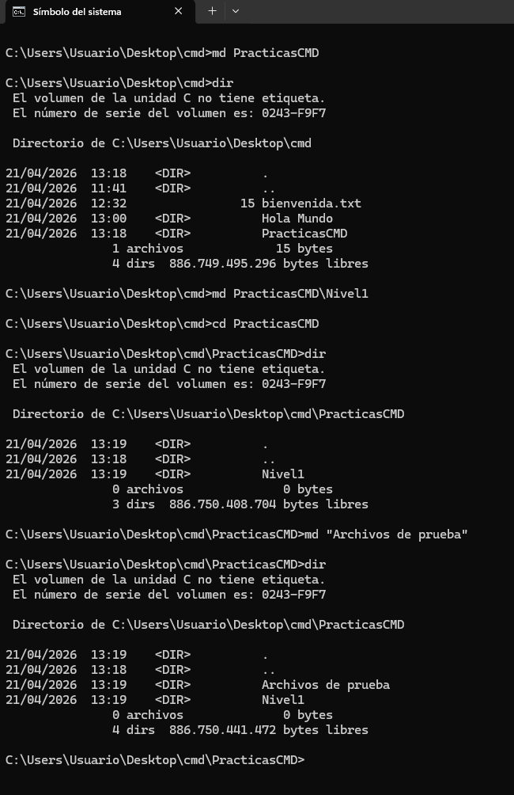

### Ejercicio 10 · Eliminar carpetas vacías

#### Enunciado

Elimina una de las carpetas vacías creadas en el ejercicio anterior.

Comprueba con dir que ya no existe.

#### Debes entregar

comando usado para eliminar

comando usado para comprobar

resultado observado

Importante

En este ejercicio debes practicar primero con carpetas vacías.

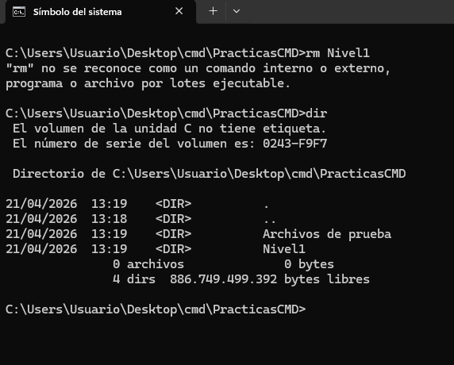

## BLOQUE 5 · Trabajo básico con archivos

### Ejercicio 11 · Leer un archivo de texto

#### Enunciado

Crea un archivo de texto llamado prueba_nivel1.txt.

Escribe dentro tres líneas de texto.

Muestra su contenido desde CMD usando type.

#### Debes entregar

ruta del archivo

comando usado

contenido mostrado

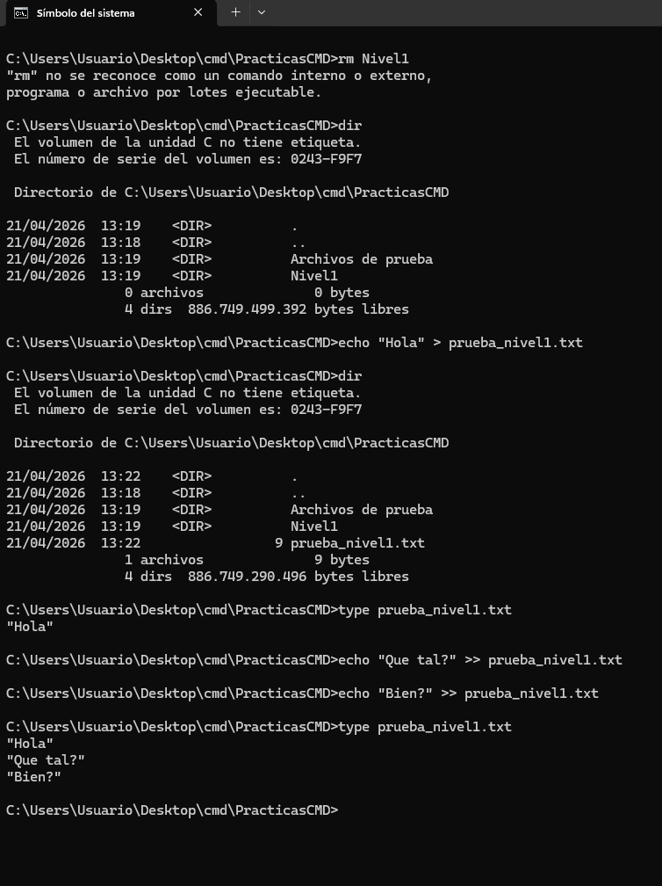

### Ejercicio 12 · Copiar un archivo con otro nombre

#### Enunciado

Utiliza el archivo prueba_nivel1.txt.

Haz una copia llamada copia_nivel1.txt.

Comprueba con dir que existen ambos archivos.

Muestra el contenido de la copia con type.

#### Debes entregar

comando de copia usado

comando para comprobar la existencia

comando para mostrar el contenido

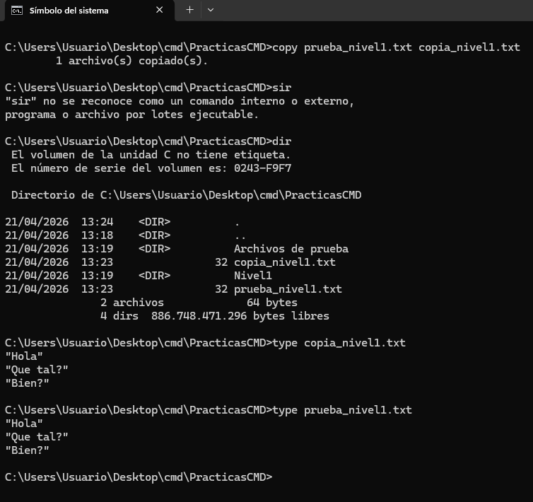

### Ejercicio 13 · Copiar un archivo a otra carpeta

#### Enunciado

Copia copia_nivel1.txt dentro de la carpeta PracticasCMD.

Accede a esa carpeta.

Muestra su contenido.

#### Debes entregar

comando usado para copiar

comando usado para acceder

comando usado para listar el contenido

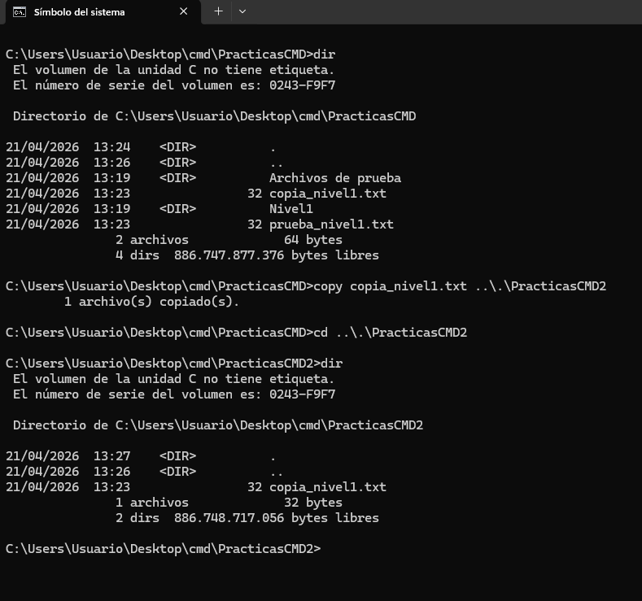

## BLOQUE 6 · Información básica del sistema

### Ejercicio 14 · Nombre del equipo y versión de Windows

#### Enunciado

Muestra el nombre del equipo.

Muestra la versión de Windows.

Explica qué información aporta cada comando.

#### Debes entregar

comando usado para ver el nombre del equipo

comando usado para ver la versión

resultado obtenido en ambos casos

explicación breve

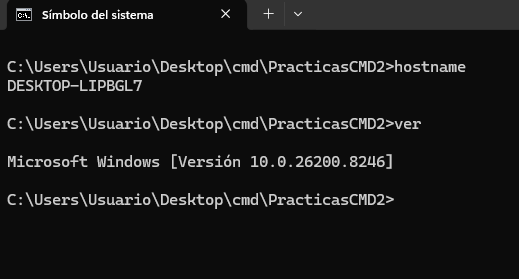

### Ejercicio 15 · Información general del sistema

#### Enunciado

Ejecuta systeminfo.

Localiza en la salida los siguientes datos:

nombre del sistema operativo

versión

memoria física total

fecha de instalación original

dominio o grupo de trabajo

#### Debes entregar

comando usado

los cinco datos solicitados

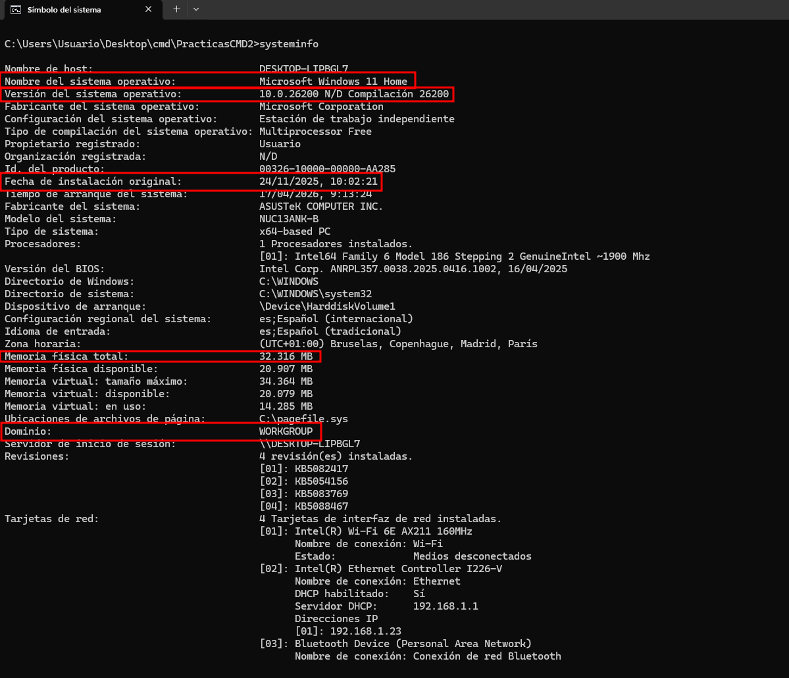

### Ejercicio 16 · Comparar comandos de información

#### Enunciado

Después de usar hostname, ver y systeminfo, responde:

¿Cuál de los tres comandos da menos información?

hostname

¿Cuál da más información?

systeminfo

¿Cuál usarías si solo quieres identificar rápidamente el equipo?

hostname

¿Cuál usarías si quieres hacer una enumeración básica del sistema?

ver

#### Debes entregar

respuestas razonadas

## BLOQUE 7 · Configuración de red y conectividad

### Ejercicio 17 · Consultar la configuración IP

#### Enunciado

Ejecuta ipconfig.

Ejecuta ipconfig /all.

Localiza en la salida:

dirección IPv4

máscara de subred

puerta de enlace predeterminada

servidor DNS

#### Debes entregar

comando usado en cada caso

los cuatro datos encontrados

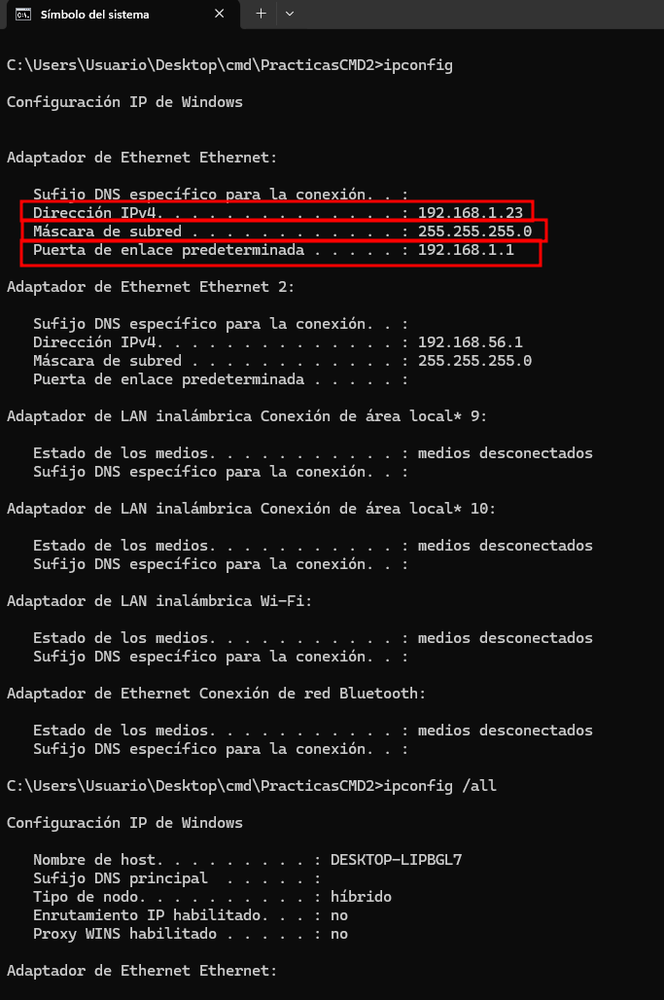

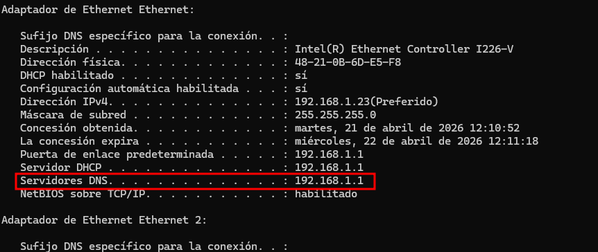

### Ejercicio 18 · Comparar ipconfig e ipconfig /all

#### Enunciado

Después de ejecutar ambos comandos, responde:

¿Qué información extra aparece en ipconfig /all?

La DNS

¿Cuál usarías para una consulta rápida?

ipconfig

¿Cuál usarías para una revisión más completa?

Ipconfig /all

#### Debes entregar

respuesta a las tres preguntas

### Ejercicio 19 · Comprobar conectividad con ping

#### Enunciado

Haz las siguientes pruebas:

Ping a la puerta de enlace de tu red.

Ping a 8.8.8.8.

Ping a google.com.

Después responde: 1. ¿Qué comprueba cada una de esas tres pruebas? 2. ¿Qué diferencia hay entre hacer ping a una IP y a un nombre de dominio?

#### Debes entregar

tres comandos utilizados

resultado resumido de cada prueba

respuesta a las dos preguntas

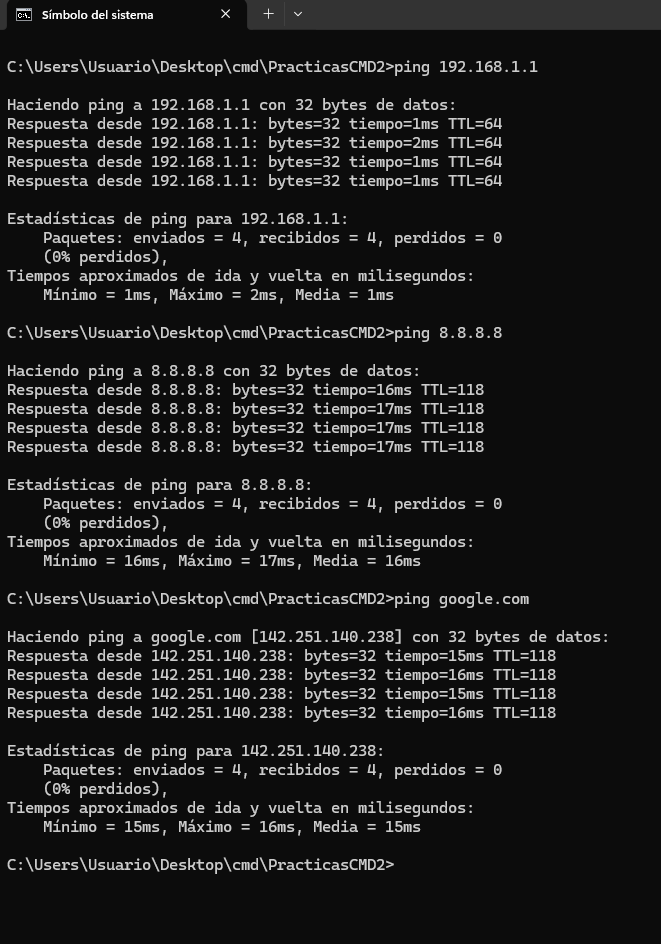

Si le haces ping al nombre de dominio te dará la ip sel servidor.

### Ejercicio 20 · Probar parámetros de ping

#### Enunciado

Haz un ping de solo 3 intentos a 8.8.8.8.

Haz un ping a un dominio forzando IPv4.

Investiga para qué sirve el parámetro /t.

#### Debes entregar

comando del apartado 1

comando del apartado 2

explicación del parámetro /t

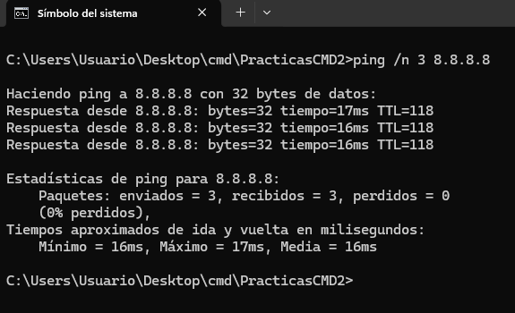

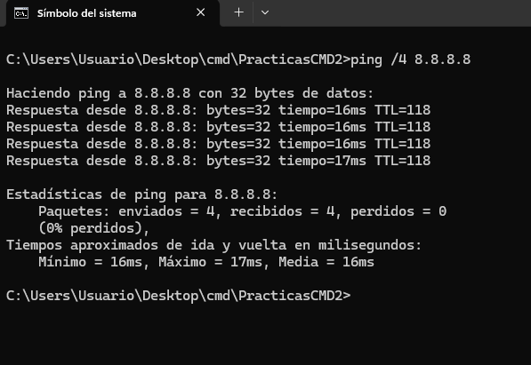

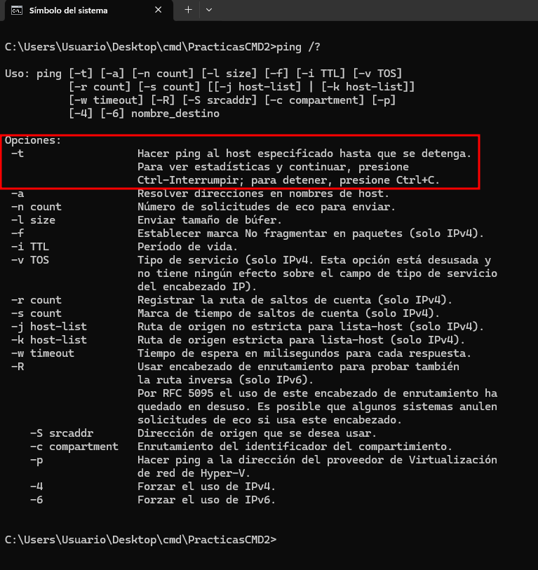

## BLOQUE 8 · Ejercicio integrador

### Ejercicio 21 · Reconocimiento básico del equipo desde CMD

#### Enunciado

Realiza una pequeña enumeración básica del equipo usando únicamente comandos del Nivel 1.

Debes obtener como mínimo:

fecha y hora del sistema

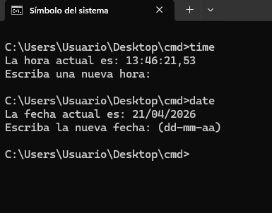

carpeta actual

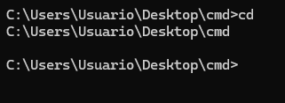

nombre del equipo

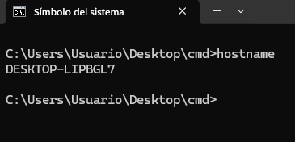

versión de Windows

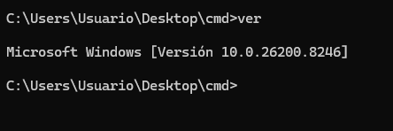

información general del sistema

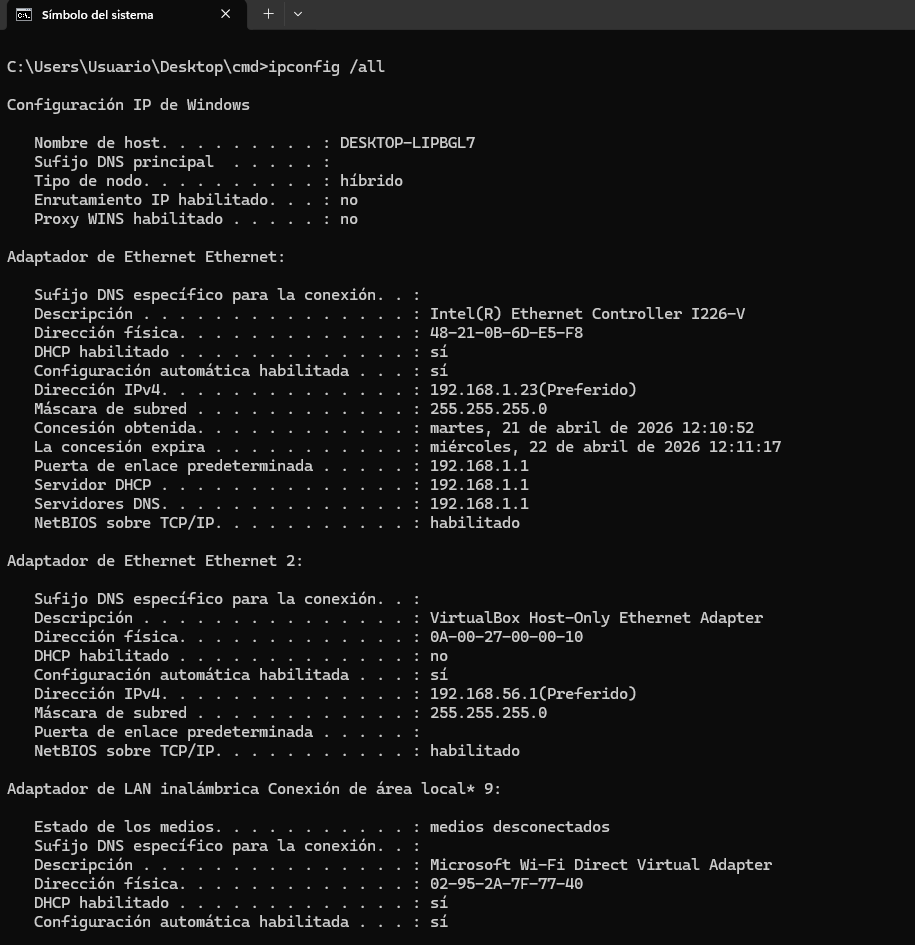

estructura de una carpeta en árbol

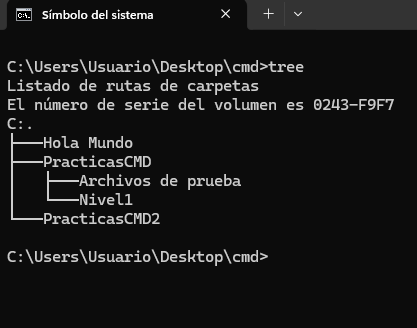

creación de una carpeta de prueba

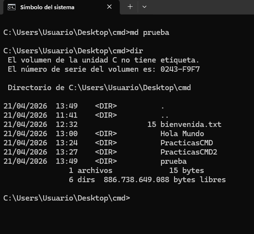

copia de un archivo de texto

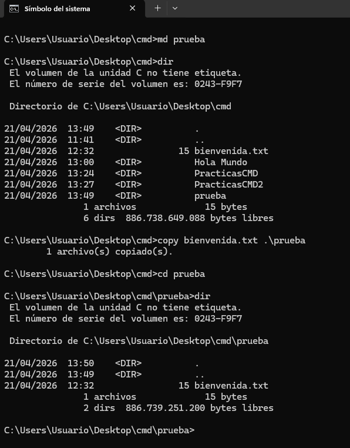

dirección IPv4 del equipo

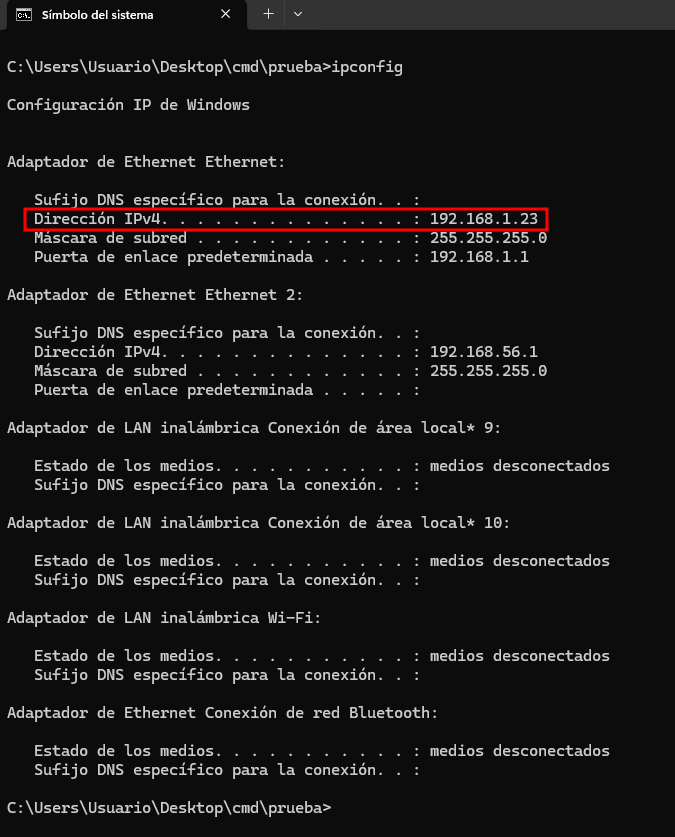

prueba de conectividad a una IP pública

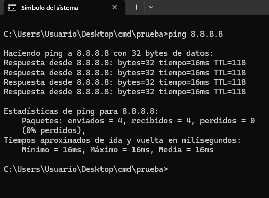

#### Debes entregar

Un pequeño informe con este formato:

Comando usado

Qué información obtiene o qué acción realiza

Resultado principal

## BLOQUE 9 · Ejercicio de razonamiento

### Ejercicio 22 · Caso práctico

#### Enunciado

Un usuario te dice:

“No sé qué pasa. No encuentro una carpeta que había creado, quiero comprobar si tengo Internet y además necesito saber en qué equipo estoy trabajando.”

Responde:

Qué comandos usarías para saber el nombre del equipo

hostname

Qué comandos usarías para moverte por carpetas

cd

Qué comandos usarías para listar contenido y ver estructura

dir , tree

Qué comandos usarías para comprobar la red

ping

Qué comandos usarías para consultar la configuración IP

Ipconfig /all

#### Debes entregar

lista ordenada de comandos

explicación breve de para qué usarías cada uno

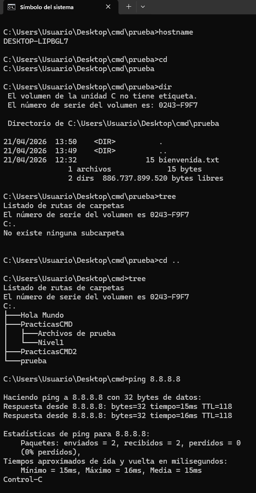

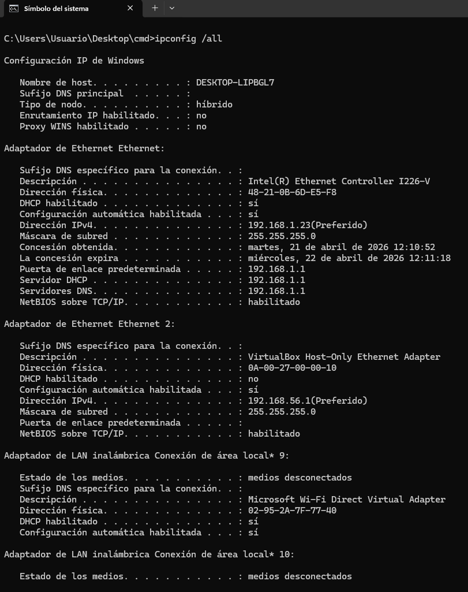

## Conclusión

Esta práctica refuerza competencias de administración, reconocimiento y análisis técnico en entornos Windows/Linux, documentando comandos, configuración y evidencias de ejecución en laboratorio.
