# Windows CMD - Nivel 2: enumeración de sistema y red

## Descripción

Práctica orientada a identificación de usuario, grupos, privilegios, MAC, ARP, DNS, rutas, procesos y filtrado desde CMD.

## Tecnologías / comandos trabajados

- Windows 11
- CMD
- whoami
- getmac
- arp
- nslookup
- tracert
- tasklist
- findstr

## Contexto

Laboratorio realizado en entorno controlado como parte del bloque de Seguridad Informática IFCT0109. El contenido se ha normalizado para GitHub, eliminando referencias personales innecesarias y manteniendo las evidencias visuales del trabajo realizado.

## Procedimiento y evidencias

Nammu

CMD Windows · Ejercicios Nivel 2

Hoja de ejercicios para alumnos

#### Objetivo

En este nivel vamos a practicar comandos orientados a enumeración y análisis del sistema desde CMD.

El objetivo no es solo ejecutar comandos, sino interpretar la información que obtenemos.

Trabajaremos:

usuario y privilegios

red (MAC, ARP, DNS)

rutas de red

procesos

búsqueda y filtrado de información

#### Instrucciones generales

Trabaja siempre en CMD.

Ejecuta los comandos con calma.

Lee bien la salida antes de responder.

No ejecutes comandos sin entender qué hacen.

En caso de duda, usa help o /??.

## BLOQUE 1 · Usuario y sistema

### Ejercicio 1 · Identidad del usuario

#### Enunciado

Ejecuta el comando para ver el usuario actual.

Ejecuta el comando para ver toda la información del usuario.

Identifica:

nombre de usuario

dominio o equipo

#### Debes entregar

comando usado

usuario

dominio/equipo

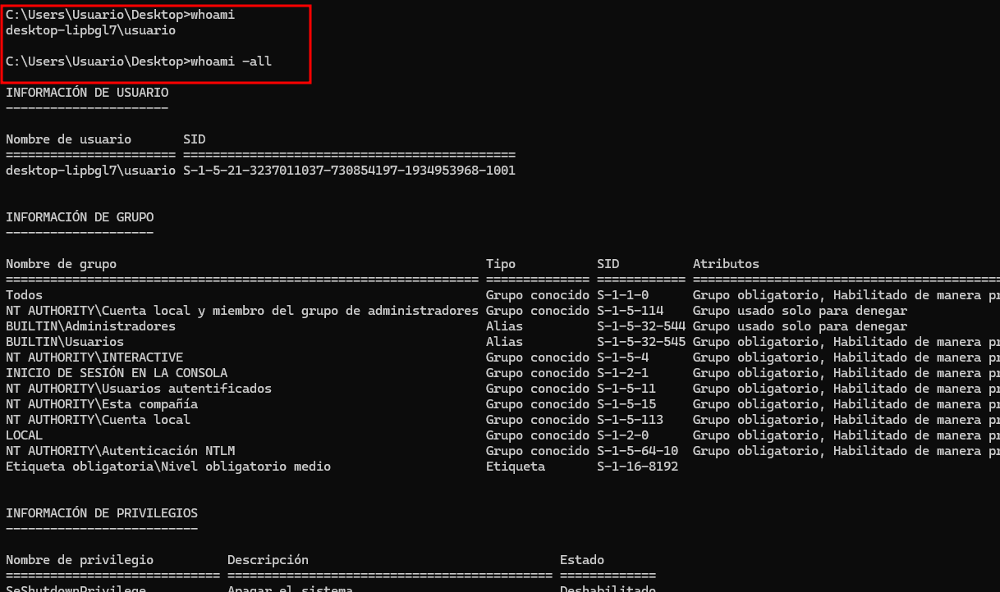

### Ejercicio 2 · Grupos y privilegios

#### Enunciado

Muestra los grupos del usuario.

Muestra los privilegios del usuario.

Indica si el usuario pertenece a algún grupo administrativo.

#### Debes entregar

comandos usados

lista de grupos principales

conclusión sobre privilegios

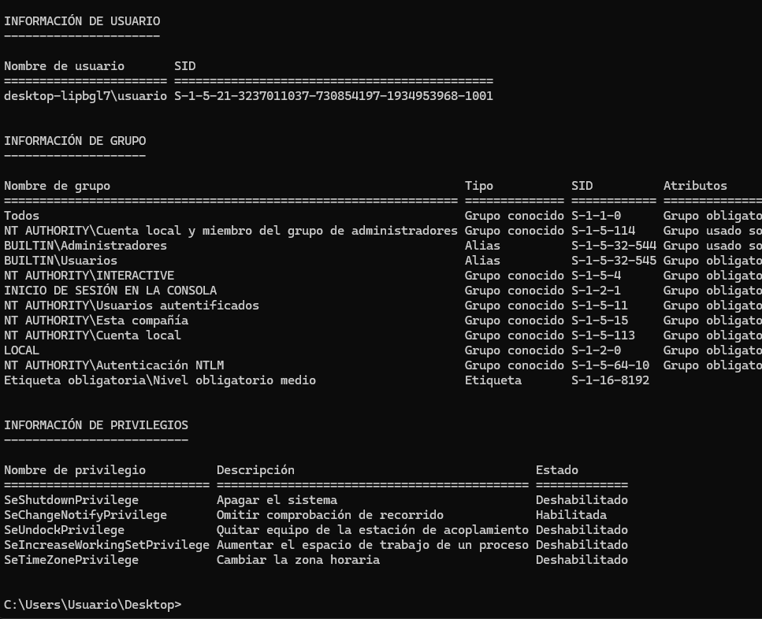

## BLOQUE 2 · Red local

### Ejercicio 3 · Direcciones MAC

#### Enunciado

Ejecuta el comando para ver las MAC.

Ejecuta el comando en modo detallado.

Identifica:

dirección MAC

nombre del adaptador

#### Debes entregar

comandos usados

MAC principal

nombre del adaptador

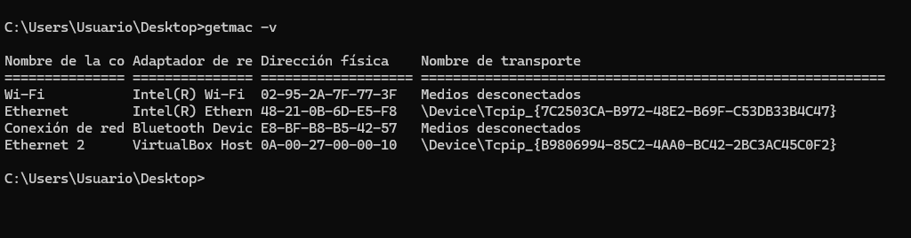

### Ejercicio 4 · Tabla ARP

#### Enunciado

Ejecuta arp -a.

Identifica al menos:

una IP

su MAC asociada

#### Debes entregar

comando usado

ejemplo de IP + MAC

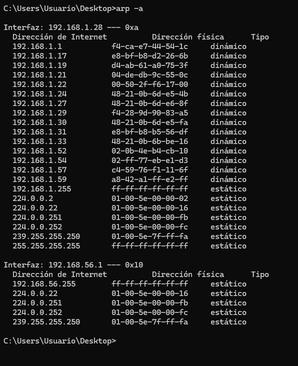

## BLOQUE 3 · DNS y rutas

### Ejercicio 5 · Resolución DNS

#### Enunciado

Ejecuta nslookup google.com.

Ejecuta nslookup openai.com.

Anota las IP obtenidas.

#### Debes entregar

comandos usados

IP de google

IP de openai

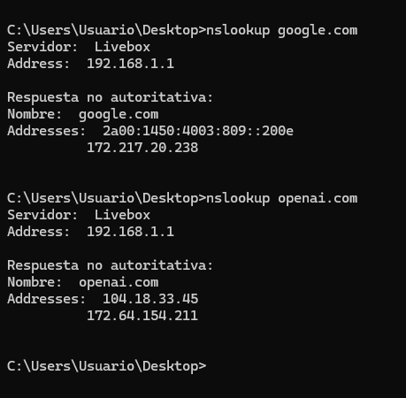

### Ejercicio 6 · Ruta de red

#### Enunciado

Ejecuta tracert google.com.

Cuenta cuántos saltos hay.

Indica si hay algún salto que no responde.

#### Debes entregar

comando usado

número de saltos

observación

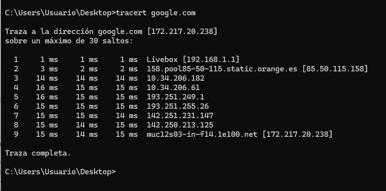

### Ejercicio 7 · Análisis de red con pathping

#### Enunciado

Ejecuta pathping google.com.

Espera a que termine.

Indica:

si hay pérdida de paquetes

qué salto tiene mayor latencia

#### Debes entregar

comando usado

resultado resumido

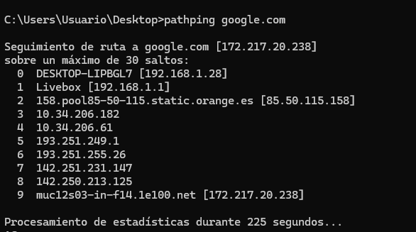

## BLOQUE 4 · Procesos

### Ejercicio 8 · Ver procesos

#### Enunciado

Ejecuta tasklist.

Ejecuta tasklist /v.

Identifica:

un proceso conocido

su PID

#### Debes entregar

comandos usados

proceso elegido

PID

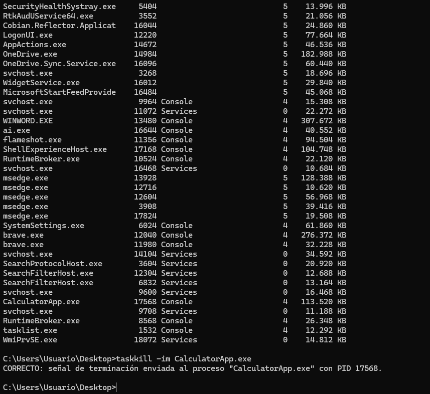

### Ejercicio 9 · Finalizar proceso (controlado)

#### Enunciado

Abre el Bloc de notas.

Localiza el proceso con tasklist.

Cierra el proceso con taskkill.

#### Debes entregar

comando usado

nombre del proceso

IMPORTANTE

No cerrar procesos del sistema.

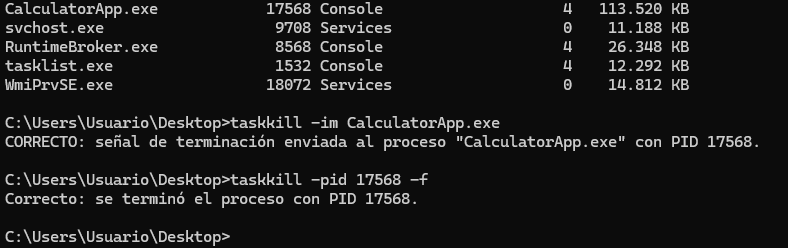

## BLOQUE 5 · Búsqueda y filtrado

### Ejercicio 10 · Filtrar con findstr

#### Enunciado

Ejecuta dir.

Filtra los archivos .txt usando findstr.

#### Debes entregar

comando completo usado

resultado

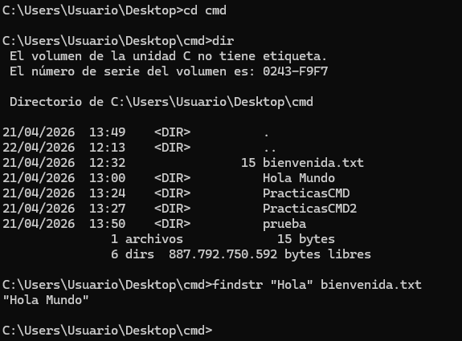

### Ejercicio 11 · Buscar dentro de archivos

#### Enunciado

Crea un archivo de texto con varias palabras.

Busca una palabra concreta con findstr.

#### Debes entregar

comando usado

palabra buscada

### Ejercicio 12 · Localizar archivos

#### Enunciado

Usa where para localizar notepad.

Usa where para localizar otro ejecutable.

#### Debes entregar

comandos usados

rutas encontradas

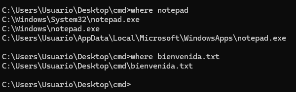

### Ejercicio 13 · Controlar salida con more

#### Enunciado

Ejecuta dir en una carpeta grande.

Repite usando more.

Explica la diferencia.

#### Debes entregar

comandos usados

explicación

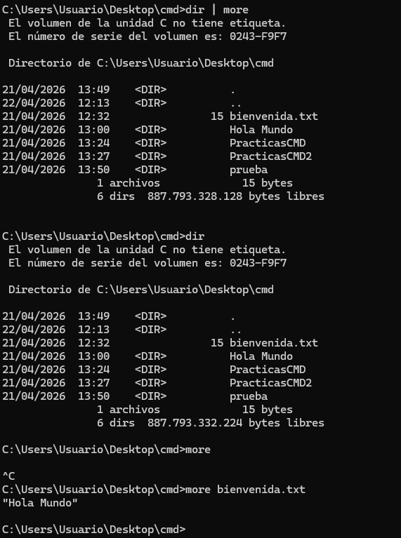

## BLOQUE 6 · Ejercicio integrador

### Ejercicio 14 · Enumeración básica del sistema

#### Enunciado

Realiza una enumeración del equipo usando comandos del Nivel 2.

Debes obtener:

usuario actual

whoami

grupos

whoami -all

MAC del equipo

getmac

tabla ARP

arp -s

IP de un dominio

nslookup

ruta de red

tracrt

lista de procesos

tasklist

búsqueda filtrada de archivos

#### Debes entregar

comando usado

qué información obtiene

resultado principal

## BLOQUE 7 · Ejercicio de razonamiento

### Ejercicio 15 · Caso práctico

#### Enunciado

Un usuario dice:

“El equipo va lento y no sé si hay algo raro en la red.”

Responde:

Qué comandos usarías para ver procesos

tasklist

Qué comandos usarías para analizar la red

pathping

Qué comandos usarías para comprobar resolución DNS

nslookup

Qué comandos usarías para filtrar información

find

#### Debes entregar

lista de comandos

explicación breve de cada uno

Evaluación

Se valorará:

uso correcto de comandos

interpretación de resultados

capacidad de análisis

claridad en las respuestas

Cierre

Cuando completes este nivel, ya estarás empezando a trabajar como un técnico real:

observando

analizando

interpretando

En el siguiente nivel iremos más allá con comandos de administración avanzada y seguridad. Ser un hacker está más cerca 😊

## Conclusión

Esta práctica refuerza competencias de administración, reconocimiento y análisis técnico en entornos Windows/Linux, documentando comandos, configuración y evidencias de ejecución en laboratorio.
