# Windows CMD - Nivel 3: red, servicios y tareas programadas

## Descripción

Laboratorio de análisis de conexiones, puertos, PID, procesos, interfaces, Wi-Fi, firewall, rutas, servicios y tareas programadas en Windows.

## Tecnologías / comandos trabajados

- Windows 11
- CMD
- netstat
- netsh
- route
- sc
- schtasks
- tasklist

## Contexto

Laboratorio realizado en entorno controlado como parte del bloque de Seguridad Informática IFCT0109. El contenido se ha normalizado para GitHub, eliminando referencias personales innecesarias y manteniendo las evidencias visuales del trabajo realizado.

## Procedimiento y evidencias

Nammu

## BLOQUE 1 · Conexiones y puertos

### Ejercicio 1 · Ver conexiones activas

#### Enunciado

Ejecuta netstat.

Conexiones establecidas

Ejecuta netstat -a.

Solo conexiones que estén a la escucha

Ejecuta netstat -an.

Todas las conexiones establecidas y a la escucha

Explica qué diferencia observas entre las tres salidas.

#### Debes entregar

los tres comandos usados

explicación breve de la diferencia entre ellos

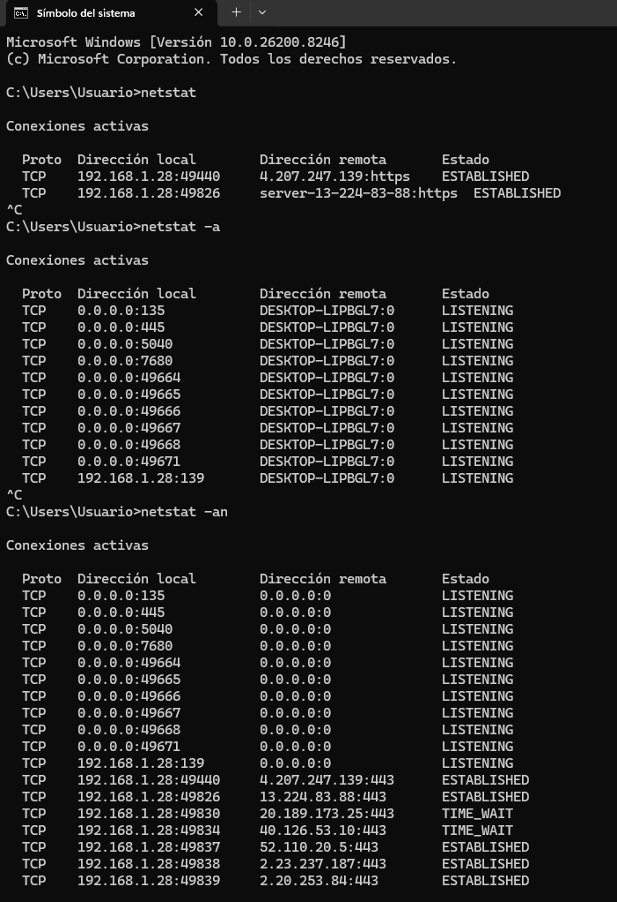

### Ejercicio 2 · Ver puertos y PID asociados

#### Enunciado

Ejecuta netstat -ano.

Identifica al menos:

una conexión establecida

un puerto en escucha

el PID asociado en cada caso

#### Debes entregar

comando usado

una conexión establecida con su PID

un puerto en escucha con su PID

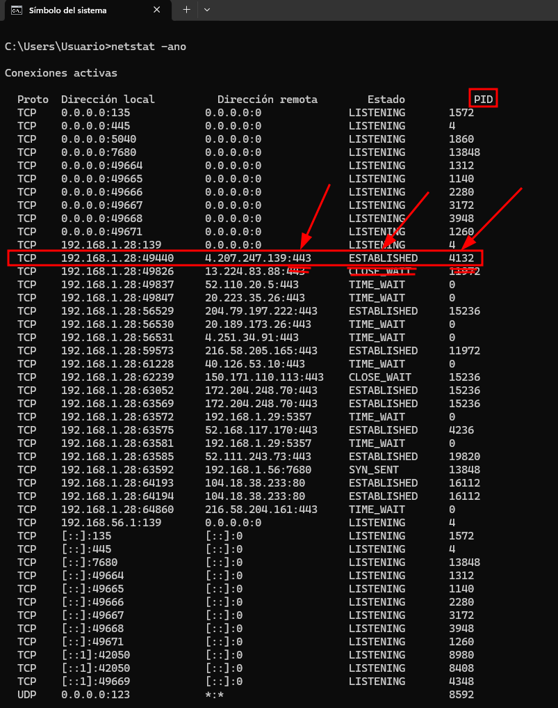

### Ejercicio 3 · Relacionar conexiones con procesos

#### Enunciado

Usa netstat -ano para obtener varios PID.

Usa tasklist para buscar a qué proceso pertenece uno de esos PID.

Relaciona la conexión con el nombre del proceso.

#### Debes entregar

comando usado para obtener el PID

comando usado para buscar el proceso

nombre del proceso encontrado

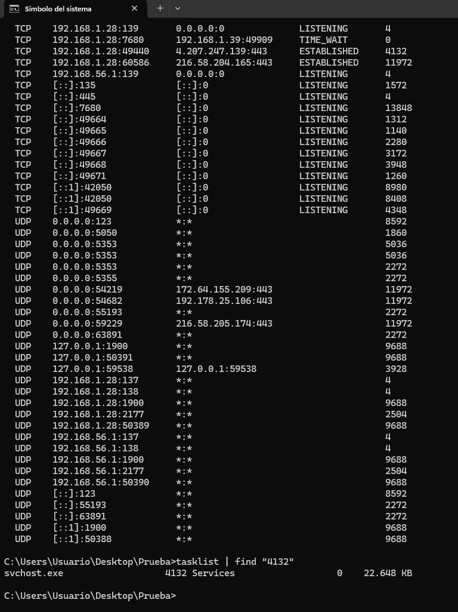

## BLOQUE 2 · Red avanzada

### Ejercicio 4 · Consultar interfaces de red con netsh

#### Enunciado

Ejecuta netsh interface show interface.

Identifica:

nombre de la interfaz

estado

tipo

#### Debes entregar

comando usado

información de una interfaz seleccionada

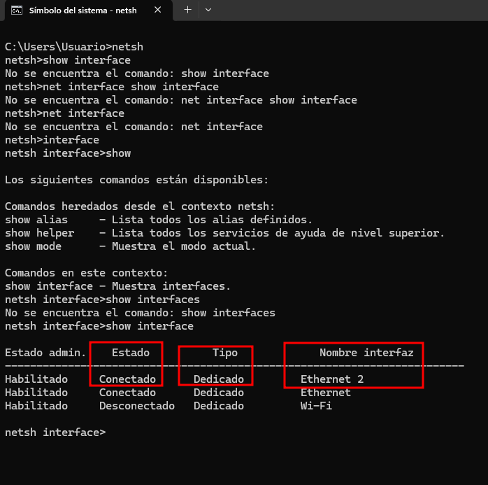

### Ejercicio 5 · Consultar perfiles Wi-Fi guardados

#### Enunciado

Ejecuta netsh wlan show profiles.

Anota cuántos perfiles aparecen.

Indica si el equipo tiene perfiles Wi-Fi guardados.

#### Debes entregar

comando usado

número de perfiles encontrados

observación final

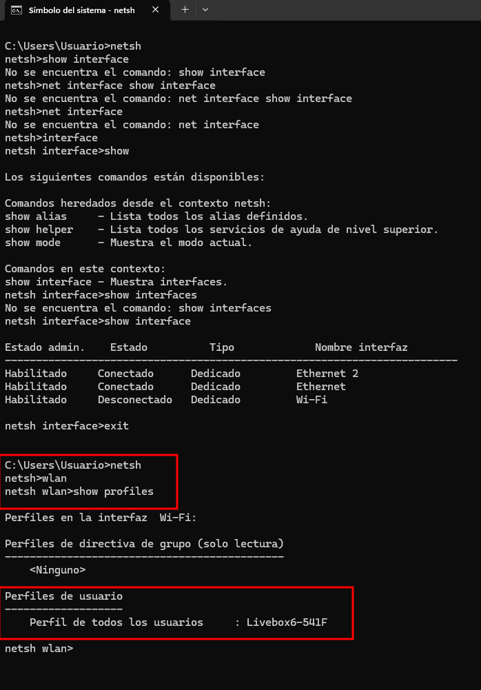

### Ejercicio 6 · Consultar el estado del firewall

#### Enunciado

Ejecuta netsh advfirewall show allprofiles.

Indica si el firewall está activado o desactivado en los perfiles mostrados.

#### Debes entregar

comando usado

estado del firewall en cada perfil

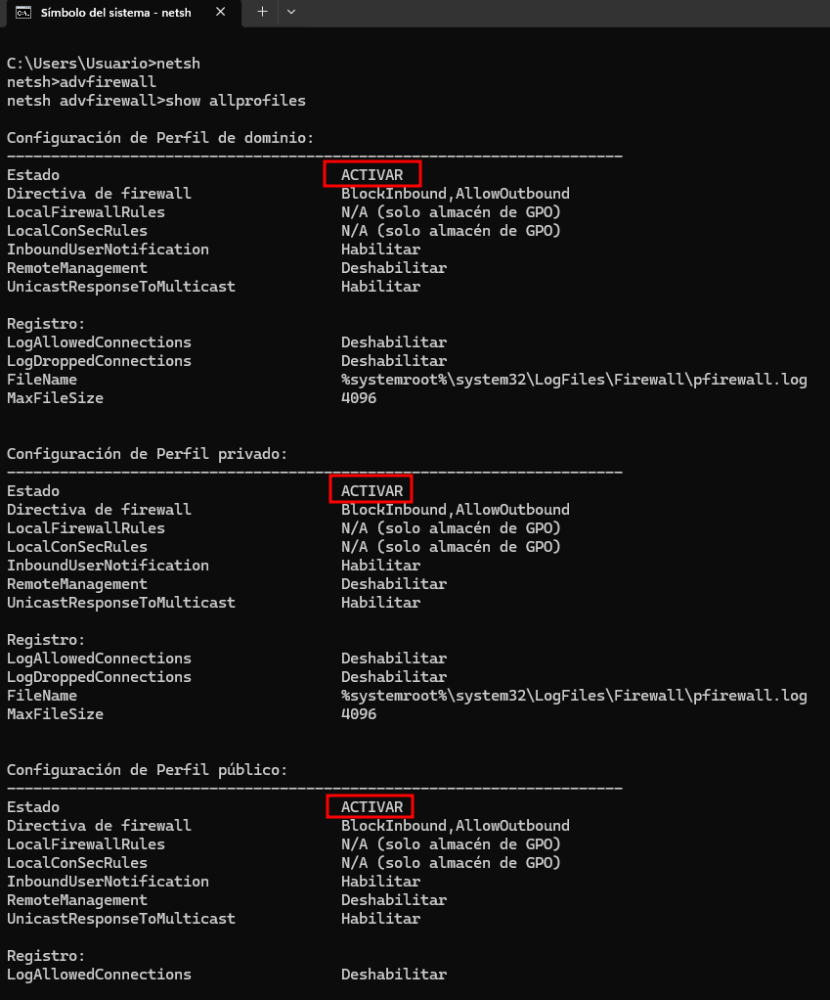

### Ejercicio 7 · Tabla de rutas

#### Enunciado

Ejecuta route print.

Ejecuta route print -4.

Localiza:

la puerta de enlace predeterminada

una ruta IPv4

#### Debes entregar

comandos usados

puerta de enlace predeterminada

ejemplo de una ruta IPv4

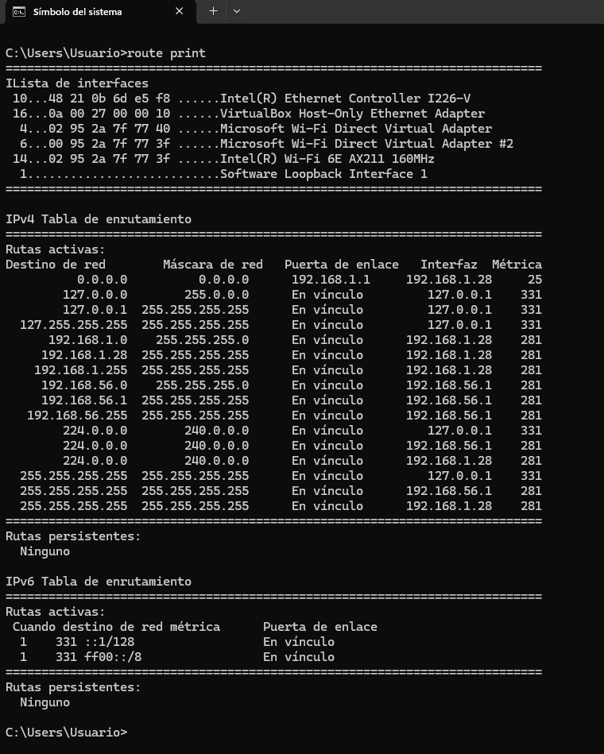

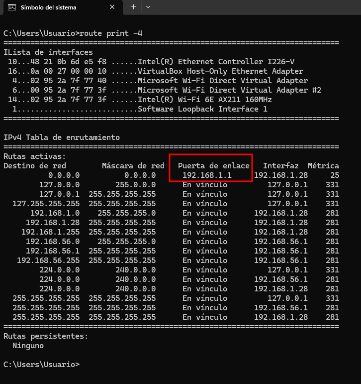

## BLOQUE 3 · Servicios y tareas programadas

### Ejercicio 8 · Consultar servicios activos

#### Enunciado

Ejecuta sc query.

Indica cuántos servicios aparecen como activos.

Selecciona uno y anota su nombre de servicio y su estado.

#### Debes entregar

comando usado

nombre de un servicio

estado observado

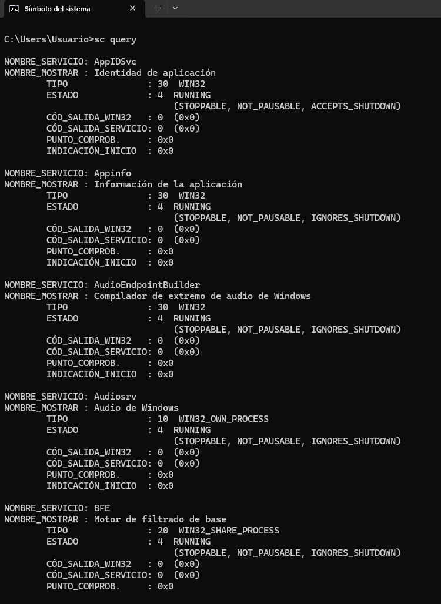

### Ejercicio 9 · Consultar todos los servicios

#### Enunciado

Ejecuta sc query state= all.

Explica la diferencia entre esta salida y la del ejercicio anterior.

#### Debes entregar

comando usado

diferencia observada

Con este comando se ven todos los servicios independientemente de como estén, a demás tiene mas detalles como el Nombre_Para_Mostrar

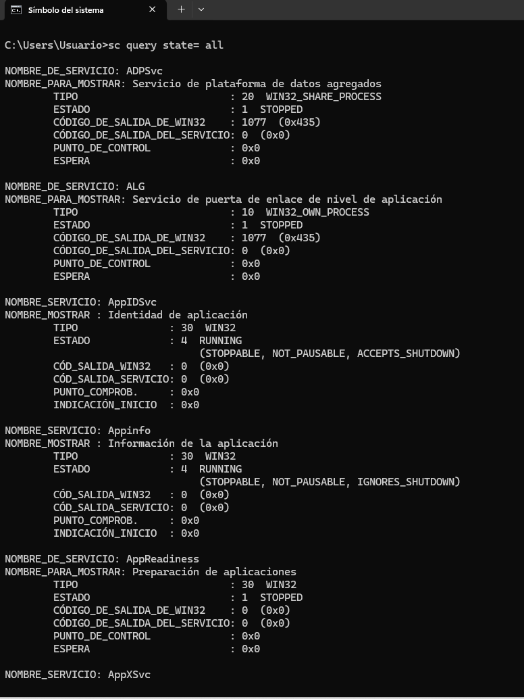

### Ejercicio 10 · Consultar tareas programadas

#### Enunciado

Ejecuta schtasks /query.

Ejecuta schtasks /query /fo LIST.

Elige una tarea y anota:

nombre

estado

próxima ejecución si aparece

#### Debes entregar

comandos usados

información de una tarea seleccionada

Nombre de host: DESKTOP-LIPBGL7

Nombre de tarea: \OneDrive Reporting Task-S-1-5-21-3237011037-730854197-1934953968-1001

Hora próxima ejecución: 29/04/2026 10:04:55

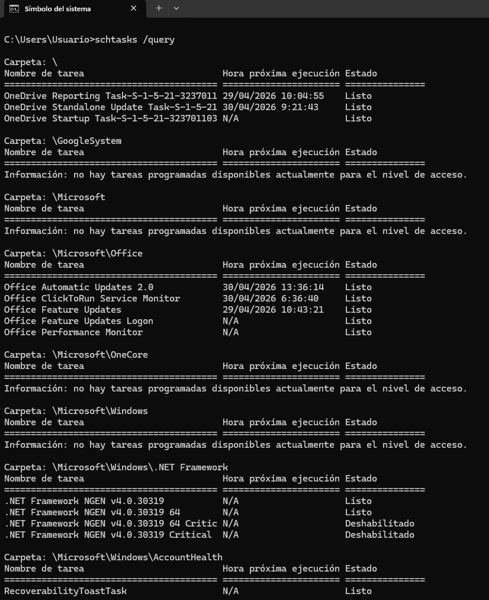

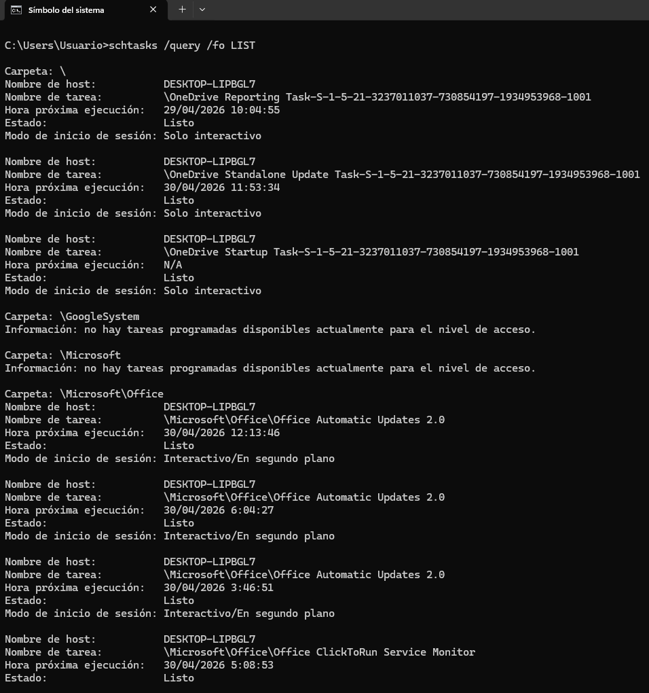

### Ejercicio 11 · Consultar tareas programadas en modo detallado

#### Enunciado

Ejecuta schtasks /query /v.

Explica qué información adicional aparece respecto al modo normal.

#### Debes entregar

comando usado

explicación breve de la diferencia

Modo de inicio…Autor…

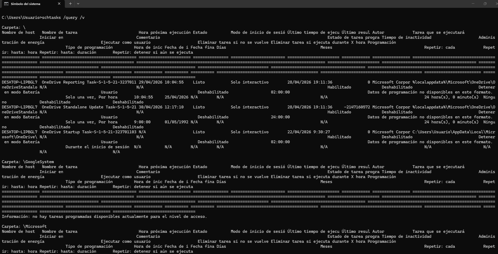

## BLOQUE 4 · Permisos y atributos

### Ejercicio 12 · Consultar permisos con icacls

#### Enunciado

Crea una carpeta de prueba o usa una que ya exista.

Ejecuta icacls sobre esa carpeta.

Identifica qué usuarios o grupos tienen permisos.

#### Debes entregar

comando usado

lista de usuarios o grupos mostrados

observación breve

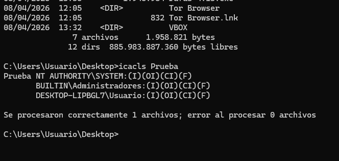

### Ejercicio 13 · Consultar permisos en archivos

#### Enunciado

Ejecuta icacls sobre un archivo de texto.

Compara la salida con la obtenida en una carpeta.

Explica si observas diferencias.

#### Debes entregar

comando usado sobre el archivo

comparación con la carpeta

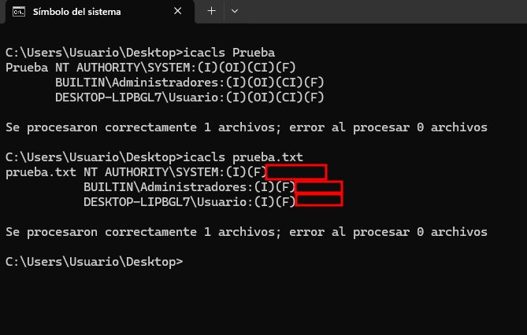

### Ejercicio 14 · Consultar atributos de archivos

#### Enunciado

Ejecuta attrib en una carpeta de trabajo.

Selecciona un archivo.

Anota los atributos que aparezcan.

#### Debes entregar

comando usado

nombre del archivo

atributos observados

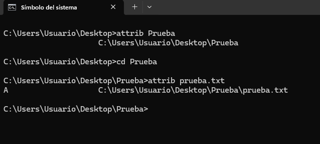

### Ejercicio 15 · Probar atributo oculto (solo en archivo de prueba)

#### Enunciado

Crea un archivo de prueba.

Aplícale el atributo oculto.

Comprueba qué ocurre.

Quítale después el atributo oculto.

#### Debes entregar

comando para ocultar el archivo

comando para quitar el atributo

explicación de lo observado

Importante

Haz esto solo con archivos de prueba creados para el ejercicio.

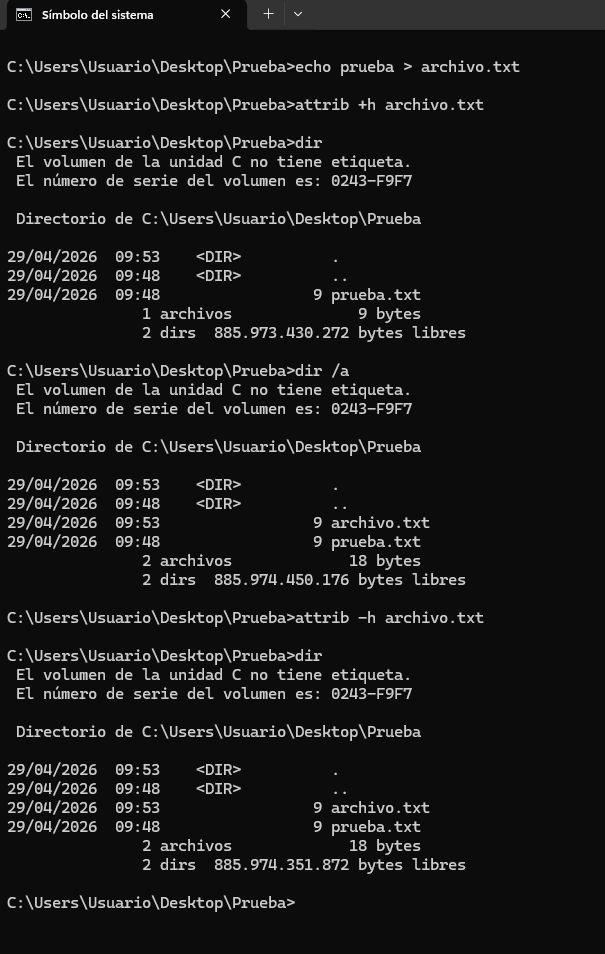

## BLOQUE 5 · Comparación de archivos y usuarios

### Ejercicio 16 · Comparar archivos con fc

#### Enunciado

Crea dos archivos de texto muy parecidos, pero con una pequeña diferencia.

Compáralos con fc.

Explica qué diferencia detecta el comando.

#### Debes entregar

comando usado

diferencia encontrada

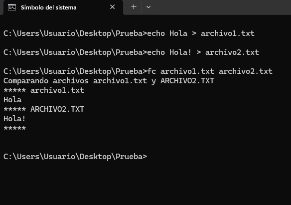

### Ejercicio 17 · Comparación ignorando mayúsculas y minúsculas

#### Enunciado

Crea dos archivos que solo se diferencien en mayúsculas y minúsculas.

Compáralos con fc.

Compáralos después con fc /c.

Explica la diferencia de resultado.

#### Debes entregar

ambos comandos usados

explicación de la diferencia

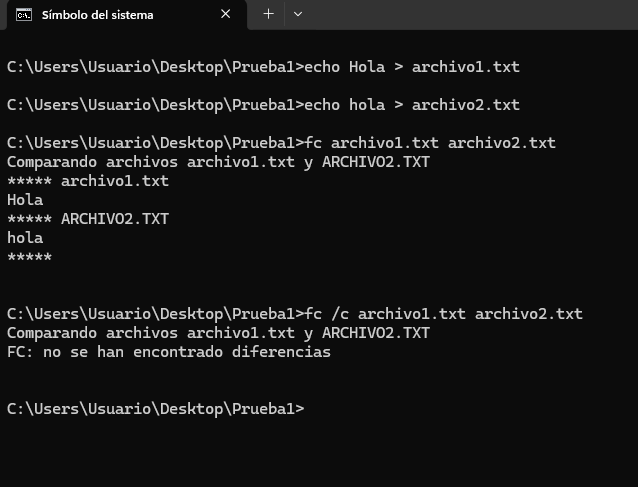

### Ejercicio 18 · Consultar usuarios del sistema

#### Enunciado

Ejecuta net user.

Anota los usuarios que aparecen.

Selecciona uno y consulta su información con net user nombre_usuario.

#### Debes entregar

comando usado para listar usuarios

usuarios encontrados

comando usado para consultar un usuario concreto

información principal obtenida

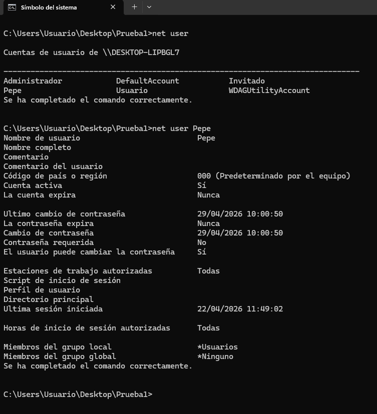

## BLOQUE 6 · Ejercicio integrador

### Ejercicio 19 · Análisis técnico básico del equipo

#### Enunciado

Realiza una revisión técnica del equipo usando comandos del Nivel 3.

Debes obtener como mínimo:

una conexión de red con su PID

el nombre del proceso asociado a esa conexión

el estado de una interfaz de red

el estado del firewall

una ruta de la tabla de enrutamiento

un servicio del sistema y su estado

una tarea programada

los permisos de una carpeta

los atributos de un archivo

un usuario del sistema

#### Debes entregar

Un informe con este formato:

Comando usado

Qué información obtiene

Resultado principal

Conclusión breve

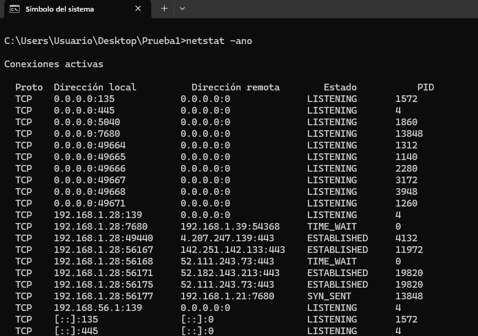

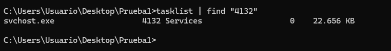

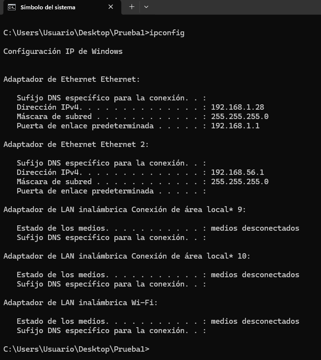

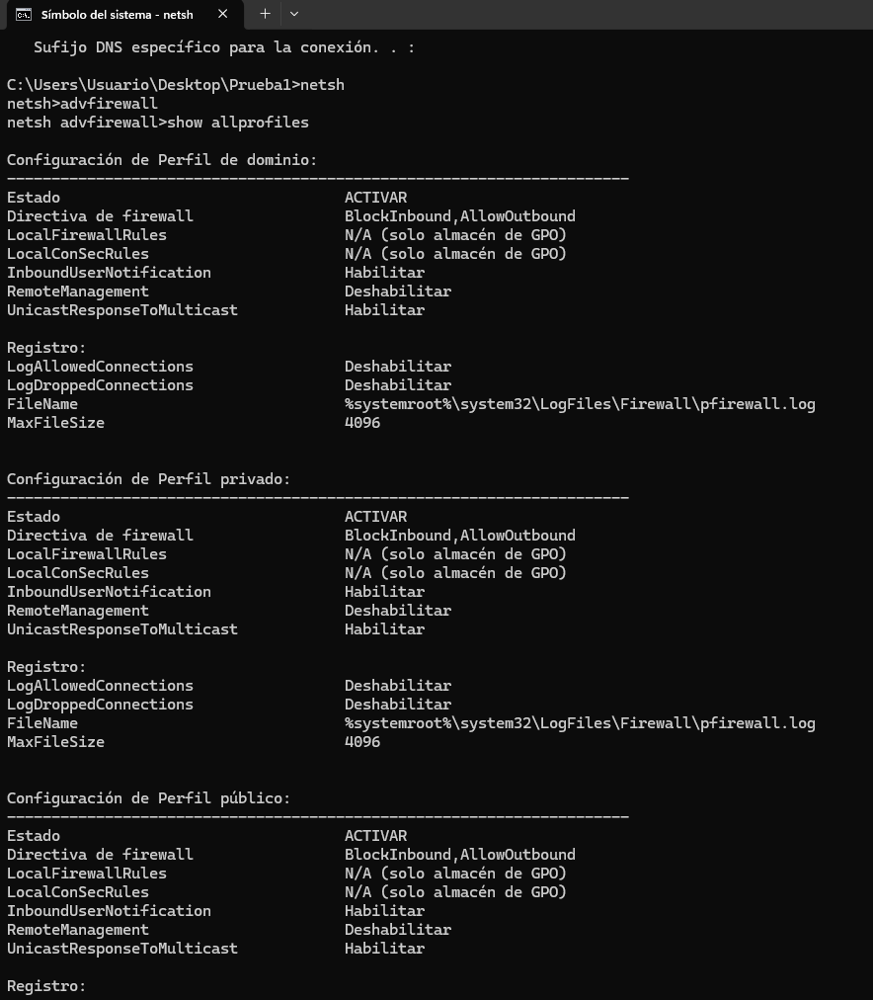

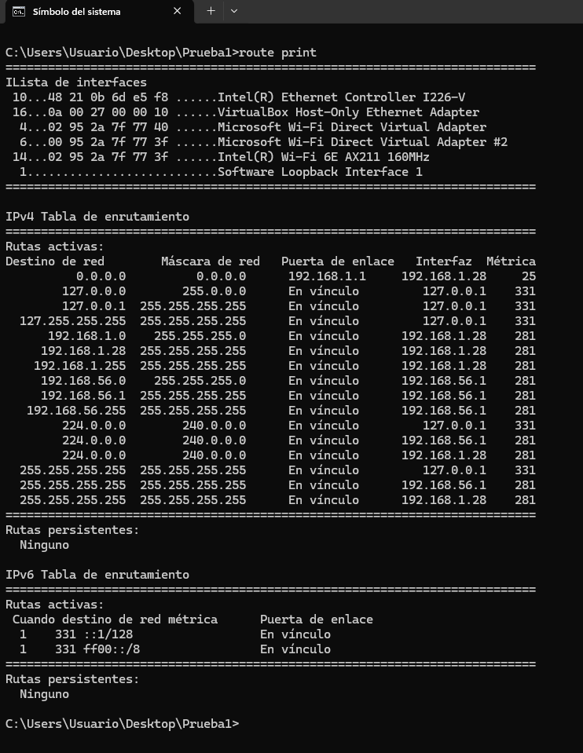

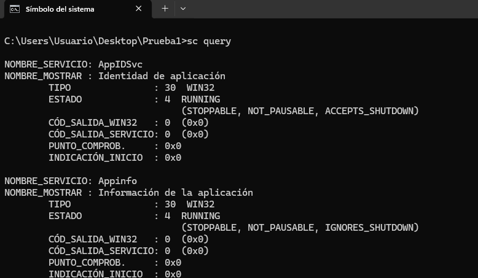

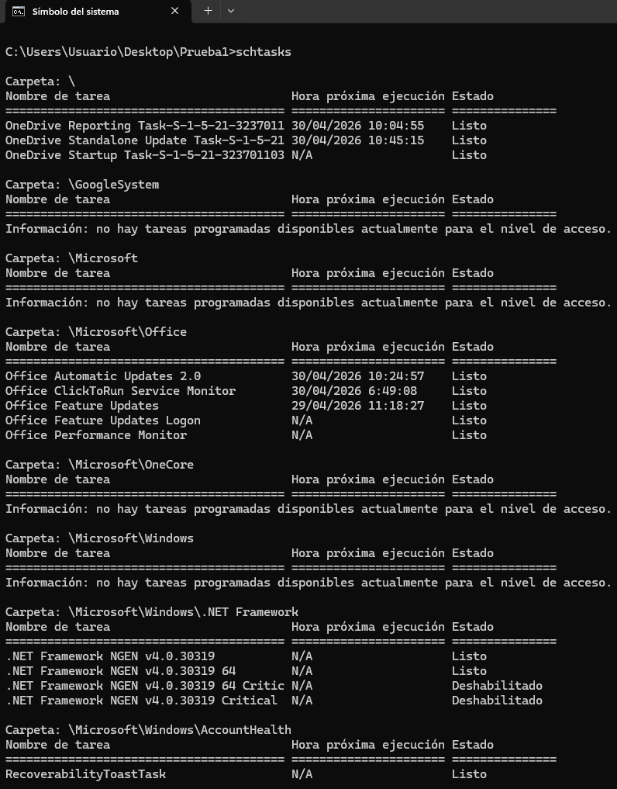

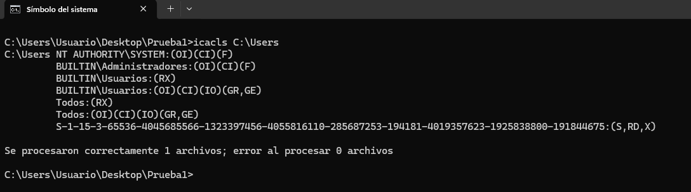

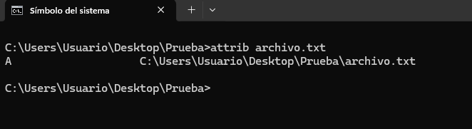

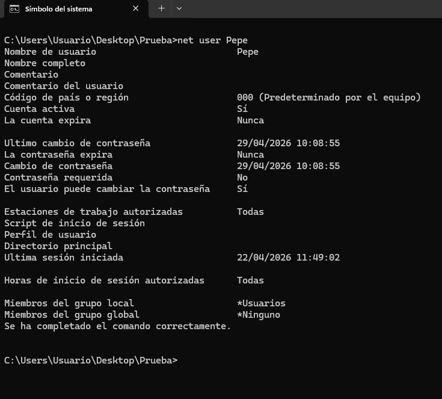

## BLOQUE 7 · Ejercicio de razonamiento

### Ejercicio 20 · Caso práctico

#### Enunciado

Imagina que un usuario te dice:

“Creo que el equipo tiene algo raro. Quiero saber si hay conexiones sospechosas, qué servicios están funcionando, si hay tareas programadas extrañas y qué usuarios existen en el sistema.”

Responde:

Qué comandos usarías para revisar conexiones y puertos

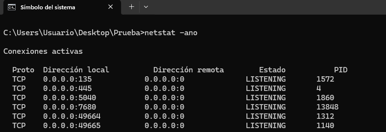

Qué comandos usarías para relacionar conexiones con procesos

tasklist

tasklist | find “PID”

Qué comandos usarías para consultar servicios

sc query

Qué comandos usarías para ver tareas programadas

schtasks

Qué comandos usarías para revisar usuarios

net user

net user Nombre_de_ususario

Qué comandos usarías para revisar permisos o atributos de un archivo sospechoso

icacls Archivo_ó_Carpeta

#### Debes entregar

lista ordenada de comandos

explicación breve de para qué usarías cada uno

## Conclusión

Esta práctica refuerza competencias de administración, reconocimiento y análisis técnico en entornos Windows/Linux, documentando comandos, configuración y evidencias de ejecución en laboratorio.
