# Linux - Nivel 1: terminal, navegación y ficheros

## Descripción

Práctica básica de terminal Linux con ayuda, navegación, rutas, listados, creación de carpetas, archivos, copias y comandos iniciales.

## Tecnologías / comandos trabajados

- Linux
- Kali
- Terminal
- ls
- cp
- ping
- pwd
- mkdir
- cat

## Contexto

Laboratorio realizado en entorno controlado como parte del bloque de Seguridad Informática IFCT0109. El contenido se ha normalizado para GitHub, eliminando referencias personales innecesarias y manteniendo las evidencias visuales del trabajo realizado.

## Procedimiento y evidencias

## BLOQUE 1 · Primer contacto con la terminal

### Ejercicio 1 · Abrir la terminal y comprobar que funciona

#### Enunciado

Abre la terminal de Linux.

Ejecuta el comando que limpia la pantalla.

Ejecuta el comando que muestra la fecha y la hora del sistema.

#### Debes entregar

comando para limpiar la pantallaclear

fecha y hora mostradas

date

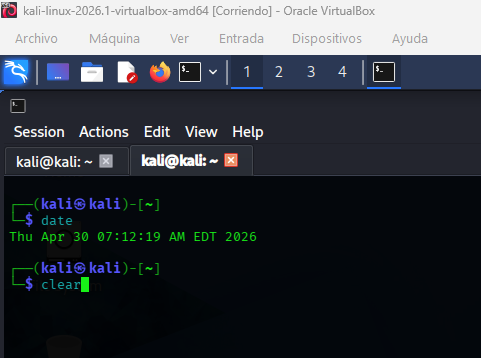

### Ejercicio 2 · Buscar ayuda en la terminal

#### Enunciado

Muestra el manual del comando ls.

Busca la ayuda rápida del comando cp.

Busca la ayuda rápida del comando ping.

Anota dos opciones útiles de ls y dos de ping.

#### Debes entregar

comando usado para ver el manual de lsman ls

comando usado para la ayuda de cpman cp

comando usado para la ayuda de pingman ping

dos opciones de ls

dos opciones de ping

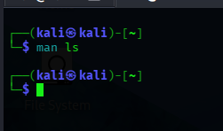

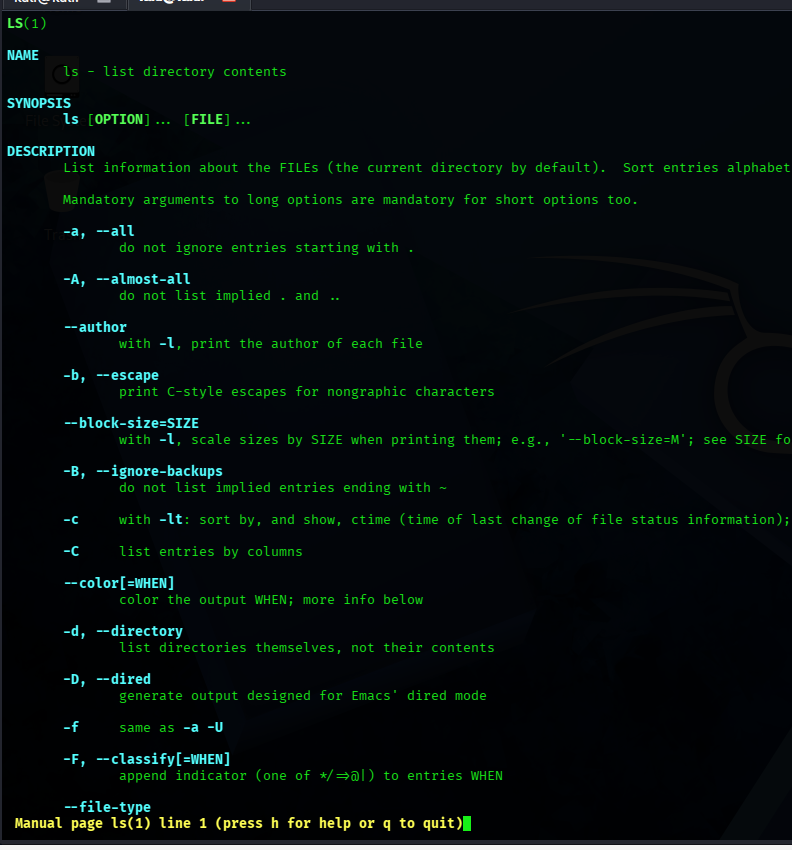

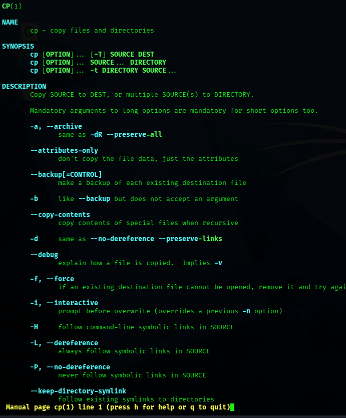

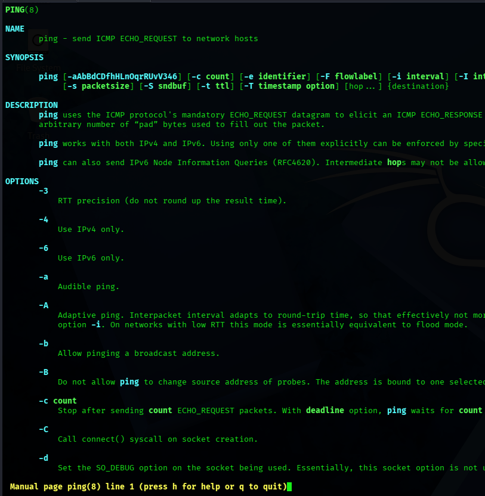

## BLOQUE 2 · Navegación por carpetas

### Ejercicio 3 · Saber dónde estás

#### Enunciado

Ejecuta el comando que muestra la carpeta actual.pwd

Anota la ruta completa en la que te encuentras.

#### Debes entregar

comando usado

ruta obtenida

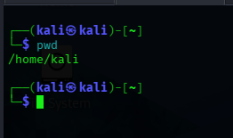

### Ejercicio 4 · Moverse por carpetas

#### Enunciado

Comprueba la carpeta actual.

Entra en una carpeta dentro de tu carpeta personal.

Sube un nivel

Entra en la carpeta raíz /.

Vuelve a tu carpeta personal.

#### Debes entregar

secuencia de comandos utilizada

breve explicación de lo que hiciste en cada paso

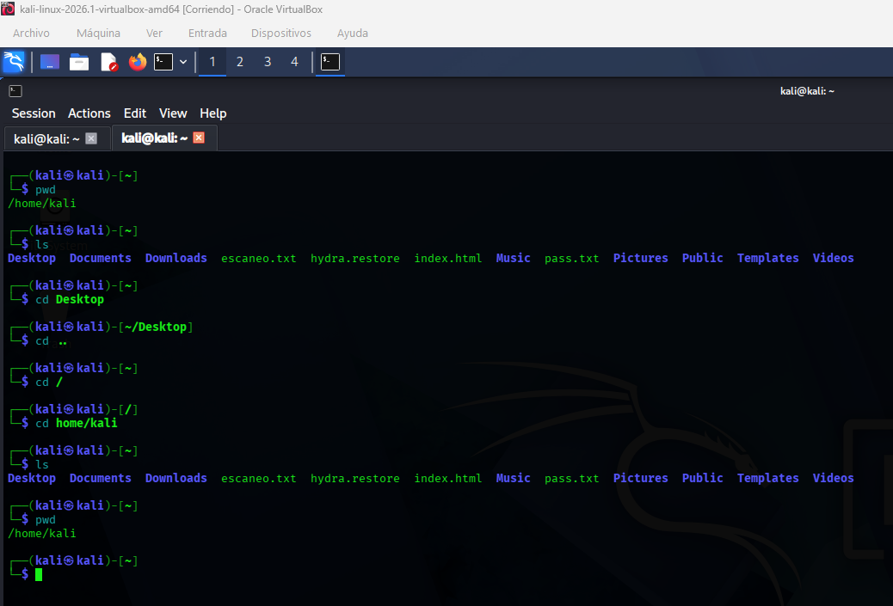

### Ejercicio 5 · Rutas con espacios

#### Enunciado

Crea o localiza una carpeta cuyo nombre tenga espacios.

Intenta acceder a ella sin usar comillas.

Explica qué ocurre.

Accede correctamente usando comillas.

#### Debes entregar

comando incorrecto usado

explicación del error

comando correcto

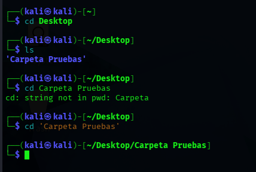

## BLOQUE 3 · Listado y estructura de carpetas

### Ejercicio 6 · Listar el contenido de una carpeta

#### Enunciado

Sitúate en una carpeta que tenga varios archivos o subcarpetas.

Muestra su contenido con ls.

Repite el ejercicio con ls -l.

Explica la diferencia entre ambas salidas.

#### Debes entregar

comandos usados

diferencia observada

ls -l te enseña los permisos

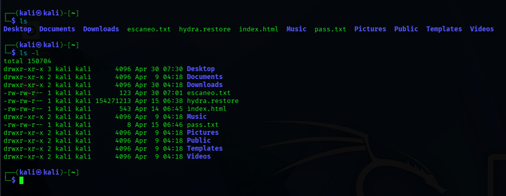

### Ejercicio 7 · Probar distintos formatos de ls

#### Enunciado

Ejecuta en la misma carpeta los siguientes comandos:

lsls -lls -als -lh

Después responde: 1. ¿Qué información extra aporta ls -l? te enseña los permisos2. ¿Qué muestra ls -a que no aparece normalmente? Los archivos ocultos3. ¿Qué ventaja tiene ls -lh frente a ls -l? tiene muchos mas detalles

#### Debes entregar

los cuatro comandos

respuesta a las tres preguntas

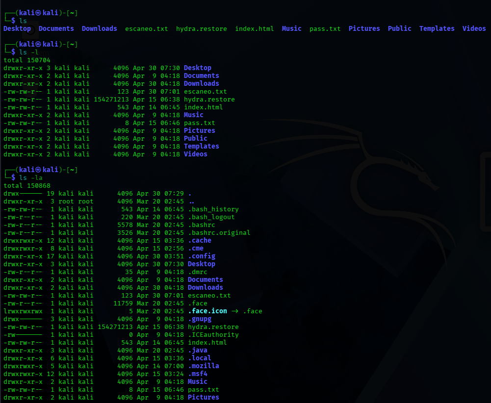

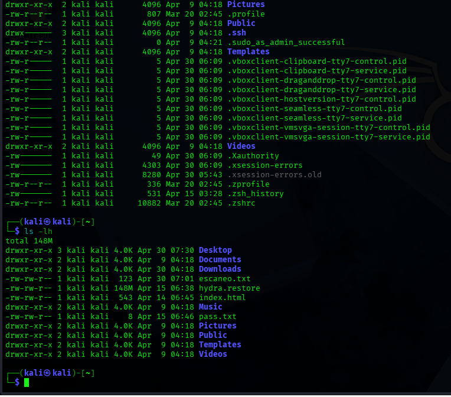

### Ejercicio 8 · Ver la estructura en árbol

#### Enunciado

Elige una carpeta sencilla.

Muestra su estructura con tree.

Repite con tree -L 2.

Explica qué cambia al limitar la profundidad.

#### Debes entregar

comando del primer caso

comando del segundo caso

diferencia observada

Importante

Si tree no está instalado en tu sistema, indícalo en la respuesta.

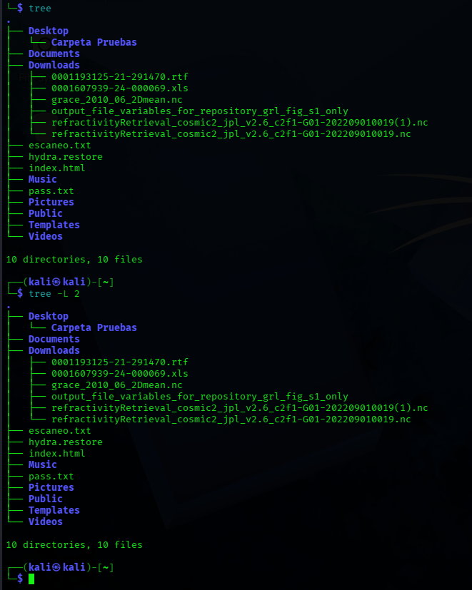

## BLOQUE 4 · Trabajo básico con carpetas

### Ejercicio 9 · Crear carpetas desde la terminal

#### Enunciado

Crea una carpeta llamada PracticasTerminal.

Crea dentro otra carpeta llamada Nivel1.

Crea una tercera carpeta llamada Archivos de prueba.

#### Debes entregar

comandos usados

listado final de carpetas creadas

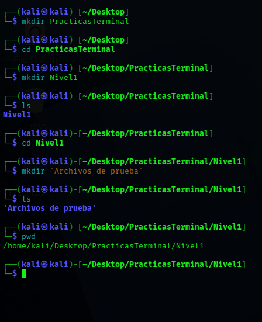

### Ejercicio 10 · Eliminar carpetas vacías

#### Enunciado

Elimina una de las carpetas vacías creadas en el ejercicio anterior.

Comprueba con ls que ya no existe.

#### Debes entregar

comando usado para eliminar

comando usado para comprobar

resultado observado

Importante

En este ejercicio debes practicar primero con carpetas vacías.

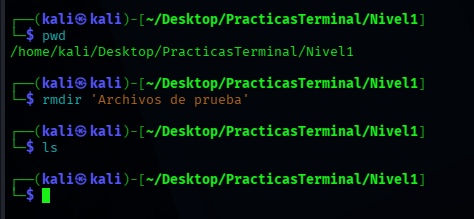

## BLOQUE 5 · Trabajo básico con archivos

### Ejercicio 11 · Leer un archivo de texto

#### Enunciado

Crea un archivo de texto llamado prueba_nivel1.txt.

Escribe dentro tres líneas de texto.

Muestra su contenido desde la terminal usando cat.

#### Debes entregar

ruta del archivo

comando usado

contenido mostrado

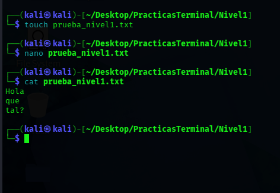

### Ejercicio 12 · Copiar un archivo con otro nombre

#### Enunciado

Utiliza el archivo prueba_nivel1.txt.

Haz una copia llamada copia_nivel1.txt.

Comprueba con ls que existen ambos archivos.

Muestra el contenido de la copia con cat.

#### Debes entregar

comando de copia usado

comando para comprobar la existencia

comando para mostrar el contenido

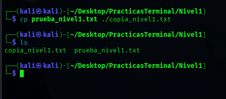

### Ejercicio 13 · Copiar un archivo a otra carpeta

#### Enunciado

Copia copia_nivel1.txt dentro de la carpeta PracticasTerminal.

Accede a esa carpeta.

Muestra su contenido.

#### Debes entregar

comando usado para copiar

comando usado para acceder

comando usado para listar el contenido

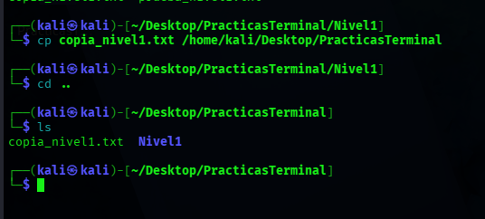

## BLOQUE 6 · Información básica del sistema

### Ejercicio 14 · Nombre del equipo e información del sistema

#### Enunciado

Muestra el nombre del equipo.

Muestra información general del sistema con uname.

Explica qué información aporta cada comando.

#### Debes entregar

comando usado para ver el nombre del equipo

comando usado para ver la información del sistema

resultado obtenido en ambos casos

explicación breve

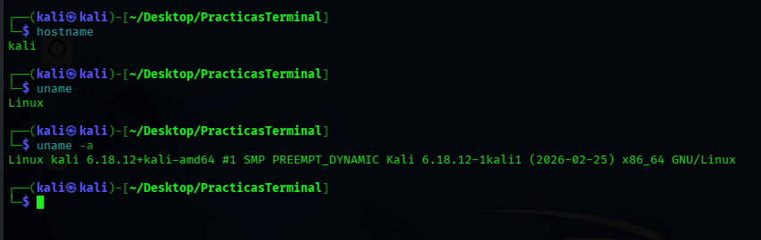

### Ejercicio 15 · Ampliar información del sistema

#### Enunciado

Ejecuta uname -a.

Ejecuta uname -r.

Ejecuta uname -m.

Explica qué información concreta aporta cada uno.

#### Debes entregar

los tres comandos usados

resultado principal de cada uno

explicación breve

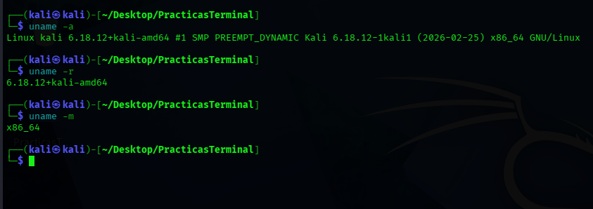

### Ejercicio 16 · Comparar comandos de información

#### Enunciado

Después de usar hostname, uname y uname -a, responde:

¿Cuál de los tres comandos da menos información? hostname

¿Cuál da más información? uname -a

¿Cuál usarías si solo quieres identificar rápidamente el equipo? hostname

¿Cuál usarías si quieres una información técnica más completa? uname -a

#### Debes entregar

respuestas razonadas

## BLOQUE 7 · Configuración de red y conectividad

### Ejercicio 17 · Consultar la configuración IP

#### Enunciado

Ejecuta ip addr.

Identifica en la salida:

una interfaz de red

una dirección IP

la dirección de loopback

Indica cuál crees que es la interfaz principal del equipo.

#### Debes entregar

comando usado

nombre de una interfaz eth1

IP encontrada 192.168.1.56

dirección de loopback 127.0.0.1

observación final

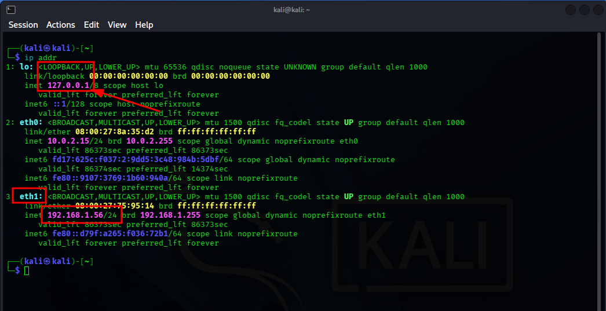

### Ejercicio 18 · Interpretar la salida de ip addr

#### Enunciado

Después de ejecutar ip addr, responde:

¿Qué diferencia hay entre lo y una interfaz de red normal?

La localhost es una interfaz para poder comunicarse consigo mismo mientras que la eth0 está asociada a un dispositivo físico y permite la comunicación con otros dispositivos en una red externa

¿Qué significa que una interfaz tenga una IP asignada?

Significa que posee una dirección lógica única en la red, lo que le permite enviar y recibir datos.

¿Por qué puede haber varias interfaces en el mismo equipo?

Para permitir funciones como el enrutamiento entre redes, la separación del tráfico (por ejemplo, entre datos y administración), o la implementación de arquitecturas más seguras, como un servidor web con una interfaz pública y otra privada para la comunicación con bases de datos.

#### Debes entregar

respuesta a las tres preguntas

### Ejercicio 19 · Comprobar conectividad con ping

#### Enunciado

Haz las siguientes pruebas:

ping a 127.0.0.1

ping a 8.8.8.8

ping a google.com usando solo 3 intentos

Después responde:

1. ¿Qué comprueba cada una de esas tres pruebas? La conectividad tanto de internet como la transmisión de datos entre máquinas.2. ¿Qué diferencia hay entre hacer ping a una IP y a un nombre de dominio? Al nombre de dominio suele darte la ip de donde se está conectando.

#### Debes entregar

tres comandos utilizados

resultado resumido de cada prueba

respuesta a las dos preguntas

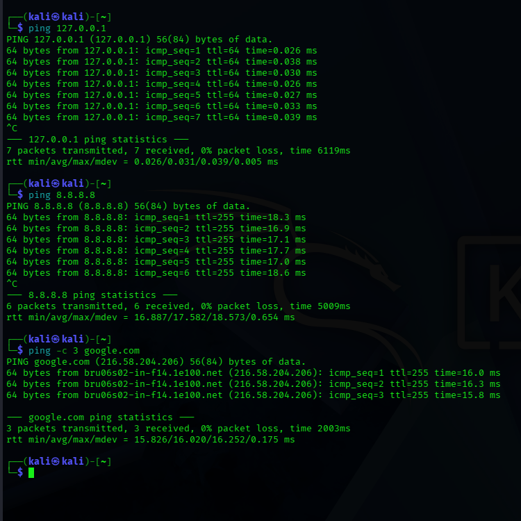

### Ejercicio 20 · Probar parámetros de ping

#### Enunciado

Haz un ping de solo 2 intentos a 8.8.8.8.

Haz un ping a un dominio forzando IPv4.

Investiga para qué sirve el parámetro -6.

#### Debes entregar

comando del apartado 1

comando del apartado 2

explicación del parámetro -6

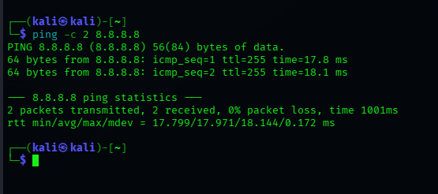

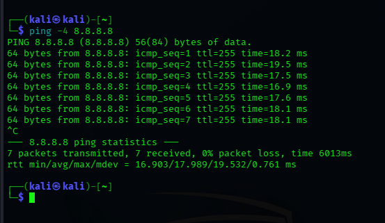

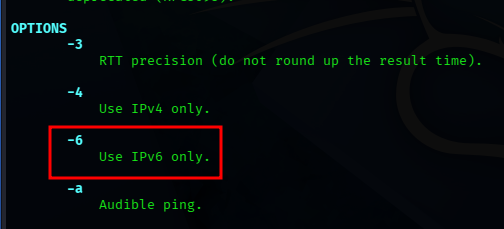

## BLOQUE 8 · Ejercicio integrador

### Ejercicio 21 · Reconocimiento básico del equipo desde la terminal

#### Enunciado

Realiza una pequeña enumeración básica del equipo usando únicamente comandos del Nivel 1.

Debes obtener como mínimo:

fecha y hora del sistema

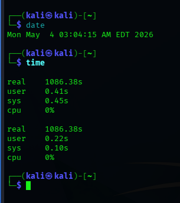

carpeta actual

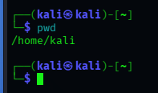

nombre del equipo

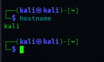

información general del sistema

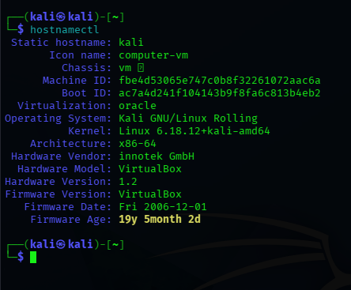

estructura de una carpeta en árbol

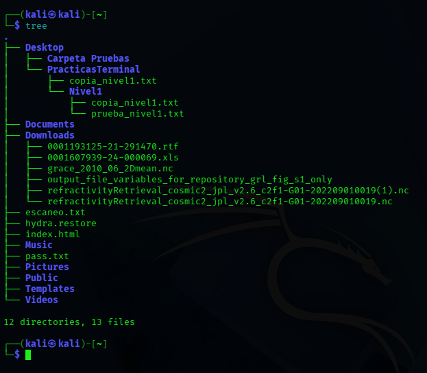

creación de una carpeta de prueba

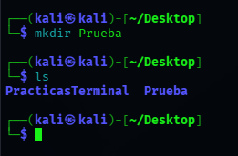

copia de un archivo de texto

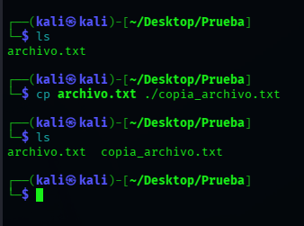

dirección IP del equipo

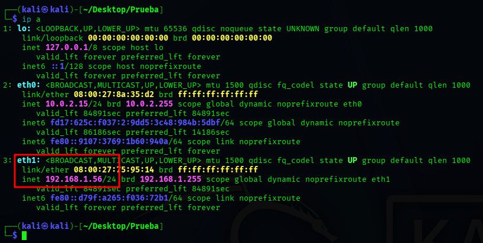

prueba de conectividad a una IP pública

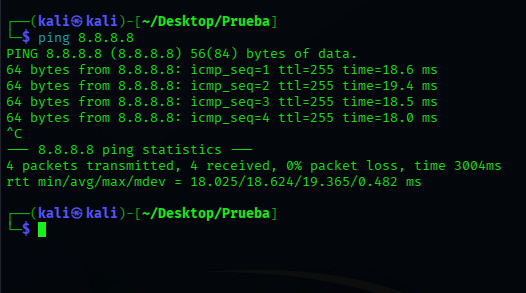

prueba de conectividad a un dominio

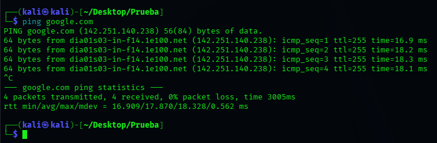

#### Debes entregar

Un pequeño informe con este formato:

comando usado

qué información obtiene

resultado principal

## BLOQUE 9 · Ejercicio de razonamiento

### Ejercicio 22 · Caso práctico

#### Enunciado

Un compañero te dice:

“No estoy acostumbrado a Linux y quiero saber lo básico del equipo sin tocar nada importante.”

Responde:

Qué comandos usarías para saber en qué carpeta estás y moverte

pwd

Qué comandos usarías para ver archivos y carpetas

ls

Qué comandos usarías para leer un archivo de texto

cat

Qué comandos usarías para identificar el equipo y el sistema

hostname y uname

Qué comandos usarías para comprobar la red

Ip a

Qué comandos usarías para buscar ayuda si no recuerdas un comando

man

#### Debes entregar

lista ordenada de comandos

explicación breve de para qué usarías cada uno

Evaluación

Se valorará:

uso correcto de los comandos

interpretación de resultados

capacidad de análisis básico

claridad en las respuestas

trabajo ordenado

Cierre

Cuando completes este Nivel 1, ya tendrás una base sólida para empezar a trabajar con Linux desde la terminal.

En el siguiente nivel iremos un paso más allá y empezaremos a trabajar con procesos, usuarios, permisos, búsquedas y primeras tareas de análisis del sistema.

## Conclusión

Esta práctica refuerza competencias de administración, reconocimiento y análisis técnico en entornos Windows/Linux, documentando comandos, configuración y evidencias de ejecución en laboratorio.
