# Linux - Nivel 2: usuarios, red local, DNS y rutas

## Descripción

Laboratorio Linux de identidad de usuario, grupos, interfaces, vecinos de red, DNS, traceroute, procesos y filtros básicos.

## Tecnologías / comandos trabajados

- Linux
- Kali
- whoami
- id
- groups
- ip
- ip neigh
- nslookup
- traceroute
- ps

## Contexto

Laboratorio realizado en entorno controlado como parte del bloque de Seguridad Informática IFCT0109. El contenido se ha normalizado para GitHub, eliminando referencias personales innecesarias y manteniendo las evidencias visuales del trabajo realizado.

## Procedimiento y evidencias

Nammu

## BLOQUE 1 · Usuario y sistema

### Ejercicio 1 · Identidad del usuario

#### Enunciado

Ejecuta el comando para ver el usuario actual.

Ejecuta el comando para ver información más completa del usuario.

Identifica:

nombre de usuario

UID

GID principal

#### Debes entregar

comandos usados

nombre de usuario

UID

GID principal

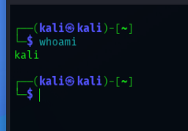

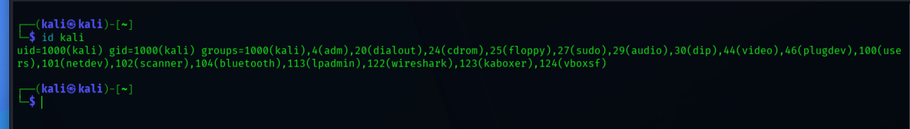

### Ejercicio 2 · Grupos del usuario

#### Enunciado

Muestra los grupos del usuario actual.

Anota los grupos que aparecen.

Indica si el usuario pertenece a algún grupo que sugiera privilegios elevados.

#### Debes entregar

comando usado

lista de grupos principales

conclusión breve sobre privilegios o grupos relevantes

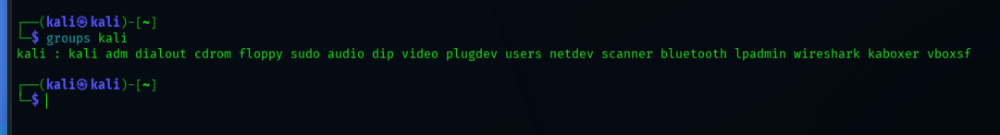

## BLOQUE 2 · Red local

### Ejercicio 3 · Interfaces y direcciones MAC

#### Enunciado

Ejecuta el comando para ver las interfaces de red.

Identifica:

nombre de una interfaz

estado de la interfaz

dirección MAC

#### Debes entregar

comando usado

nombre de la interfaz

estado

dirección MAC

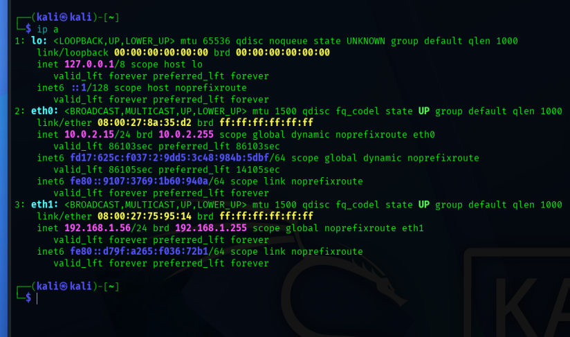

### Ejercicio 4 · Tabla de vecinos de red

#### Enunciado

Ejecuta ip neigh.

Identifica al menos:

una IP

su MAC asociada

Explica brevemente qué representa esta información.

#### Debes entregar

comando usado

ejemplo de IP + MAC

explicación breve

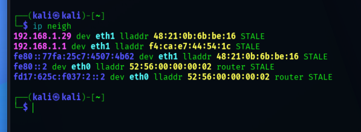

## BLOQUE 3 · DNS y rutas

### Ejercicio 5 · Resolución DNS

#### Enunciado

Ejecuta nslookup google.com.

Ejecuta nslookup openai.com.

Anota las IP obtenidas.

Si nslookup no está instalado, indícalo y explica qué problema te impide completar el ejercicio.

#### Debes entregar

comandos usados

IP de google

IP de openai

observación final

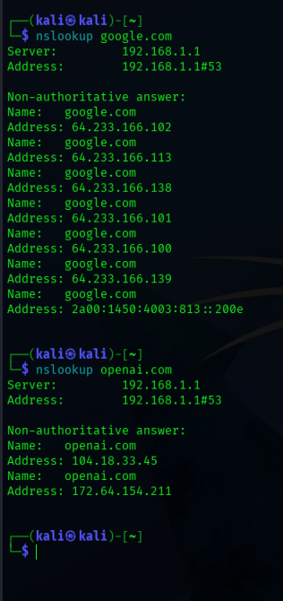

### Ejercicio 6 · Ruta de red

#### Enunciado

Ejecuta traceroute google.com.

Cuenta cuántos saltos puedes observar.

Indica si hay algún salto que no responde.

Si traceroute no está instalado, indícalo.

#### Debes entregar

comando usado

número de saltos

observación breve

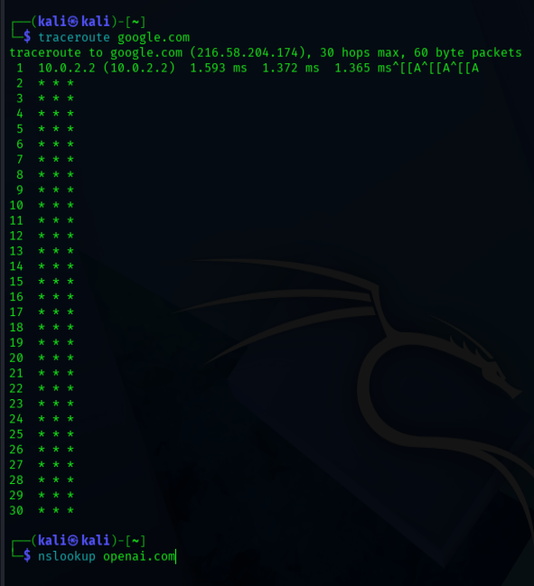

### Ejercicio 7 · Análisis básico de la ruta

#### Enunciado

Después de ejecutar traceroute, responde:

¿Qué representa cada salto? El router por el que pasa la señal

¿Por qué algunos saltos pueden no responder? Pues puede que tengan un firewall

¿Qué utilidad puede tener este comando para un técnico? Mucha utilidad

#### Debes entregar

respuesta a las tres preguntas

## BLOQUE 4 · Procesos

### Ejercicio 8 · Ver procesos

#### Enunciado

Ejecuta ps.

Ejecuta ps aux.

Identifica:

un proceso conocido

su PID

el usuario que lo ejecuta

#### Debes entregar

comandos usados

proceso elegido

PID

usuario asociado

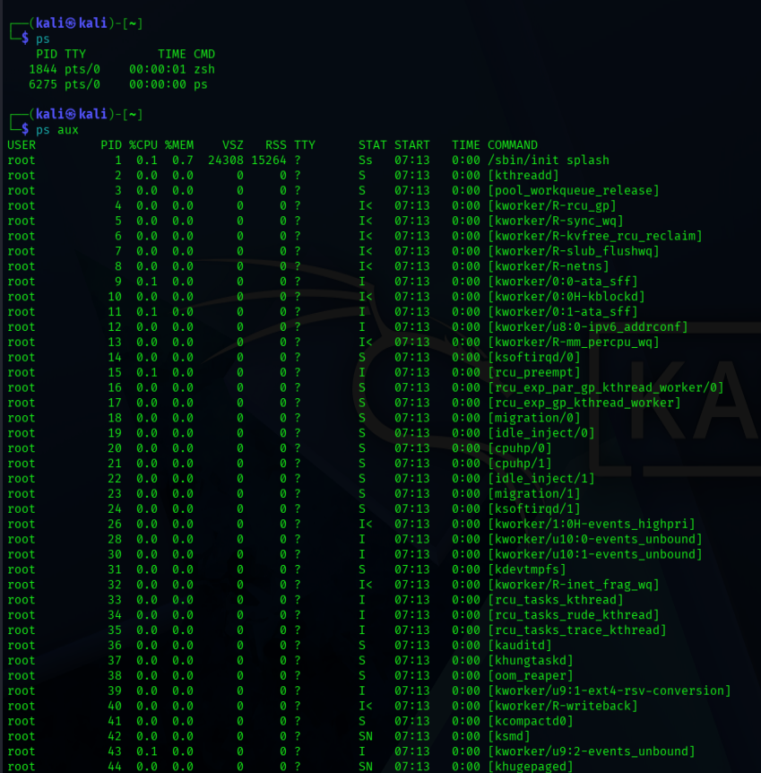

### Ejercicio 9 · Finalizar un proceso controlado

#### Enunciado

Abre una aplicación sencilla o un proceso de prueba.

Localiza su PID con ps aux.

Cierra el proceso con kill.

#### Debes entregar

comando usado para localizarlo

comando usado para cerrarlo

nombre del proceso

PID

IMPORTANTE

No cerrar procesos del sistema.

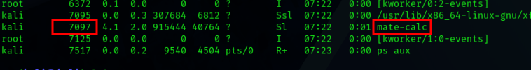

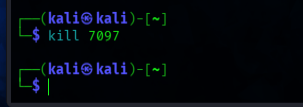

## BLOQUE 5 · Búsqueda y filtrado

### Ejercicio 10 · Filtrar procesos con grep

#### Enunciado

Ejecuta ps aux.

Filtra un proceso concreto usando grep.

Explica qué ventaja tiene filtrar frente a leer toda la salida completa.

#### Debes entregar

comando completo usado

proceso filtrado

explicación breve

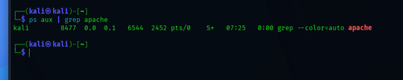

### Ejercicio 11 · Buscar dentro de archivos

#### Enunciado

Crea un archivo de texto con varias líneas.

Busca una palabra concreta con grep.

Repite ignorando mayúsculas y minúsculas.

#### Debes entregar

comando usado en el primer caso

comando usado en el segundo caso

palabra buscada

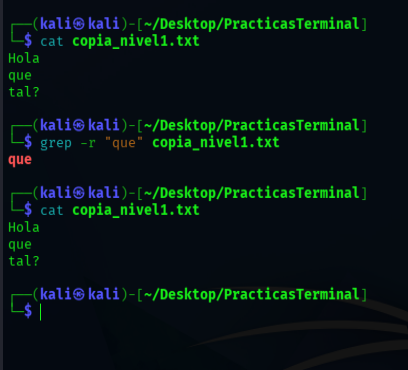

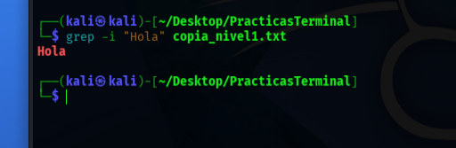

### Ejercicio 12 · Buscar de forma recursiva

#### Enunciado

Crea una pequeña estructura de carpetas con algún archivo de texto dentro.

Busca una palabra usando grep -r.

Explica qué diferencia hay entre buscar en un archivo concreto y buscar de forma recursiva.

#### Debes entregar

comando usado

resultado encontrado

explicación breve

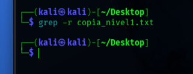

### Ejercicio 13 · Localizar comandos

#### Enunciado

Usa which para localizar ls.

Usa which para localizar ping.

Usa which para localizar otro ejecutable instalado en tu sistema.

#### Debes entregar

comandos usados

rutas encontradas

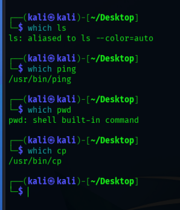

### Ejercicio 14 · Controlar salida con less

#### Enunciado

Ejecuta ps aux.

Repite usando ps aux | less.

Explica la diferencia entre ambas formas de visualizar la salida.

#### Debes entregar

comandos usados

explicación breve

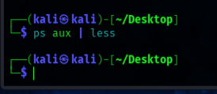

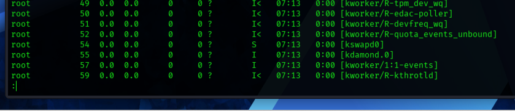

## BLOQUE 6 · Ejercicio integrador

### Ejercicio 15 · Enumeración básica del sistema en Linux

#### Enunciado

Realiza una enumeración del equipo usando comandos del Nivel 2.

Debes obtener:

usuario actual

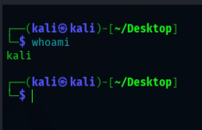

grupos del usuario

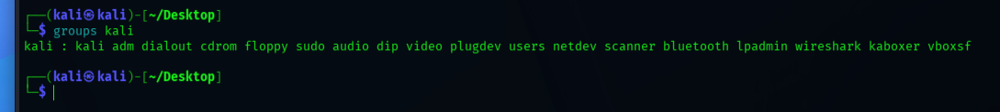

MAC de una interfaz

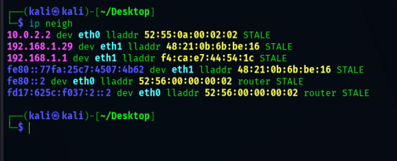

tabla de vecinos de red

IP de un dominio

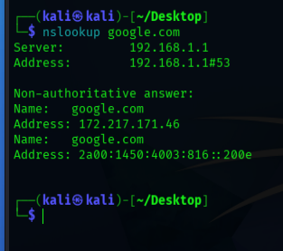

ruta de red

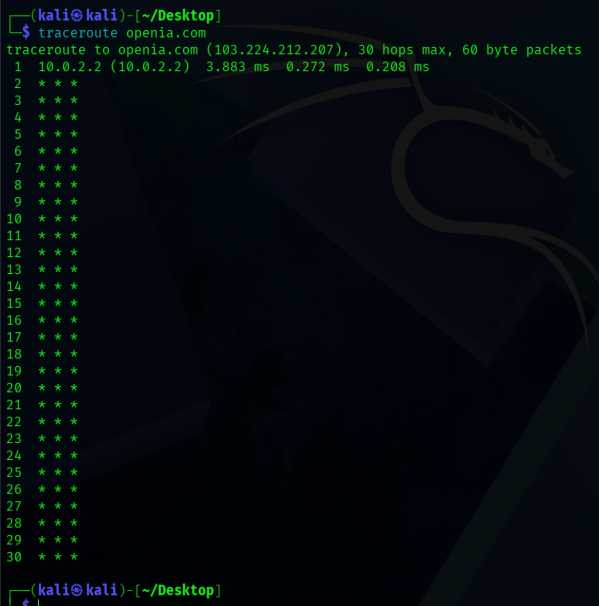

lista de procesos

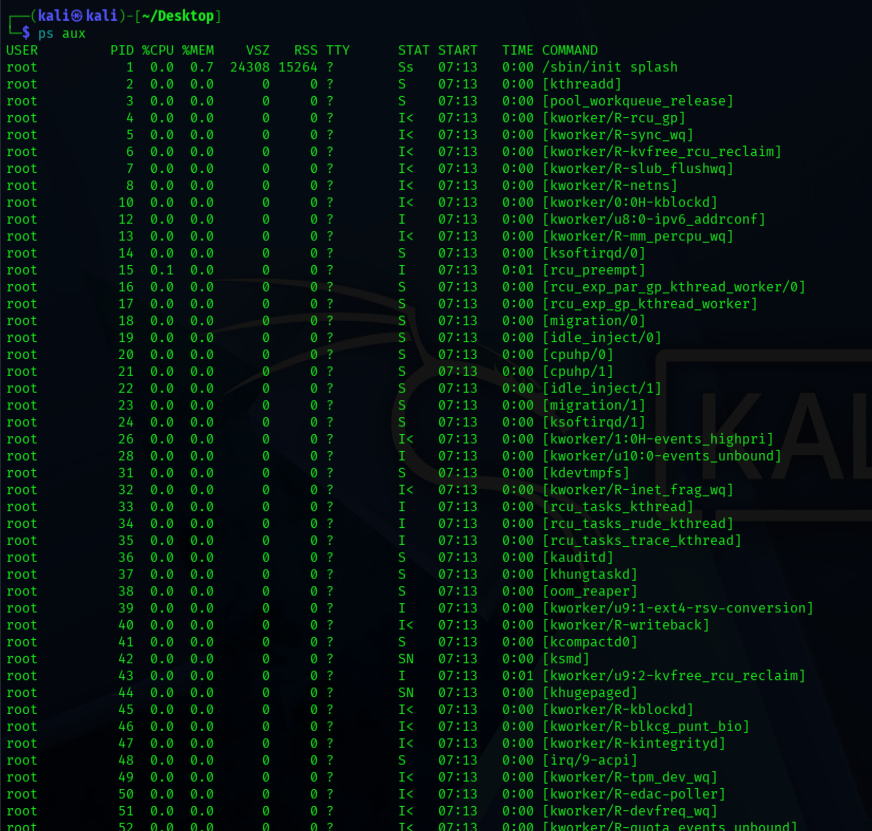

búsqueda filtrada de un proceso

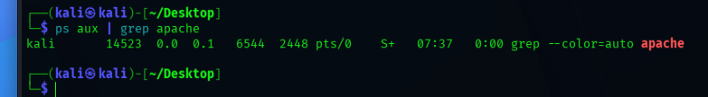

localización de un ejecutable

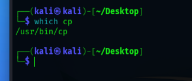

#### Debes entregar

comando usado

qué información obtiene

resultado principal

## BLOQUE 7 · Ejercicio de razonamiento

### Ejercicio 16 · Caso práctico

#### Enunciado

Un usuario dice:

“No sé muy bien qué usuario estoy usando, qué grupos tengo, qué procesos hay abiertos y si la red funciona correctamente.”

Responde:

Qué comandos usarías para ver usuario y grupos

Whoami, groups

Qué comandos usarías para revisar interfaces y MAC

Ip neigh

Qué comandos usarías para comprobar resolución DNS

nslookup

Qué comandos usarías para analizar la ruta de red

traceroute

Qué comandos usarías para ver procesos

Ps aux

Qué comandos usarías para filtrar información en salidas largas

grep

#### Debes entregar

lista de comandos

explicación breve de cada uno

Cierre

Cuando completes este nivel, ya estarás empezando a trabajar como un técnico real en Linux:

observando

analizando

filtrando información

interpretando resultados

En el siguiente nivel iremos más allá con comandos de administración, conexiones, servicios, tareas programadas, permisos y análisis más técnico del sistema.

## Conclusión

Esta práctica refuerza competencias de administración, reconocimiento y análisis técnico en entornos Windows/Linux, documentando comandos, configuración y evidencias de ejecución en laboratorio.
