# Linux - Nivel 3: puertos, servicios, cron y logs

## Descripción

Práctica de análisis de conexiones y puertos con ss, procesos, rutas, servicios systemd, tareas cron, logs y diagnóstico básico.

## Tecnologías / comandos trabajados

- Linux
- Kali
- ss
- ps
- ip route
- systemctl
- cron
- journalctl
- logs

## Contexto

Laboratorio realizado en entorno controlado como parte del bloque de Seguridad Informática IFCT0109. El contenido se ha normalizado para GitHub, eliminando referencias personales innecesarias y manteniendo las evidencias visuales del trabajo realizado.

## Procedimiento y evidencias

Nammu

## BLOQUE 1 · Conexiones y puertos

### Ejercicio 1 · Ver conexiones y puertos

#### Enunciado

Ejecuta ss -t.

Ejecuta ss -l.

Ejecuta ss -tuln.

Explica qué diferencia observas entre las tres salidas.

#### Debes entregar

los tres comandos usados

explicación breve de la diferencia entre ellos

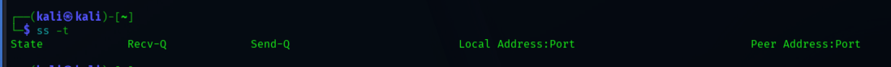

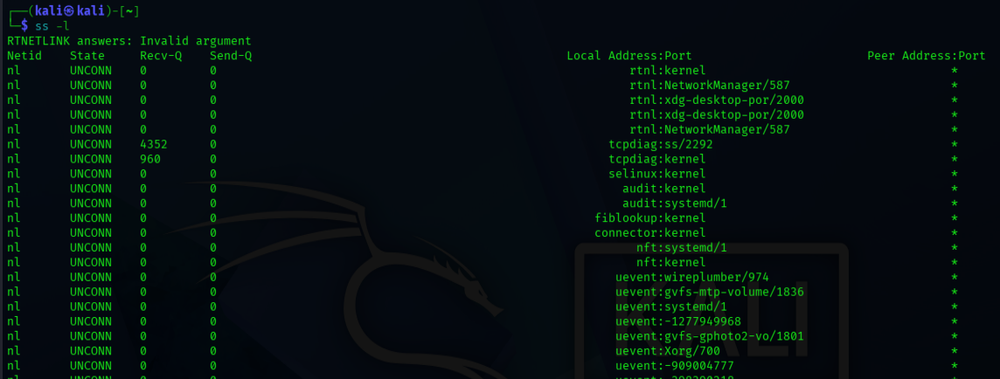

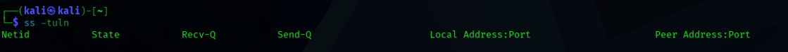

### Ejercicio 2 · Ver puertos y proceso asociado

#### Enunciado

Ejecuta ss -tulnp.

Identifica al menos:

un puerto en escucha

el protocolo

el proceso asociado si aparece

#### Debes entregar

comando usado

un puerto en escucha

protocolo

proceso asociado

### Ejercicio 3 · Relacionar conexiones con procesos

#### Enunciado

Usa ss -tulnp para localizar un proceso asociado a una conexión o puerto.

Usa ps aux para buscar más información sobre ese proceso.

Relaciona la conexión o puerto con el nombre del proceso.

#### Debes entregar

comando usado para obtener el proceso o PID

comando usado para buscar el proceso

nombre del proceso encontrado

conclusión breve

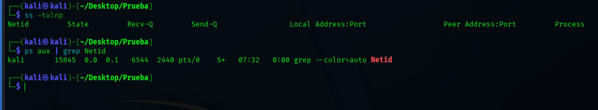

## BLOQUE 2 · Red avanzada

### Ejercicio 4 · Consultar rutas de red

#### Enunciado

Ejecuta ip route.

Localiza:

la ruta por defecto

la interfaz principal

una red o subred que aparezca en la tabla

#### Debes entregar

comando usado

ruta por defecto

interfaz principal

ejemplo de red encontrada

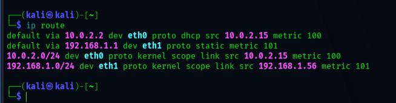

### Ejercicio 5 · Interpretar la tabla de rutas

#### Enunciado

Después de ejecutar ip route, responde:

¿Qué significa la ruta por defecto? La ruta predetermindad utilizada para conectarse

¿Para qué sirve conocer la interfaz asociada a una ruta? Para saber en que interfaz estás

¿Por qué puede haber varias entradas en la tabla? Para diferentes interfaces de red.

#### Debes entregar

respuesta a las tres preguntas

## BLOQUE 3 · Servicios y tareas programadas

### Ejercicio 6 · Consultar servicios activos

#### Enunciado

Ejecuta systemctl list-units --type=service --state=running.

Selecciona un servicio y anota:

nombre del servicio

estado observado

una breve descripción si aparece

#### Debes entregar

comando usado

nombre de un servicio

estado observado

descripción breve

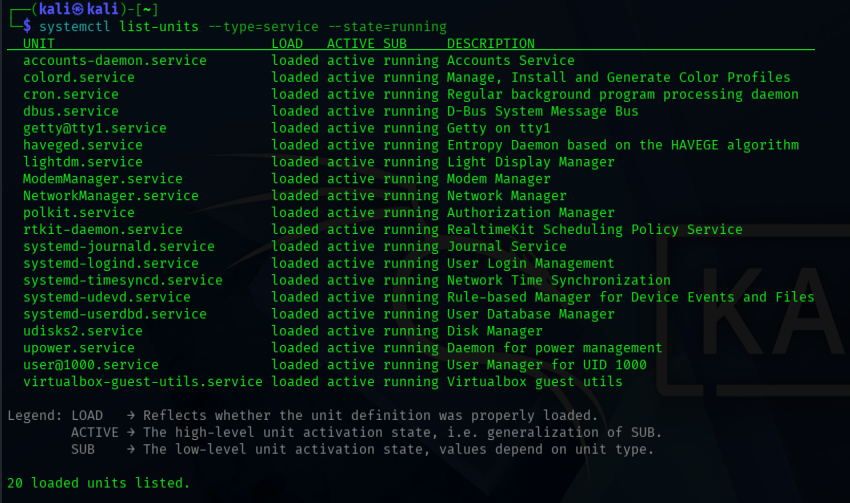

### Ejercicio 7 · Consultar el estado de un servicio concreto

#### Enunciado

Elige un servicio que exista en tu sistema.

Ejecuta systemctl status nombre_servicio.

Explica qué información adicional aparece respecto al listado general.

#### Debes entregar

comando usado

nombre del servicio consultado

explicación breve de la diferencia

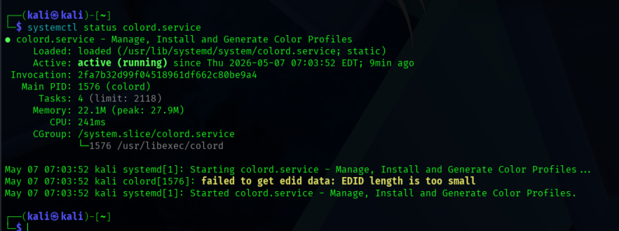

### Ejercicio 8 · Consultar tareas programadas

#### Enunciado

Ejecuta crontab -l.

Si no hay tareas programadas, indícalo.

Si existen tareas, anota una línea y explica qué representa de forma general.

#### Debes entregar

comando usado

resultado observado

explicación breve

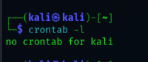

### Ejercicio 9 · Observar tareas programadas del sistema

#### Enunciado

Consulta si existe la carpeta /etc/cron.d o una carpeta similar de cron en tu sistema.

Lista su contenido con ls -l.

Explica qué idea general te da esa información.

#### Debes entregar

comando usado para comprobar la carpeta

comando usado para listar el contenido

observación final

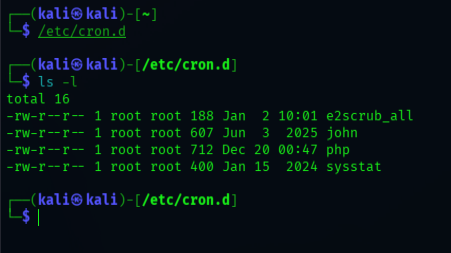

## BLOQUE 4 · Permisos y metadatos

### Ejercicio 10 · Consultar permisos con ls -l

#### Enunciado

Crea una carpeta de prueba o usa una que ya exista.

Ejecuta ls -l sobre su contenido.

Identifica en un archivo o carpeta:

tipo de elemento

permisos

propietario

grupo

#### Debes entregar

comando usado

nombre del elemento elegido

permisos observados

propietario

grupo

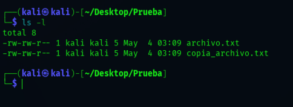

### Ejercicio 11 · Consultar metadatos con stat

#### Enunciado

Ejecuta stat sobre un archivo de texto.

Anota:

tamaño

permisos

fecha de modificación

propietario

#### Debes entregar

comando usado

tamaño

permisos

fecha de modificación

propietario

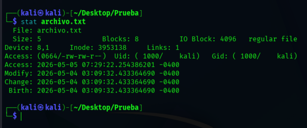

### Ejercicio 12 · Comparar ls -l y stat

#### Enunciado

Después de usar ls -l y stat sobre el mismo archivo, responde:

¿Qué comando da una visión más rápida? Ls -l

¿Qué comando da más detalle? stat

¿Cuál usarías en una revisión rápida y cuál en una auditoría más técnica? La primera ls -l stat

#### Debes entregar

respuestas razonadas

### Ejercicio 13 · Consultar ACL con getfacl

#### Enunciado

Ejecuta getfacl sobre un archivo o carpeta de prueba.

Identifica si aparecen entradas adicionales además de usuario, grupo y otros.

Si getfacl no está instalado, indícalo.

#### Debes entregar

comando usado

resultado principal

observación breve

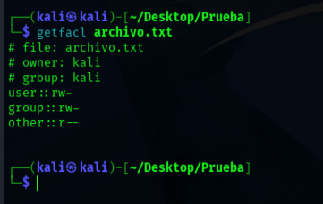

### Ejercicio 14 · Probar permisos con chmod en archivo de prueba

#### Enunciado

Crea un archivo de prueba.

Comprueba sus permisos con ls -l.

Cámbiale los permisos usando chmod a un valor sencillo, por ejemplo 644.

Comprueba qué ocurre después.

#### Debes entregar

comando usado para comprobar antes

comando usado para cambiar permisos

comando usado para comprobar después

explicación breve de lo observado

Importante

Haz esto solo con archivos de prueba creados para el ejercicio.

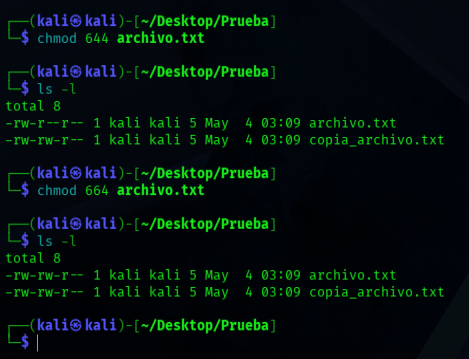

## BLOQUE 5 · Comparación de archivos y usuarios

### Ejercicio 15 · Comparar archivos con diff

#### Enunciado

Crea dos archivos de texto muy parecidos, pero con una pequeña diferencia.

Compáralos con diff.

Explica qué diferencia detecta el comando.

#### Debes entregar

comando usado

diferencia encontrada

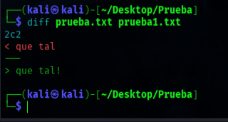

### Ejercicio 16 · Comparación en formato más legible

#### Enunciado

Compara los mismos archivos usando diff -u.

Explica qué ventaja tiene este formato respecto al modo normal.

#### Debes entregar

comando usado

explicación breve

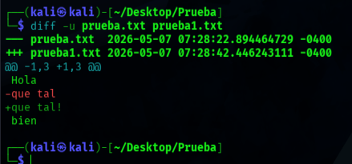

### Ejercicio 17 · Consultar usuarios del sistema

#### Enunciado

Ejecuta getent passwd.

Anota algunos usuarios que aparezcan.

Selecciona uno y consulta su información con getent passwd nombre_usuario.

#### Debes entregar

comando usado para listar usuarios

ejemplos de usuarios encontrados

comando usado para consultar un usuario concreto

información principal obtenida

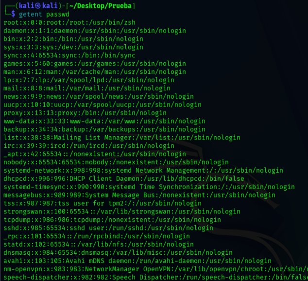

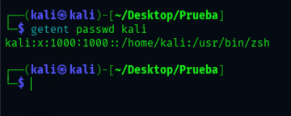

## BLOQUE 6 · Ejercicio integrador

### Ejercicio 18 · Análisis técnico básico del equipo en Linux

#### Enunciado

Realiza una revisión técnica del equipo usando comandos del Nivel 3.

Debes obtener como mínimo:

un puerto o conexión de red

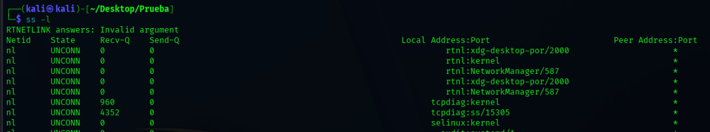

el proceso asociado a ese puerto o conexión

la ruta por defecto del sistema

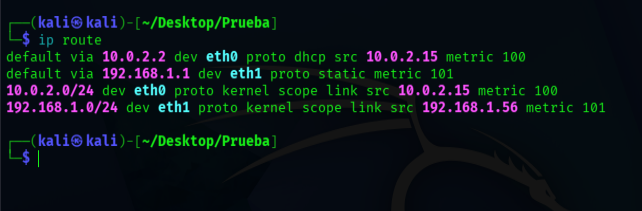

un servicio del sistema y su estado

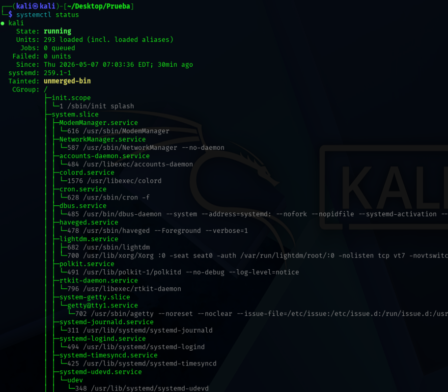

una tarea programada o la comprobación de su ausencia

los permisos de un archivo o carpeta

los metadatos de un archivo

una comparación entre dos archivos

un usuario del sistema

#### Debes entregar

Un informe con este formato:

comando usado

qué información obtiene

resultado principal

conclusión breve

## BLOQUE 7 · Ejercicio de razonamiento

### Ejercicio 19 · Caso práctico

#### Enunciado

Imagina que un usuario te dice:

“Creo que el equipo tiene algo raro. Quiero saber si hay puertos abiertos, qué servicios están funcionando, si hay tareas programadas, qué permisos tiene un archivo sospechoso y qué usuarios existen en el sistema.”

Responde:

Qué comandos usarías para revisar conexiones y puertosss -l y ps aux

Qué comandos usarías para relacionar conexiones con procesosps aux

Qué comandos usarías para consultar serviciossystemctl

Qué comandos usarías para ver tareas programadascrontab -l

Qué comandos usarías para revisar permisos y metadatos de un archivols -l , stat

Qué comandos usarías para comparar archivos de configuracióndiff

Qué comandos usarías para revisar usuarios del sistema

getent

#### Debes entregar

lista ordenada de comandos

explicación breve de para qué usarías cada uno

Evaluación

Se valorará:

uso correcto de la sintaxis

capacidad para interpretar salidas técnicas

relación entre información obtenida con distintos comandos

claridad en las respuestas

trabajo ordenado y prudente

Cierre

Cuando completes este Nivel 3, ya estarás trabajando con una mentalidad mucho más cercana a la de un técnico de sistemas o un analista de seguridad en Linux:

observando

interpretando

relacionando información

tocando lo mínimo imprescindible

Ese es justamente el enfoque correcto cuando se trabaja con terminal en entornos reales.

## Conclusión

Esta práctica refuerza competencias de administración, reconocimiento y análisis técnico en entornos Windows/Linux, documentando comandos, configuración y evidencias de ejecución en laboratorio.
