# NAS Synology + Cobian - Copias de seguridad para una asesoría

## Descripción

Práctica de preparación de un NAS Synology, carpeta compartida, permisos, acceso SMB y configuración de copias de seguridad con Cobian para una empresa ficticia.

## Tecnologías / comandos trabajados

- NAS Synology
- SMB
- Windows
- Cobian Backup
- Backups
- Permisos

## Contexto

Laboratorio realizado en entorno controlado como parte del bloque de Seguridad Informática IFCT0109. El contenido se ha normalizado para GitHub, eliminando referencias personales innecesarias y manteniendo las evidencias visuales del trabajo realizado.

## Procedimiento y evidencias

Nammu

Fecha: 16/04/2026

NAS: 192.168.1.48

Nombre de la carpeta compartida: Carpeta_de_empresa

Nombre del usuario creado:

Nombre de la tarea en Cobian: Copia de seguridad Asesoría Laboral ABC S.L.

Asesoría Laboral ABC S.L.

Es una pequeña asesoría que gestiona documentación sensible de sus clientes, como contratos, nóminas, informes y otros archivos importantes. Si uno de sus equipos falla, un usuario borra información por error o se produce una incidencia de seguridad, la empresa podría perder datos críticos para su actividad diaria.

¿Qué información debería proteger primero la asesoría?Documentación con valor legal y datos sensibles (nóminas, contratos, expedientes de clientes y bases de datos contables).

¿Qué riesgos pueden afectar a esa información?

Infección por ransomware, degradación física de discos duros, errores humanos (borrado accidental) y accesos no autorizados.

¿Qué medida concreta proponéis para reducir el impacto de una pérdida de información?

Implementación de un sistema de copias de seguridad automatizado y cifrado hacia un repositorio externo tipo NAS.

¿Por qué es útil almacenar la copia en un NAS y no solo en el propio equipo?

Proporciona aislamiento físico de los datos y redundancia mediante RAID, protegiendo la información incluso si el equipo original queda inutilizable.

¿Con qué frecuencia debería hacerse la copia?

Periodicidad diaria durante horas de baja actividad para minimizar el RPO (objetivo de punto de recuperación) a menos de 24 horas. El alto volumen de transacciones diarias en una asesoría hace que cualquier intervalo superior suponga una pérdida de datos inasumible.

¿Quién debería revisar que la copia funciona correctamente?

El Administrador de Sistemas o el Responsable de Seguridad, encargado de verificar los logs de éxito y realizar pruebas de restauración.

## Parte A. Preparación del NAS Synology

Acceder al panel de administración del NAS.

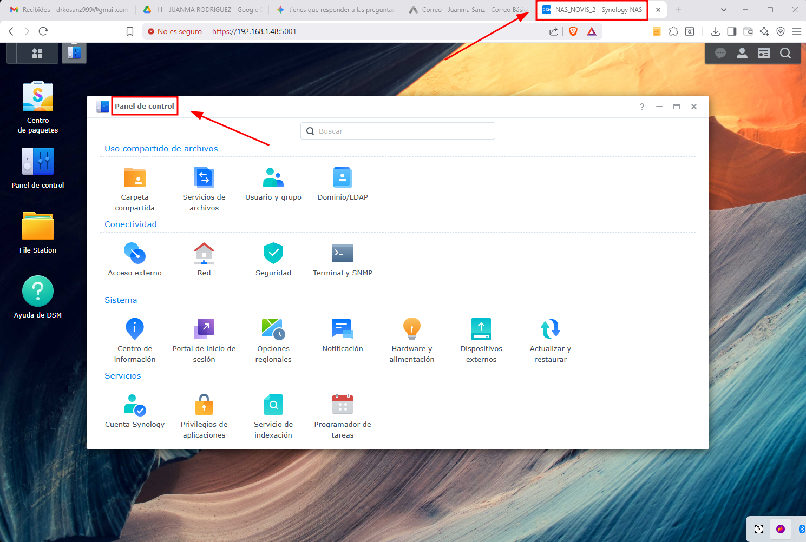

Una vez dentro del Panel de Administración en “Panel de control” donde pone “Uso compartido de archivos” seleccionamos “Carpeta compartida”.

Crear una carpeta compartida para almacenar las copias.

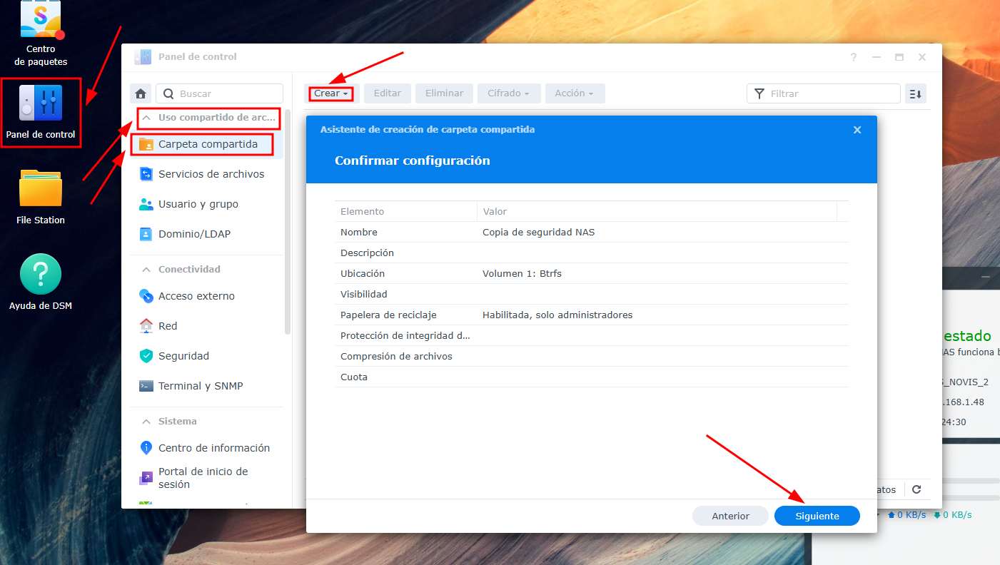

Al crearla seguiremos unos pasos muy sencillos en los cuáles no hace falta cifrar la carpeta, simplemente le daremos a siguiente y se creará la carpeta.

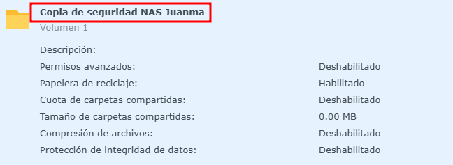

Asignar permisos adecuados al usuario sobre la carpeta compartida.

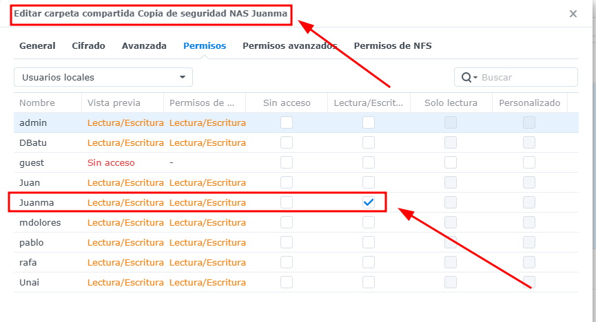

Hacemos click derecho sobre la carpeta que hemos creado, seleccionamos editar, en el apartado “Permisos”, seleccionamos los permisos de “Lectura/Escritura” a nuestro usuario “Juanma” en este caso.

Ahora probamos el acceso a la carpeta compartida.

Ponemos \\192.168.1.48 en la parte donde está la ruta del explorador de archivo, nos lleva directamente a la carpeta compartida, seguidamente nos pedirá las credenciales para poder acceder.

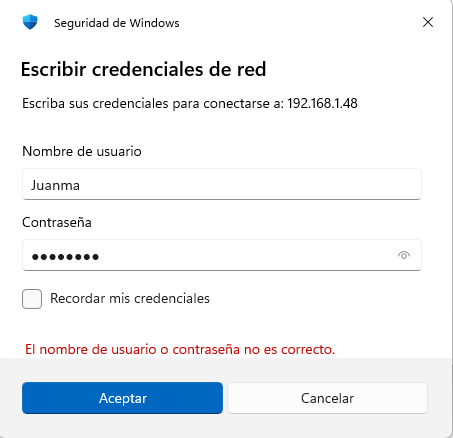

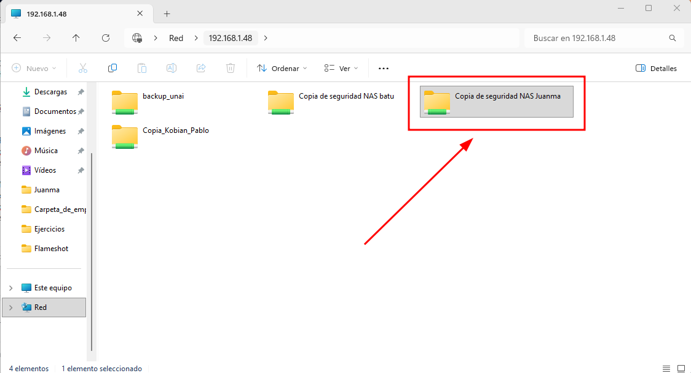

Ya podemos acceder a la carpeta compartida.

Ahora realizaremos el proceso de copia de seguridad con Cobian en la que realizaremos una copia de origen del directorio “Carpeta_de_empresa” que esta ubicado en el escritorio. Este directorio almacena archivos y otros directorios confidenciales de la empresa. La copia la realizaremos dentro de dos directorios, uno ubicado en el escritorio llamado “Copia_Carpeta_de_empresa”, y el otro directorio es la carpeta compartida que creamos en el NAS llamado “Copia de seguridad NAS Juanma”

## Parte B. Configuración de la copia en el equipo Windows

Preparar una carpeta local con archivos de prueba.

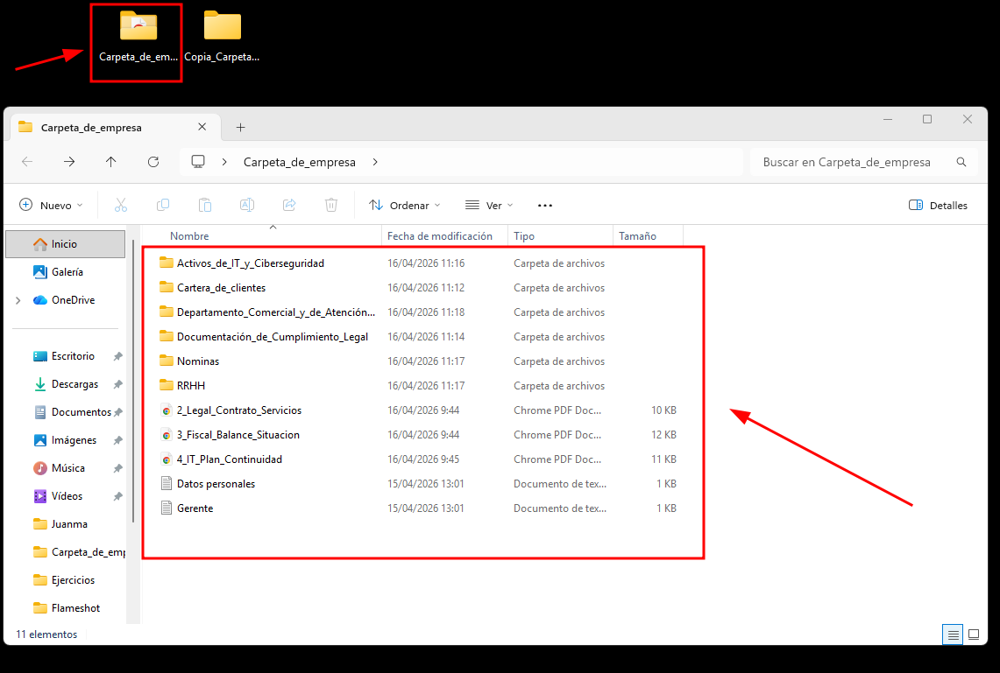

Crear una nueva tarea de copia de seguridad.

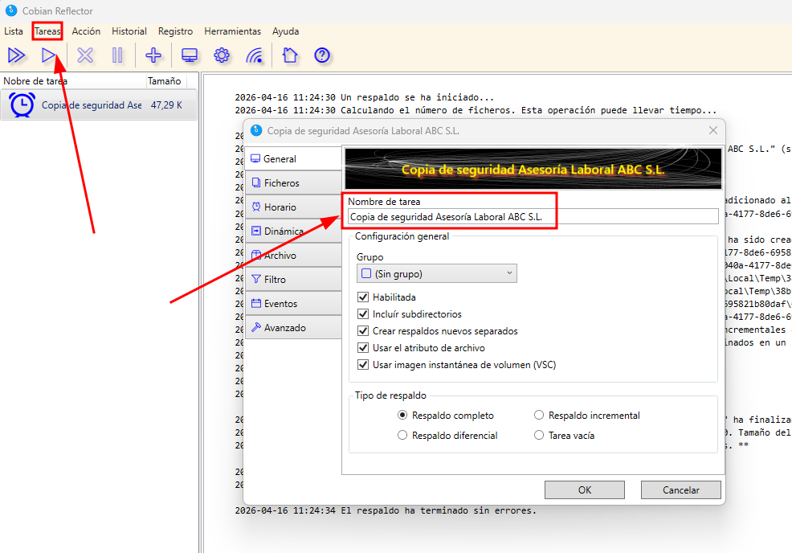

En “Tareas” seleccionamos “Nueva tarea”, ponemos el nombre Copia de seguridad Asesoría Laboral ABC S.L.

Seleccionar la carpeta origen del equipo.

Seleccionar como destino la carpeta compartida del NAS.

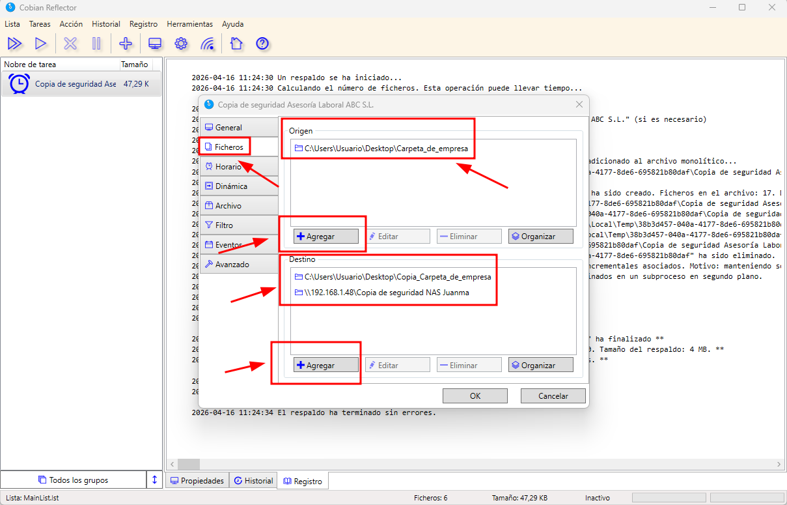

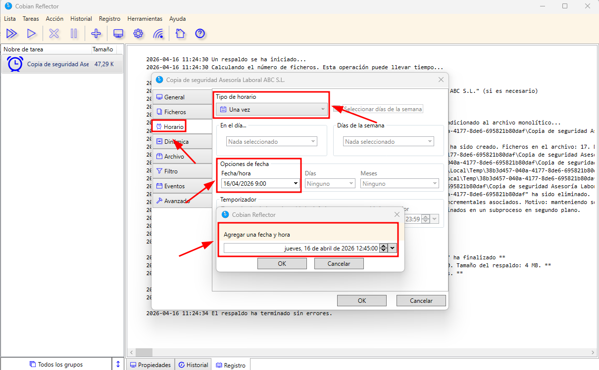

En “Horario” podemos configurar el “Tipo de horario” a nuestro gusto, esta vez hemos puesto la opción “Una Vez” para poder elegir un horario, pero puedes elegir las opciones que quieras y configurarlas al gusto.

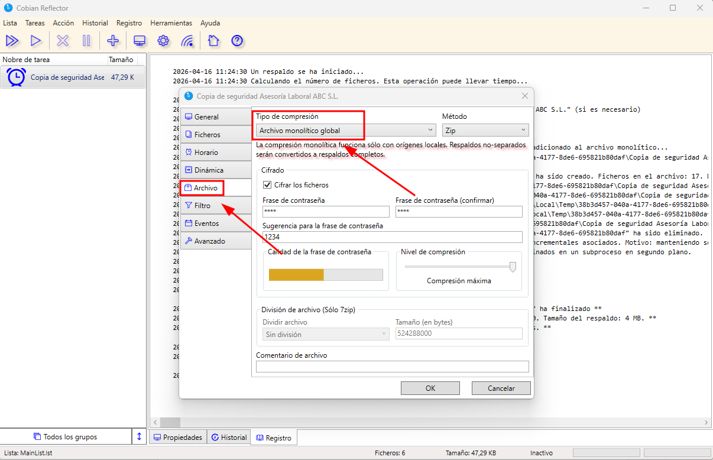

En “Archivo” en el apartado “Tipo de compresión” seleccionaremos “Archivo monolítico global” para así comprimir la carpeta seleccionada, de otra manera solo se comprimen los archivos que tiene dentro ese directorio, ó abría que seleccionar uno a uno los archivos con sus respectivas rutas que queramos meter dentro de la copia.

Verificar el resultado.

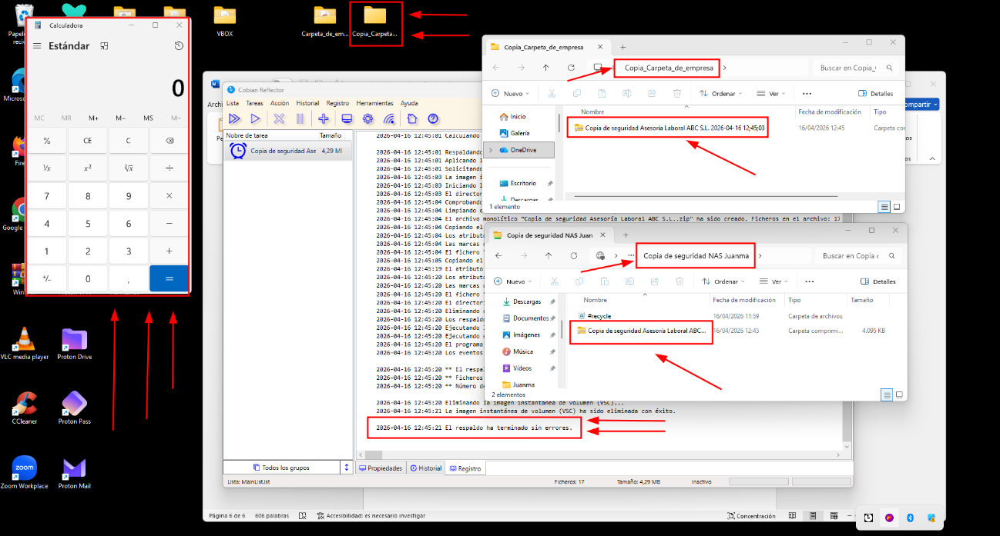

Aquí ponemos ver como se han realizado ambas copias en las localizaciones que hemos elegido. Cobian dice “El respaldo ha terminado sin errores” a demás le pusimos un evento post-respaldo que le indicaba que cuando terminara la copia queríamos que se abriera la calculadora.

Restaurar un archivo de prueba.

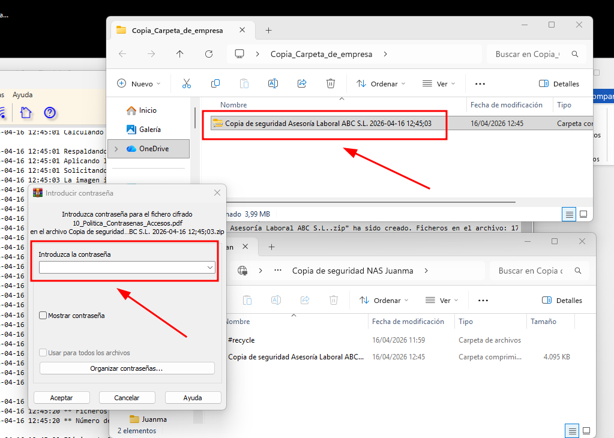

Al darle al botón derecho sobre la carpeta comprimida, seleccionamos “WinRAR” y “Extraer aquí”, nos saldrá una ventana para introducir la contraseña.

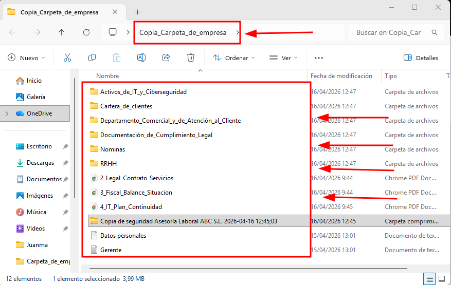

Una vez introducida la contraseña podemos comprobar que los archivos se han copiado debidamente.

Ahora lo veremos en la copia del NAS

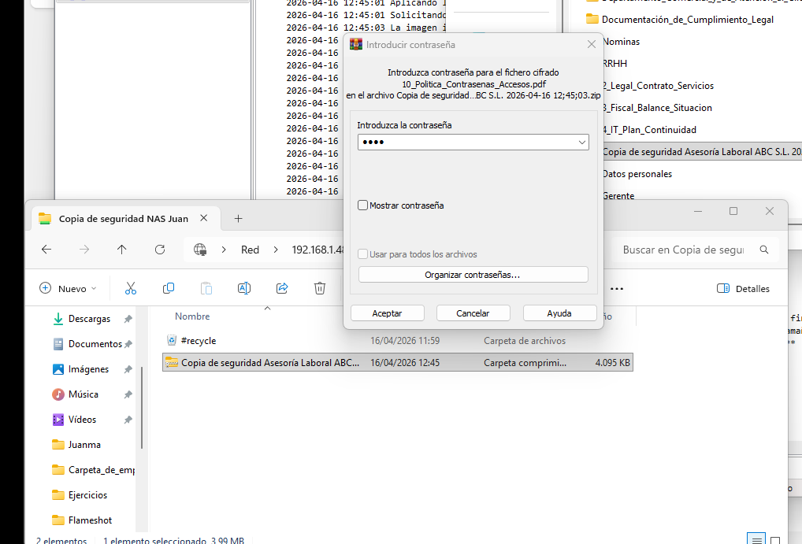

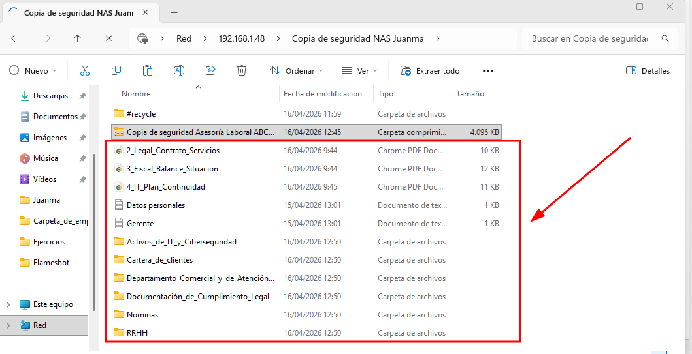

En estas dos últimas capturas podemos comprobar que los datos de la copia de seguridad en el NAS están íntegros.

## Conclusión

Esta práctica refuerza competencias de administración, reconocimiento y análisis técnico en entornos Windows/Linux, documentando comandos, configuración y evidencias de ejecución en laboratorio.
