# Bigwear - DockerLabs

> Laboratorio realizado en entorno local/controlado con fines educativos.  
> No usar estas técnicas contra sistemas reales sin autorización expresa.

## Objetivo

Resolver la máquina **Bigwear**, basada en WordPress, explotando un plugin vulnerable, accediendo al panel de administración y localizando credenciales internas para escalar privilegios.

## Información de la práctica

| Campo | Valor |
|---|---|
| Plataforma | DockerLabs |
| Máquina | Bigwear |
| Tecnología principal | WordPress |
| Herramientas | Nmap, WPScan, exploit CVE, Netcat |
| Vector principal | Plugin vulnerable `pie-register` |
| CVE trabajada | CVE-2025-34077 |
| Objetivo final | Acceso root en laboratorio |

## 1. Reconocimiento con Nmap

Se identifican los servicios expuestos por la máquina.

```bash
nmap -p- -sC -sV --open -sS -n -Pn 172.17.0.2
```

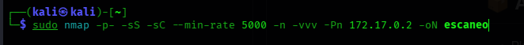

## 2. Enumeración de WordPress con WPScan

Al detectar WordPress, se usa WPScan para enumerar usuarios, temas, plugins y versiones.

```bash
wpscan --url http://172.17.0.2/ --enumerate u,p,t
```

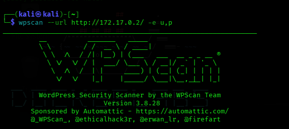

WPScan muestra información relevante sobre la instalación y sus componentes.

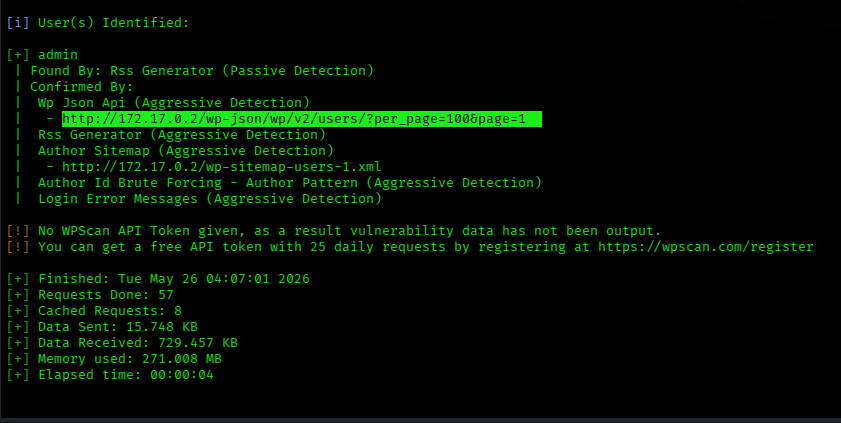

## 3. Identificación de plugin vulnerable

Durante la enumeración aparece el plugin `pie-register`, asociado a una vulnerabilidad pública.

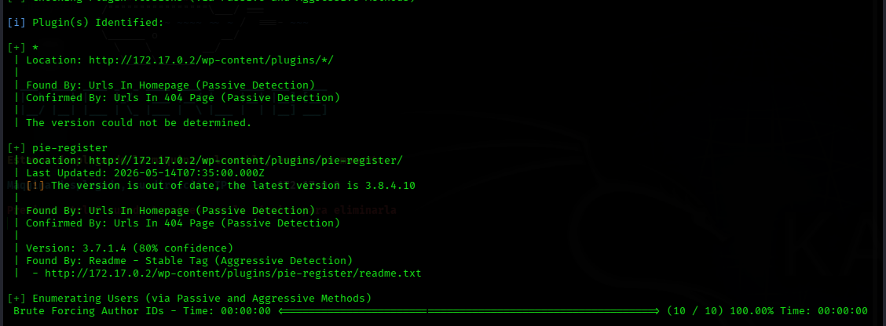

Se revisa el exploit correspondiente a **CVE-2025-34077**.

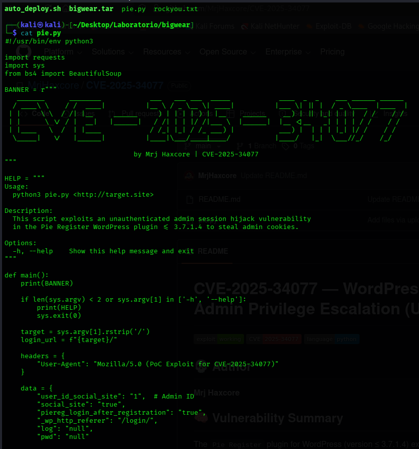

## 4. Ejecución del exploit

Se ejecuta el exploit contra la URL del laboratorio.

```bash
python3 pie.py http://172.17.0.2/
```

El exploit devuelve cookies de sesión que permiten simular una sesión autenticada en WordPress dentro del entorno controlado.

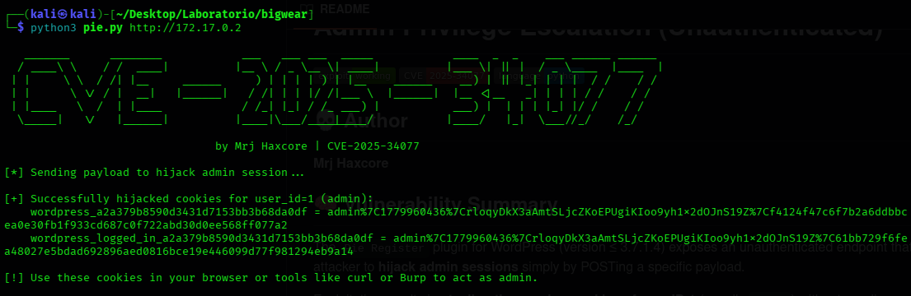

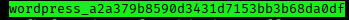

## 5. Acceso al panel y carga de shell

Con la sesión administrativa se accede al panel de WordPress. Desde el panel se instala o utiliza un gestor de archivos para modificar un archivo PHP y preparar una reverse shell.

Se inicia un listener con Netcat:

```bash
nc -lvnp 9001
```

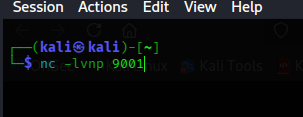

Al ejecutar el archivo PHP modificado, se obtiene una shell remota.

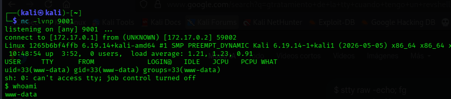

## 6. Enumeración del sistema

Desde la shell se revisan directorios y servicios internos.

```bash
whoami
id
hostname
ls -la
```

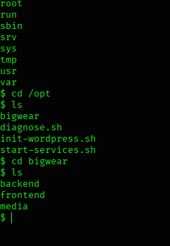

## 7. Localización de credenciales internas

Durante la enumeración se encuentra un archivo de configuración del backend con credenciales.

Ruta relevante del laboratorio:

```bash
/opt/bigwear/backend/settings.py
```

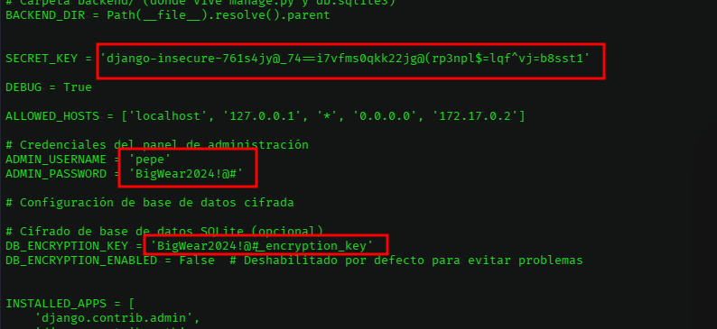

Con las credenciales encontradas se accede al usuario privilegiado del entorno.

## 8. Evidencia final

Se comprueba el acceso final como `root`.

```bash
su root
whoami
id
```

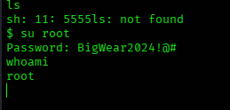

## Problemas frecuentes

| Problema | Posible causa | Solución |
|---|---|---|
| WPScan no detecta plugins | URL incorrecta o WordPress no responde | Comprobar IP y acceso HTTP. |
| El exploit no devuelve cookies | Versión no vulnerable o URL mal escrita | Revisar formato de URL y plugin detectado. |
| No llega la reverse shell | IP/puerto incorrectos | Revisar listener, payload y conectividad. |
| No se puede usar `su root` | Credencial incorrecta | Revisar el archivo de configuración encontrado. |

## Medidas defensivas

- Mantener WordPress, temas y plugins actualizados.
- Eliminar plugins innecesarios.
- Revisar vulnerabilidades conocidas antes de instalar plugins.
- Proteger cookies y sesiones administrativas.
- Impedir edición de archivos desde el panel de WordPress.
- Separar servicios internos y evitar credenciales reutilizadas.
- No almacenar contraseñas en texto plano dentro de archivos de configuración.

## Resumen final

Bigwear muestra una cadena de compromiso típica en entornos WordPress: plugin vulnerable, sesión administrativa, ejecución de código mediante modificación de archivos, reverse shell y credenciales internas reutilizadas. La práctica refuerza la importancia de actualizar componentes y proteger credenciales de backend.
