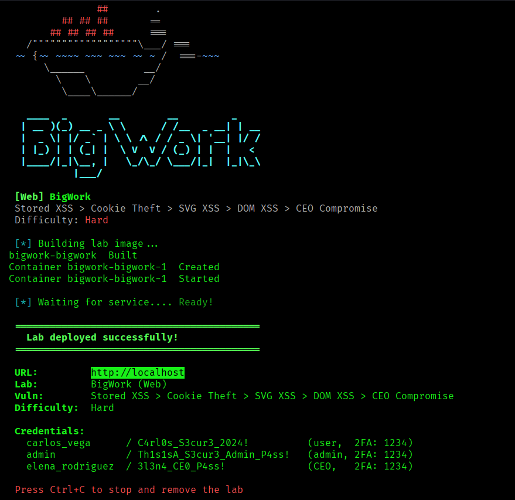
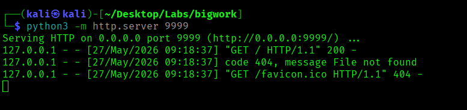
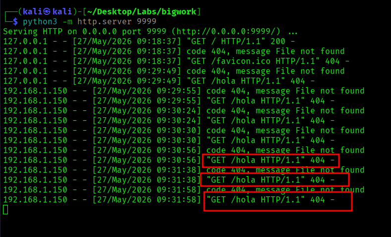
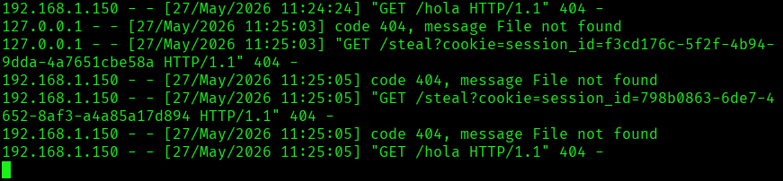
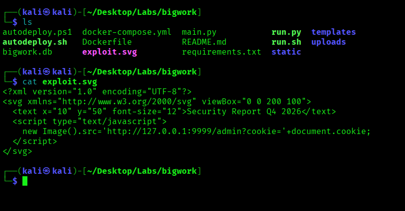
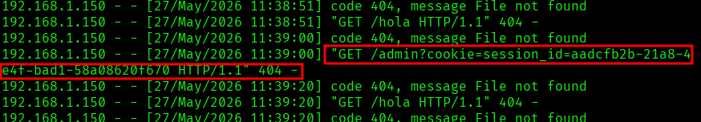

# Bigwork - DockerLabs

> Laboratorio realizado en entorno local/controlado con fines educativos.  
> No usar estas técnicas contra aplicaciones reales sin autorización expresa.

## Objetivo

Resolver la máquina **Bigwork** analizando una aplicación web vulnerable a inyección HTML y XSS almacenado.

La práctica se centra en:

1. Reconocer la aplicación web.
2. Probar inyección HTML en zonas controladas.
3. Confirmar ejecución de JavaScript mediante XSS.
4. Levantar un servidor local para recibir peticiones.
5. Capturar información de sesión en laboratorio.
6. Usar la sesión obtenida para acceder a funcionalidades protegidas.
7. Documentar el impacto y las medidas defensivas.

## Información de la práctica

| Campo | Valor |
|---|---|
| Plataforma | DockerLabs / laboratorio web |
| Máquina | Bigwork |
| Vector principal | Stored XSS |
| Herramientas | Navegador, servidor Python, Burp Suite |
| Impacto | Secuestro de sesión en entorno de laboratorio |

## 1. Reconocimiento inicial

Se identifica la aplicación web y los servicios disponibles en la máquina.

```bash
nmap -p- -sC -sV --open -sS -n -Pn 172.17.0.2
```



## 2. Detección de inyección HTML

La aplicación permite publicar contenido y comentarios. Se prueban etiquetas HTML simples para comprobar si el contenido es interpretado por el navegador.

Ejemplo de prueba:

```html
<u>Hola</u>
```

Si el texto aparece subrayado, significa que la aplicación está interpretando HTML introducido por el usuario. Esto no confirma por sí solo XSS, pero indica una validación insuficiente.

## 3. Comprobación de XSS almacenado

Una vez detectada la inyección HTML, se prueba una carga controlada para verificar si el navegador ejecuta JavaScript.

Ejemplo en laboratorio:

```html

```

Este payload intenta cargar una imagen inexistente y, al fallar, ejecuta una petición hacia un servidor controlado por el atacante dentro del laboratorio.

## 4. Servidor de escucha local

Se levanta un servidor HTTP local para comprobar si la aplicación vulnerable realiza peticiones hacia nuestra máquina.

```bash
python3 -m http.server 9999
```



Cuando otro usuario o administrador visualiza el comentario vulnerable, el navegador realiza una petición al servidor local.



## 5. Captura de información de sesión

En el laboratorio se prueba el impacto del XSS capturando información de sesión. Este paso demuestra por qué un XSS almacenado es crítico: el código se ejecuta en el navegador de otros usuarios.



## 6. Revisión posterior del entorno

Tras obtener acceso a funcionalidades protegidas, se revisa el entorno y los archivos disponibles para confirmar el alcance de la vulnerabilidad.





## Riesgo de seguridad

Un XSS almacenado puede permitir:

- Secuestro de sesión.
- Acciones en nombre de otro usuario.
- Robo de tokens si no están protegidos.
- Modificación de contenido mostrado a otros usuarios.
- Escalada hacia paneles administrativos si un administrador visualiza el contenido malicioso.

## Medidas defensivas

- Escapar correctamente la salida HTML.
- Validar y sanear entradas de usuario.
- Usar Content Security Policy.
- Marcar cookies como `HttpOnly`, `Secure` y `SameSite`.
- Evitar insertar contenido del usuario con `innerHTML`.
- Implementar protección CSRF en acciones sensibles.
- Revisar comentarios, publicaciones y campos de perfil como superficies de ataque.

## Resumen final

La práctica demuestra el impacto de un **Stored XSS** en una aplicación web tipo red social. Aunque el fallo empieza como una simple inyección HTML, puede evolucionar hasta secuestro de sesión si no existen controles adecuados de salida, cookies protegidas y políticas de seguridad en el navegador.
