# CVE-2004-2687 - distcc en laboratorio con Metasploit

> Laboratorio realizado en un entorno local/controlado con fines educativos. No aplicar estas tecnicas sobre sistemas de terceros sin autorizacion expresa.

## Objetivo

Analizar la exposicion de distcc y documentar el comportamiento de distintos payloads en un entorno vulnerable controlado.

## Informacion general

- Categoria: Explotacion controlada
- Entorno: Kali Linux y maquinas vulnerables de laboratorio
- Formato: documentacion tecnica para portfolio GitHub

## Desarrollo de la practica

CVE-2004-2687 (distcc)

### Vulnerability Details 

distcc 2.x, tal y como se utiliza en XCode 1.5 y otros, cuando no está configurado para restringir el acceso al puerto del servidor, permite a los atacantes remotos ejecutar comandos arbitrarios a través de trabajos de compilación, que son ejecutados por el servidor sin comprobaciones de autorización.

Published 2004-12-31 05:00:00 Updated 2025-04-03 01:03:51

CVSS scores 9.3

Severity High

Metasploit

### Payloads

### 0 payload/cmd/unix/adduser

El exploit se ejecutó con éxito contra el servicio distccd en el puerto 3632. Intentó leer archivos protegidos como /etc/passwd y /etc/sudoers, pero no tenía permisos suficientes, por eso aparece Permission denied. Aunque el comando llegó al sistema, no se creó una sesión interactiva, lo cual es normal si el payload usado es del tipo cmd/unix (solo ejecuta comandos, no abre una shell interactiva).

### 1 cmd/unix/bind_perl

### 2 payload/cmd/unix/bind_perl_ipv6

El exploit se ejecutó con éxito contra el servicio distccd en el puerto 3632. El mensaje de error Can't locate object method "new" via package "IO::Socket::INET6" indica que en la víctima falta el módulo Perl IO::Socket::INET6, necesario para conexiones IPv6. Aunque se inició el manejador de conexión (bind TCP en el puerto 4444), no se estableció la sesión, probablemente por incompatibilidad del payload con el entorno de la víctima. El exploit completado sin sesión sugiere que el comando no se ejecutó correctamente debido a la ausencia del módulo Perl requerido.

### 3 cmd/unix/bind_ruby

El exploit se ejecutó con éxito contra el servicio distccd en el puerto 3632. Se estableció una conexión bind TCP en el puerto 4444 y se abrió una sesión de comandos (sesión 2). El comando whoami mostró que el contexto de ejecución es el usuario daemon, lo que indica bajos privilegios. Las advertencias sobre la base de datos msf no afectan el resultado del ataque y están relacionadas con la configuración interna de Metasploit.

### 4 cmd/unix/bind_ruby_ipv6

El exploit se ejecutó con éxito contra el servicio distccd en el puerto 3632. El error "Address already in use - bind(2)" indica que el puerto local en la víctima ya estaba ocupado, pero el exploit continuó y reutilizó la conexión. Se estableció una nueva sesión de comandos (sesión 3) mediante bind TCP en el puerto 4444. La ejecución de whoami confirmó que el acceso se obtuvo con el usuario daemon. El comando ls reveló un archivo llamado 4559.jsvc_up, que podría estar relacionado con un servicio Java (como Apache Tomcat) iniciado con jsvc.

### 5 cmd/unix/generic

El exploit se ejecutó con éxito contra el servicio distccd en el puerto 3632. Se configuró correctamente el comando id mediante set CMD id, que devolvió el contexto de ejecución: usuario daemon (uid=1, gid=1). Aunque el comando se ejecutó y mostró resultados, no se creó una sesión interactiva porque el payload utilizado solo permite ejecución de comandos individuales, no una shell persistente.

### 6 cmd/unix/reverse

El exploit se ejecutó con éxito utilizando el payload cmd/unix/reverse, que inicia una conexión inversa desde la víctima hacia el atacante. Se estableció una shell inversa (sesión 4) mediante un doble manejador TCP, lo que permite mayor estabilidad en la conexión. La ejecución de whoami confirmó que el acceso se obtuvo con el usuario daemon. El comando ls mostró el archivo 4559.jsvc_up, indicativo de un servicio Java en ejecución. La comunicación se completó correctamente, verificando el control sobre el sistema víctima.

### 7 cmd/unix/reverse_bash

El exploit se ejecutó, pero no se estableció la conexión inversa. El error bash: /dev/tcp/10.10.10.4/4444: No such file or directory indica que la víctima no tiene soporte para redirecciones TCP en Bash (característica no disponible en todas las versiones o sistemas). Además, Bad file descriptor sugiere que el intento de usar descriptores de archivo para la conexión falló. El payload cmd/unix/reverse_bash depende de esta funcionalidad, por lo que no funcionará en este entorno. Se recomienda usar un payload alternativo como cmd/unix/reverse o shell_reverse_tcp que no dependa de /dev/tcp.

### 8 cmd/unix/reverse_bash_telnet_ssl

El exploit se ejecutó utilizando el payload cmd/unix/reverse_bash_telnet_ssl, que intenta crear una shell inversa cifrada mediante SSL usando telnet y mkfifo. Este payload depende de que en la víctima exista telnet con soporte para SSL. Como no se estableció ninguna sesión, es probable que el sistema destino no tenga telnet disponible o no soporte la opción SSL. Además, el uso de telnet para conexiones SSL no es común en muchos sistemas Unix, lo que limita su funcionalidad. El resultado indica que el ataque no tuvo éxito en abrir una conexión interactiva.

### 9 cmd/unix/reverse_openssl

### 10 cmd/unix/reverse_perl

### 11 cmd/unix/reverse_perl_ssl

### 12 cmd/unix/reverse_ruby

### 13 cmd/unix/reverse_ruby_ssl

### 14 cmd/unix/reverse_ssl_double_telnet

El exploit se ejecutó utilizando el payload cmd/unix/reverse_ssl_double_telnet, que intenta crear una conexión inversa cifrada mediante telnet con soporte SSL (opción -z). El error telnet: invalid option -- z indica que la versión de telnet en la víctima no soporta conexiones SSL. Además, la salida muestra el mensaje de uso de telnet, lo que confirma que el comando no es válido. No se estableció ninguna sesión, ya que el payload depende de funcionalidades no disponibles en el sistema.

## Evidencias visuales

### Captura 01

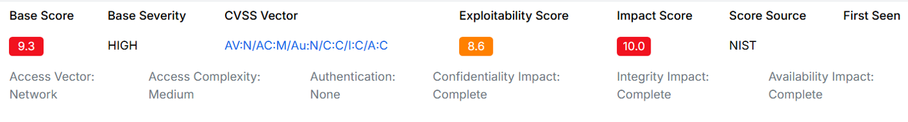

### Captura 02

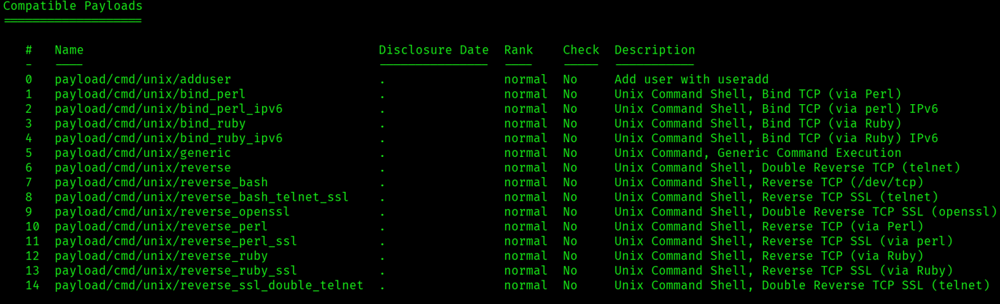

### Captura 03

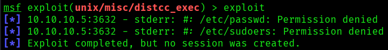

### Captura 04

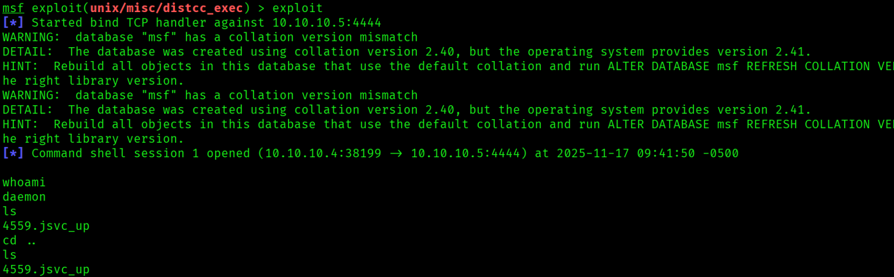

### Captura 05

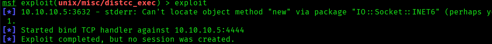

### Captura 06

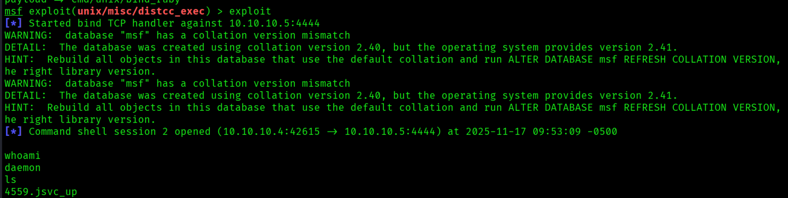

### Captura 07

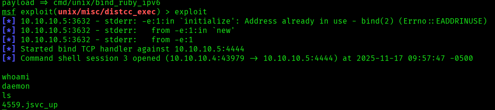

### Captura 08

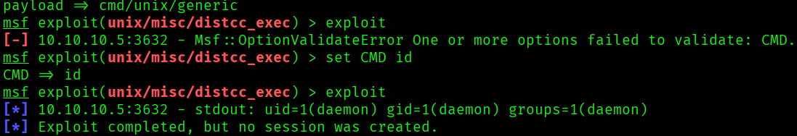

### Captura 09

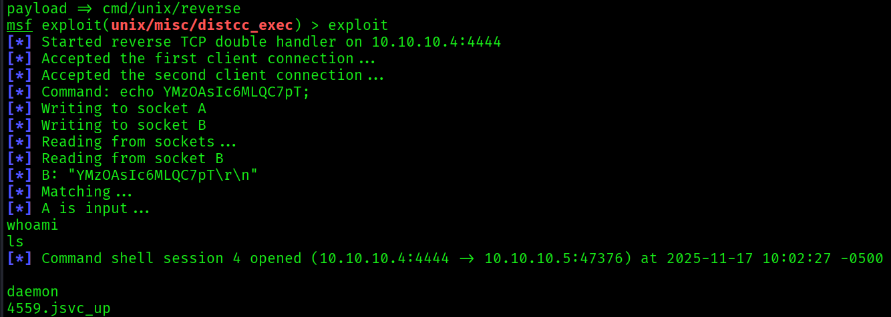

### Captura 10

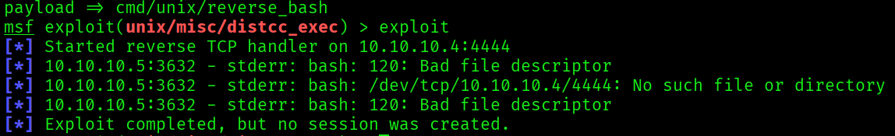

### Captura 11

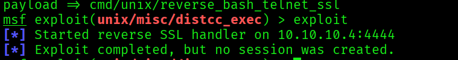

### Captura 12

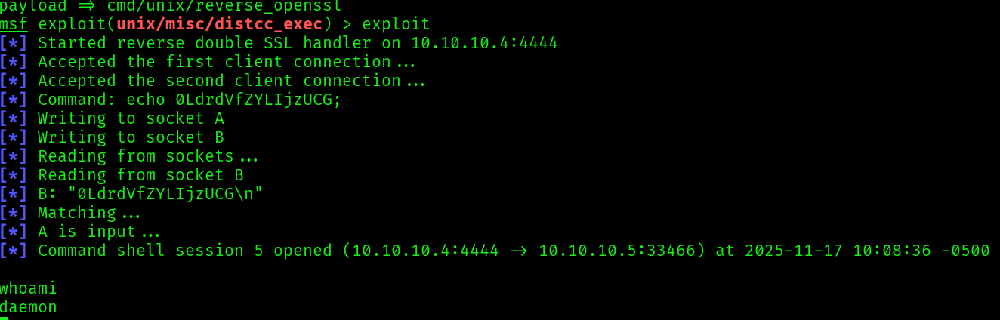

### Captura 13

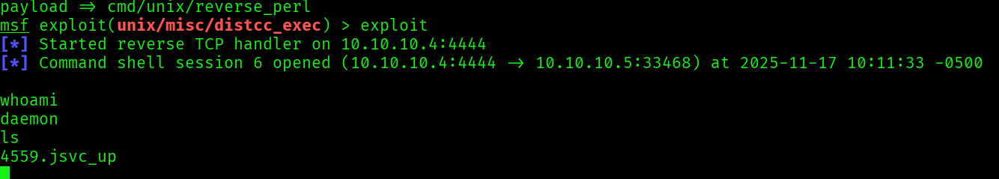

### Captura 14

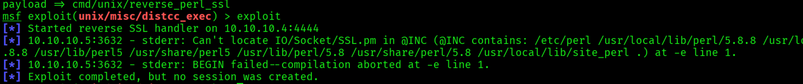

### Captura 15

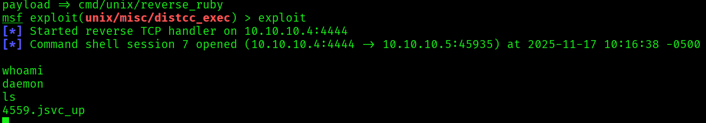

## Medidas defensivas y aprendizaje

- Mantener servicios actualizados y eliminar software obsoleto.
- Exponer solo los puertos necesarios y aplicar reglas de firewall.
- Usar segmentacion de red para aislar maquinas vulnerables o servicios criticos.
- Revisar logs de autenticacion, red y aplicacion tras cualquier prueba.
- Sustituir servicios inseguros por alternativas cifradas y soportadas.
- Aplicar el principio de minimo privilegio en usuarios, servicios y demonios.
- Documentar cada hallazgo con evidencia, impacto y recomendacion.

## Notas

- Se ha eliminado informacion personal y marcas de confidencialidad del documento original.
- Las rutas, IPs y credenciales que aparecen pertenecen a entornos de laboratorio o maquinas vulnerables preparadas para practica.
- Este README es la version limpia para GitHub; conserva los documentos originales solo en privado.
