# CVE-2007-2447 - Samba usermap script

> Laboratorio realizado en un entorno local/controlado con fines educativos. No aplicar estas tecnicas sobre sistemas de terceros sin autorizacion expresa.

## Objetivo

Documentar la explotacion de Samba usermap script en laboratorio y comparar el resultado de diferentes payloads.

## Informacion general

- Categoria: Explotacion controlada
- Entorno: Kali Linux y maquinas vulnerables de laboratorio
- Formato: documentacion tecnica para portfolio GitHub

## Desarrollo de la practica

### CVE-2007-2447

### Vulnerability Details 

La funcionalidad MS-RPC en mbd en Samba 3.0.0 hasta la 3.0.25rc3 permite a atacantes remotos ejecutar comandos de su elección a través del intérprete de comandos (shell) de metacaracteres afectando a la (1) función SamrChangePassword, cuando la opción "secuencia de comandos del mapa del nombre de usuario" smb.conf está activada, y permite a usuarios remotos validados ejecutar comandos a través del intérprete de comandos (shell) de metacaracteres afectando a otras funciones MS-RPC en la (2)impresora remota y (3)gestión de ficheros compartidos.

Published: 2007-05-14 Updated: 2025-11-04

CVSS scores 6.00

Severity Media

Detalles: Ataque remoto (AV:N), complejidad baja (AC:L), requiere privilegios bajos (PR:L), sin interacción del usuario (UI:N), impacto parcial en confidencialidad, integridad y disponibilidad.

Metasploit

### Payloads

payload/cmd/unix/adduser

El payload cmd/unix/adduser intenta crear un nuevo usuario en el sistema víctima modificando los archivos /etc/passwd y /etc/sudoers, pero no establece una sesión interactiva. Por diseño, este payload solo ejecuta comandos para añadir el usuario y luego finaliza, lo que explica por qué el exploit se completa pero no genera una shell. Para obtener acceso, debes conectarte manualmente con las credenciales creadas o usar un payload que incluya una reverse shell.

payload/cmd/unix/bind_awk

Aunque el exploit multi/samba/usermap_script se ejecutó con el payload cmd/unix/bind_awk, no se creó una sesión porque este payload puede ser inestable o incompatible con algunos sistemas. El payload bind_awk depende de GNU AWK y tiene problemas conocidos, como fallar al recibir comandos vacíos o no mantener la conexión activa. Además, si el sistema víctima no tiene gawk instalado, el payload no funcionará. Se recomienda usar cmd/unix/bind_netcat o cmd/unix/reverse como alternativas más confiables.

payload/cmd/unix/bind_busybox_telnetd

El payload cmd/unix/bind_busybox_telnetd intenta abrir un servicio telnetd en el puerto 4444 del sistema víctima para proporcionar una shell, pero no se creó una sesión porque el sistema atacado probablemente no tiene busybox instalado o el puerto está bloqueado. Además, este payload depende de que telnetd esté disponible y puede fallar si otro proceso ya controla el servicio telnet. Aunque el exploit se ejecuta, si no se puede establecer la conexión telnet, no se genera una sesión interactiva.

payload/cmd/unix/bind_inetd

El payload cmd/unix/bind_inetd intenta crear una shell vinculada usando inetd para escuchar conexiones en el puerto especificado (por defecto 4444), pero no se creó una sesión porque el sistema víctima probablemente no tiene inetd instalado o accesible, o el servicio no puede modificar /etc/services y /etc/inetd.conf debido a permisos o configuración. Además, este payload requiere que el atacante se conecte manualmente después de que se inicie el servicio. Si no hay conexión, no se genera una sesión activa.

payload/cmd/unix/bind_jjs

El payload cmd/unix/bind_jjs intenta abrir una shell vinculada usando jjs (un intérprete de JavaScript incluido en JDK de Java). Sin embargo, no se creó una sesión porque es muy probable que jjs no esté instalado en el sistema víctima. Este payload solo funciona si el entorno tiene Java JDK disponible, lo cual es poco común en sistemas de producción. Además, el servicio debe poder ejecutar comandos con los permisos adecuados. Si jjs no está presente, el exploit falla silenciosamente.

payload/cmd/unix/bind_lua

El payload cmd/unix/bind_lua intenta crear una shell vinculada usando el intérprete Lua, pero no se creó una sesión porque es muy probable que lua no esté instalado en el sistema víctima. Este payload requiere que el entorno tenga Lua disponible, lo cual no es común por defecto. Aunque el exploit se ejecuta, si el binario lua no existe o no es accesible, la conexión falla silenciosamente.

payload/cmd/unix/bind_netcat

El payload cmd/unix/bind_netcat funcionó correctamente: abrió una shell vinculada en el puerto 4444 del sistema víctima y permitió al atacante conectarse exitosamente. Se obtuvo acceso con privilegios de root, lo que indica que el servicio Samba se estaba ejecutando con permisos elevados. La vulnerabilidad CVE-2007-2447 fue explotada con éxito gracias a que la opción username map script estaba habilitada, permitiendo la inyección de comandos y el establecimiento de una conexión directa al sistema.

payload/cmd/unix/bind_netcat_gaping

El payload cmd/unix/bind_netcat_gaping se basa en gaping, una versión de netcat que permite múltiples conexiones concurrentes. Al igual que el payload anterior, este también tuvo éxito: estableció una shell vinculada en el puerto 4444 y permitió una conexión exitosa con privilegios de root. La diferencia clave es que gaping puede aceptar múltiples sesiones, lo que lo hace útil si se espera más de una conexión al mismo servicio. Esto confirma que el sistema es vulnerable a CVE-2007-2447 y que netcat (o una variante funcional) está disponible en el sistema.

payload/cmd/unix/bind_netcat_gaping_ipv6

El payload cmd/unix/bind_netcat_gaping_ipv6 intenta establecer una shell vinculada usando IPv6, pero no se creó una sesión, probablemente porque el sistema víctima no tiene soporte para IPv6 o no está disponible en la red. Aunque el exploit se ejecutó, la falta de conectividad IPv6 impide que el atacante se conecte.

payload/cmd/unix/bind_perl

El payload cmd/unix/bind_perl funcionó correctamente y abrió una shell vinculada en el puerto 4444. Se obtuvo acceso con privilegios de root, lo que demuestra que Perl estaba instalado en el sistema y que la vulnerabilidad CVE-2007-2447 fue explotada con éxito. Este payload es confiable en sistemas con Perl disponible.

payload/cmd/unix/bind_perl_ipv6

El payload cmd/unix/bind_perl_ipv6 falló porque, al igual que su versión IPv4, requiere Perl, pero además necesita soporte activo de IPv6 en el sistema y red. Dado que no se creó ninguna sesión, es muy probable que IPv6 no esté habilitado en el entorno.

payload/cmd/unix/bind_r

El payload cmd/unix/bind_r intenta usar r (un comando poco común) para crear una shell vinculada, pero no se estableció conexión, ya que este binario no existe o no está disponible en el sistema víctima. Por lo tanto, el exploit no tuvo éxito.

payload/cmd/unix/bind_ruby

El payload cmd/unix/bind_ruby generó una shell vinculada con éxito, obteniendo acceso como root, lo que confirma que Ruby estaba instalado y disponible en el sistema víctima.

payload/cmd/unix/bind_ruby_ipv6

El payload cmd/unix/bind_ruby_ipv6 también funcionó, abriendo una sesión exitosa, lo que indica que el sistema soporta conexiones IPv6 o existe compatibilidad a nivel de red para establecer la conexión.

payload/cmd/unix/bind_socat_sctp

En cambio, cmd/unix/bind_socat_sctp falló porque el protocolo SCTP no está habilitado en el sistema o red, o socat no está disponible para manejar este tipo de transporte.

payload/cmd/unix/bind_socat_udp

El payload cmd/unix/bind_socat_udp funcionó correctamente, estableciendo una shell vinculada mediante UDP gracias a socat, permitiendo acceso como root, lo que confirma que socat estaba disponible y que el tráfico UDP fue permitido.

payload/cmd/unix/bind_zsh

El payload cmd/unix/bind_zsh también tuvo éxito, abriendo una sesión con privilegios de root, lo que indica que zsh estaba instalado en el sistema, ya que este payload depende de la presencia de dicho intérprete.

payload/cmd/unix/generic

El payload cmd/unix/generic no crea una sesión interactiva, sino que ejecuta un comando simple (como id). Aunque el exploit se completó, no se genera una shell, por lo que el resultado del comando no se muestra directamente en Metasploit.

payload/cmd/unix/php/bind_php

Los payloads cmd/unix/php/bind_php, bind_php_ipv6 y reverse_php fallaron con el error PayloadSpaceViolation, lo que indica que el tamaño del payload excede el espacio permitido en el exploit o hay un problema de codificación, además de que requieren PHP en el sistema, que podría no estar presente o accesible.

payload/cmd/unix/php/bind_php_ipv6

El payload cmd/unix/php/bind_php_ipv6 falló porque requiere PHP y soporte IPv6, además del espacio suficiente en el exploit, que no se cumplió, generando el error PayloadSpaceViolation.

payload/cmd/unix/php/reverse_php

Lo mismo ocurrió con cmd/unix/php/reverse_php, que también excede el límite de tamaño o presenta incompatibilidad en el entorno, aunque depende de PHP, probablemente ausente o no funcional.

payload/cmd/unix/pingback_bind

El payload cmd/unix/pingback_bind funcionó y abrió una sesión, pero solo escucha desde localhost (127.0.0.1), por lo que no permite acceso remoto directo; se cerró tras la desconexión manual.

payload/cmd/unix/pingback_reverse

El payload cmd/unix/pingback_reverse funcionó y estableció una conexión inversa desde la víctima al atacante, pero opera como un pingback: no proporciona shell interactiva, solo confirma la conexión.

payload/cmd/unix/reverse

El payload cmd/unix/reverse tuvo éxito, abriendo una shell inversa con privilegios de root, demostrando que el sistema es vulnerable y permite conexiones salientes.

payload/cmd/unix/reverse_awk

El payload cmd/unix/reverse_awk falló porque depende de gawk y puede tener problemas de compatibilidad o tamaño; además, no todos los sistemas tienen AWK instalado o accesible.

payload/cmd/unix/reverse_bash_telnet_ssl

El payload cmd/unix/reverse_bash_telnet_ssl falló porque requiere telnet y soporte SSL en el sistema víctima, que probablemente no están disponibles.

payload/cmd/unix/reverse_jjs

cmd/unix/reverse_jjs depende del intérprete jjs (JavaScript en JDK de Java), que no está instalado en el sistema.

payload/cmd/unix/reverse_ksh

cmd/unix/reverse_ksh necesita ksh (KornShell), el cual no está presente o no es accesible.

payload/cmd/unix/reverse_lua

cmd/unix/reverse_lua requiere lua, que no se encuentra en el entorno atacado.

payload/cmd/unix/reverse_ncat_ssl

cmd/unix/reverse_ncat_ssl necesita ncat con soporte SSL, que no está disponible, impidiendo la conexión cifrada.

payload/cmd/unix/reverse_netcat

El payload cmd/unix/reverse_netcat funcionó correctamente, estableciendo una shell inversa con privilegios de root, lo que confirma que netcat está disponible en el sistema víctima.

payload/cmd/unix/reverse_netcat_gaping

cmd/unix/reverse_netcat_gaping también tuvo éxito, permitiendo múltiples conexiones gracias a gaping, una versión extendida de netcat.

payload/cmd/unix/reverse_openssl

cmd/unix/reverse_openssl se conectó con éxito usando SSL doble, lo que proporciona cifrado en la comunicación, y también obtuvo acceso como root.

payload/cmd/unix/reverse_perl

cmd/unix/reverse_perl funcionó porque Perl está instalado en el sistema, permitiendo una conexión inversa estable.

payload/cmd/unix/reverse_perl_ssl

cmd/unix/reverse_perl_ssl falló, posiblemente por falta de soporte SSL en Perl o ausencia del módulo necesario.

payload/cmd/unix/reverse_php_ssl

cmd/unix/reverse_php_ssl no funcionó, ya que PHP no está disponible o no puede ejecutar conexiones SSL.

payload/cmd/unix/reverse_python

payload/cmd/unix/reverse_python_ssl

cmd/unix/reverse_python y reverse_python_ssl fallaron, lo que indica que Python no está presente o no es accesible.

payload/cmd/unix/reverse_r

cmd/unix/reverse_r no funcionó porque el comando r no existe o no está disponible en el sistema.

payload/cmd/unix/reverse_ruby

El payload cmd/unix/reverse_ruby funcionó correctamente, estableciendo una shell inversa con acceso root, lo que confirma que Ruby está instalado en el sistema.

payload/cmd/unix/reverse_ruby_ssl

cmd/unix/reverse_ruby_ssl falló, posiblemente por incompatibilidad con la versión de OpenSSL en el sistema.

payload/cmd/unix/reverse_socat_sctp

cmd/unix/reverse_socat_sctp no funcionó, ya que el protocolo SCTP no está habilitado o no es soportado.

payload/cmd/unix/reverse_socat_tcp

cmd/unix/reverse_socat_tcp tuvo éxito, abriendo una sesión con privilegios de root, lo que indica que socat está disponible.

payload/cmd/unix/reverse_socat_udp

cmd/unix/reverse_socat_udp también funcionó, permitiendo una conexión inversa mediante UDP.

payload/cmd/unix/reverse_ssh

cmd/unix/reverse_ssh falló debido a un error de compatibilidad con OpenSSL 3.2.0, necesario para el payload SSH.

payload/cmd/unix/reverse_ssl_double_telnet

cmd/unix/reverse_ssl_double_telnet no generó sesión, probablemente por falta de telnet o soporte SSL.

payload/cmd/unix/reverse_tclsh

cmd/unix/reverse_tclsh falló, lo que sugiere que tclsh no está presente en el sistema.

payload/cmd/unix/reverse_zsh

cmd/unix/reverse_zsh no funcionó, indicando que zsh no está instalado o no es accesible.

## Evidencias visuales

### Captura 01

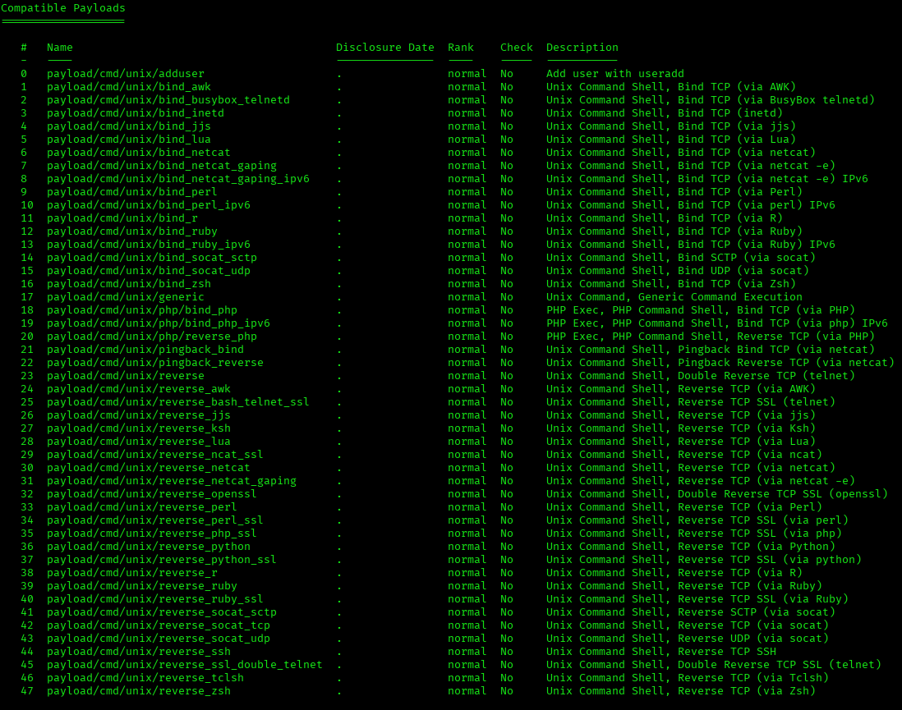

### Captura 02

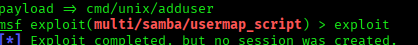

### Captura 03

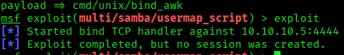

### Captura 04

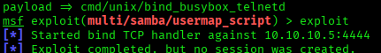

### Captura 05

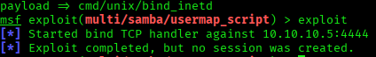

### Captura 06

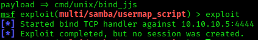

### Captura 07

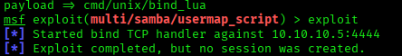

### Captura 08

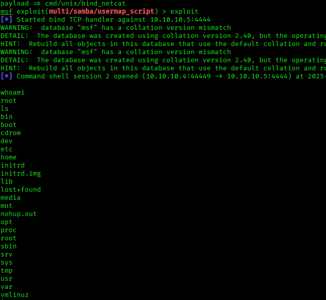

### Captura 09

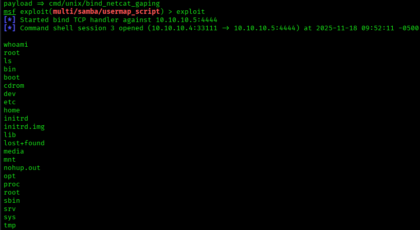

### Captura 10

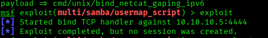

### Captura 11

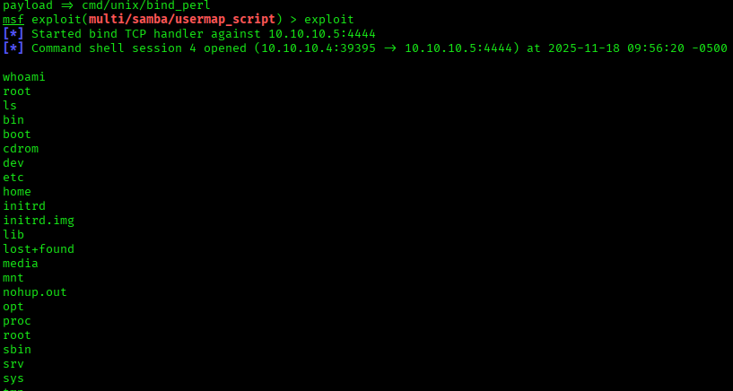

### Captura 12

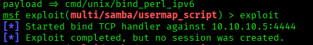

### Captura 13

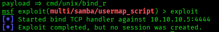

### Captura 14

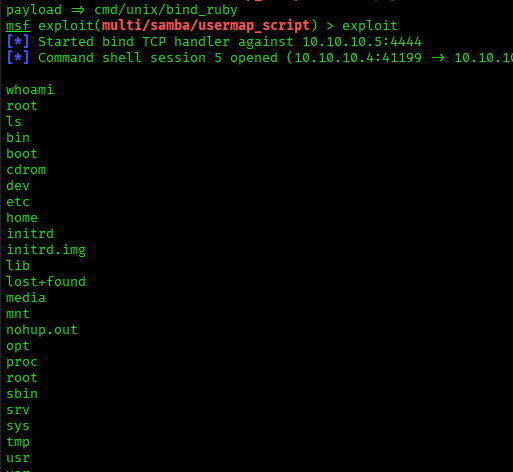

### Captura 15

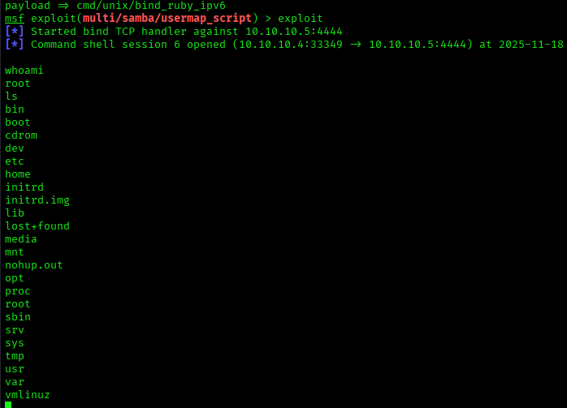

## Medidas defensivas y aprendizaje

- Mantener servicios actualizados y eliminar software obsoleto.
- Exponer solo los puertos necesarios y aplicar reglas de firewall.
- Usar segmentacion de red para aislar maquinas vulnerables o servicios criticos.
- Revisar logs de autenticacion, red y aplicacion tras cualquier prueba.
- Sustituir servicios inseguros por alternativas cifradas y soportadas.
- Aplicar el principio de minimo privilegio en usuarios, servicios y demonios.
- Documentar cada hallazgo con evidencia, impacto y recomendacion.

## Notas

- Se ha eliminado informacion personal y marcas de confidencialidad del documento original.
- Las rutas, IPs y credenciales que aparecen pertenecen a entornos de laboratorio o maquinas vulnerables preparadas para practica.
- Este README es la version limpia para GitHub; conserva los documentos originales solo en privado.
