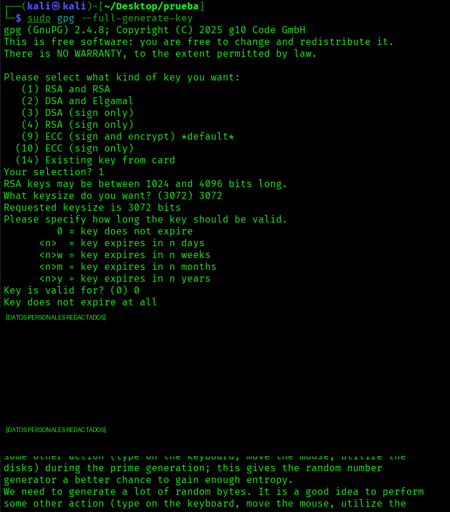
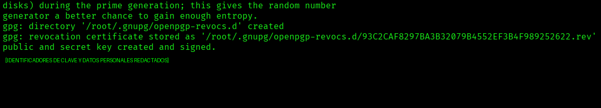

# Cifrado de documentos con GPG y SHA-256

> Laboratorio realizado en entorno local/controlado con fines educativos.
>
> Este documento ha sido limpiado para GitHub: se han eliminado nombres personales, correos, identificadores sensibles, passphrases y cualquier referencia a claves privadas reales.

## Objetivo

Practicar operaciones básicas de criptografía aplicada en Linux utilizando `sha256sum` y `gpg`:

- Calcular el hash SHA-256 de un dato o documento.
- Crear un archivo de texto de prueba.
- Cifrar un documento con cifrado simétrico.
- Generar un par de claves GPG.
- Firmar un documento.
- Verificar la existencia de archivos generados.
- Entender qué información no debe publicarse nunca en un repositorio.

## Herramientas utilizadas

- Kali Linux
- Terminal Bash
- `sha256sum`
- `gpg`
- `nano`

## 1. Cálculo de hash SHA-256

Para calcular un hash SHA-256 de una cadena o dato de prueba se puede usar:

```bash
echo -n "DATO_DE_PRUEBA" | sha256sum
```

Explicación:

- `echo -n` imprime el texto sin salto de línea final.
- `sha256sum` calcula el resumen criptográfico SHA-256.
- El mismo contenido debe producir siempre el mismo hash.
- Un cambio mínimo en el contenido genera un hash diferente.

> Nota: en una práctica pública no debe mostrarse el DNI, documento real, correo personal ni ningún dato identificativo.

## 2. Creación de documento de prueba

Se crea un archivo de texto para realizar las pruebas de cifrado y firma:

```bash
nano documento_prueba.txt
```

Ejemplo de contenido seguro:

```text
Este es un documento de prueba para practicar cifrado y firma con GPG.
```

## 3. Cifrado simétrico con GPG

El cifrado simétrico utiliza una misma contraseña para cifrar y descifrar el archivo.

```bash
gpg -c documento_prueba.txt
```

Resultado esperado:

```text
documento_prueba.txt.gpg
```

Captura de la opción de cifrado simétrico en GPG:


## 4. Generación de par de claves GPG

Para generar un par de claves se utiliza:

```bash
gpg --full-generate-key
```

Durante el proceso se seleccionan los parámetros de la clave, como tipo, tamaño y caducidad.

Ejemplo de configuración usada en laboratorio:

```text
Tipo de clave: RSA and RSA
Tamaño: 3072 bits
Caducidad: sin caducidad para práctica local
```

Captura redactada del proceso:



## 5. Firma de documento

Para firmar un documento con GPG:

```bash
gpg -s documento_prueba.txt
```

Resultado esperado:

```text
documento_prueba.txt.gpg
```

Captura de la opción de firma:


## 6. Hash del documento

Para calcular el hash del documento y guardarlo en otro archivo:

```bash
sha256sum documento_prueba.txt > hash_documento_prueba.txt
```

Esto genera un archivo con el hash del documento original.

## 7. Listado de claves

Para listar las claves secretas disponibles en el llavero local:

```bash
gpg --list-secret-keys
```

Captura redactada del listado de claves:



## 8. Buenas prácticas de seguridad

No se debe subir a GitHub:

```text
- claves privadas;
- passphrases;
- correos personales;
- DNI u otros identificadores reales;
- capturas donde aparezcan claves completas;
- archivos .asc privados;
- documentos cifrados que contengan datos reales;
- rutas personales o nombres completos.
```

Una clave privada solo debe almacenarse en ubicaciones seguras y nunca publicarse en un repositorio.

## 9. Comandos utilizados

```bash
# Calcular hash de una cadena
echo -n "DATO_DE_PRUEBA" | sha256sum

# Crear documento
nano documento_prueba.txt

# Cifrar documento con GPG
gpg -c documento_prueba.txt

# Generar par de claves
gpg --full-generate-key

# Firmar documento
gpg -s documento_prueba.txt

# Calcular hash del documento
sha256sum documento_prueba.txt > hash_documento_prueba.txt

# Listar claves secretas
gpg --list-secret-keys
```

## 10. Resumen

En esta práctica se ha trabajado el uso básico de funciones hash, cifrado simétrico, generación de claves y firma digital con GPG. También se ha reforzado una idea importante: la documentación técnica puede publicarse en GitHub, pero las claves privadas, passphrases y datos personales deben eliminarse o anonimizarse antes de compartirla.
