# Workspace de Metasploit con PostgreSQL e importacion de Nessus

> Laboratorio realizado en un entorno local/controlado con fines educativos. No aplicar estas tecnicas sobre sistemas de terceros sin autorizacion expresa.

## Objetivo

Practicar la base de datos de Metasploit, workspaces, importacion de informes Nessus y uso de modulos auxiliares.

## Informacion general

- Categoria: Gestion de evidencias
- Entorno: Kali Linux y maquinas vulnerables de laboratorio
- Formato: documentacion tecnica para portfolio GitHub

## Desarrollo de la practica

Base de datos: Workspace (Scaner Nessus)

Alcance: Ataques con módulos auxiliares de postgres


### 1. Comenzamos con

```bash

msfconsole

wokspace -a meta

db_status

db_import /home/ess/Desktop/Metasploitable2.nessus

```

Como vemos la base de datos está activa y hemos conseguido importar el documento.

Tenemos los datos del escaneo de Nessus. Ahora le daremos consultas para visibilizar el contenido detallado:

```bash

hosts

services

vulns

notes

creds

```

2. Ahora utilizaremos varios módulos auxiliares de postgres para realizar ataques contra la máquina metasploitable2.

```bash

search postgres

```


### 2.1Utilizaremos el módulo auxiliar


### 29 auxiliary/scanner/postgres/postgres_login

```bash

use 29

show options

```


### Ponemos la IP víctima que nos falta por configurar

```bash

set RHOSTS 10.10.10.5

```


### Lanzamos el exploit

```bash

exploit

```

Hallazgo de brute force PostgreSQL.

El módulo postgres_login de Metasploit realizó un ataque de fuerza bruta contra el servicio PostgreSQL en la IP 10.10.10.5 (puerto 5432), probando combinaciones comunes de usuario/contraseña. Tras varios intentos fallidos, logró acceso con las credenciales postgres:postgres, lo que indica que el servicio estaba utilizando credenciales por defecto. Este acceso exitoso permite una fase posterior de explotación, como ejecutar comandos SQL o escalar privilegios.


### 2.2 Utilizaremos el siguiente módulo auxiliar


### 31 auxiliary/admin/postgres/postgres_sql

```bash

use 31

```

Hallazgo: Detección de versión vulnerable de PostgreSQL mediante consulta SQL

El resultado mostrado indica que el módulo auxiliar postgres_sql de Metasploit se ejecutó con éxito contra el sistema con IP 10.10.10.5, tras establecer una conexión válida con su base de datos PostgreSQL. Al ejecutar la consulta SQL select version(), se obtuvo la respuesta detallada de la versión del servidor: "PostgreSQL 8.3.1 on i486-pc-linux-gnu compiled by gcc cc (gcc) 4.2.3 (Ubuntu 4.2.3-2ubuntu4)", lo que revela que el sistema está ejecutando una versión antigua y potencialmente vulnerable de PostgreSQL. Esta información es crucial en un análisis de seguridad, ya que versiones como esta pueden tener fallos conocidos que permitan escalación de privilegios o ejecución remota de comandos. El mensaje [*] auxiliary module execution completed confirma que la acción finalizó correctamente, demostrando que el atacante tiene capacidad para ejecutar comandos SQL arbitrarios sobre la base de datos, lo que podría usarse para extraer datos sensibles o profundizar en la explotación del sistema.

## Evidencias visuales

### Captura 01

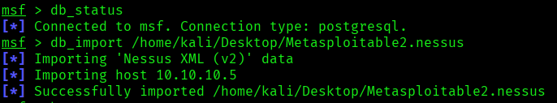

### Captura 02

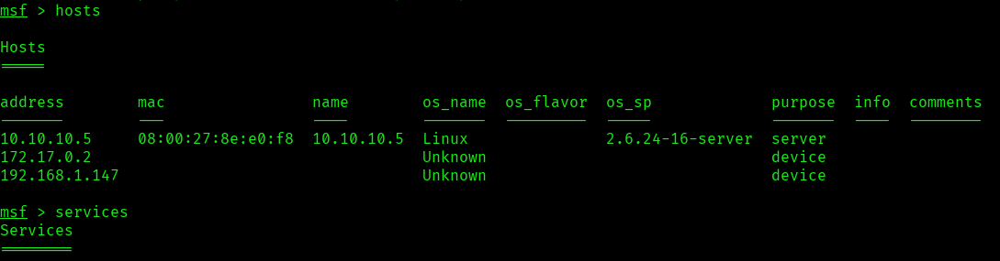

### Captura 03

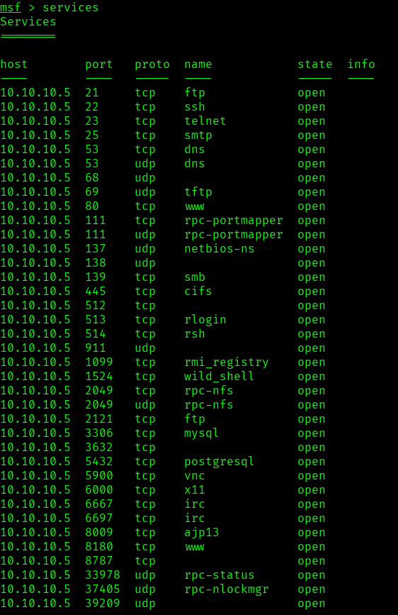

### Captura 04

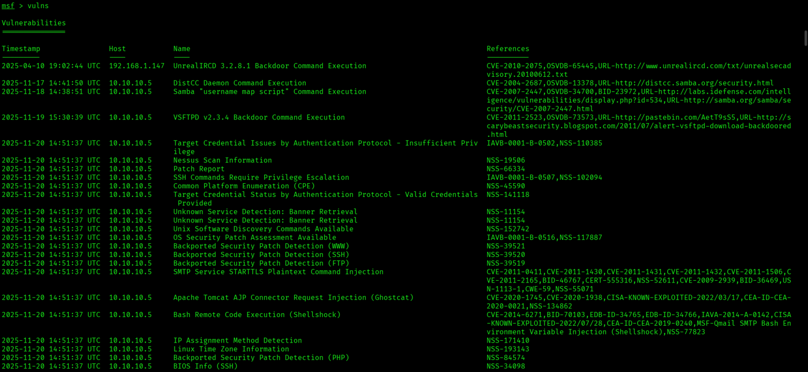

### Captura 05

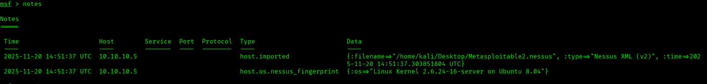

### Captura 06

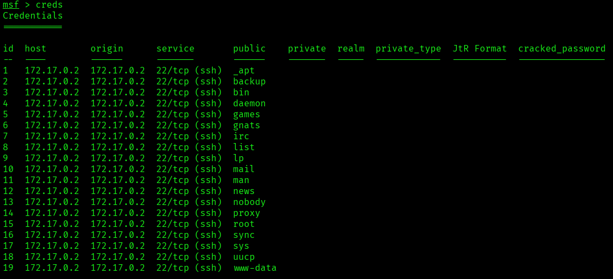

### Captura 07

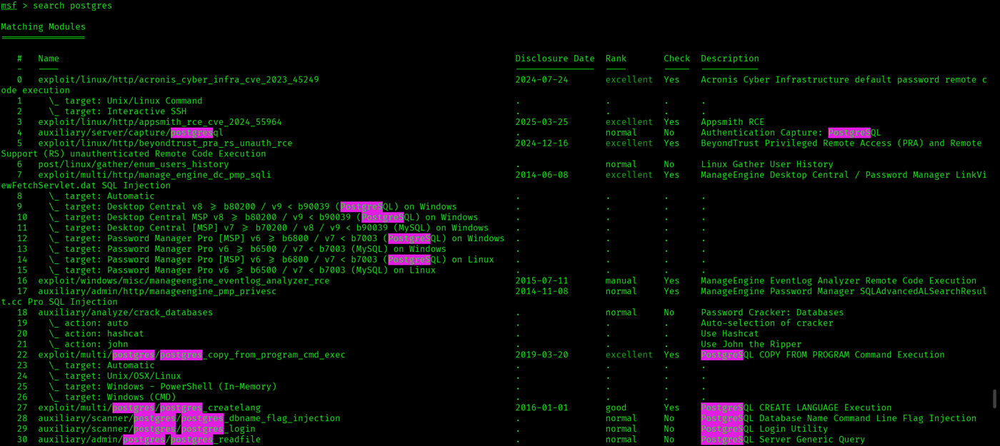

### Captura 08

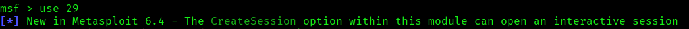

### Captura 09

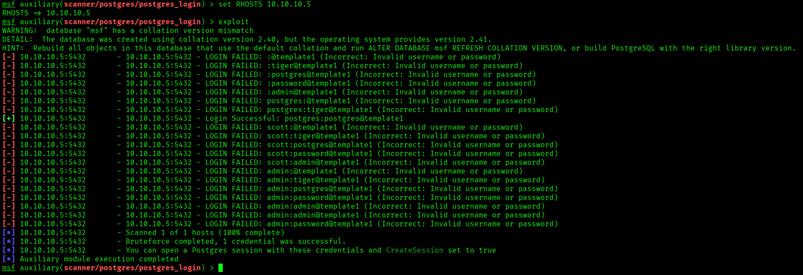

### Captura 10

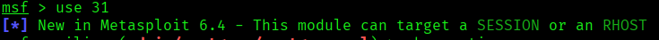

### Captura 11

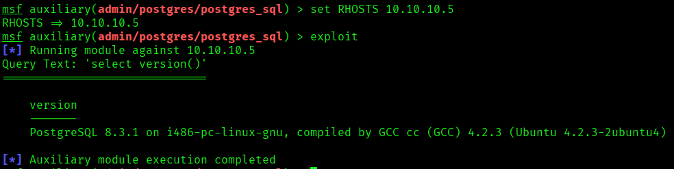


## Medidas defensivas y aprendizaje

- Mantener servicios actualizados y eliminar software obsoleto.
- Exponer solo los puertos necesarios y aplicar reglas de firewall.
- Usar segmentacion de red para aislar maquinas vulnerables o servicios criticos.
- Revisar logs de autenticacion, red y aplicacion tras cualquier prueba.
- Sustituir servicios inseguros por alternativas cifradas y soportadas.
- Aplicar el principio de minimo privilegio en usuarios, servicios y demonios.
- Documentar cada hallazgo con evidencia, impacto y recomendacion.

## Notas

- Se ha eliminado informacion personal y marcas de confidencialidad del documento original.
- Las rutas, IPs y credenciales que aparecen pertenecen a entornos de laboratorio o maquinas vulnerables preparadas para practica.
- Este README es la version limpia para GitHub; conserva los documentos originales solo en privado.
